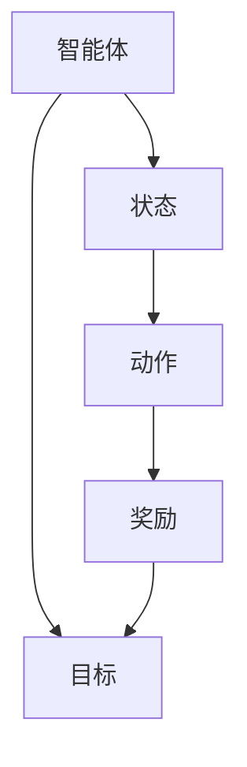
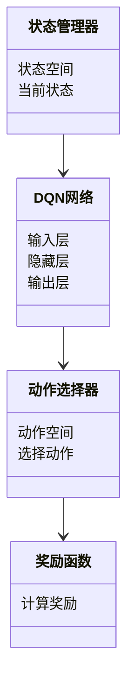
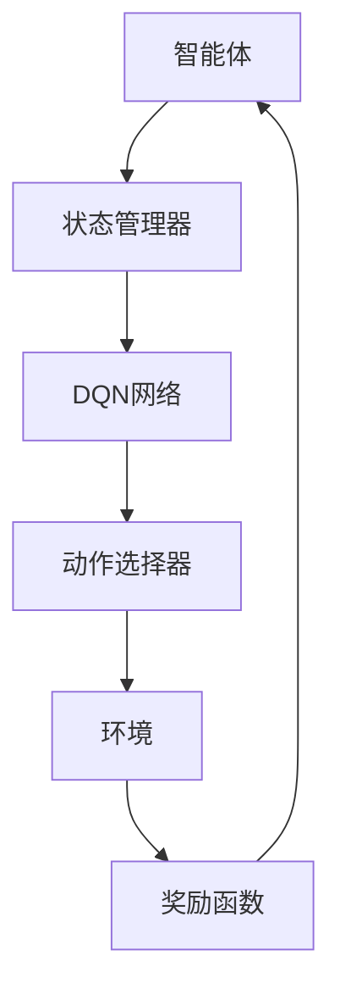

                 


# AI Agent的深度强化学习：从模拟到现实世界应用

> 关键词：AI Agent，深度强化学习，强化学习，Q-learning，深度Q网络，DQN，策略梯度，系统设计，强化学习实战

> 摘要：本文深入探讨了AI Agent的深度强化学习技术，从基本概念到核心算法，再到系统设计与实际应用，详细分析了深度强化学习的核心原理与实际应用案例。通过理论分析与实战案例相结合，帮助读者全面理解AI Agent的深度强化学习技术，并掌握其在现实世界中的应用方法。

---

## 第1章: AI Agent的基本概念

### 1.1 AI Agent的定义与特点

AI Agent（人工智能代理）是指在计算机系统中，能够感知环境并采取行动以实现目标的实体。AI Agent的核心特点包括自主性、反应性、目标导向性和社交能力。AI Agent可以分为简单反射型、基于模型的反射型、目标驱动型和实用驱动型四种类型。AI Agent广泛应用于自动驾驶、游戏AI、机器人控制等领域。

### 1.2 强化学习的基础知识

强化学习是一种机器学习范式，通过智能体与环境交互，学习采取最优动作以最大化累积奖励。马尔可夫决策过程（MDP）是强化学习的核心模型，定义了状态、动作、转移概率和奖励函数。策略（Policy）是智能体选择动作的规则，值函数（Value Function）则衡量状态或动作的价值。

### 1.3 深度强化学习的引入

深度强化学习结合了深度学习和强化学习的优势，利用深度神经网络表示状态和动作之间的关系。深度强化学习的核心优势在于其强大的特征提取能力和处理高维数据的能力，使得智能体能够处理更复杂和真实的环境。

---

## 第2章: 深度强化学习的核心算法

### 2.1 深度Q网络（DQN）

DQN通过将Q-learning算法与深度神经网络结合，解决了传统Q-learning在处理高维状态时的局限性。DQN的数学模型包括经验回放和目标网络两大核心创新，能够有效加速训练并提高稳定性。

### 2.2 策略梯度方法（PG）

策略梯度方法直接优化策略，通过计算梯度更新参数。PG算法包括策略评估和策略改进两个步骤，能够处理连续动作空间的问题，适用于复杂的强化学习场景。

### 2.3 统一的强化学习框架

通过对比分析各种强化学习算法，本文提出了一个统一的框架，帮助读者更好地理解不同算法之间的联系与区别。

---

## 第3章: 深度强化学习的核心概念与联系

### 3.1 核心概念原理

通过状态、动作、奖励的关系分析，深入探讨了强化学习的核心原理。对比分析了策略与值函数的数学表达，以及动作空间与状态空间的维度特征。

### 3.2 核心概念属性特征对比表格

以下是核心概念的对比表格：

| 概念       | 描述                                                                 |
|------------|----------------------------------------------------------------------|
| 状态（State）| 环境的当前情况，智能体感知环境的信息来源                                       |
| 动作（Action）| 智能体采取的具体行动，影响环境状态的变化                                       |
| 奖励（Reward）| 环境对智能体行为的反馈，指导智能体优化策略                                       |
| 策略（Policy）| 智能体选择动作的概率分布或确定性规则                                           |
| 值函数（Value Function）| 衡量状态或动作价值的函数，用于指导智能体的决策                               |

### 3.3 ER实体关系图架构

以下是AI Agent的核心概念关系图：



---

## 第4章: 深度强化学习的数学模型与公式

### 4.1 Q-learning算法的数学模型

Q-learning的公式推导如下：

$$ Q(s, a) = Q(s, a) + \alpha [r + \max_{a'} Q(s', a') - Q(s, a)] $$

其中，$\alpha$ 是学习率，$r$ 是奖励，$s'$ 是下一状态。

### 4.2 Deep Q-Networks的数学模型

DQN的网络结构包括输入层、隐藏层和输出层。输出层的大小等于动作空间的维度。损失函数定义为：

$$ \mathcal{L} = \mathbb{E}_{(s,a,r,s')} \left[ (r + \gamma \max_{a'} Q(s', a') - Q(s,a))^2 \right] $$

其中，$\gamma$ 是折扣因子。

### 4.3 策略梯度方法的数学模型

策略梯度的优化目标是最大化奖励的期望：

$$ \nabla \theta J(\theta) = \mathbb{E}_{\tau} \left[ \nabla_\theta \log \pi_\theta(a|s) Q_\theta(s,a) \right] $$

---

## 第5章: AI Agent的系统设计与架构

### 5.1 项目实战

以设计一个简单的游戏AI为例，展示如何实现一个基于DQN的AI Agent。

#### 5.1.1 环境搭建

使用OpenAI Gym库，搭建一个简单的迷宫环境。

#### 5.1.2 系统功能设计

以下是系统的领域模型：



#### 5.1.3 系统架构设计

以下是系统的架构图：



#### 5.1.4 系统核心实现源代码

以下是DQN网络的实现代码：

```python
import torch
import torch.nn as nn

class DQN(nn.Module):
    def __init__(self, state_dim, action_dim):
        super(DQN, self).__init__()
        self.fc1 = nn.Linear(state_dim, 64)
        self.fc2 = nn.Linear(64, 64)
        self.fc3 = nn.Linear(64, action_dim)
    
    def forward(self, x):
        x = torch.relu(self.fc1(x))
        x = torch.relu(self.fc2(x))
        x = self.fc3(x)
        return x
```

---

## 第6章: 总结与展望

### 6.1 总结

本文详细探讨了AI Agent的深度强化学习技术，从基本概念到核心算法，再到系统设计与实际应用，帮助读者全面理解深度强化学习的核心原理与实际应用案例。

### 6.2 展望

未来的研究方向包括更高效的算法设计、多智能体协作、强化学习的可解释性以及在现实世界中的广泛应用。

---

通过本文的学习，读者将能够掌握AI Agent的深度强化学习技术，并能够在实际项目中灵活应用这些知识。

