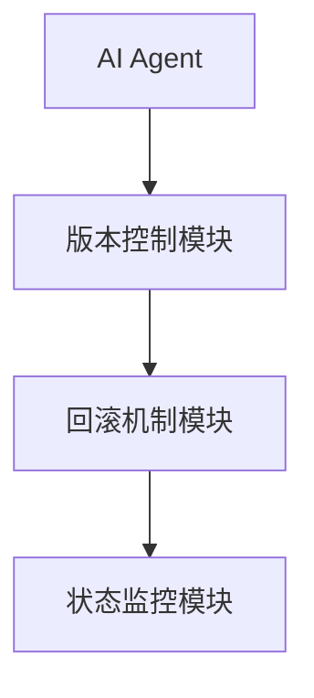

                 


# AI Agent的版本控制与回滚机制：确保稳定运行

## 关键词
AI Agent, 版本控制, 回滚机制, 稳定性, 可追溯性, 系统架构

## 摘要
本文深入探讨了AI Agent的版本控制与回滚机制，旨在确保其在复杂应用场景中的稳定运行。通过分析版本控制的核心概念、回滚机制的实现原理，以及系统架构设计，结合实际案例，详细阐述了如何通过版本控制和回滚机制来实现AI Agent的稳定性和可追溯性。文章还提供了具体的算法流程图、系统架构图和代码实现，帮助读者更好地理解和应用这些机制。

---

# 第1章: AI Agent的基本概念与问题背景

## 1.1 AI Agent的核心概念

### 1.1.1 AI Agent的定义
AI Agent（人工智能代理）是一种能够感知环境并采取行动以实现目标的智能实体。它可以是一个软件程序、一个机器人，或者任何能够与环境交互的智能系统。

### 1.1.2 AI Agent的核心特征
- **自主性**：能够在没有外部干预的情况下自主决策。
- **反应性**：能够实时感知环境并做出响应。
- **目标导向性**：所有行为都围绕实现特定目标展开。
- **学习能力**：能够通过经验改进自身的性能。

### 1.1.3 AI Agent与传统软件的区别
AI Agent不仅仅是简单的程序，它具有以下特点：
- 具备学习和自适应能力。
- 能够与动态环境进行交互。
- 具备复杂的决策能力。

## 1.2 问题背景与挑战

### 1.2.1 AI Agent在实际应用中的常见问题
在实际应用中，AI Agent可能会遇到以下问题：
- **版本不一致**：不同版本的AI Agent可能在功能和行为上存在差异，导致系统不稳定。
- **回滚困难**：当某个版本出现问题时，难以快速恢复到之前的稳定版本。
- **可追溯性差**：无法准确追踪问题发生的时间点和具体原因。

### 1.2.2 版本控制在AI Agent中的重要性
版本控制是确保AI Agent稳定运行的关键机制。它可以帮助我们：
- 管理不同版本的AI Agent。
- 追踪版本之间的依赖关系。
- 快速恢复到已知的稳定版本。

### 1.2.3 回滚机制的必要性与应用场景
回滚机制是版本控制的重要组成部分。它可以在出现问题时，快速恢复到之前的稳定状态。应用场景包括：
- **故障修复**：当某个版本出现问题时，快速回滚到稳定的版本。
- **实验验证**：在测试新版本时，如果出现问题，可以快速回滚到之前的版本。
- **版本迭代**：在多个版本之间切换时，确保系统稳定性。

---

# 第2章: 版本控制的核心概念与原理

## 2.1 版本控制的基本原理

### 2.1.1 版本控制的定义与作用
版本控制是一种管理不同版本文件或程序的技术。它的作用包括：
- 管理文件的历史版本。
- 记录每次修改的详细信息。
- 提供快速回滚到任意版本的功能。

### 2.1.2 版本控制的关键要素
- **版本号**：用于标识不同版本的唯一标识符。
- **版本依赖关系**：不同版本之间的依赖关系。
- **版本状态**：每个版本的当前运行状态。

## 2.2 回滚机制的实现原理

### 2.2.1 回滚机制的基本概念
回滚机制是一种通过记录历史状态，快速恢复到之前版本的技术。它通常包括以下步骤：
1. **记录历史状态**：在每次修改时记录当前状态。
2. **标记回滚点**：在关键点标记回滚点，以便在需要时快速恢复。
3. **触发回滚**：当出现问题时，触发回滚机制，恢复到标记的版本。

### 2.2.2 回滚机制的核心流程
1. **检测问题**：通过监控系统状态，检测到问题发生。
2. **确定回滚点**：找到与当前问题相关的最近的回滚点。
3. **执行回滚**：将系统恢复到指定的回滚点。

## 2.3 版本控制与回滚机制的关联

### 2.3.1 版本控制与回滚机制的关系
版本控制是回滚机制的基础，而回滚机制是版本控制的延伸。版本控制提供了历史版本的记录，回滚机制则利用这些记录快速恢复系统状态。

### 2.3.2 回滚机制在版本控制中的作用
回滚机制可以帮助我们在出现问题时快速恢复到已知的稳定版本，从而保证系统的稳定性。

### 2.3.3 版本控制与回滚机制的协同工作
版本控制和回滚机制协同工作，形成了一个完整的版本管理闭环。版本控制负责记录和管理版本，回滚机制负责在出现问题时快速恢复到稳定版本。

---

# 第3章: AI Agent版本控制的核心要素

## 3.1 AI Agent版本控制的关键要素

### 3.1.1 版本号的定义与设计
版本号是标识不同版本的重要信息。通常采用语义化版本控制（Semantic Versioning），格式为`major.minor.patch`。

### 3.1.2 版本依赖关系的管理
版本依赖关系是指某个版本的AI Agent依赖于其他组件的特定版本。通过管理依赖关系，可以确保系统的兼容性。

### 3.1.3 版本状态的监控与反馈
版本状态监控是指实时监控AI Agent的运行状态，并根据反馈信息调整版本控制策略。

## 3.2 回滚机制的核心要素

### 3.2.1 回滚点的标记与存储
回滚点是指在版本控制过程中标记的关键点。通常在每次重大修改后标记回滚点。

### 3.2.2 回滚触发条件的设置
回滚触发条件是指在特定条件下自动触发回滚机制。例如，当系统状态达到预设的阈值时，触发回滚。

### 3.2.3 回滚过程中的状态恢复
在回滚过程中，系统需要恢复到指定的版本状态。这通常包括恢复代码、配置文件和数据等。

## 3.3 版本控制与回滚机制的协同优化

### 3.3.1 版本控制策略的优化
通过优化版本控制策略，可以提高版本管理的效率和准确性。

### 3.3.2 回滚机制的优化
通过优化回滚机制，可以减少回滚时间，提高系统的恢复能力。

### 3.3.3 稳定性与可追溯性的协同提升
版本控制和回滚机制的协同优化可以同时提高系统的稳定性和可追溯性。

---

# 第4章: AI Agent版本控制的算法原理与实现

## 4.1 版本控制的算法原理

### 4.1.1 版本控制算法的概述
版本控制算法通常包括以下步骤：
1. **记录变更**：记录每次修改的信息。
2. **生成版本号**：根据变更信息生成版本号。
3. **管理依赖关系**：管理不同版本之间的依赖关系。

### 4.1.2 基于时间戳的版本控制算法
基于时间戳的版本控制算法通过记录修改时间来生成版本号。这种方法简单但不够精确。

### 4.1.3 基于哈希的版本控制算法
基于哈希的版本控制算法通过计算文件的哈希值来生成版本号。这种方法可以确保文件内容的唯一性。

## 4.2 回滚机制的算法实现

### 4.2.1 回滚机制的算法流程
回滚机制的算法流程包括：
1. **检测问题**：通过监控系统状态，检测到问题发生。
2. **确定回滚点**：找到与当前问题相关的最近的回滚点。
3. **执行回滚**：将系统恢复到指定的回滚点。

### 4.2.2 基于状态恢复的回滚算法
基于状态恢复的回滚算法通过记录历史状态，快速恢复到指定版本。这种方法适用于状态恢复需求较高的场景。

### 4.2.3 基于依赖关系的回滚算法
基于依赖关系的回滚算法通过分析版本之间的依赖关系，选择合适的回滚点。这种方法适用于复杂依赖关系的场景。

## 4.3 算法实现的代码示例

### 4.3.1 版本控制算法的Python实现
```python
def generate_version_hash(file_path):
    import hashlib
    with open(file_path, 'rb') as f:
        content = f.read()
    return hashlib.sha256(content).hexdigest()
```

### 4.3.2 回滚机制的Python实现
```python
def rollback_to_version(version_hash):
    import os
    rollback_point = find.RollbackPoint(version_hash)
    if rollback_point.exists():
        rollback_point.restore()
    else:
        raise ValueError("Version hash not found.")
```

---

# 第5章: AI Agent版本控制的系统架构与设计

## 5.1 系统架构设计

### 5.1.1 系统功能设计
系统功能设计包括：
- 版本记录与管理
- 回滚机制实现
- 状态监控与反馈

### 5.1.2 系统架构图


### 5.1.3 关键模块的设计
- **版本控制模块**：负责记录和管理版本信息。
- **回滚机制模块**：负责实现回滚功能。
- **状态监控模块**：负责监控系统状态并提供反馈。

## 5.2 系统接口设计

### 5.2.1 系统接口描述
系统接口包括：
- `get_current_version()`：获取当前版本号。
- `rollback_to_version(version_hash)`：回滚到指定版本。
- `monitor_system_state()`：监控系统状态。

### 5.2.2 接口实现
```python
class VersionControl:
    def get_current_version(self):
        return self.current_version

    def rollback_to_version(self, version_hash):
        self.current_version = version_hash
```

---

# 第6章: 项目实战与案例分析

## 6.1 项目实战

### 6.1.1 环境安装
安装必要的依赖：
```bash
pip install mermaid
```

### 6.1.2 核心实现
实现版本控制和回滚机制的核心代码：
```python
class AI-Agent:
    def __init__(self, version):
        self.version = version

    def update_version(self, new_version):
        self.version = new_version
```

### 6.1.3 代码解读
```python
# 初始化AI Agent
agent = AI-Agent("1.0.0")

# 更新版本
agent.update_version("1.0.1")

# 回滚到指定版本
agent.rollback_to_version("1.0.0")
```

## 6.2 案例分析

### 6.2.1 案例背景
某AI Agent在运行过程中出现了性能问题，需要回滚到之前的稳定版本。

### 6.2.2 实施步骤
1. **检测问题**：发现性能问题。
2. **确定回滚点**：找到最近的稳定版本。
3. **执行回滚**：恢复到稳定版本。

### 6.2.3 案例总结
通过回滚机制，成功恢复了系统的稳定运行，避免了问题的扩大。

---

# 第7章: 最佳实践与注意事项

## 7.1 最佳实践

### 7.1.1 版本控制策略
- 使用语义化版本控制。
- 定期记录版本信息。
- 保持版本依赖关系的清晰。

### 7.1.2 回滚机制的优化
- 定期标记回滚点。
- 测试回滚机制的有效性。
- 优化回滚流程。

## 7.2 注意事项

### 7.2.1 版本控制的注意事项
- 避免频繁的版本切换。
- 确保版本依赖关系的兼容性。

### 7.2.2 回滚机制的注意事项
- 定期测试回滚机制。
- 避免过度依赖回滚机制。

## 7.3 未来展望

### 7.3.1 版本控制的未来趋势
- 更智能的版本控制算法。
- 更高效的版本管理工具。

### 7.3.2 回滚机制的未来发展方向
- 更快速的回滚技术。
- 更智能的回滚决策系统。

---

# 总结

通过本文的深入探讨，我们可以看到，AI Agent的版本控制与回滚机制是确保其稳定运行的关键技术。通过合理设计版本控制策略和优化回滚机制，可以有效提高系统的稳定性和可追溯性。未来，随着技术的进步，版本控制与回滚机制将更加智能化和高效化，为AI Agent的应用提供更多可能性。

