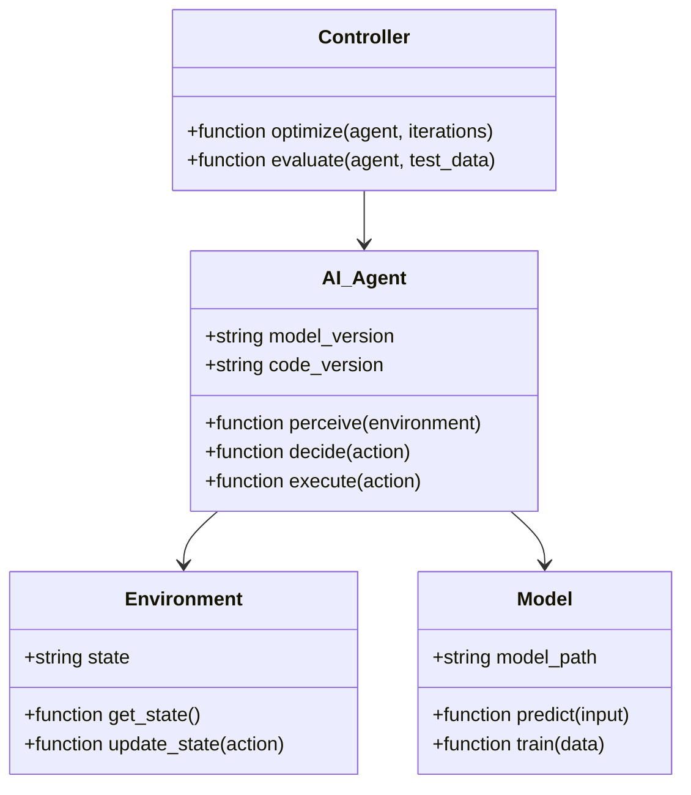
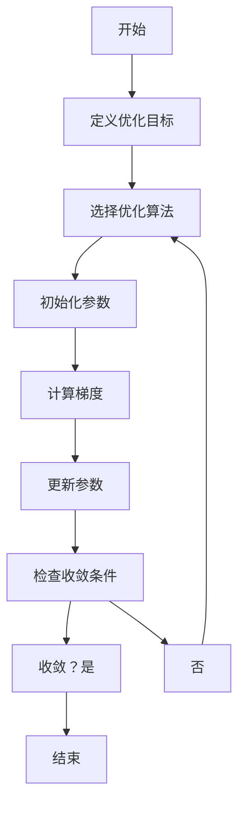

                 


# AI Agent的版本控制与迭代优化流程

## 关键词：
- AI Agent
- 版本控制
- 迭代优化
- 优化算法
- 系统架构

## 摘要：
本文详细探讨了AI Agent的版本控制与迭代优化流程，从基本概念到具体实现方法，结合实际案例分析，全面解析如何在AI Agent的开发过程中有效进行版本管理和优化。文章通过详细分析优化目标、策略和算法，结合系统架构设计和项目实战，为读者提供了一套完整的AI Agent优化方案。

---

## 第一部分: AI Agent的版本控制与迭代优化基础

### 第1章: AI Agent的基本概念与版本控制的重要性

#### 1.1 AI Agent的定义与核心功能
- **1.1.1 AI Agent的定义**  
  AI Agent（人工智能代理）是一种能够感知环境、自主决策并执行任务的智能实体。它通过传感器获取信息，利用算法进行分析和决策，最终通过执行器完成任务。AI Agent可以是软件程序、机器人或其他智能设备。

- **1.1.2 AI Agent的核心功能**  
  - **感知能力**：通过传感器或数据接口获取环境信息。  
  - **决策能力**：基于获取的信息，通过算法做出决策。  
  - **执行能力**：根据决策结果执行操作，如调用API、控制设备等。  
  - **自适应能力**：通过学习和优化不断改进性能。

- **1.1.3 AI Agent与传统软件的区别**  
  AI Agent的核心区别在于其具备自主决策和学习能力，能够根据环境变化动态调整行为，而传统软件通常是基于固定逻辑的程序。

#### 1.2 版本控制在AI Agent中的作用
- **1.2.1 为什么需要版本控制**  
  AI Agent的开发涉及模型、算法和代码的不断迭代，版本控制是确保每次优化可追溯、可恢复的基础。

- **1.2.2 版本控制对AI Agent开发的影响**  
  - **模型版本管理**：确保每次模型优化都有记录，便于回溯和复现。  
  - **代码版本管理**：通过代码版本控制工具（如Git）管理AI Agent的代码开发流程。  
  - **协作开发**：多人协作开发时，版本控制工具是核心基础设施。

- **1.2.3 版本控制的常见挑战**  
  - **模型版本冲突**：不同版本的模型可能在不同场景下表现不同，难以统一管理。  
  - **数据依赖问题**：某些AI Agent的优化依赖于特定数据集，版本控制需要考虑数据的版本和一致性。  

#### 1.3 本章小结
本章介绍了AI Agent的基本概念及其与传统软件的区别，并重点阐述了版本控制在AI Agent开发中的重要性。版本控制不仅是开发流程的基础，更是优化过程中的关键环节。

---

## 第二部分: AI Agent的版本控制流程

### 第2章: AI Agent的版本控制方法

#### 2.1 基于模型的版本控制
- **2.1.1 模型版本的分类**  
  - **训练版本**：基于不同训练数据或超参数的模型版本。  
  - **推理版本**：基于不同推理策略的模型版本。  
  - **优化版本**：基于不同优化算法的模型版本。  

- **2.1.2 模型版本的存储与管理**  
  - **版本标识**：为每个模型版本分配唯一的标识符，便于管理和引用。  
  - **版本存储**：将模型文件、训练数据和优化参数存储在版本控制系统中。  
  - **版本回滚**：当新版本出现问题时，可以回滚到之前的稳定版本。  

- **2.1.3 模型版本的回滚机制**  
  - **回滚流程**：通过版本控制工具快速切换到指定版本，并恢复相关依赖。  
  - **回滚策略**：根据问题的严重性选择回滚的范围，避免不必要的版本切换。  

#### 2.2 基于代码的版本控制
- **2.2.1 代码版本控制的流程**  
  - **代码提交**：开发者将代码提交到版本控制系统，记录修改日志。  
  - **代码分支管理**：通过分支管理实现多人协作开发。  
  - **代码合并**：将不同分支的代码合并到主分支，确保代码的稳定性。  

- **2.2.2 代码版本控制的工具选择**  
  - **Git**：主流的代码版本控制工具，支持分布式协作开发。  
  - **GitHub/GitLab**：基于Git的代码托管平台，提供丰富的协作功能。  
  - **Docker**：用于容器化部署，确保不同版本的AI Agent在运行环境中的一致性。  

- **2.2.3 代码版本控制的注意事项**  
  - **代码规范**：确保代码风格统一，便于多人协作。  
  - **文档管理**：将模型文档和代码文档一并纳入版本控制。  
  - **依赖管理**：通过依赖管理工具（如pipenv）确保开发环境的一致性。  

#### 2.3 混合版本控制方法
- **2.3.1 混合版本控制的定义**  
  混合版本控制是指同时对模型和代码进行版本控制的方法，兼顾模型的可追溯性和代码的可维护性。  

- **2.3.2 混合版本控制的优势**  
  - **模型与代码的关联性**：确保模型和代码的版本对应，避免混淆。  
  - **优化过程的透明性**：通过版本记录可以清晰地追踪优化过程。  

- **2.3.3 混合版本控制的实现步骤**  
  - **初始化版本库**：创建一个同时包含模型和代码的版本库。  
  - **版本提交**：每次优化后提交模型和代码的变更。  
  - **版本回滚**：当出现问题时，可以同时回滚模型和代码。  

#### 2.4 本章小结
本章详细探讨了AI Agent的版本控制方法，包括基于模型的版本控制、基于代码的版本控制以及混合版本控制方法。通过合理选择版本控制策略，可以显著提高AI Agent的开发效率和稳定性。

---

## 第三部分: AI Agent的迭代优化流程

### 第3章: AI Agent的优化目标与策略

#### 3.1 优化目标的设定
- **3.1.1 优化目标的分类**  
  - **性能优化**：提升模型的准确率、响应速度等。  
  - **资源优化**：降低计算资源的消耗。  
  - **用户体验优化**：提升用户交互体验。  

- **3.1.2 优化目标的优先级**  
  - **优先级排序**：根据项目需求和资源限制，确定优化目标的优先级。  
  - **短期目标与长期目标**：明确短期可实现的目标和长期优化方向。  

- **3.1.3 优化目标的实现路径**  
  - **问题分析**：通过数据分析和用户反馈，明确优化方向。  
  - **目标分解**：将整体目标分解为具体的小目标，逐步实现。  

#### 3.2 优化策略的选择
- **3.2.1 基于性能的优化策略**  
  - **算法优化**：通过改进算法结构提升性能。  
  - **参数调整**：通过调整超参数优化模型性能。  

- **3.2.2 基于资源的优化策略**  
  - **资源分配优化**：合理分配计算资源，避免资源浪费。  
  - **资源利用率提升**：通过并行计算等技术提升资源利用率。  

- **3.2.3 基于用户体验的优化策略**  
  - **用户反馈收集**：通过用户反馈分析优化方向。  
  - **交互优化**：优化用户界面和交互流程，提升用户体验。  

#### 3.3 优化策略的实施步骤
- **3.3.1 策略的制定与分解**  
  - **制定优化计划**：明确优化目标和实施步骤。  
  - **分解优化任务**：将整体任务分解为具体的小任务，逐步实施。  

- **3.3.2 策略的实施与监控**  
  - **监控指标设定**：设定关键性能指标（KPIs），用于监控优化效果。  
  - **实时监控**：通过日志和监控工具，实时跟踪优化过程中的问题。  

- **3.3.3 策略的评估与调整**  
  - **评估优化效果**：通过对比优化前后的数据，评估优化策略的有效性。  
  - **持续改进**：根据评估结果，调整优化策略，持续改进。  

#### 3.4 本章小结
本章从优化目标的设定到优化策略的选择和实施，全面探讨了AI Agent的迭代优化流程。通过合理制定优化目标和策略，可以显著提升AI Agent的性能和用户体验。

---

## 第四部分: AI Agent的优化算法与数学模型

### 第4章: 常见的优化算法

#### 4.1 梯度下降算法
- **4.1.1 梯度下降的定义**  
  梯度下降是一种优化算法，通过计算损失函数的梯度，逐步调整模型参数，以最小化损失函数的值。

- **4.1.2 梯度下降的数学模型**  
  损失函数为$L$，参数为$\theta$，学习率为$\eta$，梯度下降的更新公式为：  
  $$\theta = \theta - \eta \cdot \frac{\partial L}{\partial \theta}$$  

- **4.1.3 梯度下降的实现步骤**  
  - **计算损失**：计算当前模型的损失函数值。  
  - **计算梯度**：计算损失函数对模型参数的梯度。  
  - **更新参数**：根据梯度和学习率更新模型参数。  
  - **重复迭代**：重复计算损失、梯度和更新参数，直到满足停止条件。  

#### 4.2 Adam优化算法
- **4.2.1 Adam算法的定义**  
  Adam（Adaptive Moment Estimation）是一种结合了动量和自适应学习率的优化算法，能够有效加速收敛并提高优化效果。

- **4.2.2 Adam算法的数学模型**  
  动量项为$v$，方差项为$r$，学习率为$\eta$，Adam的更新公式为：  
  $$v = \beta_1 v + (1-\beta_1)g$$  
  $$r = \beta_2 r + (1-\beta_2)g^2$$  
  $$\theta = \theta - \eta \cdot \frac{v}{\sqrt{r+\epsilon}}$$  
  其中，$\beta_1$和$\beta_2$分别为动量的衰减率和方差的衰减率，$\epsilon$为防止除零的小量。

- **4.2.3 Adam算法的实现步骤**  
  - **初始化参数**：设置初始参数$\theta$，动量$v$，方差$r$，以及$\beta_1$、$\beta_2$和$\epsilon$。  
  - **计算梯度**：计算损失函数对参数的梯度$g$。  
  - **更新动量和方差**：根据动量和方差的衰减率更新$v$和$r$。  
  - **更新参数**：根据动量、方差和学习率更新参数$\theta$。  
  - **重复迭代**：重复计算梯度和更新参数，直到满足停止条件。  

#### 4.3 其他优化算法
- **4.3.1 其他优化算法的简介**  
  - **随机梯度下降（SGD）**：基于随机样本计算梯度，适用于大数据集。  
  - **批量梯度下降（BGD）**：基于整个数据集计算梯度，适用于小数据集。  
  - **AdaGrad**：自适应学习率的优化算法，适用于不同参数梯度变化大的情况。  

- **4.3.2 算法选择的注意事项**  
  - **数据规模**：数据集大小影响算法选择，大数据集适合随机梯度下降，小数据集适合批量梯度下降。  
  - **梯度特性**：梯度变化大的参数适合AdaGrad，梯度变化小的参数适合Adam。  
  - **计算效率**：Adam在大多数情况下效率较高，适合大多数场景。  

#### 4.4 本章小结
本章详细介绍了几种常见的优化算法，包括梯度下降、Adam和AdaGrad等。通过合理选择和调整优化算法，可以显著提升AI Agent的优化效果。

---

## 总结与最佳实践

### 第5章: 总结与最佳实践

#### 5.1 本章小结
本文从AI Agent的版本控制到迭代优化流程，详细探讨了优化目标、版本控制方法和优化算法的选择与实现。通过合理制定优化策略和选择优化算法，可以显著提升AI Agent的性能和用户体验。

#### 5.2 最佳实践 tips
- **版本控制优先**：在AI Agent的开发中，版本控制是确保优化可追溯性和可恢复性的基础。  
- **混合版本控制**：结合模型和代码的版本控制，确保优化过程的透明性和一致性。  
- **算法选择与调整**：根据具体场景选择合适的优化算法，并通过实验不断调整参数，优化效果。  
- **持续监控与改进**：通过实时监控和用户反馈，持续优化AI Agent的性能和用户体验。  

#### 5.3 注意事项
- **避免过度优化**：在优化过程中，要避免过度追求性能指标，忽视用户体验。  
- **版本回滚机制**：确保在出现问题时能够快速回滚到稳定版本，避免重大损失。  
- **文档记录**：详细记录每次优化的过程和结果，便于后续分析和复现。  

#### 5.4 拓展阅读
- **优化算法研究**：深入研究各类优化算法的原理和应用场景。  
- **系统架构设计**：学习更多系统架构设计的方法和工具，提升系统设计能力。  
- **AI Agent应用案例**：通过实际案例分析，学习如何将AI Agent应用于不同领域。  

---

## 附录

### 附录A: 优化算法的代码实现示例

```python
import numpy as np

def gradient_descent(X, y, theta, learning_rate, iterations):
    m = len(y)
    for _ in range(iterations):
        h = np.dot(X, theta)
        loss = h - y
        gradient = (1/m) * np.dot(X.T, loss)
        theta = theta - learning_rate * gradient
    return theta

def adam(X, y, theta, learning_rate, beta1, beta2, epsilon, iterations):
    m = len(y)
    v = np.zeros(theta.shape)
    r = np.zeros(theta.shape)
    for _ in range(iterations):
        h = np.dot(X, theta)
        loss = h - y
        gradient = (1/m) * np.dot(X.T, loss)
        v = beta1 * v + (1 - beta1) * gradient
        r = beta2 * r + (1 - beta2) * gradient**2
        v_corrected = v / (1 - beta1**(_+1))
        r_corrected = r / (1 - beta2**(_+1))
        theta = theta - learning_rate * v_corrected / (np.sqrt(r_corrected) + epsilon)
    return theta
```

### 附录B: 系统架构设计的类图



### 附录C: 优化流程的流程图



---

## 结语

通过本文的详细讲解，读者可以全面了解AI Agent的版本控制与迭代优化流程。从基本概念到具体实现方法，再到实际案例分析，本文为读者提供了一套完整的优化方案。希望本文能为AI Agent的开发和优化提供有价值的参考和指导。

--- 

如果需要进一步探讨或有其他问题，请随时联系！

