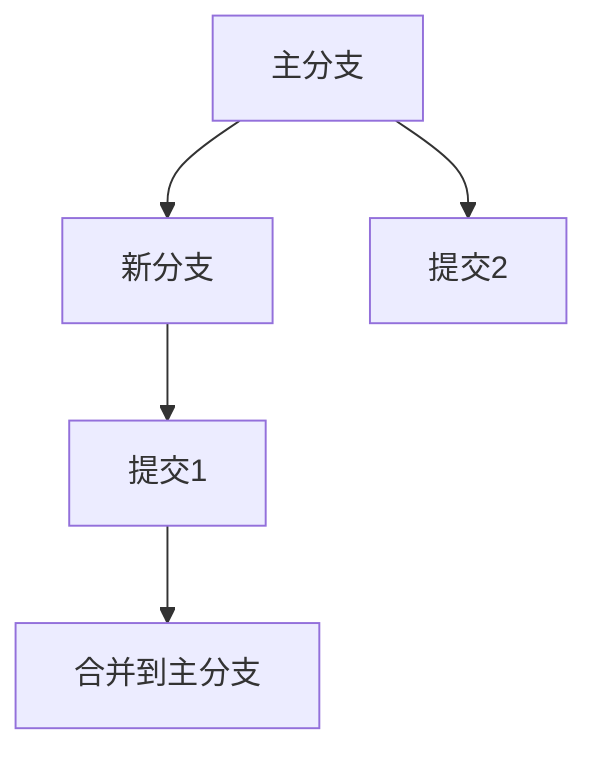
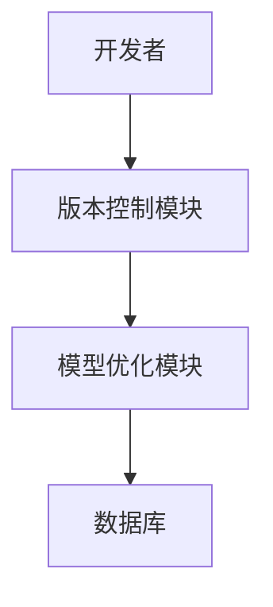

                 


# AI Agent的版本控制与迭代优化策略

> 关键词：AI Agent、版本控制、迭代优化、系统架构、数学模型、项目实战

> 摘要：本文深入探讨了AI Agent的版本控制与迭代优化策略，从基本概念、版本控制原理、算法优化、系统架构到实际项目案例，系统地分析了AI Agent开发中的关键问题，提出了科学的优化方法和实施策略。

---

# 第一部分: AI Agent的版本控制与迭代优化背景

## 第1章: AI Agent概述

### 1.1 AI Agent的基本概念

#### 1.1.1 什么是AI Agent
AI Agent（人工智能代理）是指能够感知环境、自主决策并执行任务的智能体。AI Agent的核心目标是通过感知和行动与环境交互，实现特定的目标。

#### 1.1.2 AI Agent的分类
AI Agent可以根据智能水平、应用场景和决策方式等分为多种类型：
- **反应式AI Agent**：基于当前感知做出反应，不依赖历史信息。
- **认知式AI Agent**：具有复杂推理和规划能力，能够处理不确定性。
- **协作式AI Agent**：能够与其他Agent或人类进行协作，完成复杂任务。
- **学习型AI Agent**：能够通过数据和经验不断优化自身的性能。

#### 1.1.3 AI Agent的核心特征
- **自主性**：能够自主决策和行动。
- **反应性**：能够感知环境并实时响应。
- **目标导向**：以实现特定目标为导向。
- **适应性**：能够适应环境变化和新任务需求。

### 1.2 AI Agent的版本控制的重要性

#### 1.2.1 版本控制的基本概念
版本控制是一种管理文件和代码变更的机制，能够记录每次修改，便于回溯和恢复。

#### 1.2.2 AI Agent开发中的版本控制需求
在AI Agent的开发过程中，版本控制的需求包括：
- **模型版本管理**：AI模型的更新和迭代需要记录和管理。
- **数据版本管理**：训练数据的变更也需要进行版本控制。
- **代码版本管理**：开发过程中的代码变更需要记录。

#### 1.2.3 版本控制对AI Agent迭代优化的意义
版本控制是AI Agent迭代优化的基础，它能够：
- **支持回溯和恢复**：当模型出现性能下降时，可以回溯到之前的版本。
- **支持协作开发**：多人协作开发时，版本控制能够避免代码冲突。
- **支持实验和试错**：允许开发人员尝试不同的算法和策略，失败后可以快速恢复。

### 1.3 AI Agent的迭代优化策略

#### 1.3.1 迭代优化的基本概念
迭代优化是一种通过不断改进模型和算法，逐步提升性能的方法。

#### 1.3.2 AI Agent优化的目标
AI Agent的优化目标包括：
- **提升性能**：提高模型的准确率、响应速度等。
- **降低资源消耗**：减少计算资源的使用。
- **增强适应性**：提高模型对环境变化的适应能力。

#### 1.3.3 优化策略的分类与对比
优化策略可以分为以下几类：
- **贪心算法**：每一步都选择当前最优的解决方案。
- **随机优化**：通过随机搜索寻找最优解。
- **梯度下降**：基于梯度的信息进行优化。
- **强化学习优化**：通过强化学习的方法优化模型。

---

# 第二部分: AI Agent版本控制的核心概念与联系

## 第2章: AI Agent版本控制的核心概念

### 2.1 版本控制的原理

#### 2.1.1 版本控制的基本原理
版本控制通过记录文件的变化历史，支持文件的回溯和恢复。其核心原理包括：
- **变更记录**：记录每次修改的内容和修改者。
- **分支与合并**：允许开发人员在不同的分支上进行实验，最后将结果合并到主分支。

#### 2.1.2 AI Agent版本控制的核心要素
- **版本号**：唯一标识每个版本。
- **变更日志**：记录每个版本的修改内容。
- **依赖关系**：记录不同版本之间的依赖关系。

#### 2.1.3 版本控制的实现方式
- **集中式版本控制**：所有开发者共享一个中心仓库。
- **分布式版本控制**：每个开发者都有自己的本地仓库。

### 2.2 AI Agent版本控制与传统代码版本控制的对比

#### 2.2.1 传统代码版本控制的特点
- **文件为中心**：关注代码文件的变化。
- **简单依赖**：通常只处理代码依赖。

#### 2.2.2 AI Agent版本控制的独特性
- **模型为中心**：关注AI模型的变化。
- **复杂依赖**：需要处理数据、算法和模型的多重依赖。

#### 2.2.3 两者的异同点对比
| 特性                | 传统代码版本控制        | AI Agent版本控制          |
|---------------------|-------------------------|---------------------------|
| 管理对象            | 代码文件                | AI模型、数据、代码        |
| 依赖关系            | 简单                   | 复杂                     |
| 优化目标            | 提高代码质量            | 提高模型性能              |

### 2.3 AI Agent版本控制的ER实体关系图

```mermaid
er
    actor: 开发者
    model_version: 模型版本
    dependency: 依赖关系
    actor --> model_version: 提交版本
    model_version --> dependency: 定义依赖
```

### 2.4 本章小结
通过本章的介绍，我们了解了AI Agent版本控制的核心概念、实现原理以及与传统代码版本控制的差异。下一章将深入探讨AI Agent版本控制的算法原理与数学模型。

---

# 第三部分: AI Agent版本控制的算法原理与数学模型

## 第3章: AI Agent版本控制的算法原理

### 3.1 基于Git的版本控制算法

#### 3.1.1 Git的基本工作原理
Git是一个分布式版本控制系统，其核心原理包括：
- **存储快照**：每次提交记录的是文件的快照。
- **分支与合并**：允许开发人员在不同的分支上进行开发。

#### 3.1.2 分支与合并的实现


#### 3.1.3 树状结构的版本管理
AI Agent的版本控制可以看作是一个树状结构，每个节点代表一个版本，节点之间的关系表示依赖关系。

### 3.2 AI Agent优化算法

#### 3.2.1 随机梯度下降算法
随机梯度下降是一种常用的优化算法，其数学模型如下：
$$f(x) = x^2$$
$$\text{更新规则：} \theta_{n+1} = \theta_n - \eta \cdot \frac{\partial f}{\partial \theta}$$

#### 3.2.2 动态规划算法
动态规划通过状态转移方程进行优化，其数学模型如下：
$$v(s) = \max_a \sum_{s'} P(s'|s,a) v(s')$$

#### 3.2.3 近似算法
近似算法通过简化问题，找到近似最优解，适用于复杂场景。

### 3.3 算法的数学模型

#### 3.3.1 基于梯度下降的优化
$$\text{损失函数：} L = \frac{1}{2m} \sum_{i=1}^{m} (y_i - \hat{y_i})^2$$
$$\text{优化目标：} \min_{\theta} L$$

#### 3.3.2 动态规划的状态转移方程
$$v(s) = \max_a \sum_{s'} P(s'|s,a) v(s')$$

### 3.4 本章小结
通过本章的分析，我们了解了AI Agent版本控制的算法原理和数学模型，为后续的系统设计和优化奠定了基础。

---

# 第四部分: AI Agent版本控制的系统架构与设计

## 第4章: AI Agent版本控制的系统架构

### 4.1 系统功能设计

#### 4.1.1 版本管理模块
- **功能**：管理AI模型的版本，支持回溯和恢复。

#### 4.1.2 优化策略模块
- **功能**：实现AI Agent的优化算法，提升模型性能。

#### 4.1.3 日志记录模块
- **功能**：记录每次版本修改的日志，便于追溯。

### 4.2 系统架构设计



### 4.3 系统接口设计

```mermaid
sequenceDiagram
    actor -> version_control: 提交版本
    version_control -> model_optimizer: 优化模型
    model_optimizer -> database: 保存优化结果
```

### 4.4 系统交互设计

```mermaid
sequenceDiagram
    actor -> version_control: 获取版本历史
    version_control -> model_optimizer: 加载指定版本
    model_optimizer -> actor: 返回优化结果
```

### 4.5 本章小结
通过本章的系统架构设计，我们了解了AI Agent版本控制的整体结构和各模块之间的关系。

---

# 第五部分: AI Agent版本控制的项目实战

## 第5章: 项目实战

### 5.1 环境安装

```bash
pip install gitpython
pip install numpy
pip install matplotlib
```

### 5.2 核心实现源代码

#### 5.2.1 版本控制模块
```python
from git import Repo

class ModelVersionControl:
    def __init__(self, repo_path):
        self.repo = Repo(repo_path)

    def save_version(self, message):
        self.repo.git.add(all=True)
        self.repo.git.commit(m=message)
```

#### 5.2.2 优化策略模块
```python
import numpy as np

def gradient_descent(f, df, theta, eta, iterations):
    for _ in range(iterations):
        theta = theta - eta * df(theta)
    return theta

# 示例函数
def f(x):
    return x**2

def df(x):
    return 2*x

# 示例优化
theta_initial = np.array([2.0])
theta_optimized = gradient_descent(f, df, theta_initial, 0.1, 100)
print(theta_optimized)
```

### 5.3 代码应用解读与分析
- **版本控制模块**：通过GitPython库实现版本控制，能够记录每次模型的修改。
- **优化策略模块**：实现了一个简单的随机梯度下降算法，用于优化AI模型的参数。

### 5.4 实际案例分析
假设我们有一个AI聊天机器人，通过版本控制模块记录每次模型的修改，优化模块不断优化模型的响应速度和准确性。

### 5.5 项目小结
通过本章的项目实战，我们了解了AI Agent版本控制的实际应用和实现方法，能够将理论知识应用到实际开发中。

---

# 第六部分: 总结与展望

## 第6章: 总结与展望

### 6.1 最佳实践 Tips
- 定期备份模型和数据，防止数据丢失。
- 在多人协作开发时，使用分布式版本控制工具。
- 在优化模型时，尽量使用高效的优化算法。

### 6.2 小结
本文从AI Agent的基本概念出发，深入探讨了版本控制和迭代优化的策略，结合系统架构和项目实战，为AI Agent的开发提供了科学的指导。

### 6.3 注意事项
- 在进行版本控制时，需要确保数据和模型的完整性。
- 在优化模型时，需要关注模型的泛化能力和计算效率。

### 6.4 拓展阅读
- 《机器学习实战》
- 《深度学习》
- 《版本控制系统Git权威指南》

---

通过本文的系统阐述，我们希望读者能够全面理解AI Agent的版本控制与迭代优化策略，并能够在实际开发中灵活运用这些方法。

