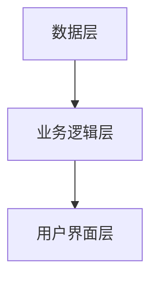
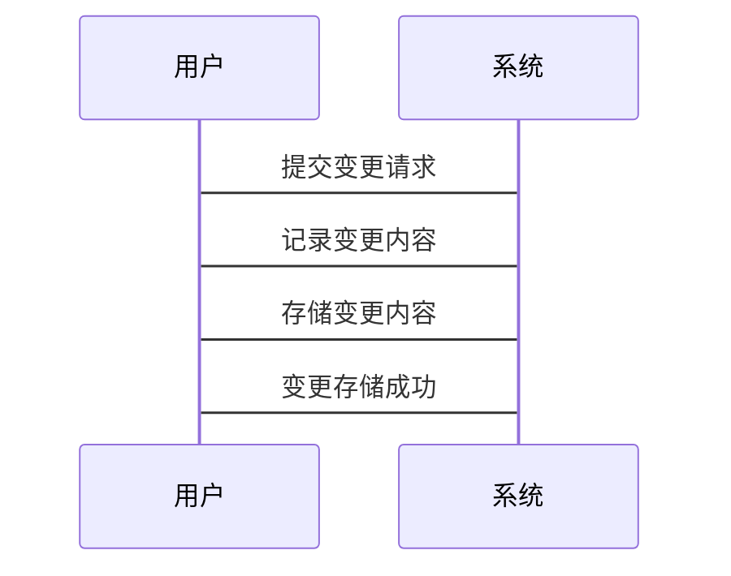

                 


# AI Agent的版本控制与迭代管理

> 关键词：AI Agent, 版本控制, 迭代管理, 算法原理, 系统架构

> 摘要：AI Agent的版本控制与迭代管理是确保AI系统稳定性和可维护性的重要环节。本文将从AI Agent的基本概念出发，探讨其版本控制的核心原理、算法实现、系统架构设计以及实际项目中的应用，最后总结最佳实践。

---

## 第一章: AI Agent的基本概念与版本控制的背景

### 1.1 AI Agent的定义与特点

#### 1.1.1 AI Agent的基本定义
AI Agent（人工智能代理）是指能够感知环境、自主决策并执行任务的智能实体。它能够通过学习和优化不断提升自身的性能。

#### 1.1.2 AI Agent的核心特点
- **自主性**：AI Agent能够自主决策，无需外部干预。
- **反应性**：能够实时感知环境并做出反应。
- **学习性**：通过数据和反馈不断优化自身模型。
- **适应性**：能够在动态环境中调整行为和策略。

#### 1.1.3 AI Agent与传统软件开发的区别
AI Agent的开发和维护需要考虑模型、数据和代码的版本控制，这与传统软件开发有显著不同。AI Agent的版本控制需要同时跟踪模型的演变、数据的更新以及代码的变更。

### 1.2 版本控制的背景与重要性

#### 1.2.1 软件开发中的版本控制
版本控制是软件开发中的基本工具，用于跟踪代码的变更历史，便于回溯和修复问题。

#### 1.2.2 AI Agent开发中的特殊挑战
AI Agent的开发涉及模型训练、数据准备和代码实现三个阶段，每个阶段都需要独立的版本控制策略。

#### 1.2.3 版本控制在AI Agent中的作用
版本控制能够确保AI Agent的稳定性和可追溯性，同时支持团队协作和问题定位。

---

## 第二章: AI Agent版本控制的核心概念

### 2.1 AI Agent版本控制的定义

#### 2.1.1 AI Agent版本控制的定义
AI Agent版本控制是指对AI Agent的模型、数据和代码进行版本记录、管理与控制的过程。

#### 2.1.2 AI Agent版本控制的目标
- **可追溯性**：记录每个版本的变更历史。
- **可复用性**：支持不同版本的回溯与复用。
- **可管理性**：便于团队协作和问题定位。

#### 2.1.3 AI Agent版本控制的范围
- **模型版本**：包括机器学习模型的训练参数和结构。
- **数据版本**：包括训练数据和验证数据。
- **代码版本**：包括AI Agent的实现代码和依赖库。

### 2.2 AI Agent版本控制的核心要素

#### 2.2.1 AI Agent的模型版本
模型版本控制需要记录每次训练的参数、结构和性能指标。

#### 2.2.2 AI Agent的数据版本
数据版本控制需要记录训练数据的来源、格式和版本号。

#### 2.2.3 AI Agent的代码版本
代码版本控制需要记录AI Agent的实现代码、依赖库和配置文件。

---

## 第三章: AI Agent版本控制的原理与方法

### 3.1 AI Agent版本控制的原理

#### 3.1.1 AI Agent版本控制的流程
1. **变更记录**：记录每次变更的内容和原因。
2. **版本存储**：将变更的内容存储到版本控制系统中。
3. **版本回溯**：支持从历史版本中恢复当前版本。
4. **版本合并**：支持不同版本的合并与冲突处理。

#### 3.1.2 AI Agent版本控制的机制
- **基于模型的版本控制**：通过记录模型的训练参数和结构实现版本控制。
- **基于数据的版本控制**：通过记录数据的来源和格式实现版本控制。
- **基于代码的版本控制**：通过代码版本控制工具（如Git）实现代码版本管理。

#### 3.1.3 AI Agent版本控制的实现方式
- **集中式版本控制**：如Git、svn等。
- **分布式版本控制**：如Git-LFS、DVC等。

### 3.2 AI Agent版本控制的方法

#### 3.2.1 基于模型的版本控制
通过记录模型的训练参数和结构，实现模型的版本控制。

#### 3.2.2 基于数据的版本控制
通过记录数据的来源和格式，实现数据的版本控制。

#### 3.2.3 基于代码的版本控制
通过代码版本控制工具，实现AI Agent代码的版本管理。

---

## 第四章: AI Agent版本控制的算法原理

### 4.1 AI Agent版本控制的算法概述

#### 4.1.1 算法的基本概念
版本控制算法用于管理AI Agent的模型、数据和代码的版本。

#### 4.1.2 算法的核心思想
通过记录每次变更的内容和原因，支持版本的回溯、合并和恢复。

#### 4.1.3 算法的实现步骤
1. **记录变更**：记录每次变更的内容和原因。
2. **存储版本**：将变更的内容存储到版本控制系统中。
3. **回溯版本**：支持从历史版本中恢复当前版本。
4. **合并版本**：支持不同版本的合并与冲突处理。

### 4.2 AI Agent版本控制的算法实现

#### 4.2.1 算法的输入与输出
- **输入**：AI Agent的模型、数据和代码。
- **输出**：版本记录和版本控制日志。

#### 4.2.2 算法的实现流程
1. **初始化版本库**：创建版本库用于存储AI Agent的模型、数据和代码。
2. **记录变更**：记录每次变更的内容和原因。
3. **存储版本**：将变更的内容存储到版本库中。
4. **回溯版本**：支持从历史版本中恢复当前版本。
5. **合并版本**：支持不同版本的合并与冲突处理。

#### 4.2.3 算法的优化方法
- **增量存储**：只存储变更的部分，减少存储空间的占用。
- **版本标签**：为重要的版本打标签，便于管理和引用。

---

## 第五章: AI Agent版本控制的数学模型

### 5.1 AI Agent版本控制的数学模型概述

#### 5.1.1 数学模型的基本概念
数学模型用于描述AI Agent版本控制的过程和方法。

#### 5.1.2 数学模型的核心要素
- **版本号**：表示版本的唯一标识符。
- **变更记录**：记录每次变更的内容和原因。
- **版本关系**：描述不同版本之间的依赖关系。

### 5.2 AI Agent版本控制的数学公式

#### 5.2.1 基本公式
$$ \text{版本号} = \text{当前时间戳} $$

#### 5.2.2 优化公式
$$ \text{版本号} = \text{当前时间戳} + \text{变更标识} $$

#### 5.2.3 应用公式
$$ \text{版本关系} = \text{父版本号} \rightarrow \text{子版本号} $$

---

## 第六章: AI Agent版本控制的系统架构与设计

### 6.1 系统功能设计

#### 6.1.1 系统功能概述
AI Agent版本控制系统需要支持模型、数据和代码的版本管理。

#### 6.1.2 系统功能模块
- **版本记录模块**：记录每次变更的内容和原因。
- **版本存储模块**：存储AI Agent的模型、数据和代码。
- **版本回溯模块**：支持从历史版本中恢复当前版本。
- **版本合并模块**：支持不同版本的合并与冲突处理。

### 6.2 系统架构设计

#### 6.2.1 系统架构概述
AI Agent版本控制系统采用分层架构，包括数据层、业务逻辑层和用户界面层。

#### 6.2.2 系统架构图


#### 6.2.3 系统接口设计
- **记录变更接口**：`void recordChange(String changeLog)`
- **存储版本接口**：`void saveVersion(String versionNumber)`
- **回溯版本接口**：`String revertVersion(String versionNumber)`
- **合并版本接口**：`void mergeVersions(String version1, String version2)`

### 6.3 系统交互设计

#### 6.3.1 系统交互流程
1. 用户提交变更请求。
2. 系统记录变更内容。
3. 系统存储变更内容。
4. 用户回溯版本或合并版本。

#### 6.3.2 系统交互图


---

## 第七章: AI Agent版本控制的项目实战

### 7.1 项目介绍

#### 7.1.1 项目背景
本项目旨在开发一个支持AI Agent版本控制的系统，用于管理和维护AI Agent的模型、数据和代码。

#### 7.1.2 项目目标
实现对AI Agent的模型、数据和代码的版本管理，支持版本回溯和合并。

### 7.2 项目核心实现

#### 7.2.1 环境安装
安装必要的开发工具和版本控制软件，如Git、Python、TensorFlow等。

#### 7.2.2 系统核心实现
实现版本记录、存储、回溯和合并功能。

#### 7.2.3 代码实现
```python
# 版本记录模块
def record_change(change_log):
    with open("change_log.txt", "a") as f:
        f.write(change_log + "\n")

# 版本存储模块
def save_version(version_number):
    with open(f"version_{version_number}.txt", "w") as f:
        f.write(version_number)

# 版本回溯模块
def revert_version(version_number):
    with open(f"version_{version_number}.txt", "r") as f:
        current_version = f.read()
    return current_version

# 版本合并模块
def merge_versions(version1, version2):
    # 简化处理，仅合并变更日志
    with open("merged_version.txt", "a") as f:
        f.write(f"Version {version1} and Version {version2} merged.\n")
```

#### 7.2.4 代码应用解读
- **版本记录模块**：记录每次变更的内容。
- **版本存储模块**：存储AI Agent的模型、数据和代码。
- **版本回溯模块**：支持从历史版本中恢复当前版本。
- **版本合并模块**：支持不同版本的合并与冲突处理。

### 7.3 项目小结

#### 7.3.1 项目总结
通过本项目，我们实现了对AI Agent的模型、数据和代码的版本管理，支持版本回溯和合并。

#### 7.3.2 项目经验
- 版本控制是AI Agent开发中的重要环节，需要同时考虑模型、数据和代码的版本管理。
- 使用Git等工具可以有效地管理AI Agent的版本。

---

## 第八章: AI Agent版本控制的总结与展望

### 8.1 小结

#### 8.1.1 核心内容回顾
AI Agent的版本控制需要考虑模型、数据和代码的版本管理，支持版本回溯和合并。

#### 8.1.2 关键点总结
- **模型版本控制**：记录模型的训练参数和结构。
- **数据版本控制**：记录数据的来源和格式。
- **代码版本控制**：使用版本控制工具管理代码。

### 8.2 注意事项

#### 8.2.1 开发中的注意事项
- 在开发过程中，需要及时记录变更内容。
- 版本控制需要与开发流程紧密结合。

#### 8.2.2 使用中的注意事项
- 在回溯版本时，需要确保数据的完整性和一致性。
- 在合并版本时，需要处理可能的冲突和问题。

### 8.3 拓展阅读

#### 8.3.1 相关书籍
- 《版本控制之道》
- 《AI Agent开发指南》

#### 8.3.2 相关技术博客
- Git官方文档
- AI Agent版本控制的最佳实践

---

## 参考文献

- 《版本控制之道》
- 《AI Agent开发指南》
- Git官方文档
- AI Agent版本控制的最佳实践

---

## 附录

### 附录A: 相关术语解释

- **AI Agent**：人工智能代理，能够感知环境、自主决策并执行任务的智能实体。
- **版本控制**：记录和管理软件或系统的变更历史，便于回溯和修复问题。

### 附录B: 工具推荐

- **Git**：分布式版本控制系统。
- **DVC**：数据版本控制系统。
- **TensorFlow**：机器学习框架。

---

## 结束语

通过本文的详细讲解，我们了解了AI Agent的版本控制与迭代管理的核心概念、算法原理、系统架构和实际应用。希望本文能够为AI Agent的开发和维护提供有价值的参考和指导。

