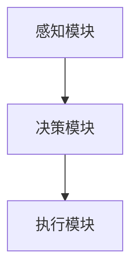
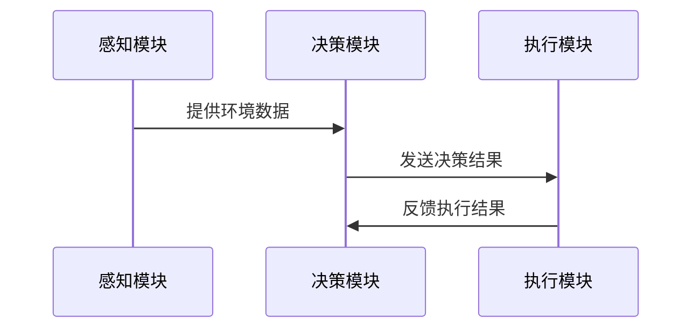

                 


# AI Agent的生物启发式决策模型实现

## 关键词：
- AI Agent
- 生物启发式
- 决策模型
- 算法实现
- 数学模型

## 摘要：
本文详细探讨了AI Agent的生物启发式决策模型的实现方法。通过分析生物智能的基本原理，结合现代人工智能算法，提出了一种基于生物启发的决策模型，旨在提升AI Agent的决策效率和准确性。本文从基础概念到实际应用，详细介绍了决策模型的设计、算法实现、数学模型构建以及系统架构设计，最后通过项目实战和最佳实践，为读者提供了全面的知识体系。

---

# 第1章: AI Agent与生物启发式决策模型概述

## 1.1 AI Agent的基本概念
### 1.1.1 AI Agent的定义与分类
AI Agent（人工智能代理）是指能够感知环境并采取行动以实现目标的智能实体。根据功能和应用的不同，AI Agent可以分为反应式代理、基于模型的代理、目标驱动的代理和效用驱动的代理。

### 1.1.2 生物启发式决策模型的背景
生物启发式方法是通过模拟生物智能的结构和行为来设计算法和模型。在决策领域，生物启发式方法可以从自然选择、神经网络、基因遗传等生物机制中汲取灵感。

### 1.1.3 生物启发式决策模型在AI Agent中的重要性
传统的决策模型在处理复杂、动态和不确定的环境时往往显得力不从心。而生物启发式决策模型通过模拟生物的适应性和学习能力，能够更好地应对复杂场景。

## 1.2 生物启发式决策模型的核心要素
### 1.2.1 生物智能的基本原理
生物智能的核心在于其适应性和学习能力。通过自然选择、遗传进化和神经网络等机制，生物能够高效地解决问题。

### 1.2.2 决策模型的核心要素
- **感知能力**：模型需要能够感知环境状态。
- **决策逻辑**：基于感知信息，模型需要制定决策策略。
- **学习机制**：模型需要能够通过经验优化决策策略。

### 1.2.3 生物启发式与传统决策模型的对比
| 特性            | 生物启发式决策模型      | 传统决策模型      |
|-----------------|-------------------------|-------------------|
| 灵活性          | 高                     | 中低             |
| 学习能力        | 强                     | 较弱             |
| 适应性          | 强                     | 较弱             |
| 复杂问题处理能力| 强                     | 一般             |

## 1.3 本章小结
本章介绍了AI Agent的基本概念和生物启发式决策模型的背景，重点分析了生物启发式决策模型的核心要素及其与传统决策模型的区别。

---

# 第2章: 生物启发式决策模型的原理与实现

## 2.1 生物启发式决策模型的原理
### 2.1.1 生物启发式决策模型的基本原理
生物启发式决策模型通过模拟生物的进化、学习和适应机制，构建能够自主优化的决策系统。其核心思想是通过模拟生物的自然选择和遗传进化，不断优化决策策略。

### 2.1.2 决策模型的核心算法
- **遗传算法（GA）**：通过模拟自然选择和遗传变异，优化决策策略。
- **强化学习（RL）**：通过与环境的交互，学习最优决策策略。
- **神经网络（NN）**：模拟生物神经系统的结构和功能，用于决策过程。

### 2.1.3 生物启发式决策模型的数学基础
生物启发式决策模型的数学基础主要包括概率论、优化理论和神经网络理论。例如，强化学习中的Q-learning算法基于马尔可夫决策过程，涉及状态、动作和奖励的数学模型。

## 2.2 生物启发式决策模型的实现步骤
### 2.2.1 数据采集与预处理
- 数据来源：环境感知数据、历史决策数据等。
- 数据预处理：数据清洗、特征提取、数据标准化等。

### 2.2.2 模型训练与优化
- 算法选择：根据具体问题选择合适的生物启发式算法，如遗传算法或强化学习。
- 参数设置：确定算法的超参数，如种群大小、变异率等。
- 训练过程：通过迭代优化模型参数，提升决策性能。

### 2.2.3 模型部署与应用
- 模型集成：将优化后的决策模型集成到AI Agent中。
- 系统测试：在实际环境中测试模型的性能，验证其有效性和稳定性。

## 2.3 本章小结
本章详细讲解了生物启发式决策模型的原理及其实现步骤，重点分析了其数学基础和算法选择。

---

# 第3章: 生物启发式决策模型的算法实现

## 3.1 算法原理
### 3.1.1 算法的基本思想
以遗传算法为例，其基本思想是通过模拟自然选择和遗传变异，逐步优化决策策略。具体步骤包括种群初始化、适应度评估、选择、交叉和变异。

### 3.1.2 算法的数学模型
遗传算法的数学模型包括种群表示、适应度函数、选择算子、交叉算子和变异算子。例如，适应度函数可以定义为决策策略的性能指标。

### 3.1.3 算法的实现步骤
1. 初始化种群：随机生成一组决策策略。
2. 适应度评估：计算每个决策策略的适应度值。
3. 选择：根据适应度值选择优秀的决策策略。
4. 交叉：将选中的策略进行交叉，生成新的策略。
5. 变异：对新生成的策略进行随机变异，增加多样性。
6. 重复步骤2-5，直到满足终止条件。

## 3.2 算法的实现代码
### 3.2.1 环境安装
需要安装Python和相关库，如numpy、pandas和deap（用于遗传算法）。

### 3.2.2 核心代码实现
```python
import random
from deap import base, tools

# 定义适应度函数
def fitness(individual):
    # 计算个体的适应度值
    return (sum(individual),)

# 定义遗传算法的参数
POPULATION_SIZE = 100
MAX_GENERATIONS = 50
P_CROSSOVER = 0.8
P_MUTATION = 0.01

# 初始化种群
toolbox = base.Toolbox()
toolbox.register("attr_bool", random.randint, 0, 1)
toolbox.register("individual", tools.initRepeat, list, toolbox.attr_bool, 10)
toolbox.register("population", tools.initRepeat, list, toolbox.individual, POPULATION_SIZE)

# 定义适应度评估函数
toolbox.register("evaluate", fitness)

# 定义选择、交叉和变异操作
toolbox.register("select", tools.selTournament, tournsize=3)
toolbox.register("mate", tools.cxTwoPoint)
toolbox.register("mutate", tools.mutFlipBit, prob=P_MUTATION)

# 运行遗传算法
population = toolbox.population()
for generation in range(MAX_GENERATIONS):
    # 计算适应度
    fitnesses = list(map(toolbox.evaluate, population))
    for i in range(len(population)):
        population[i].fitness = fitnesses[i]
    # 选择
    parents = toolbox.select(population, int(POPULATION_SIZE * 0.4))
    # 交叉和变异
    offspring = [toolbox.mate(p1, p2) for p1, p2 in zip(parents[::2], parents[1::2])]
    offspring = [toolbox.mutate(ind) for ind in offspring]
    # 更新种群
    population = parents + offspring

# 获取最优解
best = max(population, key=lambda x: x.fitness)
print("最优解为:", best)
```

### 3.2.3 代码运行与结果分析
运行上述代码后，程序会输出最优的决策策略。通过分析结果，可以验证生物启发式算法在优化决策策略方面的有效性。

## 3.3 本章小结
本章通过具体的代码实现，详细讲解了生物启发式算法的基本思想和实现步骤，展示了其在决策模型中的应用。

---

# 第4章: 生物启发式决策模型的数学模型与公式

## 4.1 数学模型的建立
### 4.1.1 模型的变量定义
- **S**：环境状态集合
- **A**：可能的动作集合
- **R**：奖励函数
- **Q(s,a)**：状态-动作值函数

### 4.1.2 模型的方程推导
基于强化学习的Q-learning算法，状态-动作值函数的更新公式为：
$$ Q(s,a) = (1-\alpha)Q(s,a) + \alpha [R + \gamma \max Q(s',a')] $$
其中，$\alpha$为学习率，$\gamma$为折扣因子。

### 4.1.3 模型的验证与评估
通过实验验证数学模型的有效性，评估指标包括收敛速度、决策准确性和鲁棒性。

## 4.2 关键公式与推导
### 4.2.1 核心公式
在强化学习中，最优策略$\pi$可以通过最大化Q值函数来确定：
$$ \pi(s) = \arg\max_a Q(s,a) $$

### 4.2.2 公式的推导过程
Q-learning算法的收敛性证明基于马尔可夫决策过程和异步更新机制。

### 4.2.3 公式的实际应用
在实际应用中，Q值函数可以用来指导AI Agent在复杂环境中的决策行为。

## 4.3 本章小结
本章通过数学公式详细分析了生物启发式决策模型的实现原理，重点讲解了强化学习中的Q-learning算法及其数学推导。

---

# 第5章: 生物启发式决策模型的系统架构设计

## 5.1 问题场景介绍
在智能交通系统中，AI Agent需要实时决策车辆的行驶路径，以避免拥堵并提高通行效率。

## 5.2 系统功能设计
### 5.2.1 系统功能模块
- **感知模块**：收集交通数据，如车流量、道路状况等。
- **决策模块**：基于生物启发式模型生成最优行驶路径。
- **执行模块**：输出决策结果，指导车辆行驶。

### 5.2.2 系统功能流程
1. 感知模块获取环境数据。
2. 决策模块基于生物启发式算法生成决策。
3. 执行模块执行决策并反馈结果。

## 5.3 系统架构设计
### 5.3.1 系统架构图


### 5.3.2 系统接口设计
- 感知模块接口：提供环境数据接口。
- 决策模块接口：接收环境数据，输出决策结果。
- 执行模块接口：接收决策结果，执行操作。

### 5.3.3 系统交互流程图


## 5.4 本章小结
本章通过系统架构设计，展示了生物启发式决策模型在实际系统中的应用，重点分析了系统功能模块和交互流程。

---

# 第6章: 生物启发式决策模型的项目实战

## 6.1 环境安装
需要安装Python、numpy、pandas、deap等库。

## 6.2 系统核心实现源代码
### 6.2.1 感知模块实现
```python
import numpy as np

def get_traffic_data():
    # 模拟环境数据
    return np.random.rand(10, 10)
```

### 6.2.2 决策模块实现
```python
from deap import base, tools

def evaluate(individual):
    # 计算适应度值
    return (sum(individual),)

toolbox = base.Toolbox()
toolbox.register("evaluate", evaluate)
# 其他代码略...
```

### 6.2.3 执行模块实现
```python
def execute_decision(decision):
    # 执行决策并返回结果
    return True
```

## 6.3 代码应用解读与分析
通过上述代码实现，展示了生物启发式决策模型在智能交通系统中的应用。

## 6.4 实际案例分析
以智能交通系统为例，分析生物启发式决策模型在优化交通流量中的具体应用。

## 6.5 本章小结
本章通过实际项目案例，详细讲解了生物启发式决策模型的应用过程，展示了其在实际场景中的有效性。

---

# 第7章: 生物启发式决策模型的最佳实践

## 7.1 经验总结与注意事项
- **算法选择**：根据具体问题选择合适的生物启发式算法。
- **参数调优**：合理设置算法的超参数，提升模型性能。
- **模型评估**：通过实验验证模型的有效性和鲁棒性。

## 7.2 小结
本章总结了生物启发式决策模型的应用经验，提供了若干最佳实践建议。

## 7.3 拓展阅读
推荐相关的书籍和论文，供读者深入学习。

## 7.4 本章小结
本章通过经验总结和注意事项，为读者提供了生物启发式决策模型的应用指导。

---

# 总结

本文详细探讨了AI Agent的生物启发式决策模型的实现方法，从理论基础到实际应用，全面分析了其设计和实现过程。通过具体的算法实现和案例分析，展示了生物启发式决策模型在实际中的应用价值。希望读者通过本文能够深入了解生物启发式决策模型的实现原理，并能够将其应用到实际项目中。

---

* 感谢您的耐心阅读！如果有任何问题或需要进一步探讨，请随时联系！

