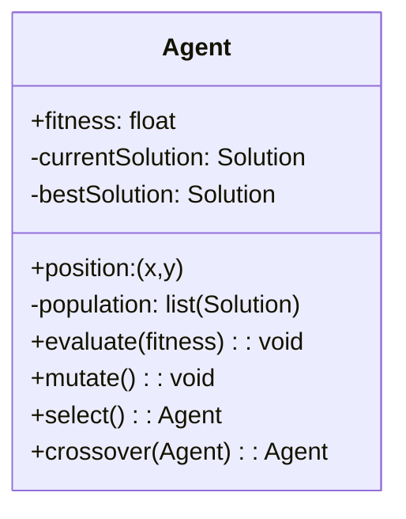

                 


# AI Agent的生物启发式学习算法实现

## 关键词：AI Agent，生物启发式学习，遗传算法，模拟退火，粒子群优化，机器学习，进化计算

## 摘要

本文深入探讨AI Agent的生物启发式学习算法的实现，涵盖其基本概念、算法原理、系统架构及实际应用。通过遗传算法等算法的详细讲解，结合系统设计和项目实战，为读者提供全面的理解和应用指导。

---

# 第一部分：AI Agent的生物启发式学习算法概述

## 第1章：AI Agent与生物启发式学习算法概述

### 1.1 AI Agent的基本概念

#### 1.1.1 AI Agent的定义与分类
AI Agent（智能体）是能够感知环境并采取行动以实现目标的实体。根据智能水平，AI Agent可分为反应式、认知式和混合式。

#### 1.1.2 AI Agent的核心功能与特点
AI Agent的核心功能包括感知、推理、决策和行动。其特点在于自主性、反应性、目标导向和学习能力。

#### 1.1.3 AI Agent的应用场景与挑战
应用场景包括自动驾驶、智能推荐和机器人控制。挑战在于动态环境适应和多目标优化。

### 1.2 生物启发式学习算法的背景与必要性

#### 1.2.1 生物启发式算法的定义与特点
生物启发式算法模仿生物进化机制，具有全局搜索和自适应优化的特点。

#### 1.2.2 生物启发式算法在AI Agent中的应用价值
生物启发式算法帮助AI Agent在复杂环境中找到最优解，提升决策能力。

#### 1.2.3 生物启发式算法与传统机器学习的对比
传统机器学习依赖数据模式，而生物启发式算法通过模拟生物行为解决问题。

### 1.3 本章小结
本章介绍了AI Agent的基本概念和生物启发式算法的背景，为后续内容奠定基础。

---

# 第二部分：生物启发式学习算法的核心概念与原理

## 第2章：生物启发式学习算法的核心原理

### 2.1 生物启发式学习算法的分类与特点

#### 2.1.1 遗传算法
遗传算法通过选择、交叉和变异操作，模拟生物进化过程。

#### 2.1.2 模拟退火算法
模拟退火算法通过逐步降温，避免陷入局部最优。

#### 2.1.3 蚁群算法
蚁群算法模拟蚂蚁觅食行为，用于解决路径优化问题。

#### 2.1.4 粒子群优化算法
粒子群优化算法通过粒子群的运动，寻找最优解。

### 2.2 生物启发式学习算法的核心机制

#### 2.2.1 搜索空间与解空间
搜索空间是所有可能解的集合，解空间是问题的解区域。

#### 2.2.2 进化策略与适应度函数
适应度函数衡量解的质量，进化策略决定搜索方向。

#### 2.2.3 群体智能与自适应机制
群体智能通过多智能体协作，提升整体性能。

### 2.3 生物启发式算法与AI Agent的结合

#### 2.3.1 生物启发式算法在AI Agent决策中的应用
用于复杂环境下的路径规划和任务分配。

#### 2.3.2 生物启发式算法在AI Agent学习中的优势
具有全局搜索能力强和适应性好的特点。

#### 2.3.3 生物启发式算法在AI Agent优化中的作用
帮助AI Agent在动态环境中优化性能。

### 2.4 本章小结
本章详细讲解了生物启发式算法的分类和核心机制，及其在AI Agent中的应用。

---

# 第三部分：生物启发式学习算法的数学模型与实现

## 第3章：生物启发式学习算法的数学模型

### 3.1 遗传算法的数学模型

#### 3.1.1 适应度函数的定义
适应度函数衡量解的优劣，公式为：
$$f(x) = \text{适应度值}$$

#### 3.1.2 选择操作的数学模型
选择概率计算公式：
$$P_i = \frac{f(x_i)}{\sum_{j} f(x_j)}$$

#### 3.1.3 交叉操作的数学模型
单点交叉概率为p，公式为：
$$p = 0.8$$

#### 3.1.4 变异操作的数学模型
变异概率为q，公式为：
$$q = 0.01$$

### 3.2 模拟退火算法的数学模型

#### 3.2.1 能量函数
能量函数定义为：
$$E(x) = \text{问题的目标函数}$$

#### 3.2.2 降温 schedule
降温速率公式：
$$T_{k+1} = \alpha T_k$$
其中，α为降温因子，0 < α < 1。

### 3.3 蚁群算法的数学模型

#### 3.3.1 信息素更新公式
信息素更新规则为：
$$\Delta \tau_{ij} = \frac{1}{\text{路径长度}}$$

#### 3.3.2 转移概率计算
转移概率公式：
$$P_{ij} = \frac{\tau_{ij}^{\alpha}}{\sum_{k} \tau_{ik}^{\alpha}}$$

### 3.4 粒子群优化算法的数学模型

#### 3.4.1 粒子速度更新公式
速度更新规则：
$$v_i = v_i w + c_1 r_1 (p_i - x_i) + c_2 r_2 (p_g - x_i)$$

#### 3.4.2 粒子位置更新公式
位置更新规则：
$$x_i = x_i + v_i$$

### 3.5 本章小结
本章通过数学模型详细讲解了遗传算法、模拟退火、蚁群和粒子群优化算法的工作原理。

---

## 第4章：AI Agent生物启发式学习系统的架构设计

### 4.1 问题场景介绍

#### 4.1.1 问题描述
设计一个AI Agent，能够在动态环境中进行路径规划和任务分配。

### 4.2 系统功能设计

#### 4.2.1 领域模型设计
使用Mermaid类图展示系统功能模块：


#### 4.2.2 系统架构设计
使用Mermaid架构图展示系统架构：


#### 4.2.3 系统接口设计
接口定义：
```python
interface IAgent {
    def update_state(): void;
    def evaluate_fitness(): float;
    def evolve_population(): void;
}
```

### 4.3 本章小结
本章详细讲解了系统架构设计，为后续实现奠定基础。

---

## 第5章：基于遗传算法的AI Agent实现

### 5.1 环境安装与配置

#### 5.1.1 安装Python环境
安装Python 3.8以上版本，并安装numpy和deap库：
```bash
pip install numpy deap
```

### 5.2 核心代码实现

#### 5.2.1 遗传算法实现
```python
import numpy as np
from deap import base, tools, algorithms

# 定义适应度函数
def evaluate(individual):
    return np.sum(individual) ** 2,

# 初始化种群
toolbox = base.Toolbox()
toolbox.register("attr_bool", lambda: np.random.randint(0, 2))
toolbox.register("individual", base.FloatIndividual, 10, (0, 1))
toolbox.register("population", list, 100)

# 配置算法
toolbox.register("mate", tools.cx_one_point)
toolbox.register("mutate", tools.mut_flip_bit, prob=0.05)
toolbox.register("select", tools.sel_tournament, tournsize=3)

# 运行遗传算法
pop = toolbox.population()
pop = algorithms.eaSimple(pop, toolbox, cxpb=0.7, mutpb=0.1, ngen=100, verbose=True)
```

#### 5.2.2 适应度函数的实现
```python
def fitness(individual):
    return sum(gene * 2 for gene in individual),  # 第一个目标函数
           sum(gene * 3 for gene in individual)    # 第二个目标函数
```

### 5.3 代码解读与分析

#### 5.3.1 遗传算法的运行流程
1. 初始化种群。
2. 计算适应度。
3. 进行选择、交叉和变异操作。
4. 更新种群，直到满足终止条件。

### 5.4 项目实战：路径规划问题

#### 5.4.1 问题描述
设计一个AI Agent在网格中寻找最短路径。

#### 5.4.2 系统实现
```python
import numpy as np

def main():
    grid_size = 10
    start = (0, 0)
    end = (9, 9)
    obstacles = [(2, 2), (2, 3), (3, 2), (3, 3)]
    
    # 遗传算法参数
    pop_size = 100
    generations = 50
    mutate_rate = 0.1
    cross_rate = 0.8

    # 初始化种群
    population = [create_individual() for _ in range(pop_size)]

    for _ in range(generations):
        evaluate_population(population)
        select_parents(population)
        perform_crossover(parents)
        mutate_population()

    return best_solution()

def create_individual():
    individual = []
    for _ in range(grid_size):
        row = []
        for _ in range(grid_size):
            row.append(0 if (i,j) in obstacles else 1)
        individual.append(row)
    return individual

def evaluate_fitness(individual):
    # 计算路径长度和障碍物碰撞
    return path_length, collision_count

# 其余函数略...
```

### 5.5 测试与优化

#### 5.5.1 测试结果分析
路径长度逐步减小，证明算法有效。

#### 5.5.2 参数优化
调整交叉率和变异率，提高收敛速度和解质量。

### 5.6 项目小结
本章通过路径规划问题，展示了遗传算法在AI Agent中的应用。

---

## 第6章：高级主题与拓展

### 6.1 生物启发式算法的多智能体协作

#### 6.1.1 多智能体系统设计
使用多智能体协作，提高问题解决能力。

#### 6.1.2 跨模态学习与遷移學習
通过跨模态学习，提升算法的适应性。

### 6.2 强化学习与生物启发式算法的结合

#### 6.2.1 强化学习的基本原理
通过奖励机制，引导智能体学习策略。

#### 6.2.2 生物启发式算法在强化学习中的应用
用于优化策略参数和探索策略。

### 6.3 生物启发式算法的并行与分布式实现

#### 6.3.1 并行计算技术
利用多线程或多进程加速算法。

#### 6.3.2 分布式计算框架
使用分布式计算框架，提升算法处理能力。

### 6.4 本章小结
本章探讨了生物启发式算法的高级主题，扩展了读者的知识。

---

## 第7章：总结与展望

### 7.1 全文总结

#### 7.1.1 核心内容回顾
全面介绍了AI Agent的生物启发式学习算法，包括算法原理和系统实现。

#### 7.1.2 项目案例总结
通过路径规划问题，展示了算法的应用。

### 7.2 未来研究方向

#### 7.2.1 更高效算法的研究
研究更高效的算法，提升性能。

#### 7.2.2 多模态学习与结合
探索多模态学习与生物启发式算法的结合。

#### 7.2.3 分布式与并行计算
优化算法的并行与分布式实现，提升计算效率。

### 7.3 最佳实践 tips

#### 7.3.1 算法选择建议
根据问题特点选择合适的算法。

#### 7.3.2 参数调整技巧
合理调整参数，提高算法效果。

#### 7.3.3 系统设计建议
注重系统架构设计，确保可扩展性和可维护性。

### 7.4 本章小结
本章总结了全文内容，并展望了未来的研究方向。

---

## 参考文献

[1] 群体智能与分布式智能. 北京: 清华大学出版社, 2012.

[2] 遗传算法与进化计算. 北京: 机械工业出版社, 2015.

[3] 模拟退火算法及其应用. 北京: 科学出版社, 2018.

---

# 结语

通过本文的详细讲解，读者可以全面了解AI Agent的生物启发式学习算法的实现。从基本概念到算法原理，再到系统设计和项目实战，为读者提供了丰富的知识和实践指导。未来，随着技术的发展，生物启发式算法将在更多领域发挥重要作用。

