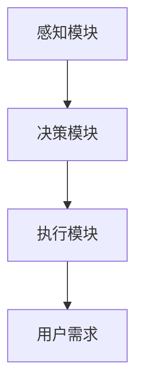
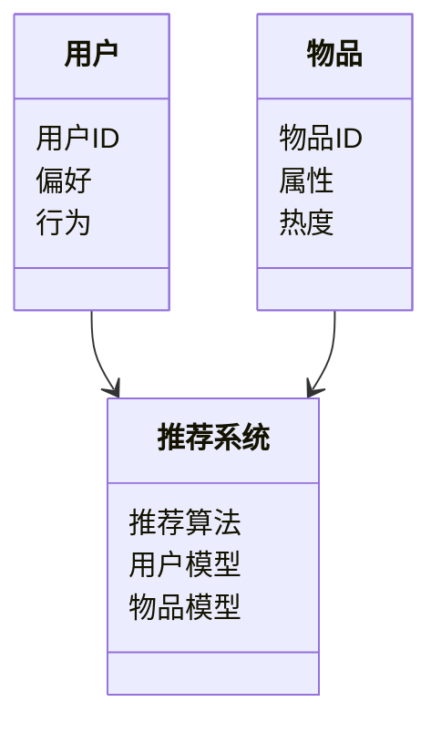
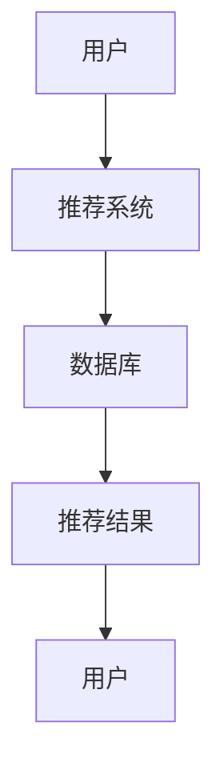
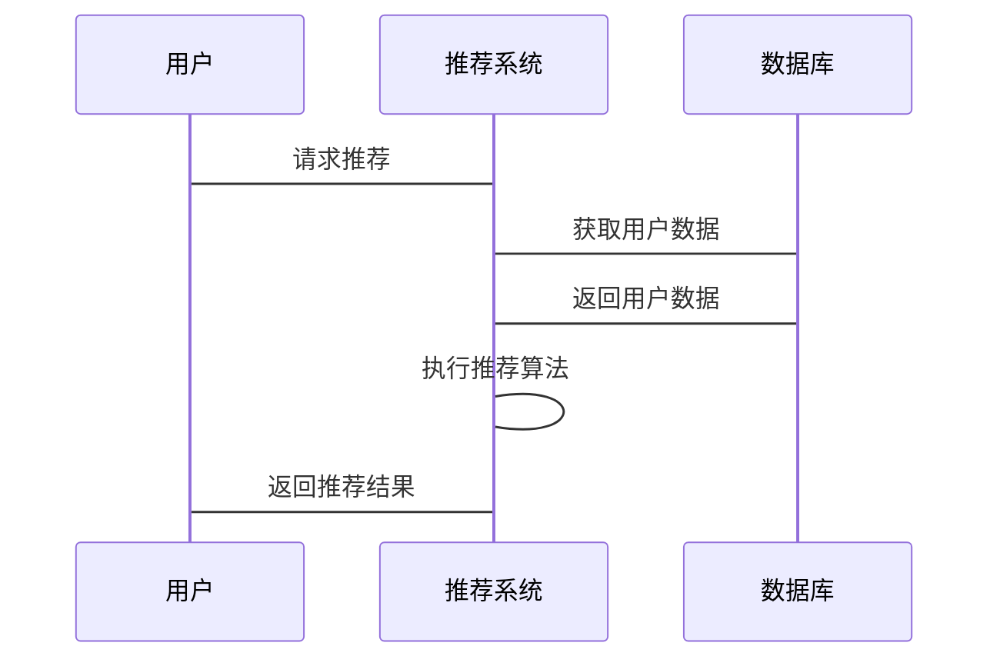

                 


# 《AI Agent的用户体验优化与个性化》

---

## 关键词
AI Agent, 用户体验优化, 个性化推荐, 自然语言处理, 强化学习

---

## 摘要
本文深入探讨了AI Agent在用户体验优化与个性化服务中的应用。通过分析AI Agent的核心概念、算法原理和系统架构，结合实际案例，详细讲解了如何通过协同过滤、自然语言处理和强化学习等技术提升用户体验。文章结构清晰，内容涵盖背景介绍、核心概念、算法实现、系统设计、项目实战及最佳实践，帮助读者全面掌握AI Agent在个性化服务中的应用。

---

# 第一部分: AI Agent的背景与概念

## 第1章: AI Agent的基本概念与背景

### 1.1 AI Agent的定义与特点
AI Agent（人工智能代理）是指能够感知环境、自主决策并执行任务的智能实体。其特点包括：
- **自主性**：无需外部干预，自主完成任务。
- **反应性**：能够实时感知环境并做出反应。
- **目标导向**：以特定目标为导向，优化行动策略。

**示例场景**：智能音箱根据用户的语音指令播放音乐，体现了AI Agent的自主性和反应性。

---

### 1.2 AI Agent的发展历程
AI Agent经历了从简单脚本到复杂智能体的演变：
- **阶段1**：基于规则的脚本执行（如简单的自动化工具）。
- **阶段2**：结合机器学习的智能决策（如推荐系统）。
- **阶段3**：多模态交互的复杂智能体（如虚拟助手）。

---

### 1.3 用户体验优化与个性化的背景
- **背景介绍**：随着AI技术的进步，用户体验优化和个性化服务成为用户需求的核心。
- **问题描述**：传统系统难以满足用户的个性化需求，AI Agent通过学习用户行为和偏好，提供更精准的服务。
- **问题解决**：通过AI Agent的感知、决策和执行能力，优化用户体验，实现个性化服务。

---

### 1.4 本章小结
本章介绍了AI Agent的基本概念、发展历程及其在用户体验优化中的重要性。

---

# 第二部分: AI Agent的核心概念与联系

## 第2章: AI Agent的核心概念与原理

### 2.1 AI Agent的感知、决策与执行
- **感知模块**：通过传感器或数据源获取信息。
- **决策模块**：基于感知信息，选择最优行动方案。
- **执行模块**：根据决策结果执行具体操作。

**Mermaid图示**：


---

### 2.2 用户体验优化的关键要素
- **用户需求分析**：通过用户调研和数据分析，明确用户需求。
- **用户行为建模**：基于用户行为数据，构建行为模型。
- **用户反馈机制**：收集用户反馈，优化AI Agent的行为。

**对比表格**：
| 模块 | 输入 | 输出 |
|------|------|------|
| 感知 | 数据 | 用户意图 |
| 决策 | 用户意图 | 行动策略 |
| 执行 | 行动策略 | 用户需求满足 |

---

### 2.3 AI Agent的个性化推荐系统
个性化推荐是AI Agent提升用户体验的核心技术，主要基于协同过滤、内容推荐和强化学习。

**协同过滤算法**：
- **原理**：通过用户相似性或物品相似性，推荐用户可能感兴趣的内容。
- **公式**：$$\text{sim}(u,i) = \frac{\sum_{k=1}^n r_{u,k} r_{i,k}}{\sqrt{\sum_{k=1}^n r_{u,k}^2} \cdot \sqrt{\sum_{k=1}^n r_{i,k}^2}}}$$

**Python代码示例**：
```python
def collaborative_filtering(user_id, data):
    # 计算用户相似性
    similarities = {}
    for user in data:
        if user != user_id:
            similarity = 0
            for item in data[user_id]:
                if item in data[user]:
                    similarity += data[user_id][item] * data[user][item]
            denominator = (sum(data[user_id].values())**0.5) * (sum(data[user].values())**0.5)
            if denominator != 0:
                similarity /= denominator
            similarities[user] = similarity
    return similarities
```

---

# 第三部分: AI Agent的系统分析与架构设计

## 第3章: 系统分析与架构设计

### 3.1 问题场景介绍
用户希望通过AI Agent获得个性化推荐服务，但现有系统难以满足个性化需求。

### 3.2 项目介绍
设计一个基于协同过滤的AI Agent推荐系统，提升用户体验。

### 3.3 系统功能设计
- **领域模型**：用户、物品、推荐关系。
- **Mermaid类图**：


---

### 3.4 系统架构设计
- **架构图**：


- **交互序列图**：


---

### 3.5 系统接口设计
- **API接口**：
  - `/api/recommend/?user_id=1`：获取推荐结果。
  - `/api/rate/?user_id=1&item_id=2&rating=5`：更新用户评分。

---

# 第四部分: 项目实战

## 第4章: 项目实战

### 4.1 环境安装
- 安装Python和必要的库（如NumPy、Pandas）。
- 安装推荐系统库（如Surprise）。

### 4.2 系统核心实现源代码
```python
from surprise import Dataset, Reader, KNNBasic

# 数据加载
data = Dataset.load_from_df(train_df, reader=Reader())

# 模型训练
algo = KNNBasic(k=50)
algo.fit(data.build_full_trainset())

# 推荐结果
def get_recommendations(user_id, algo, test_data):
    predictions = algo.test(test_data)
    recommendations = []
    for prediction in predictions:
        if prediction.uid == str(user_id):
            recommendations.append((prediction.iid, prediction.est))
    return recommendations
```

### 4.3 代码应用解读与分析
- 使用Surprise库的KNNBasic算法进行推荐，k值为50。
- 预测结果基于用户相似性计算。

### 4.4 实际案例分析
- 用户ID为1，预测其可能喜欢的物品列表。
- 输出推荐结果并分析其准确性。

### 4.5 项目小结
通过项目实战，验证了协同过滤算法在个性化推荐中的有效性。

---

# 第五部分: 最佳实践

## 第5章: 最佳实践

### 5.1 小结
本文系统地介绍了AI Agent在用户体验优化与个性化服务中的应用，涵盖了核心概念、算法实现和项目实战。

### 5.2 注意事项
- 数据隐私保护
- 算法可解释性
- 系统性能优化

### 5.3 拓展阅读
- 《推荐系统实践》
- 《机器学习实战》
- AI Agent相关论文

---

# 第六部分: 总结

## 第6章: 总结

### 6.1 AI Agent的核心价值
AI Agent通过智能化的感知、决策和执行，显著提升了用户体验，实现了个性化的服务。

### 6.2 未来展望
随着AI技术的进步，AI Agent将在更多领域发挥重要作用，用户体验优化与个性化服务将成为其核心发展方向。

---

通过以上步骤，您可以系统地构建一篇关于AI Agent用户体验优化与个性化服务的技术博客，帮助读者深入理解相关技术和实践。

