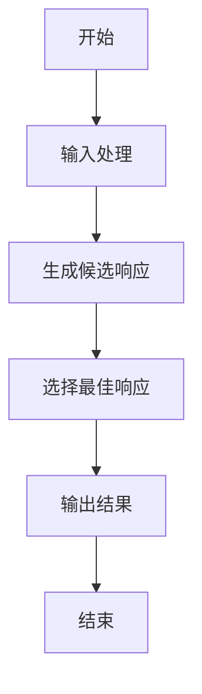
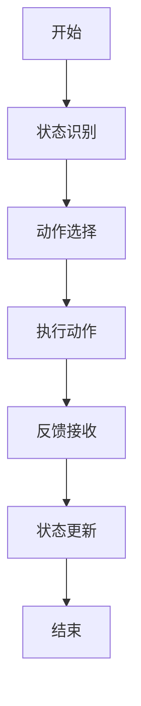
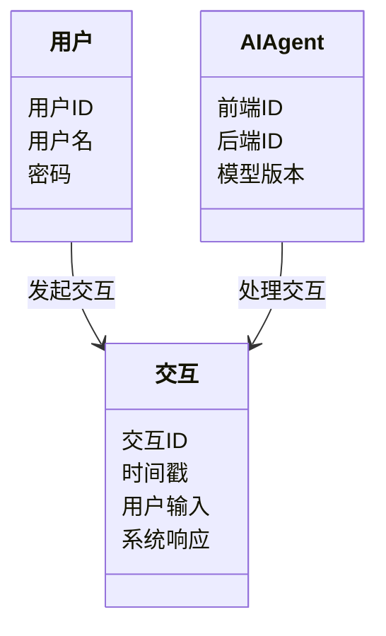
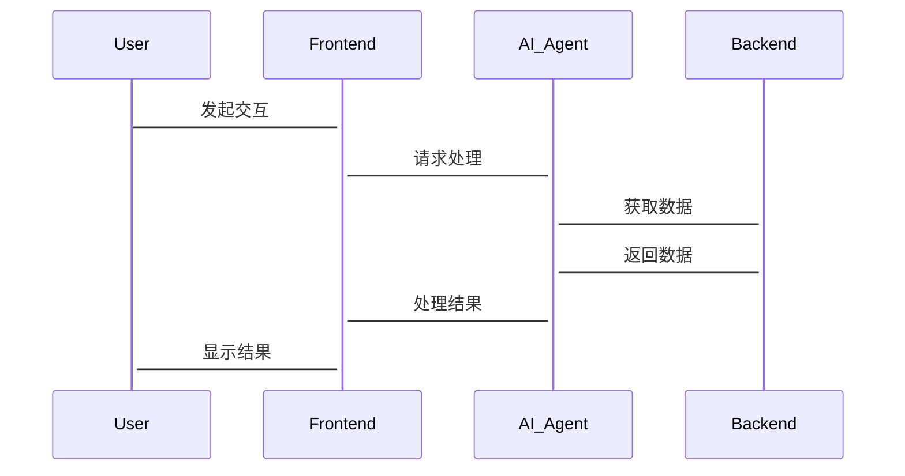

                 


---

# AI Agent的用户体验设计：提升交互效率与满意度

**关键词**：AI Agent, 用户体验设计, 交互设计, 用户满意度, 交互效率

**摘要**：本文旨在探讨AI Agent在用户体验设计中的关键作用，分析如何通过优化交互设计提升效率和满意度。文章从AI Agent的核心概念出发，结合算法原理和系统架构设计，提供具体的实现方法和实战案例，最终总结出提升用户体验的最佳实践。

---

## 第1章: AI Agent的背景与问题背景

### 1.1 问题背景

#### 1.1.1 从传统交互到AI交互的演进

传统交互设计依赖于固定的规则和预定义的响应，难以适应用户的动态需求。随着AI技术的发展，AI Agent通过学习和适应，提供更智能、个性化的交互体验，显著提升了用户体验。

#### 1.1.2 当前交互设计的痛点与挑战

- **效率低下**：传统交互设计无法实时适应用户需求，导致用户体验差。
- **个性化不足**：缺乏对用户个性化需求的深度理解，导致交互单调。
- **反馈机制不完善**：反馈不够及时或不够具体，影响用户满意度。

#### 1.1.3 AI Agent在交互设计中的角色

AI Agent作为智能化的交互工具，通过自然语言处理、机器学习等技术，实时理解和响应用户需求，显著提升交互效率和满意度。

### 1.2 问题描述

#### 1.2.1 用户体验的核心要素

- **效率**：用户能够快速、准确地完成目标。
- **满意度**：用户对交互过程的满意程度。
- **个性化**：根据用户需求提供定制化服务。

#### 1.2.2 AI Agent交互中的效率与满意度问题

- **效率问题**：交互过程中的延迟和错误影响用户体验。
- **满意度问题**：用户对交互结果的满意度不足。

#### 1.2.3 用户需求与技术实现的平衡

在设计AI Agent时，需平衡用户需求的多样性与技术实现的可行性，确保用户体验的高效和满意。

### 1.3 问题解决

#### 1.3.1 AI Agent的定义与目标

AI Agent是一种能够感知用户需求、主动提供服务的智能体，其目标是通过智能化交互提升用户体验。

#### 1.3.2 提升交互效率的设计思路

- **上下文感知**：通过分析用户行为和环境，提供更精准的交互响应。
- **动态反馈**：实时调整交互策略，确保高效反馈。

#### 1.3.3 提升用户满意度的关键因素

- **个性化服务**：根据用户偏好提供定制化交互。
- **自然流畅的对话**：通过自然语言处理技术，实现更自然的对话体验。

### 1.4 AI Agent的边界与外延

#### 1.4.1 AI Agent的功能边界

- **核心功能**：理解和响应用户需求。
- **辅助功能**：数据收集与分析、用户行为预测。

#### 1.4.2 与传统交互设计的区别

| 特性          | 传统交互设计         | AI Agent交互设计        |
|---------------|----------------------|-------------------------|
| 智能性         | 低                   | 高                     |
| 适应性         | 低                   | 高                     |
| 个性化         | 有限                 | 强                     |

#### 1.4.3 与其他AI技术的关系

AI Agent依赖于自然语言处理、机器学习等技术，与其他技术协同工作，共同提升用户体验。

---

## 第2章: AI Agent的核心概念与联系

### 2.1 核心概念原理

#### 2.1.1 AI Agent的基本原理

AI Agent通过感知用户输入，结合内部算法生成响应，实现智能化交互。

#### 2.1.2 用户体验设计的核心要素

- **用户角色**：不同用户群体的需求差异。
- **交互流程**：从输入到输出的完整流程。
- **反馈机制**：用户操作后的系统反馈。

### 2.2 核心概念属性特征对比

#### 2.2.1 对比分析表格

| 特性          | 传统交互设计         | AI Agent交互设计        |
|---------------|----------------------|-------------------------|
| 响应速度       | 较慢                 | 较快                    |
| 个性化程度     | 低                   | 高                     |
| 学习能力       | 无                   | 有                     |

### 2.3 ER实体关系图

```mermaid
erDiagram
    user {
        string 用户ID
        string 用户名
        string 密码
    }
    ai_agent {
        string 前端ID
        string 后端ID
        string 模型版本
    }
    interaction {
        string 交互ID
        datetime 时间戳
        string 用户输入
        string 系统响应
    }
    user --> interaction : 发起交互
    ai_agent --> interaction : 处理交互
```

---

## 第3章: AI Agent的算法原理与数学模型

### 3.1 算法原理

#### 3.1.1 生成式模型



#### 3.1.2 强化学习



#### 3.1.3 Python代码实现

```python
import tensorflow as tf
import numpy as np

# 生成式模型示例代码
class Generator:
    def __init__(self, model):
        self.model = model

    def generate_response(self, input_text):
        # 输入处理
        input_tensor = self.model.input_layer(input_text)
        # 生成候选响应
        candidates = self.model.generate(input_tensor)
        # 选择最佳响应
        best_candidate = self.model.select_best(candidates)
        return best_candidate

# 加强学习示例代码
class Agent:
    def __init__(self, model):
        self.model = model

    def take_action(self, state):
        # 动作选择
        action = self.model.predict(state)
        # 执行动作
        next_state = self.model.step(state, action)
        return next_state, action
```

#### 3.1.4 数学模型

- **生成式模型数学基础**：
  $$ P(y|x) = \frac{P(x,y)}{P(x)} $$
  其中，\( P(x,y) \) 是联合概率分布，\( P(x) \) 是边缘概率分布。

- **强化学习数学基础**：
  $$ Q(s,a) = Q(s,a) + \alpha (r + \max Q(s',a') - Q(s,a)) $$
  其中，\( Q(s,a) \) 是Q值，\( \alpha \) 是学习率，\( r \) 是奖励。

---

## 第4章: 系统分析与架构设计

### 4.1 系统分析

#### 4.1.1 问题场景介绍

以智能客服系统为例，分析用户咨询的交互流程，设计高效的AI Agent解决方案。

### 4.2 系统功能设计

#### 4.2.1 领域模型



### 4.3 系统架构设计

```mermaid
graph TD
    User --> Frontend : 用户输入
    Frontend --> AI_Agent : 请求处理
    AI_Agent --> Backend : 获取数据
    Backend --> Frontend : 返回结果
    Frontend --> User : 显示结果
```

### 4.4 系统接口设计

#### 4.4.1 关键接口

- **用户输入接口**：接收用户的自然语言输入。
- **反馈接口**：根据用户反馈调整交互策略。

#### 4.4.2 交互流程图



---

## 第5章: 项目实战

### 5.1 环境安装

安装Python、TensorFlow、Flask等工具：

```bash
pip install python tensorflow flask
```

### 5.2 系统核心实现

#### 5.2.1 生成式模型实现

```python
def generate_response(input_text):
    # 处理输入
    processed_input = preprocess(input_text)
    # 生成候选
    candidates = generate(processed_input)
    # 选择最佳
    best_candidate = select_best(candidates)
    return best_candidate
```

#### 5.2.2 强化学习实现

```python
def take_action(state):
    # 选择动作
    action = model.predict(state)
    # 执行动作
    next_state = step(state, action)
    return next_state, action
```

### 5.3 代码解读与分析

分析代码结构，解释每部分的功能，展示AI Agent如何实现高效的交互流程。

### 5.4 实际案例分析

以智能客服为例，分析设计中的挑战，如处理复杂查询、多轮对话等，展示AI Agent如何有效解决这些问题。

### 5.5 项目小结

总结项目实现的关键点，强调设计优化对用户体验提升的重要性。

---

## 第6章: 最佳实践、小结与拓展阅读

### 6.1 最佳实践

- **持续学习**：定期更新模型，适应用户需求变化。
- **用户反馈**：收集用户反馈，优化交互设计。

### 6.2 小结

通过系统的分析和实践，AI Agent在用户体验设计中的潜力巨大，能够显著提升交互效率和满意度。

### 6.3 注意事项

- **数据隐私**：确保用户数据的安全与隐私。
- **错误处理**：设计完善的错误处理机制，提升用户体验。

### 6.4 拓展阅读

推荐相关书籍和论文，鼓励读者深入研究AI Agent的设计与实现。

---

**附录**

- **参考文献**：列出文章中引用的文献资料。
- **工具资源**：推荐相关的开发工具和技术资源。

---

通过以上结构和内容，本文系统地探讨了AI Agent的用户体验设计，从理论到实践，为读者提供了全面的指导和实用的案例分析。

