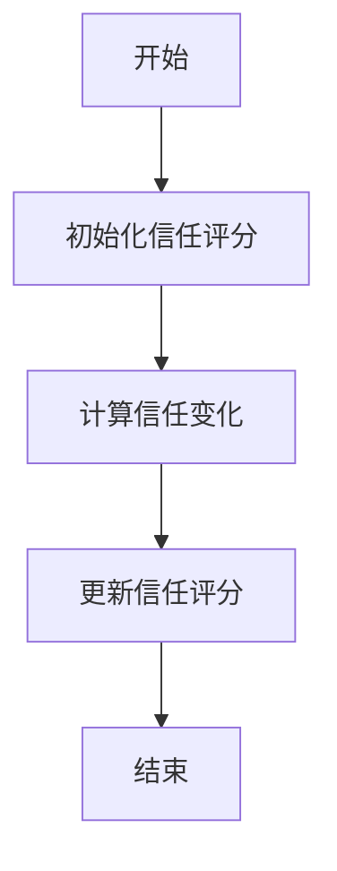
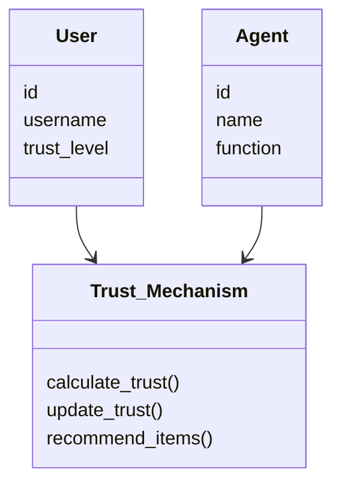
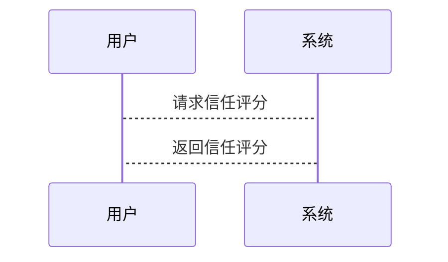

                 


# AI Agent的用户信任建立与维护机制

> **关键词**: AI Agent, 用户信任, 信任机制, 算法原理, 系统架构

> **摘要**: 本文深入探讨了AI Agent用户信任建立与维护的机制，从核心概念、算法原理到系统架构设计，再到项目实战，全面解析如何构建高效、可靠的AI Agent信任体系，确保用户与AI Agent之间的信任关系得以建立和持续维护。

---

## 第1章: AI Agent与用户信任的背景介绍

### 1.1 AI Agent的基本概念

AI Agent（人工智能代理）是指能够感知环境并采取行动以实现目标的智能实体。AI Agent可以是软件程序、智能助手或任何能够自主决策的智能系统。AI Agent的核心属性包括自主性、反应性、目标导向性和社会能力。与传统软件不同，AI Agent能够主动适应环境变化，与用户或其他系统进行交互。

### 1.2 用户信任的定义与重要性

信任是指一方对另一方的行为、意图和能力的依赖与认可。在AI Agent与用户的关系中，信任是用户对AI Agent的可靠性、透明性和可解释性的信任。这种信任对于AI Agent的成功应用至关重要，因为缺乏信任会导致用户抵触或拒绝使用AI Agent。

### 1.3 AI Agent信任建立的挑战与机遇

信任建立的挑战主要在于AI Agent的复杂性和不确定性。AI Agent的行为可能受到算法偏差、数据质量和环境干扰的影响，这些因素可能导致用户信任的动摇。然而，信任建立也带来了机遇，通过透明化、可解释性和可靠性的提升，可以增强用户对AI Agent的信任，从而推动其广泛应用。

---

## 第2章: AI Agent信任的核心概念与联系

### 2.1 信任建立的核心要素

信任建立的核心要素包括透明性、可解释性、可靠性和用户控制权。透明性要求AI Agent的行为可被用户理解和监督；可解释性要求AI Agent的决策过程能够被用户理解；可靠性要求AI Agent在各种情况下都能稳定运行；用户控制权则赋予用户对AI Agent行为的监督和调整能力。

### 2.2 信任模型的属性特征对比

以下是一个对比表，展示了不同信任模型的属性特征：

| 信任模型 | 透明性 | 可解释性 | 可靠性 | 用户控制权 |
|----------|--------|----------|--------|------------|
| 基于行为 | 高     | 中       | 高     | 低          |
| 基于声誉 | 中     | 高       | 中     | 中          |
| 基于知识 | 中     | 高       | 高     | 中          |

### 2.3 ER实体关系图架构

以下是AI Agent信任机制的ER实体关系图：

```mermaid
erDiagram
    user {
        id INT PRIMARY KEY AUTO_INCREMENT
        username VARCHAR(255)
        trust_level INT
    }
    agent {
        id INT PRIMARY KEY AUTO_INCREMENT
        name VARCHAR(255)
        function VARCHAR(255)
    }
    trust_relationship {
        id INT PRIMARY KEY AUTO_INCREMENT
        user_id INT REFERENCES user(id)
        agent_id INT REFERENCES agent(id)
        trust_score DECIMAL(10,2)
        timestamp DATETIME
    }
```

---

## 第3章: AI Agent信任建立的算法原理

### 3.1 信任计算的数学模型

信任计算的数学模型可以采用模糊计算模型或贝叶斯信任网络。以下是一个模糊计算模型的示例：

$$ trust = \frac{1}{1 + e^{-\alpha x}} $$

其中，$\alpha$ 是一个调节参数，$x$ 是输入的信任评分。

### 3.2 信任维护的算法流程

以下是信任维护的算法流程图：



### 3.3 信任推荐算法

信任推荐算法可以采用协同过滤算法。以下是协同过滤算法的Python实现示例：

```python
def collaborative_filtering(user_id, user_ratings, k=3):
    # 计算用户之间的相似度
    similarities = {}
    for user in user_ratings:
        if user != user_id:
            similarities[user] = cosine_similarity(user_ratings[user_id], user_ratings[user])
    
    # 找到最相似的k个用户
    similar_users = sorted(similarities.items(), key=lambda x: -x[1])[:k]
    
    # 计算推荐评分
    recommended_ratings = {}
    for user in similar_users:
        for item in user_ratings[user[0]]:
            if item not in user_ratings[user_id]:
                recommended_ratings[item] += user_ratings[user[0]][item]
    
    return recommended_ratings
```

---

## 第4章: AI Agent信任系统分析与架构设计

### 4.1 系统功能设计

以下是系统功能模块的领域模型：



### 4.2 系统架构设计

以下是系统架构图：


### 4.3 系统接口设计

以下是系统接口设计的示例：



---

## 第5章: AI Agent信任机制的项目实战

### 5.1 环境安装

需要安装以下工具和库：

- Python 3.8+
- NumPy
- Scikit-learn
- Mermaid CLI

### 5.2 系统核心实现源代码

以下是信任计算模块的Python代码：

```python
class TrustMechanism:
    def __init__(self, user_ratings):
        self.user_ratings = user_ratings
    
    def calculate_trust(self, user_id):
        # 计算用户信任评分
        user_ratings = self.user_ratings[user_id]
        trust_score = sum(user_ratings.values()) / len(user_ratings)
        return trust_score
    
    def update_trust(self, user_id, item_id, rating):
        # 更新用户信任评分
        self.user_ratings[user_id][item_id] = rating
```

### 5.3 案例分析与详细讲解

以电商推荐系统为例，展示如何应用AI Agent的信任机制。通过用户行为分析和信任评分计算，实现个性化推荐。

---

## 第6章: 总结与展望

### 6.1 本章小结

本文详细探讨了AI Agent用户信任建立与维护的机制，从核心概念到算法原理，再到系统架构设计，最后通过项目实战展示了如何实现AI Agent的信任机制。

### 6.2 未来研究方向

未来的研究方向可以包括动态信任调整、多模态信任计算以及信任修复机制。

### 6.3 最佳实践 tips

- 确保AI Agent的行为透明可解释。
- 定期更新信任模型以适应用户需求变化。
- 提供用户控制权以增强信任感。

---

通过本文的详细分析，读者可以全面理解AI Agent用户信任建立与维护的机制，并将其应用于实际项目中。

