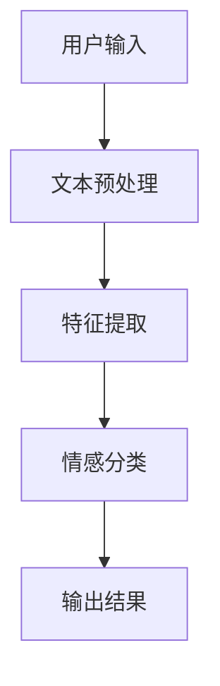
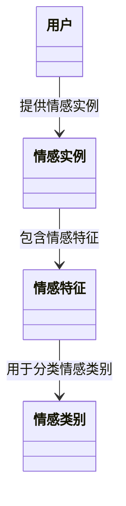
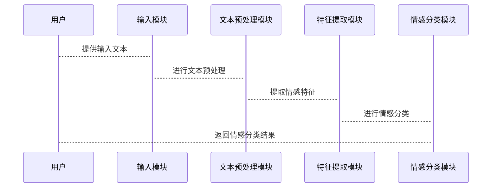

                 


# AI Agent的用户情感状态识别与响应

---

## 关键词
AI Agent, 情感识别, 情感分类, 自然语言处理, 深度学习, 情感响应

---

## 摘要
随着人工智能技术的快速发展，AI Agent（人工智能代理）在各个领域的应用越来越广泛。然而，AI Agent的核心能力之一是与用户的自然交互，这需要对用户的语言、语气和情感状态进行准确识别。本文将从AI Agent的情感识别与响应的基础概念、核心算法、系统架构、项目实现等方面进行深入探讨，帮助读者全面理解如何在实际应用中实现AI Agent的情感识别与响应。

---

# 第1章: 情感识别与响应的背景与概念

## 1.1 问题背景与描述
### 1.1.1 AI Agent的定义与核心功能
AI Agent是一种能够感知环境、执行任务并主动与用户交互的智能实体。其核心功能包括信息处理、决策制定和人机交互。

### 1.1.2 用户情感状态识别的重要性
在人机交互中，用户的情感状态直接影响用户体验。AI Agent需要能够理解用户的情感，从而提供更个性化的服务。

### 1.1.3 情感识别与响应的边界与外延
情感识别的边界包括语言、语气和语境，而其外延则涉及语义理解和意图识别。

## 1.2 核心概念与联系
### 1.2.1 情感识别的核心原理
情感识别主要基于自然语言处理（NLP）技术和机器学习算法。

### 1.2.2 情感分类与响应的关系
情感分类是情感识别的基础，而情感响应是情感识别的应用。

### 1.2.3 情感识别与自然语言处理的联系
自然语言处理为情感识别提供了文本分析和语义理解的技术支持。

## 1.3 情感识别的核心要素与组成
### 1.3.1 情感识别的关键属性
- **语言特征**：文本中的词汇、句式和语气。
- **语境特征**：上下文信息和对话历史。
- **情感类别**：正面、负面、中性等。

### 1.3.2 情感分类的特征对比表
| 情感类别 | 特征描述 | 示例文本 |
|----------|----------|----------|
| 正面     | 积极、肯定 | "很好"   |
| 负面     | 消极、否定 | "很差"   |
| 中性     | 无明显情感倾向 | "一般" |

### 1.3.3 情感识别的ER实体关系图
```mermaid
er
    %% 情感识别的ER实体关系图
    管理员
    用户
    情感类别
    情感特征
    情感实例

    用户 --> 情感实例: 提供情感实例
    情感实例 --> 情感特征: 包含情感特征
    情感实例 --> 情感类别: 归属于情感类别
    情感特征 --> 情感类别: 用于分类情感类别
```

---

# 第2章: 情感识别的核心概念与原理

## 2.1 情感识别的核心原理
### 2.1.1 情感识别的基本流程


### 2.1.2 情感分类的关键算法
- **规则-based方法**：基于预定义的情感词典进行情感判断。
- **统计学习方法**：如朴素贝叶斯、支持向量机（SVM）。
- **深度学习方法**：如循环神经网络（RNN）、 Transformer。

### 2.1.3 情感识别的特征提取方法
- **词袋模型**：忽略词序，仅考虑词频。
- **词嵌入**：如Word2Vec、GloVe，将词转化为向量表示。

## 2.2 情感分类的数学模型与实现
### 2.2.1 朴素贝叶斯分类器
- **概率公式**：
  $$ P(c|x) = \frac{P(x|c)P(c)}{P(x)} $$
  其中，$c$ 是情感类别，$x$ 是输入文本。

### 2.2.2 支持向量机（SVM）
- **优化目标**：
  $$ \min \frac{1}{2}||w||^2 + C \sum_{i=1}^n \xi_i $$
  其中，$w$ 是权重向量，$C$ 是惩罚参数。

### 2.2.3 深度学习模型（如LSTM）
- **模型结构**：
  $$ h_t = \text{tanh}(W_h h_{t-1} + U x_t) $$
  其中，$h_t$ 是隐藏层状态，$x_t$ 是输入向量。

---

# 第3章: 情感识别算法的数学模型与实现

## 3.1 情感识别的特征提取
### 3.1.1 文本特征提取的常见方法
```python
# 示例代码：基于词袋模型的特征提取
from sklearn.feature_extraction.text import TfidfVectorizer

vectorizer = TfidfVectorizer()
X = vectorizer.fit_transform(["I love it", "I hate it"])
```

### 3.1.2 基于词嵌入的特征提取
```python
# 示例代码：使用Word2Vec提取特征
from gensim.models import Word2Vec

model = Word2Vec(sentences, vector_size=100)
```

## 3.2 情感分类的数学模型
### 3.2.1 朴素贝叶斯分类器
```python
# 示例代码：朴素贝叶斯分类器
from sklearn.naive_bayes import MultinomialNB

model = MultinomialNB()
model.fit(X_train, y_train)
```

### 3.2.2 支持向量机（SVM）
```python
# 示例代码：SVM分类器
from sklearn.svm import SVC

model = SVC(C=1.0, kernel='linear')
model.fit(X_train, y_train)
```

### 3.2.3 深度学习模型（如LSTM）
```python
# 示例代码：LSTM情感分类
import tensorflow as tf
from tensorflow.keras import layers

model = tf.keras.Sequential()
model.add(layers.Embedding(vocab_size, 64))
model.add(layers.LSTM(64))
model.add(layers.Dense(1, activation='sigmoid'))
model.compile(optimizer='adam', loss='binary_crossentropy', metrics=['accuracy'])
model.fit(X_train, y_train, epochs=10, batch_size=32)
```

---

# 第4章: 系统分析与架构设计

## 4.1 系统架构设计
### 4.1.1 领域模型


### 4.1.2 系统架构图


## 4.2 系统接口设计
### 4.2.1 接口描述
- **输入接口**：接收用户输入的文本。
- **输出接口**：返回情感分类结果。

### 4.2.2 系统交互流程


---

# 第5章: 项目实战

## 5.1 项目环境安装
```bash
pip install scikit-learn tensorflow-gpu gensim
```

## 5.2 核心代码实现
### 5.2.1 文本预处理
```python
import re
import nltk

def preprocess(text):
    text = re.sub(r'[^\w\s]', '', text)
    tokens = nltk.word_tokenize(text.lower())
    return tokens
```

### 5.2.2 特征提取与分类
```python
from sklearn.feature_extraction.text import TfidfVectorizer
from sklearn.naive_bayes import MultinomialNB

# 数据准备
texts = ["I love it", "I hate it"]
labels = [1, 0]

# 特征提取
vectorizer = TfidfVectorizer()
X = vectorizer.fit_transform(texts)

# 模型训练
model = MultinomialNB()
model.fit(X, labels)

# 预测
new_text = "I like it"
new_X = vectorizer.transform([new_text])
print(model.predict(new_X))
```

## 5.3 案例分析
假设输入文本为“这个产品很好用”，系统输出情感分类为正面。

---

# 第6章: 最佳实践与小结

## 6.1 最佳实践
- 数据质量：确保训练数据的多样性和平衡性。
- 特征工程：合理选择和提取特征。
- 模型调优：通过交叉验证优化模型参数。

## 6.2 小结
AI Agent的情感识别与响应是实现人机交互的重要技术，通过本文的探讨，读者可以掌握情感识别的核心原理、算法实现和系统设计方法。

---

## 注意事项
- 情感识别的准确性依赖于高质量的数据和模型调优。
- 在实际应用中，需结合具体场景选择合适的情感分类算法。

---

## 拓展阅读
- 《情感计算入门》
- 《深度学习与自然语言处理》
- 《AI Agent设计与实现》

---

通过以上内容，我们可以看到AI Agent的情感识别与响应是一个复杂但有趣的领域，结合自然语言处理、机器学习和深度学习等多种技术，未来随着技术的进步，AI Agent在情感识别与响应方面将有更广泛的应用。

