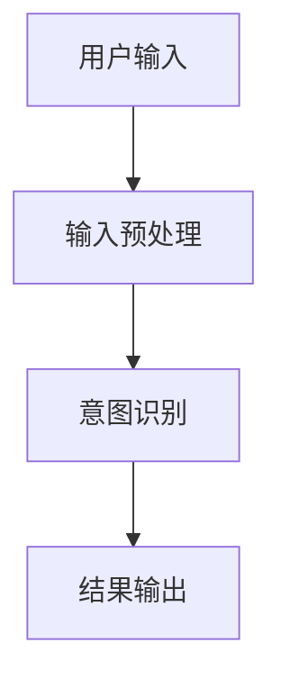
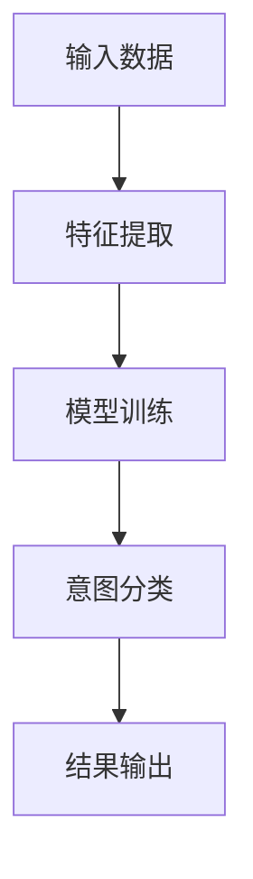
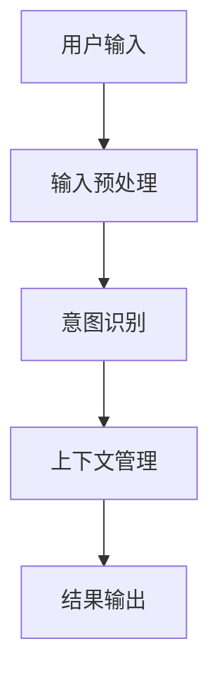

                 


# AI Agent的用户意图理解：从表层到深层

## 关键词：
AI Agent, 用户意图理解, 自然语言处理, 意图分类, 深度学习, 实体识别

## 摘要：
本书系统地探讨了AI Agent中用户意图理解的核心概念、算法原理、系统架构设计以及实际应用。从用户意图的层次划分出发，详细分析了表层意图和深层意图的理解方法，并结合自然语言处理技术和深度学习模型，提供了从理论到实践的全面指导。通过具体案例和项目实战，读者将能够掌握如何设计和实现高效的用户意图理解系统。

---

## 第1章: 用户意图理解的背景与概念

### 1.1 用户意图理解的定义与背景
用户意图理解是指通过分析用户的输入（如文本、语音或行为）来识别其潜在的需求或目标。在AI Agent系统中，意图理解是实现人机交互的核心环节，它决定了系统如何响应用户的需求。随着自然语言处理技术的快速发展，用户意图理解的准确性和效率成为衡量AI Agent性能的重要指标。

#### 1.1.1 什么是用户意图
用户意图是指用户在与AI Agent交互时所表达的需求或目标。意图可以是显式的（如“我要查询天气”）或隐式的（如“我需要快速找到附近的餐厅”）。意图的理解需要结合上下文信息，因为用户的表达方式和实际需求可能不完全一致。

#### 1.1.2 用户意图理解的重要性
在AI Agent系统中，意图理解是实现智能化服务的基础。准确的意图理解能够提升用户体验，降低交互成本，并提高系统的响应效率。例如，在智能音箱或聊天机器人中，意图理解能够帮助系统准确识别用户的意图，并提供个性化的服务。

#### 1.1.3 AI Agent中的用户意图理解
AI Agent是一种能够感知环境、自主决策并执行任务的智能系统。在AI Agent中，意图理解模块负责解析用户的输入，将其转化为系统可以理解的指令或任务。意图理解的准确性和实时性直接影响AI Agent的性能。

### 1.2 用户意图的层次划分
用户意图可以分为表层意图和深层意图两个层次。

#### 1.2.1 表层意图
表层意图是指用户直接表达的需求或指令。例如，当用户说“我要查一下明天的天气”，表层意图就是“查询天气”。表层意图通常可以通过关键词提取或简单的模式匹配来识别。

#### 1.2.2 深层意图
深层意图是指用户未明确表达但隐含的需求或目标。例如，当用户说“我需要一个便宜的餐厅”，深层意图可能是“寻找价格实惠且评价较高的餐厅”。深层意图的理解需要结合上下文信息和用户的历史行为数据。

#### 1.2.3 潜在意图
潜在意图是指用户在未来可能需要的服务或需求。例如，当用户查询天气后，潜在意图可能是“计划明天的户外活动”。理解潜在意图需要结合用户的长期行为数据和场景信息。

### 1.3 用户意图理解的挑战
用户意图理解是一个复杂的问题，面临以下挑战：

#### 1.3.1 语义歧义性
用户的表达方式可能存在多种解释。例如，“apple”可能指苹果公司、苹果水果或Apple产品。如何准确识别用户的意图是语义理解的关键。

#### 1.3.2 上下文依赖性
用户的意图往往依赖于上下文信息。例如，在对话中，用户提到“我需要一个会议记录工具”，深层意图可能是“寻找适合团队协作的工具”，而不仅仅是“记录工具”。

#### 1.3.3 用户行为多样性
用户的表达方式和行为习惯可能存在多样性。例如，用户可能使用不同的语言风格或表达习惯，导致意图理解的难度增加。

---

## 第2章: 用户意图理解的核心概念

### 2.1 意图理解的关键要素
意图理解的关键要素包括用户输入分析、上下文信息提取和用户目标识别。

#### 2.1.1 用户输入分析
用户输入分析是指对用户的输入文本或行为数据进行预处理和解析。例如，将用户的自然语言输入转化为结构化的数据，以便后续处理。

#### 2.1.2 上下文信息提取
上下文信息提取是指从用户的历史行为、环境信息或对话历史中提取相关数据，帮助理解用户的意图。例如，在对话系统中，上下文信息可以用于保持对话的连贯性。

#### 2.1.3 用户目标识别
用户目标识别是指通过分析用户的输入数据，识别其潜在的目标或需求。例如，在电商场景中，用户的目标可能是“购买电子产品”。

### 2.2 意图理解与自然语言处理的关系
自然语言处理（NLP）是意图理解的核心技术之一。以下是意图理解与NLP的关系：

#### 2.2.1 意图理解与NLP的关联
意图理解依赖于NLP技术，如分词、实体识别、情感分析等。例如，实体识别可以帮助系统提取用户输入中的关键实体（如地点、时间、人物等），从而更准确地理解用户的意图。

#### 2.2.2 意图理解与实体识别
实体识别是意图理解的重要环节。例如，当用户说“明天北京的天气怎么样”，实体识别可以提取出“时间”（明天）和“地点”（北京），从而帮助系统准确理解用户的意图。

#### 2.2.3 意图理解与情感分析
情感分析可以帮助系统理解用户的情感倾向，从而更好地识别用户的深层意图。例如，当用户说“我对这个服务很不满意”，系统可以通过情感分析识别用户的负面情绪，并进一步分析其潜在需求。

### 2.3 意图理解的核心流程
意图理解的核心流程包括输入预处理、意图识别和结果输出。

#### 2.3.1 输入预处理
输入预处理是指对用户的输入数据进行清洗、分词和向量化处理。例如，将用户的自然语言输入转化为词向量表示，以便后续处理。

#### 2.3.2 意图识别
意图识别是指通过分类算法识别用户的意图类别。例如，使用机器学习或深度学习模型对用户的输入进行分类，确定其意图类别。

#### 2.3.3 结果输出
结果输出是指根据识别出的意图生成相应的响应。例如，在对话系统中，系统根据用户的意图生成自然语言回复或执行相应的任务。

### 2.4 意图理解的流程图


---

## 第3章: 用户意图理解的算法原理

### 3.1 基于规则的意图理解算法
基于规则的意图理解算法是一种简单且易于实现的方法，适用于特定场景下的意图识别。

#### 3.1.1 规则的定义与特点
基于规则的算法依赖于预定义的规则，例如关键词匹配、模式匹配等。这种方法的优点是实现简单，但需要人工维护大量的规则，且难以应对复杂场景。

#### 3.1.2 基于规则的意图分类
基于规则的意图分类通过预定义的关键词或模式匹配用户的输入，将其分类到特定的意图类别。例如，当用户输入中包含“天气”这个词，系统可以将其分类到“查询天气”的意图类别。

#### 3.1.3 规则优化方法
为了提高基于规则算法的准确性，可以采用以下优化方法：
1. 增加关键词覆盖范围；
2. 使用正则表达式进行模式匹配；
3. 结合上下文信息进行调整。

### 3.2 统计模型与意图理解
统计模型是一种基于数据驱动的方法，通过学习数据的分布规律来识别意图。

#### 3.2.1 朴素贝叶斯分类器
朴素贝叶斯分类器是一种常用的文本分类算法，适用于意图分类任务。其基本原理是基于概率论，计算每个类别条件下用户输入的概率，选择概率最大的类别作为意图。

#### 3.2.2 支持向量机(SVM)
支持向量机是一种监督学习算法，适用于小规模数据集的意图分类任务。其优点是能够处理高维数据，并且具有良好的泛化能力。

#### 3.2.3 隐马尔可夫模型(HMM)
隐马尔可夫模型是一种基于序列数据的模型，适用于时间序列数据的意图识别任务。例如，在语音识别中，HMM可以用于识别用户的意图。

### 3.3 深度学习模型与意图理解
深度学习模型是一种基于神经网络的算法，适用于大规模数据集的意图分类任务。

#### 3.3.1 循环神经网络(RNN)
循环神经网络是一种适用于序列数据的深度学习模型，能够捕捉文本中的上下文信息。例如，在对话系统中，RNN可以用于识别用户的意图。

#### 3.3.2 Transformer架构
Transformer是一种基于注意力机制的深度学习模型，广泛应用于自然语言处理任务。例如，在意图分类任务中，Transformer可以通过全局上下文信息提高意图识别的准确性。

#### 3.3.3 多任务学习
多任务学习是一种同时学习多个任务的深度学习方法，适用于复杂场景下的意图识别。例如，可以同时学习意图分类和实体识别任务，从而提高模型的综合性能。

### 3.4 意图理解的算法流程图


---

## 第4章: 系统分析与架构设计

### 4.1 系统架构概述
意图理解系统的架构设计需要考虑模块化、可扩展性和高效性。

#### 4.1.1 分层架构
分层架构将系统划分为输入层、处理层和输出层。输入层负责接收用户输入，处理层负责解析和分类，输出层负责生成响应。

#### 4.1.2 微服务架构
微服务架构将系统功能分解为多个独立的服务模块，例如意图识别服务、实体识别服务和上下文管理服务。这种架构具有良好的扩展性和维护性。

#### 4.1.3 模块化设计
模块化设计将系统功能分解为多个模块，例如输入预处理模块、意图识别模块和结果输出模块。每个模块独立实现功能，便于维护和优化。

### 4.2 系统功能设计
意图理解系统的功能设计需要涵盖输入处理、意图识别和结果输出三个主要环节。

#### 4.2.1 用户输入处理模块
用户输入处理模块负责接收用户的输入数据，并进行预处理和向量化处理。例如，将用户的自然语言输入转化为词向量表示。

#### 4.2.2 意图识别模块
意图识别模块负责基于预处理后的数据，使用深度学习模型或统计模型识别用户的意图类别。例如，使用Transformer模型进行意图分类。

#### 4.2.3 上下文管理模块
上下文管理模块负责维护用户的上下文信息，例如对话历史、用户行为数据等。这些信息可以用于辅助意图识别和结果输出。

### 4.3 系统架构图


### 4.4 系统接口设计
系统接口设计需要定义意图理解模块与其他模块之间的交互接口。例如，输入预处理模块需要与意图识别模块交互，传递预处理后的数据。

### 4.5 系统交互图


---

## 第5章: 项目实战

### 5.1 项目环境搭建
项目环境搭建需要安装必要的开发工具和库。例如，使用Python语言，安装TensorFlow、Keras、NLTK等库。

#### 5.1.1 安装Python环境
使用Anaconda或虚拟环境管理工具，安装Python 3.x版本。

#### 5.1.2 安装必要的库
```bash
pip install tensorflow numpy pandas scikit-learn nltk
```

#### 5.1.3 配置开发环境
配置IDE（如PyCharm、Jupyter Notebook）或命令行工具。

### 5.2 系统核心实现源代码
以下是意图理解系统的核心实现代码示例。

#### 5.2.1 输入预处理代码
```python
import nltk
from tensorflow.keras.preprocessing.text import Tokenizer

# 分词处理
def preprocess_input(text):
    tokens = nltk.word_tokenize(text)
    return tokens

# 向量化处理
tokenizer = Tokenizer()
tokenizer.fit_on_texts(["hello world", "how are you"])
sequences = tokenizer.texts_to_sequences(["hello world", "how are you"])
```

#### 5.2.2 意图识别代码
```python
from tensorflow.keras.models import Sequential
from tensorflow.keras.layers import Dense, Embedding, LSTM

# 构建模型
model = Sequential()
model.add(Embedding(input_dim=10000, output_dim=128, input_length=50))
model.add(LSTM(128))
model.add(Dense(10, activation='softmax'))
model.compile(loss='sparse_categorical_crossentropy', optimizer='adam', metrics=['accuracy'])

# 训练模型
model.fit(x_train, y_train, epochs=5, batch_size=32)
```

#### 5.2.3 结果输出代码
```python
# 预测意图
import numpy as np

def predict_intent(text):
    tokens = preprocess_input(text)
    sequence = tokenizer.texts_to_sequences([text])[0]
    padded_sequence = tf.keras.preprocessing.sequence.pad_sequences([sequence], maxlen=50)
    prediction = model.predict(padded_sequence)
    return np.argmax(prediction[0])

intent = predict_intent("我要查询天气")
print(intent)
```

### 5.3 项目小结
通过项目实战，我们可以看到意图理解系统的实现过程。从输入预处理到意图识别，再到结果输出，每个环节都需要精心设计和优化。未来，可以进一步探索更先进的算法和模型，以提高意图理解的准确性和效率。

---

## 第6章: 最佳实践与总结

### 6.1 小结
用户意图理解是AI Agent系统的核心任务之一。通过本章的学习，我们了解了意图理解的基本概念、算法原理和系统架构设计。意图理解的实现需要结合自然语言处理技术和深度学习模型，同时关注用户的实际需求和场景。

### 6.2 注意事项
在实际应用中，需要注意以下几点：
1. 数据质量：高质量的数据是意图理解的基础。
2. 上下文信息：上下文信息对意图理解具有重要影响。
3. 模型优化：需要不断优化模型以提高准确性和效率。

### 6.3 拓展阅读
以下是推荐的拓展阅读资料：
1.《自然语言处理实战：基于Python的机器学习和深度学习》
2.《深度学习入门：基于Python的CNN、RNN、GAN、强化学习等实践》
3.《AI Agent开发实战：从零开始构建智能对话系统》

---

通过以上内容，我们系统地探讨了AI Agent中用户意图理解的核心概念、算法原理和实际应用。希望读者能够通过本书的学习，掌握意图理解的基本原理和实现方法，并在实际项目中灵活应用这些知识。

