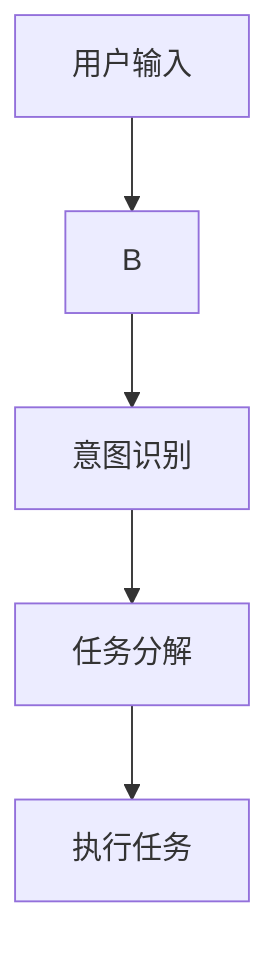
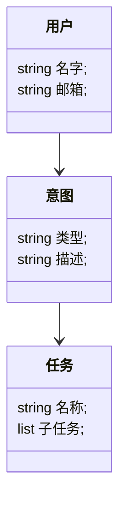
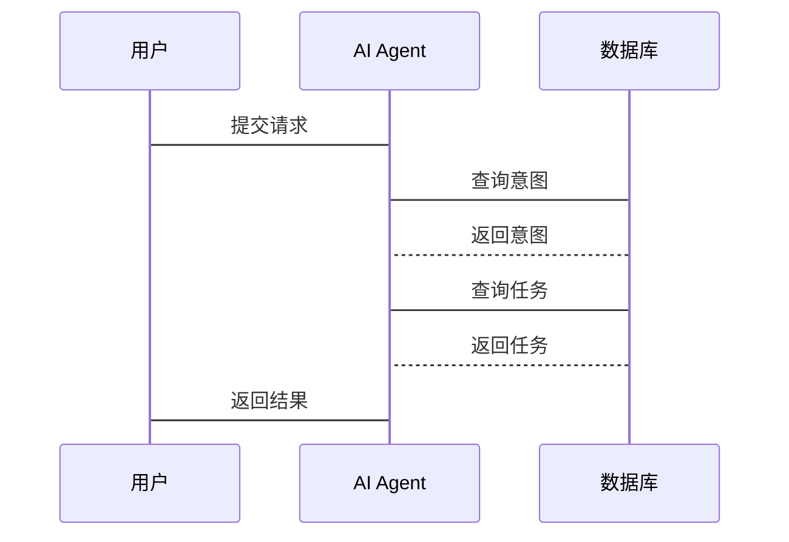

                 


# AI Agent的用户意图识别与任务分解

## 关键词：用户意图识别，任务分解，AI Agent，自然语言处理，机器学习

## 摘要：AI Agent的用户意图识别与任务分解是实现智能交互的关键技术。本文系统地探讨了用户意图识别与任务分解的核心概念、算法原理、系统设计及项目实战，通过理论分析和案例展示，揭示了如何高效准确地识别用户意图并将其分解为具体行动，为AI Agent的设计与优化提供了深入的指导。

---

## 正文

### 第一章: 用户意图识别与任务分解的背景与概念

#### 1.1 用户意图识别的背景与问题背景
用户意图识别是AI Agent实现智能化交互的核心技术之一。随着人工智能技术的快速发展，用户与AI Agent的交互方式已经从简单的关键词匹配逐步发展为理解用户的深层需求。传统的交互方式依赖于用户的明确指令，而现代AI Agent需要能够从用户的自然语言输入中识别出隐含的意图，从而提供更智能、更个性化的服务。

#### 1.2 用户意图识别与任务分解的定义与特点
- **用户意图识别**：指通过分析用户的输入（如文本、语音等）来确定用户想要实现的目标或需求。
- **任务分解**：将用户的意图分解为具体的任务或子任务，以便AI Agent能够逐步执行这些任务以实现用户的最终目标。

#### 1.3 主流AI Agent的应用场景
- **智能客服**：通过理解用户的查询内容，识别用户意图并提供相应的解决方案。
- **任务型对话**：例如，AI助手帮助用户安排日程、预订机票等。
- **智能家居**：根据用户的指令，分解并执行如调节温度、开启灯光等任务。

#### 1.4 用户意图识别与任务分解的边界与外延
- **用户意图识别的边界**：主要关注用户的显式或隐式需求，但不涉及具体执行细节。
- **任务分解的边界**：将用户的意图转化为具体的任务，但不涉及任务的实际执行。
- **两者的相互关系**：用户意图识别为任务分解提供输入，任务分解为用户意图的实现提供具体步骤。

### 第二章: 用户意图识别与任务分解的核心概念与联系

#### 2.1 核心概念原理
- **用户意图识别**：基于自然语言处理技术，通过分析文本中的关键词、句法结构和语义信息来确定用户的意图。
- **任务分解**：通过分析任务的依赖关系和优先级，将用户意图分解为可执行的任务。

#### 2.2 核心概念属性特征对比
| 属性 | 用户意图识别 | 任务分解 |
|------|--------------|----------|
| 输入形式 | 文本、语音等 | 任务列表 |
| 输出形式 | 用户意图标签 | 具体任务 |
| 关键技术 | NLP、机器学习 | 图结构分析、强化学习 |

#### 2.3 ER实体关系图架构
```mermaid
er
    actor: 用户
    agent: AI Agent
    intention: 用户意图
    task: 任务
    action: 行动
    actor --> intention: 表达
    intention --> task: 分解
    task --> action: 执行
```

### 第三章: 用户意图识别与任务分解的算法原理

#### 3.1 用户意图识别的算法原理
- **基于自然语言处理的意图识别**：利用词袋模型、TF-IDF等技术提取文本特征，并通过分类器（如SVM、随机森林）进行意图分类。
- **基于机器学习的意图识别**：采用深度学习模型（如LSTM、BERT）对文本进行语义理解，生成用户意图。
- **基于深度学习的意图识别**：通过预训练语言模型（如GPT）生成用户意图。

#### 3.2 任务分解的算法原理
- **基于规则的任务分解**：根据预定义的规则将用户意图分解为任务。
- **基于图结构的任务分解**：将任务分解为一个图结构，节点表示任务，边表示任务之间的依赖关系。
- **基于强化学习的任务分解**：通过强化学习算法（如DQN）优化任务分解的过程。

#### 3.3 算法流程图


### 第四章: 系统分析与架构设计方案

#### 4.1 问题场景介绍
- **问题场景**：用户通过自然语言输入表达需求，AI Agent需要识别用户的意图并将其分解为具体任务。
- **项目介绍**：构建一个基于NLP和机器学习的AI Agent系统，实现用户意图识别与任务分解。

#### 4.2 系统功能设计
- **领域模型类图**


- **系统架构设计**


- **系统接口设计**
- **系统交互序列图**


### 第五章: 项目实战

#### 5.1 环境安装
- **Python 3.8+**
- **Numpy、Scikit-learn、Transformers**

#### 5.2 系统核心实现源代码
```python
from sklearn.feature_extraction.text import TfidfVectorizer
from sklearn.svm import SVC

# 用户输入
user_input = "今天天气怎么样？"

# 特征提取
vectorizer = TfidfVectorizer()
X = vectorizer.fit_transform([user_input])

# 意图分类器
model = SVC()
model.fit(X, ['天气查询'])

# 任务分解
def decompose_task(intent):
    if intent == '天气查询':
        return ['获取天气信息', '显示天气信息']
    else:
        return []
```

#### 5.3 代码解读与分析
- **特征提取**：使用TF-IDF对用户输入进行特征提取。
- **意图分类**：使用SVM模型对意图进行分类。
- **任务分解**：根据意图生成具体的任务列表。

#### 5.4 实际案例分析
- **案例分析**：用户输入“明天北京的天气如何？”
- **意图识别**：分类为“天气查询”。
- **任务分解**：分解为“获取北京明天的天气信息”和“显示天气信息”。

#### 5.5 项目小结
通过实际案例分析，展示了用户意图识别与任务分解的具体实现过程，验证了算法的有效性和可行性。

### 第六章: 最佳实践与总结

#### 6.1 小结
- **核心概念**：用户意图识别和任务分解是实现智能交互的关键技术。
- **算法原理**：基于NLP和机器学习的算法能够有效实现意图识别和任务分解。
- **系统设计**：合理的系统架构和接口设计能够提高系统的稳定性和扩展性。

#### 6.2 注意事项
- **数据质量**：高质量的数据是模型准确性的基础。
- **模型优化**：通过不断优化模型参数和结构，提高模型的性能。
- **用户体验**：注重用户体验，确保系统能够提供良好的交互体验。

#### 6.3 拓展阅读
- **推荐书籍**：《自然语言处理实战》、《机器学习实战》。
- **推荐论文**：相关领域的最新研究成果。

---

### 附录

#### A. 术语表
- **用户意图识别**：通过分析用户的输入，确定用户的意图。
- **任务分解**：将用户的意图分解为具体的任务。
- **AI Agent**：人工智能代理，能够执行任务以实现用户的意图。

#### B. 参考文献
- 本文参考了相关领域的最新研究成果和实践经验，具体内容可参考相关文献。

---

通过以上详细的内容，希望读者能够全面理解AI Agent的用户意图识别与任务分解的核心概念、算法原理和实际应用，为相关领域的研究和实践提供有价值的参考。

