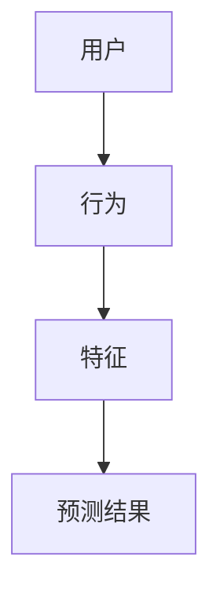
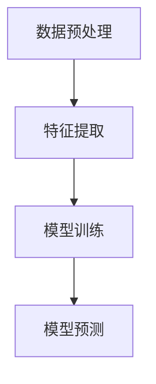
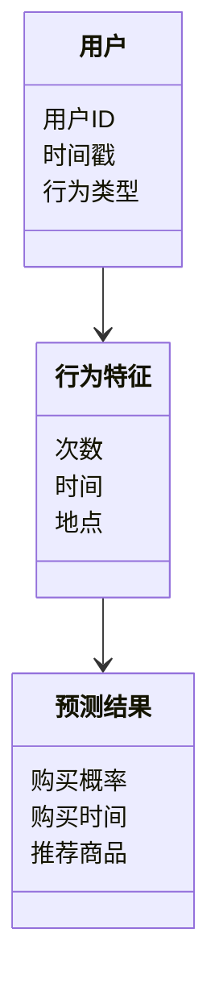
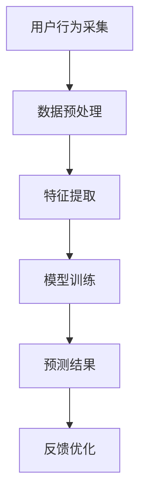
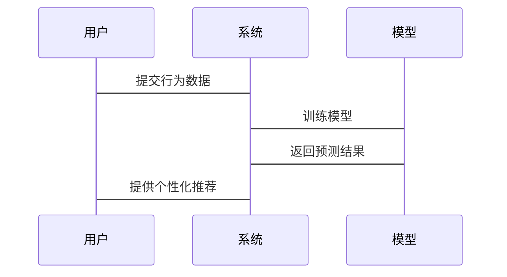

                 


# AI Agent的用户行为分析与预测系统

## 关键词：AI Agent, 用户行为分析, 预测系统, 机器学习, 用户行为预测

## 摘要：本文详细探讨了AI Agent在用户行为分析与预测系统中的应用，从系统设计、算法原理到实际案例，全面解析如何利用AI技术实现用户行为的深度分析与精准预测。

---

# 第一部分: AI Agent的用户行为分析与预测系统背景介绍

# 第1章: AI Agent的用户行为分析与预测系统概述

## 1.1 问题背景

### 1.1.1 用户行为分析的必要性

在现代信息技术高度发展的背景下，用户行为分析已成为企业优化产品、提升用户体验的核心竞争力之一。通过分析用户在系统中的行为，企业可以更好地理解用户需求，优化产品设计，甚至预测用户的下一步行为，提前做好准备。

### 1.1.2 用户行为预测的挑战

用户行为预测面临数据复杂性、行为多样性以及实时性要求高等挑战。用户行为受到多种因素影响，如用户心理、外部环境等，这使得预测模型的设计和优化具有较高的难度。

### 1.1.3 AI Agent在用户行为分析中的作用

AI Agent（人工智能代理）作为一种能够感知环境、自主决策的智能体，能够实时采集用户行为数据，利用机器学习算法进行分析与预测，并根据预测结果采取相应的行动，从而实现对用户行为的主动干预和优化。

## 1.2 问题描述

### 1.2.1 用户行为的定义与分类

用户行为可以分为显性行为和隐性行为。显性行为包括用户的点击、浏览、购买等操作，而隐性行为则包括用户的情感倾向、注意力分布等。

### 1.2.2 用户行为分析的目标

用户行为分析的目标包括：1）理解用户需求；2）优化产品体验；3）预测用户行为；4）提升用户留存率。

### 1.2.3 用户行为预测的边界与外延

用户行为预测的边界包括数据范围、时间范围和场景范围。外延则包括从单一行为预测到多行为关联预测的扩展。

## 1.3 问题解决

### 1.3.1 AI Agent的核心功能

AI Agent的核心功能包括数据采集、行为分析、预测建模和反馈优化。

### 1.3.2 用户行为分析与预测的实现路径

1. 数据采集：通过日志系统、传感器等手段采集用户行为数据。
2. 数据预处理：清洗数据、特征提取。
3. 模型训练：利用机器学习算法训练预测模型。
4. 预测与优化：基于模型预测结果，优化用户行为分析与预测系统。

## 1.4 系统核心要素

### 1.4.1 数据采集模块

数据采集模块负责采集用户行为数据，包括用户ID、时间戳、操作类型等。

### 1.4.2 行为分析模块

行为分析模块对采集到的数据进行分析，提取用户的特征，如活跃度、偏好等。

### 1.4.3 预测模型模块

预测模型模块基于机器学习算法，对用户行为进行预测，生成预测结果。

### 1.4.4 反馈优化模块

反馈优化模块根据预测结果优化系统，调整模型参数或策略。

## 1.5 本章小结

本章介绍了AI Agent在用户行为分析与预测系统中的背景、问题描述及核心功能，为后续章节的展开奠定了基础。

---

# 第二部分: AI Agent的核心概念与联系

# 第2章: AI Agent的核心概念原理

## 2.1 AI Agent的基本原理

### 2.1.1 AI Agent的定义与特征

AI Agent是一种能够感知环境、自主决策的智能体，具有主动性、智能性和适应性等特征。

### 2.1.2 用户行为分析的数学模型

用户行为分析的数学模型包括回归分析、聚类分析等。

### 2.1.3 用户行为预测的算法框架

用户行为预测的算法框架包括监督学习、无监督学习和强化学习。

## 2.2 核心概念对比表

| 概念         | 特征                     | 描述                                                                 |
|--------------|--------------------------|----------------------------------------------------------------------|
| 用户行为     | 数据类型                 | 离散型（如点击、购买）和连续型（如时长、频率）                     |
| 行为分析     | 方法                     | 监督学习（如分类、回归）和无监督学习（如聚类、降维）                 |
| 预测模型     | 算法                     | 线性回归、逻辑回归、决策树、随机森林、神经网络等                   |
| 实体关系     | 关系类型                 | 用户与行为、行为与特征、特征与预测结果之间的关联                   |

## 2.3 ER实体关系图



## 2.4 本章小结

本章详细介绍了AI Agent的核心概念及其在用户行为分析与预测系统中的应用，通过对比表和ER图帮助读者更好地理解系统结构。

---

# 第三部分: 算法原理与数学模型

# 第3章: 用户行为分析的算法原理

## 3.1 监督学习算法

### 3.1.1 线性回归模型

线性回归模型用于预测连续型用户行为，如用户停留时间的预测。

$$ y = \beta_0 + \beta_1x + \epsilon $$

其中，$y$ 是预测目标，$\beta_0$ 和 $\beta_1$ 是模型参数，$x$ 是输入特征，$\epsilon$ 是误差项。

### 3.1.2 逻辑回归模型

逻辑回归模型用于分类问题，如用户是否购买某商品。

$$ P(y=1|x) = \frac{e^{\beta_0 + \beta_1x}}{1 + e^{\beta_0 + \beta_1x}} $$

## 3.2 无监督学习算法

### 3.2.1 K-means聚类

K-means聚类用于将用户行为分为不同的群组，便于后续分析。

### 3.2.2 主成分分析(PCA)

PCA用于降维，提取用户行为的主要特征。

## 3.3 强化学习算法

### 3.3.1 Q-learning算法

Q-learning算法通过状态-动作-奖励机制，优化用户的预测行为。

### 3.3.2 Deep Q-Networks(DQN)

DQN是一种基于深度学习的强化学习算法，用于复杂的用户行为预测场景。

## 3.4 算法流程图



## 3.5 本章小结

本章详细讲解了用户行为分析与预测中常用的算法原理，包括监督学习、无监督学习和强化学习，并通过数学公式和流程图帮助读者理解算法实现。

---

# 第四部分: 系统分析与架构设计

# 第4章: 系统分析与架构设计

## 4.1 问题场景介绍

以电商系统为例，分析用户行为，预测用户的购买行为，从而优化推荐策略。

## 4.2 系统功能设计

### 4.2.1 领域模型



### 4.2.2 系统架构设计



### 4.2.3 系统接口设计

系统接口包括数据接口、模型接口和用户接口。

### 4.2.4 系统交互设计



## 4.3 本章小结

本章详细分析了系统的功能设计、架构设计和交互设计，为后续的系统实现提供了理论基础。

---

# 第五部分: 项目实战

# 第5章: 项目实战

## 5.1 环境安装

### 5.1.1 安装Python

```bash
python --version
pip install --upgrade pip
```

### 5.1.2 安装依赖库

```bash
pip install numpy pandas scikit-learn matplotlib
```

## 5.2 系统核心实现

### 5.2.1 数据预处理

```python
import pandas as pd
import numpy as np

# 读取数据
data = pd.read_csv('user_behavior.csv')

# 数据清洗
data.dropna(inplace=True)
data = data[~data.duplicated()]
```

### 5.2.2 特征提取

```python
from sklearn.feature_selection import SelectKBest
from sklearn.feature_selection import chi2

selector = SelectKBest(score_func=chi2, k=4)
X_new = selector.fit_transform(data.drop('label', axis=1), data['label'])
```

### 5.2.3 模型训练

```python
from sklearn.model

