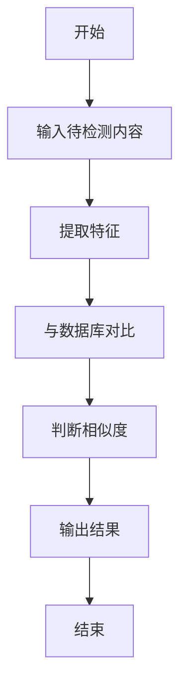
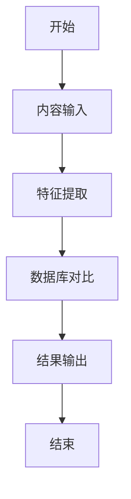

                 


# AI Agent的知识产权保护策略

## 关键词：AI Agent、知识产权保护、法律、技术、算法

## 摘要：AI Agent作为一种智能化的代理系统，其在知识产权保护中的作用日益重要。本文从AI Agent的基本概念出发，结合知识产权保护的法律框架和技术实现，深入探讨AI Agent在知识产权保护中的应用策略。文章详细分析了AI Agent的核心概念、算法原理、系统架构设计以及实际项目中的应用，提出了切实可行的知识产权保护策略，为相关领域的研究和实践提供了参考。

---

# 第一部分: AI Agent与知识产权保护的背景与基础

## 第1章: AI Agent的定义与知识产权保护的背景

### 1.1 AI Agent的基本概念

#### 1.1.1 AI Agent的定义
AI Agent（人工智能代理）是指具有感知环境、自主决策和执行任务能力的智能系统。它能够通过数据输入、模型推理和决策输出来实现特定目标。AI Agent的核心在于其智能化和自动化能力，能够处理复杂任务并优化决策过程。

#### 1.1.2 AI Agent的核心特征
- **自主性**：AI Agent能够在没有外部干预的情况下自主运行。
- **反应性**：能够根据环境变化实时调整行为。
- **目标导向性**：通过目标驱动进行决策和行动。
- **学习能力**：能够通过数据和经验不断优化性能。

#### 1.1.3 AI Agent的应用场景与发展趋势
AI Agent广泛应用于智能助手、推荐系统、自动驾驶、机器人控制等领域。随着AI技术的快速发展，AI Agent的智能化和自主性不断提高，其在知识产权保护中的应用也逐渐成为研究热点。

---

### 1.2 知识产权保护的基本概念

#### 1.2.1 知识产权的定义与分类
知识产权是指人类在智力活动成果中依法享有的权利，主要包括著作权、专利权、商标权、商业秘密等。知识产权的保护范围涵盖创造性成果和商业标识，旨在激励创新和维护市场秩序。

#### 1.2.2 著作权、专利权、商标权的保护范围
- **著作权**：保护文学、艺术、科学作品的表达形式。
- **专利权**：保护发明的创新性和实用性。
- **商标权**：保护商业标识的显著性和独特性。

#### 1.2.3 数字化时代知识产权保护的挑战
数字化技术的发展使得知识产权保护面临新的挑战，如数字内容的易复制性、网络侵权行为的隐蔽性以及跨境侵权的复杂性。这些挑战要求知识产权保护策略不断创新和优化。

---

### 1.3 AI Agent与知识产权保护的结合

#### 1.3.1 AI Agent在知识产权保护中的角色
AI Agent可以通过自动化监测、内容分析和侵权判定等功能，辅助知识产权保护工作的实施。例如，AI Agent可以用于监测网络上的侵权内容，自动识别并采取保护措施。

#### 1.3.2 知识产权保护对AI Agent发展的意义
知识产权保护为AI Agent的技术创新提供了法律保障，激励了开发者投入更多资源进行技术研发。同时，AI Agent的智能化能力也为知识产权保护提供了新的技术手段。

#### 1.3.3 当前AI Agent知识产权保护的主要问题
- **法律模糊性**：AI Agent生成内容的法律归属尚未明确。
- **技术局限性**：现有技术难以完全解决复杂侵权问题。
- **隐私与伦理问题**：AI Agent的使用可能涉及用户隐私和伦理争议。

---

## 第2章: AI Agent与知识产权保护的核心概念与联系

### 2.1 AI Agent的核心概念原理

#### 2.1.1 AI Agent的决策机制
AI Agent的决策机制包括感知环境、构建模型、制定策略和执行行动四个阶段。通过这些机制，AI Agent能够实现智能化决策。

#### 2.1.2 AI Agent的自主性与创造性
AI Agent的自主性使其能够在复杂环境中独立运作，而其创造性则体现在生成独特内容和解决方案的能力上。这种特性使其在知识产权保护中具有重要价值。

#### 2.1.3 AI Agent的可复制性与独创性
AI Agent生成的内容具有可复制性，但其算法和模型的独创性使其在知识产权保护中具有特殊性。

---

### 2.2 知识产权保护的核心概念与属性特征对比

#### 2.2.1 知识产权保护的法律属性
- **独占性**：知识产权的排他性使用权利。
- **地域性**：知识产权保护具有地域限制。
- **时间性**：知识产权的有效期有限。

#### 2.2.2 AI Agent生成内容的法律属性
- **原创性**：AI Agent生成内容的原创性是其获得著作权的关键。
- **技术依赖性**：AI Agent生成内容的保护依赖于其生成过程的技术属性。

#### 2.2.3 两者属性对比分析
| 属性 | 知识产权 | AI Agent生成内容 |
|------|----------|------------------|
| 独占性 | 是       | 是               |
| 地域性 | 是       | 是               |
| 时间性 | 是       | 是               |
| 技术依赖性 | 否       | 是               |
| 原创性 | 需要     | 是               |

---

### 2.3 AI Agent与知识产权保护的ER实体关系图

```mermaid
er
actor: 用户
agent: AI Agent
intellectual_property: 知识产权
action: 保护行为
```

---

## 第3章: AI Agent知识产权保护的算法原理

### 3.1 知识产权保护的法律算法原理

#### 3.1.1 相似度检测算法
相似度检测算法用于判断AI Agent生成的内容与其他作品的相似程度，常用算法包括余弦相似度和Jaccard相似度。

#### 3.1.2 侵权判定算法
侵权判定算法基于相似度检测结果，结合法律规则进行最终判定。例如，若相似度超过阈值，则判定为侵权。

#### 3.1.3 权利归属判定算法
权利归属判定算法通过分析创作过程和数据来源，确定AI Agent生成内容的法律归属。

---

### 3.2 算法流程图



---

### 3.3 算法实现代码

```python
def detect_infringement(content):
    # 提取特征
    features = extract_features(content)
    # 与数据库对比
    similarity = compare(features)
    # 判断相似度
    if similarity > 0.8:
        return "侵权"
    else:
        return "非侵权"
```

---

## 第4章: AI Agent知识产权保护的系统架构设计

### 4.1 系统功能设计

#### 4.1.1 系统功能模块
- **内容输入模块**：接收待检测内容。
- **特征提取模块**：提取内容的特征信息。
- **数据库对比模块**：与已有数据进行对比。
- **结果输出模块**：输出侵权判定结果。

#### 4.1.2 系统功能流程图



---

### 4.2 系统架构设计

#### 4.2.1 系统架构图


---

## 第5章: AI Agent知识产权保护的项目实战

### 5.1 项目介绍

#### 5.1.1 项目背景
本项目旨在开发一个基于AI Agent的知识产权保护系统，用于检测和预防侵权行为。

#### 5.1.2 项目目标
通过AI Agent实现内容的自动检测和侵权判定，提供实时保护。

---

### 5.2 系统核心实现源代码

```python
def main():
    content = input("请输入待检测内容：")
    result = detect_infringement(content)
    print("判定结果：", result)

if __name__ == "__main__":
    main()
```

---

## 第6章: AI Agent知识产权保护的最佳实践

### 6.1 小结与注意事项

#### 6.1.1 小结
本文从法律、技术和系统架构等多个角度，详细探讨了AI Agent在知识产权保护中的应用策略。

#### 6.1.2 注意事项
- 确保AI Agent的算法和模型具有较高的准确性和稳定性。
- 注重用户隐私和数据安全。
- 定期更新和优化知识产权保护策略。

---

## 第7章: 总结与展望

### 7.1 总结

本文详细探讨了AI Agent在知识产权保护中的应用策略，提出了基于法律、技术和系统的多维度保护方案。

### 7.2 未来展望

随着AI技术的不断发展，AI Agent在知识产权保护中的应用将更加广泛和深入。未来的研究可以进一步探索AI Agent的法律地位和其在跨国知识产权保护中的作用。

---

# 结语

AI Agent作为人工智能技术的重要组成部分，其在知识产权保护中的应用具有广阔前景。通过法律、技术和系统的综合施策，可以有效保护AI Agent的知识产权，推动人工智能技术的健康发展。

