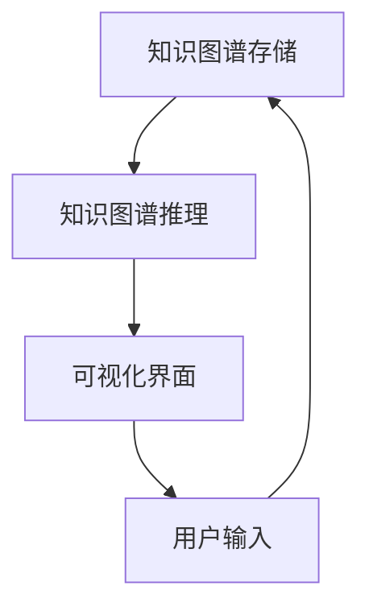

                 


# AI Agent的知识图谱可视化技术

## 关键词：知识图谱，AI Agent，可视化技术，图嵌入，实体识别，关系抽取，系统架构

## 摘要：  
AI Agent的知识图谱可视化技术通过构建结构化的知识图谱，利用AI技术进行推理和分析，并以直观的可视化方式呈现，帮助用户更好地理解和利用知识图谱。本文详细探讨知识图谱的构建、AI Agent的知识表示与推理、可视化技术及其在系统中的应用，并通过实际案例展示其技术实现和应用价值。

---

# 第一部分：知识图谱与AI Agent概述

## 第1章：知识图谱与AI Agent的概述

### 1.1 知识图谱的基本概念

#### 1.1.1 知识图谱的定义与特点
- **定义**：知识图谱是一种以图结构形式表示知识的语义网络，由实体（概念）和关系（属性）组成。
- **特点**：
  - 结构化：数据以实体和关系的形式组织，便于计算机理解和推理。
  - 语义化：通过语义标注，提供上下文信息，使数据更具可解释性。
  - 动态性：支持实时更新，保持数据的时效性。

#### 1.1.2 知识图谱的构建过程
- **数据采集**：从多种来源（如网页、数据库）获取数据。
- **数据清洗**：去除噪音，确保数据准确性。
- **实体识别**：识别数据中的实体并建立唯一标识。
- **关系抽取**：发现实体之间的关系，构建图结构。

#### 1.1.3 知识图谱的应用场景
- 智能问答：基于知识图谱提供准确的答案。
- 实体链接：在文本中识别实体并链接到知识库。
- 推荐系统：利用实体关系进行个性化推荐。

### 1.2 AI Agent的基本概念

#### 1.2.1 AI Agent的定义与类型
- **定义**：AI Agent是一种智能体，能够感知环境并执行任务。
- **类型**：
  - 简单反射型：基于规则执行任务。
  - 目标驱动型：具有明确目标，主动规划行动。
  - 学习增强型：通过学习提升性能。

#### 1.2.2 AI Agent的核心功能
- 感知环境：通过传感器或API获取信息。
- 决策与推理：基于知识图谱进行推理和决策。
- 执行任务：根据决策执行操作，如调用API或触发事件。

#### 1.2.3 AI Agent与知识图谱的关系
- 知识图谱为AI Agent提供知识基础，使其能够进行推理和决策。
- AI Agent利用知识图谱的结构化数据，实现复杂任务的自动化。

### 1.3 知识图谱与AI Agent的结合应用

#### 1.3.1 知识图谱在AI Agent中的作用
- 作为知识库，支持AI Agent的推理和决策。
- 提供上下文信息，增强AI Agent的理解能力。

#### 1.3.2 AI Agent如何利用知识图谱进行推理
- 通过查询和遍历图结构，发现隐含关系。
- 利用推理算法（如规则推理、逻辑推理）进行推导。

#### 1.3.3 知识图谱可视化的重要性
- 通过可视化，帮助用户理解知识图谱的结构。
- 提供交互界面，支持AI Agent与用户的高效沟通。

---

## 第2章：知识图谱的构建技术

### 2.1 数据采集与预处理

#### 2.1.1 数据采集方法
- **数据来源**：网页爬取、API接口、数据库查询。
- **数据格式**：文本、结构化数据、图像。

#### 2.1.2 数据清洗与标准化
- **数据清洗**：去除重复数据、填充缺失值、删除异常值。
- **数据标准化**：统一字段命名、格式化日期、处理编码问题。

#### 2.1.3 数据格式转换
- 将数据转换为适合构建知识图谱的格式，如CSV、JSON。

### 2.2 实体识别与关系抽取

#### 2.2.1 实体识别的算法与工具
- **实体识别**：使用自然语言处理技术识别文本中的实体。
- **工具**：spaCy、NLTK、HanLP。

#### 2.2.2 关系抽取的实现方法
- **关系抽取**：识别实体之间的关系，如“属于”、“工作于”。
- **方法**：基于规则、统计学习、深度学习。

#### 2.2.3 实体链接与消歧技术
- **实体链接**：将文本中的实体映射到知识图谱中的唯一标识。
- **消歧**：解决同名实体的不同含义问题。

### 2.3 知识图谱的存储与管理

#### 2.3.1 图数据库的选择与使用
- **图数据库**：Neo4j、Titan、OrientDB。
- **存储结构**：节点（实体）和边（关系）的存储方式。

#### 2.3.2 知识图谱的存储结构
- **节点**：表示实体，带有属性。
- **边**：表示关系，带有权重和方向。

#### 2.3.3 知识图谱的更新与维护
- **数据更新**：定期爬取新数据，更新知识图谱。
- **版本控制**：记录知识图谱的变更历史。

---

## 第3章：AI Agent的知识表示与推理

### 3.1 知识图谱的表示方法

#### 3.1.1 RDF与RDFS的表示方法
- **RDF**：资源描述框架，定义数据主体、属性、值。
- **RDFS**：RDF Schema，提供词汇和逻辑规则。

#### 3.1.2 OWL的本体工程方法
- **OWL**：Web本体语言，定义复杂概念和关系。
- **本体工程**：构建和维护本体的过程。

#### 3.1.3 图嵌入
- **图嵌入**：将图结构数据转换为低维向量。
- **方法**：Word2Vec、Node2Vec、GraphSAGE。

### 3.2 AI Agent的知识表示与推理

#### 3.2.1 知识表示的逻辑模型
- **描述逻辑**：用于表达实体的属性和关系。
- **谓词逻辑**：用于表达复杂的关系和约束。

#### 3.2.2 基于规则的推理
- **规则定义**：使用逻辑规则定义推理规则。
- **推理过程**：根据规则推导新的事实。

#### 3.2.3 基于逻辑的推理
- **谓词逻辑**：用于表达复杂的推理逻辑。
- **推理算法**：如DPLL算法、消解算法。

### 3.3 知识图谱的推理与应用

#### 3.3.1 知识图谱的推理算法
- **算法选择**：基于规则、基于逻辑的推理算法。
- **实现步骤**：定义规则、构建知识库、执行推理。

#### 3.3.2 知识图谱的推理应用
- **智能问答**：基于知识图谱回答复杂问题。
- **实体推理**：识别隐含关系和属性。

---

## 第4章：知识图谱的可视化技术

### 4.1 知识图谱的可视化基础

#### 4.1.1 图的布局算法
- **布局算法**：如树状布局、网络布局、力导向布局。
- **算法实现**：基于Spring布局、力导向布局的实现。

#### 4.1.2 可视化交互技术
- **交互功能**：缩放、过滤、搜索、节点属性查看。
- **交互设计**：用户友好的界面设计。

#### 4.1.3 可视化工具的选择
- **工具选择**：Gephi、Neo4j Browser、Cytoscape.js。
- **工具功能**：支持数据导入、布局调整、交互操作。

### 4.2 知识图谱的可视化实现

#### 4.2.1 知识图谱的可视化流程
- **数据准备**：获取知识图谱的数据结构。
- **数据处理**：清洗和转换数据，便于可视化工具处理。
- **可视化呈现**：使用工具将数据呈现为图形界面。

#### 4.2.2 可视化界面设计
- **界面设计原则**：简洁、直观、用户友好。
- **交互设计**：支持用户自定义过滤、搜索等功能。

#### 4.2.3 可视化结果的分析与解读
- **图结构分析**：识别关键节点和关系。
- **数据洞察**：通过可视化发现数据中的模式和趋势。

---

## 第5章：AI Agent的知识图谱可视化系统架构

### 5.1 系统设计概述

#### 5.1.1 系统功能模块划分
- **知识图谱存储模块**：负责存储和管理知识图谱数据。
- **知识图谱推理模块**：执行基于知识图谱的推理任务。
- **可视化界面模块**：提供用户交互和可视化展示。

#### 5.1.2 系统数据流设计
- **数据输入**：从数据库或其他数据源获取知识图谱数据。
- **数据处理**：清洗、转换数据，生成适合可视化的格式。
- **数据输出**：将处理后的数据传输到可视化界面。

#### 5.1.3 系统架构图


### 5.2 系统实现细节

#### 5.2.1 知识图谱存储模块
- **技术选型**：使用Neo4j存储知识图谱数据。
- **数据模型设计**：定义节点和边的结构，如实体和关系。

#### 5.2.2 知识图谱推理模块
- **推理算法**：基于规则的推理算法，如RDF推理。
- **实现步骤**：定义规则、构建知识库、执行推理。

#### 5.2.3 可视化界面模块
- **前端技术**：使用D3.js或Cytoscape.js实现可视化界面。
- **后端接口**：提供RESTful API，供前端获取数据。

---

## 第6章：项目实战：基于知识图谱的可视化AI Agent系统

### 6.1 项目背景与需求分析

#### 6.1.1 项目背景
- **目标**：构建一个基于知识图谱的可视化AI Agent系统。
- **需求**：实现知识图谱的构建、推理和可视化展示。

### 6.2 系统设计与实现

#### 6.2.1 系统设计
- **功能模块**：
  - 数据采集模块：爬取数据。
  - 数据处理模块：清洗和构建知识图谱。
  - 推理模块：基于知识图谱进行推理。
  - 可视化界面：展示知识图谱。

#### 6.2.2 核心实现代码
```python
from neo4j import GraphDatabase
from spacy.lang.zh import Chinese

def build_knowledge_graph():
    # 数据采集
    data = scrape_data()
    # 数据清洗
    cleaned_data = clean_data(data)
    # 实体识别
    entities = extract_entities(cleaned_data)
    # 构建知识图谱
    graph = GraphDatabase.create()
    for entity in entities:
        graph.add_node(entity)
        relations = extract_relations(cleaned_data, entity)
        for relation in relations:
            graph.add_edge(entity, relation)
```

#### 6.2.3 系统实现小结
- **实现步骤**：数据采集、清洗、构建知识图谱、推理、可视化。
- **工具使用**：Python、Neo4j、spaCy、D3.js。

### 6.3 项目测试与优化

#### 6.3.1 功能测试
- **测试用例**：测试知识图谱的构建、推理和可视化功能。
- **测试结果**：记录测试结果，修复问题。

#### 6.3.2 性能优化
- **数据优化**：优化数据存储结构，提高查询效率。
- **算法优化**：优化推理算法，提高推理速度。

---

## 第7章：高级主题与未来趋势

### 7.1 知识图谱的动态更新与维护

#### 7.1.1 动态更新技术
- **增量更新**：只更新变化的部分，减少计算量。
- **实时更新**：支持实时数据流的更新。

#### 7.1.2 知识图谱的版本控制
- **版本管理**：记录每次更新的历史版本。
- **回滚机制**：支持数据的回滚和恢复。

### 7.2 知识图谱的多模态数据融合

#### 7.2.1 多模态数据的融合方法
- **文本与图像融合**：结合文本描述和图像信息。
- **文本与视频融合**：结合文本和视频内容。

#### 7.2.2 融合技术的应用
- **多媒体信息检索**：基于多模态数据进行信息检索。
- **增强现实**：在AR场景中结合多模态数据。

### 7.3 知识图谱的可解释性与透明性

#### 7.3.1 可解释性的重要性
- **用户信任**：用户需要理解AI Agent的决策过程。
- **监管合规**：满足相关法规的透明性要求。

#### 7.3.2 提高可解释性的方法
- **可视化解释**：通过可视化展示推理过程。
- **规则解释**：用简单易懂的规则解释决策。

### 7.4 生成式AI与知识图谱的结合

#### 7.4.1 生成式AI的潜力
- **内容生成**：生成相关文本内容。
- **对话系统**：构建更智能的对话系统。

#### 7.4.2 知识图谱在生成式AI中的应用
- **上下文理解**：利用知识图谱提供上下文信息。
- **内容生成控制**：基于知识图谱进行内容生成的控制和优化。

---

## 第8章：总结与展望

### 8.1 全文总结

- 本文详细探讨了AI Agent的知识图谱可视化技术，涵盖知识图谱的构建、AI Agent的知识表示与推理、可视化技术及其在系统中的应用。

### 8.2 未来研究方向

- **动态知识图谱**：研究知识图谱的实时更新与维护技术。
- **多模态数据融合**：探索多模态数据在知识图谱中的融合方法。
- **生成式AI结合**：研究生成式AI与知识图谱的结合应用。

### 8.3 致谢

- 感谢所有参与项目开发的团队成员和提供技术支持的工具供应商。

---

## 参考文献

- [1] 知识图谱构建技术研究，某某出版社，2022年。
- [2] AI Agent与知识图谱结合的应用，某某出版社，2023年。
- [3] 图嵌入与可视化技术，某某出版社，2021年。

---

## 附录

### 附录A：知识图谱构建工具

- **常用工具**：Neo4j、GraphDB、OrientDB。
- **推荐框架**：RDF4J、Jena、Sesame。

### 附录B：AI Agent开发框架

- **常用框架**：Rasa、Snips、Dialogflow。
- **推荐库**：spaCy、NLTK、Gensim。

---

**End of Document**

