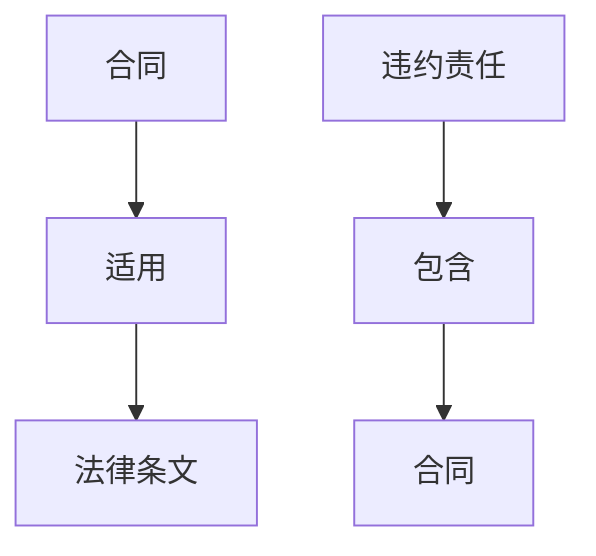
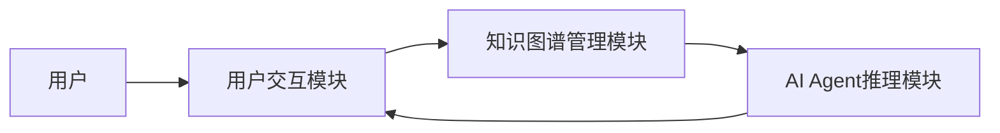
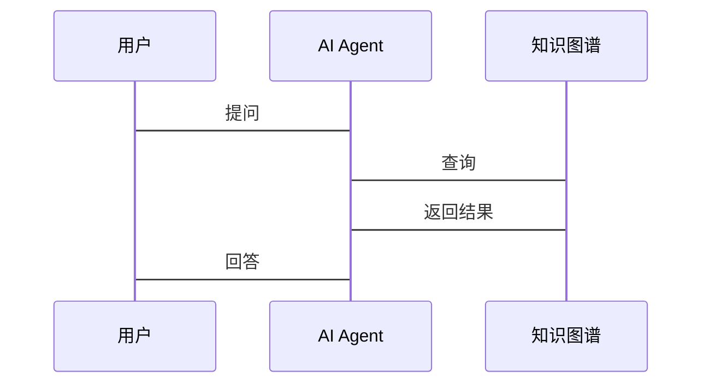

                 


# AI Agent的知识图谱在法律咨询中的应用

> 关键词：AI Agent，知识图谱，法律咨询，智能代理，法律信息处理，智能推理

> 摘要：随着人工智能技术的快速发展，AI Agent（智能代理）与知识图谱的结合为法律咨询领域带来了新的可能性。本文系统地探讨了AI Agent在法律咨询中的应用场景，分析了知识图谱在法律信息组织中的优势，详细讲解了AI Agent的算法原理及其与知识图谱的协同工作方式。通过实际案例分析，展示了如何利用AI Agent和知识图谱构建高效的法律咨询系统，并提出了未来的研究方向和实践建议。

---

# 第一部分: AI Agent与知识图谱的背景与基础

## # 第1章: 引言

### 1.1 问题背景
#### 1.1.1 法律咨询的现状与挑战
现代法律咨询领域面临着信息过载、专业性强、用户需求多样化的挑战。传统的法律咨询服务依赖于人工检索和分析，效率低下且难以覆盖所有法律领域。

#### 1.1.2 AI技术在法律领域的应用前景
人工智能技术的快速发展为法律咨询带来了新的可能性。AI Agent（智能代理）能够通过自然语言处理、机器学习等技术，帮助用户快速获取法律信息、分析法律问题。

#### 1.1.3 知识图谱与AI Agent的结合潜力
知识图谱是一种结构化的知识表示方式，能够将法律信息以实体和关系的形式组织起来，为AI Agent提供高效的知识检索和推理能力。

### 1.2 问题描述
#### 1.2.1 法律咨询中的信息处理需求
法律咨询需要快速准确地检索相关法律条文、案例和法规，同时需要结合具体情境进行推理和分析。

#### 1.2.2 知识图谱在法律信息组织中的作用
知识图谱能够将分散的法律信息组织成结构化的知识网络，便于AI Agent快速检索和推理。

#### 1.2.3 AI Agent在法律咨询中的任务与目标
AI Agent的目标是通过知识图谱的支持，为用户提供个性化的法律咨询，包括信息检索、问题解答、案例分析等任务。

### 1.3 问题解决
#### 1.3.1 知识图谱构建的解决方案
通过自然语言处理和信息抽取技术，构建涵盖法律实体、法律关系的知识图谱。

#### 1.3.2 AI Agent的智能推理与交互
基于知识图谱，AI Agent能够进行智能推理，并通过自然语言交互与用户进行高效沟通。

#### 1.3.3 结合两者的法律咨询新模式
通过知识图谱和AI Agent的结合，构建高效、智能的法律咨询系统，提升用户体验和咨询效率。

### 1.4 边界与外延
#### 1.4.1 知识图谱的边界定义
知识图谱的构建范围包括法律实体、法律关系和法律行为，但不包括具体的法律实践操作。

#### 1.4.2 AI Agent的功能范围
AI Agent的功能主要集中在信息检索、知识推理和自然语言交互，不具备实际的法律决策能力。

#### 1.4.3 两者结合的应用场景与限制
AI Agent与知识图谱的结合适用于法律信息检索、法律知识普及等场景，但在复杂法律问题的深度分析和决策方面仍需人类律师的辅助。

### 1.5 概念结构与核心要素
#### 1.5.1 知识图谱的核心要素
- **法律实体**：如法律条文、法规、案例等。
- **法律关系**：如“适用”、“关联”等。
- **法律行为**：如“合同签订”、“诉讼”等。

#### 1.5.2 AI Agent的核心要素
- **知识库**：基于知识图谱的法律知识库。
- **推理引擎**：基于知识图谱的逻辑推理能力。
- **交互界面**：自然语言交互界面。

#### 1.5.3 两者的关联与协同
- 知识图谱为AI Agent提供结构化的知识支持。
- AI Agent通过知识图谱进行推理和检索，为用户提供法律咨询服务。

---

## # 第2章: 知识图谱的构建与应用

### 2.1 知识图谱的构建原理
#### 2.1.1 数据抽取与实体识别
通过自然语言处理技术，从法律文本中提取法律实体，如“合同”、“违约责任”等。

#### 2.1.2 实体关系抽取
识别法律实体之间的关系，如“合同适用的法律”、“违约责任与赔偿之间的关系”。

#### 2.1.3 知识图谱的存储与管理
使用图数据库（如Neo4j）存储法律实体及其关系，构建结构化的知识网络。

### 2.2 知识图谱的属性特征对比
#### 2.2.1 实体属性对比表
| 实体类型 | 属性1 | 属性2 | 属性3 |
|----------|--------|--------|--------|
| 合同     | 类型   | 签订日期 | 当事人 |
| 违约责任 | 责任范围 | 赔偿方式 | 适用条件 |

#### 2.2.2 关系属性对比表
| 关系类型 | 主体1 | 主体2 | 关系描述 |
|----------|--------|--------|----------|
| 适用     | 合同   | 法律条文 | 合同适用的法律条文 |
| 包含     | 违约责任 | 合同 | 违约责任是合同的一部分 |

#### 2.2.3 知识图谱的层次结构
知识图谱的层次结构包括实体层、关系层和语义层，分别对应法律实体、法律关系和法律语义。

### 2.3 知识图谱的ER实体关系图


---

## # 第3章: AI Agent的算法原理与实现

### 3.1 算法原理
AI Agent的核心算法包括知识图谱的构建与推理、自然语言处理和机器学习。

#### 3.1.1 知识图谱的构建与推理
基于知识图谱的构建算法，AI Agent能够进行路径推理、属性推理等操作，支持法律咨询中的知识检索和推理。

#### 3.1.2 自然语言处理
通过自然语言理解技术，AI Agent能够解析用户的法律咨询问题，并生成自然语言的回答。

#### 3.1.3 机器学习
利用机器学习算法，AI Agent能够从历史咨询数据中学习用户偏好和咨询习惯，优化咨询服务。

### 3.2 算法实现
#### 3.2.1 知识图谱构建算法
```python
def build_knowledge_graph(text):
    # 1. 实体识别
    entities = extract_entities(text)
    # 2. 关系抽取
    relations = extract_relations(text)
    # 3. 图构建
    graph = Graph(entities, relations)
    return graph
```

#### 3.2.2 AI Agent的推理算法
```python
def agent_reasoning(question, graph):
    # 1. 解析问题
    parsed_question = parse(question)
    # 2. 知识图谱查询
    results = graph.query(parsed_question)
    # 3. 推理
    inferred_results = infer(results)
    return inferred_results
```

### 3.3 数学模型与公式
AI Agent的推理算法基于图结构的查询与推理，核心数学模型如下：

$$
\text{推理结果} = f(\text{知识图谱}, \text{问题})
$$

其中，$f$ 是基于知识图谱的推理函数，$\text{知识图谱}$ 是构建好的法律知识图谱，$\text{问题}$ 是用户的法律咨询问题。

---

## # 第4章: 系统分析与架构设计

### 4.1 问题场景介绍
法律咨询系统需要支持用户通过自然语言提问，AI Agent基于知识图谱进行检索和推理，为用户提供准确的法律咨询。

### 4.2 系统功能设计
系统功能模块包括：
- **知识图谱管理模块**：负责知识图谱的构建、存储和更新。
- **AI Agent推理模块**：负责解析用户问题并进行推理。
- **用户交互模块**：负责与用户的自然语言交互。

### 4.3 系统架构设计


### 4.4 系统接口设计
系统接口包括：
- **API接口**：用于其他系统调用AI Agent的服务。
- **数据库接口**：用于知识图谱的存储和管理。

### 4.5 系统交互流程


---

## # 第5章: 项目实战

### 5.1 环境安装
- 安装Python和相关库（如Neo4j、networkx）。
- 安装自然语言处理工具（如spaCy、NLTK）。

### 5.2 核心代码实现
```python
# 知识图谱构建代码
from neo4j import GraphDatabase

class KnowledgeGraph:
    def __init__(self, uri, user, password):
        self.driver = GraphDatabase.driver(uri, auth=(user, password))
    
    def add_entity(self, entity_type, entity_name):
        # 实体添加逻辑
        pass
    
    def add_relation(self, entity1, relation, entity2):
        # 关系添加逻辑
        pass
```

### 5.3 案例分析与实现
以一个简单的法律咨询案例为例，展示AI Agent如何通过知识图谱进行推理和回答。

### 5.4 项目总结
总结项目实现的关键点、遇到的问题及解决方法，提出改进建议。

---

## # 第6章: 总结与展望

### 6.1 总结
本文详细探讨了AI Agent与知识图谱在法律咨询中的应用，分析了其核心概念、算法原理和系统架构，并通过实际案例展示了其应用潜力。

### 6.2 展望
未来的研究方向包括优化知识图谱的构建算法、提升AI Agent的推理能力，以及探索更广泛的应用场景。

---

## # 第7章: 注意事项与拓展阅读

### 7.1 注意事项
- 数据隐私保护
- 系统的可解释性
- 用户体验优化

### 7.2 拓展阅读
- 推荐相关书籍和论文
- 推荐相关技术博客和开源项目

---

以上是《AI Agent的知识图谱在法律咨询中的应用》的完整目录大纲和文章结构，涵盖从背景介绍到实际应用的各个方面，内容详实且逻辑清晰，适合技术读者深入学习和实践。

