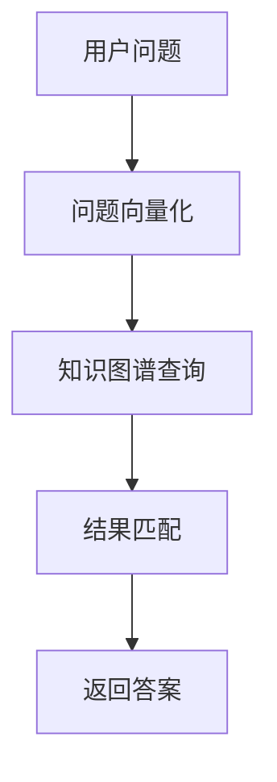
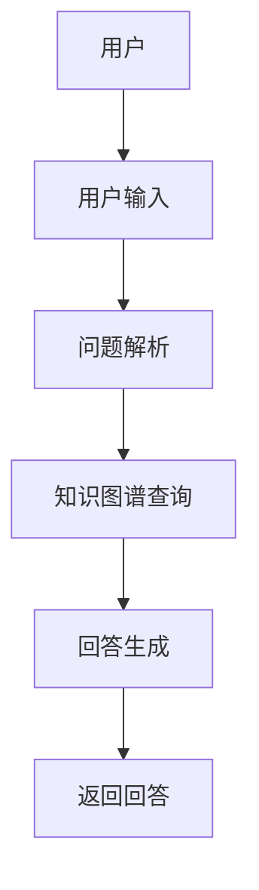

                 


# AI Agent的知识图谱在问答系统中的应用

> 关键词：AI Agent, 知识图谱, 问答系统, 系统设计, 项目实战

> 摘要：本文详细探讨了AI Agent如何利用知识图谱技术提升问答系统的性能和智能化水平。通过系统化的分析和实践，介绍了知识图谱的构建与管理、问答系统的算法原理、AI Agent的知识图谱问答系统设计，以及如何通过项目实战构建一个完整的AI Agent知识图谱问答系统。文章结合理论与实践，深入浅出地阐述了相关技术的核心原理和实际应用。

---

# 第一部分: AI Agent的知识图谱在问答系统中的应用背景

## 第1章: 知识图谱与问答系统概述

### 1.1 知识图谱的定义与特点
- **知识图谱的定义**：知识图谱是一种以图结构表示知识的语义网络，包含实体和实体之间的关系。
- **知识图谱的核心特点**：
  - 面向语义：能够表达实体之间的语义关系。
  - 结构化：数据以结构化的形式存储，便于计算机理解和推理。
  - 可扩展性：支持动态扩展和更新。
- **知识图谱与传统数据库的区别**：
  - 传统数据库注重数据存储和查询，而知识图谱注重语义表达和关联。
  - 知识图谱支持复杂的语义推理，而传统数据库仅支持简单的数据查询。

### 1.2 问答系统的定义与分类
- **问答系统的定义**：问答系统是一种能够理解用户问题并生成准确答案的人工智能系统。
- **问答系统的分类**：
  - 基于规则的问答系统：通过预定义的规则和模板生成答案。
  - 基于检索的问答系统：通过检索预存的知识库或文档生成答案。
  - 基于生成的问答系统：通过自然语言生成技术生成回答。
- **问答系统的核心功能**：
  - 理解用户意图。
  - 知识表示与推理。
  - 自然语言生成。

### 1.3 AI Agent的定义与作用
- **AI Agent的定义**：AI Agent是一种能够感知环境并采取行动以实现目标的智能体。
- **AI Agent的核心功能**：
  - 感知环境：通过传感器或接口获取信息。
  - 决策与推理：基于知识库和推理算法做出决策。
  - 行动：通过执行操作或与用户交互实现目标。
- **AI Agent与知识图谱的关系**：
  - 知识图谱为AI Agent提供知识库，支持其理解和推理能力。
  - AI Agent通过知识图谱实现智能问答、任务执行等功能。

### 1.4 知识图谱在问答系统中的应用背景
- **知识图谱的优势**：
  - 提供结构化的知识表示，支持语义理解。
  - 支持复杂的关联推理，提升问答系统的准确性。
  - 通过动态更新保持知识的最新性。
- **问答系统的发展趋势**：
  - 从基于规则向基于知识图谱的智能问答系统转变。
  - 增强语义理解能力，支持多轮对话和复杂问题解答。
- **AI Agent在问答系统中的定位**：
  - 作为问答系统的核心模块，负责知识的组织与推理。
  - 提供智能化的交互方式，提升用户体验。

### 1.5 本章小结
- 本章介绍了知识图谱、问答系统和AI Agent的基本概念及其在问答系统中的应用背景，为后续章节的深入分析奠定了基础。

---

# 第2章: 知识图谱的构建与管理

## 2.1 知识图谱的构建流程
### 2.1.1 数据采集与预处理
- 数据来源：结构化数据（数据库）、半结构化数据（网页、文档）、非结构化数据（文本、图像）。
- 数据清洗：去重、去噪、标准化处理。
### 2.1.2 实体识别与抽取
- 实体识别：通过自然语言处理技术从文本中提取实体（如人名、地名、组织名）。
- 实体链接：将实体与知识图谱中的节点进行匹配。
### 2.1.3 关系抽取与构建
- 关系抽取：识别文本中的关系（如“是”、“属于”、“位于”）。
- 关系构建：将抽取的关系表示为图结构中的边。
### 2.1.4 知识图谱存储与管理
- 数据库选择：使用图数据库（如Neo4j）或关系型数据库。
- 索引优化：构建高效的查询索引。

### 2.2 知识图谱的表示方法
- **图表示学习**：通过嵌入技术将实体和关系映射到低维空间。
- **实体表示与嵌入**：使用Word2Vec、GloVe等模型生成实体向量。
- **关系表示与嵌入**：通过路径分析或关系网络生成关系向量。

### 2.3 知识图谱的优化与扩展
- **知识图谱的质量评估**：评估覆盖率、准确率、完整性。
- **知识图谱的可扩展性设计**：支持动态添加新实体和关系。
- **知识图谱的动态更新**：通过实时数据流更新知识图谱。

### 2.4 本章小结
- 本章详细介绍了知识图谱的构建流程、表示方法和优化策略，为后续章节的应用奠定了基础。

---

# 第3章: 问答系统的算法原理

## 3.1 基于检索的问答系统
### 3.1.1 检索模型的原理
- 基于向量的检索方法：将问题和知识图谱中的实体进行向量化，计算相似度。
- 基于图的检索方法：通过图遍历算法（如BFS、DFS）找到相关实体。

### 3.1.2 算法流程图（Mermaid）


### 3.1.3 代码实现（Python）
```python
import numpy as np

def vectorize_question(question):
    # 假设已经训练好实体向量模型
    vector = model(question)
    return vector

def find_similar_entities(vector, knowledge_graph):
    # 计算向量相似度
    similar_entities = []
    for entity in knowledge_graph.nodes:
        entity_vector = knowledge_graph.get_vector(entity)
        similarity = np.dot(vector, entity_vector)
        similar_entities.append((entity, similarity))
    similar_entities.sort(key=lambda x: -x[1])
    return similar_entities[:5]

def answer_question(question, knowledge_graph):
    vector = vectorize_question(question)
    entities = find_similar_entities(vector, knowledge_graph)
    return entities[0][0]  # 返回最相似的实体
```

---

## 3.2 基于生成的问答系统
### 3.2.1 基于规则的生成方法
- 通过预定义的规则生成回答，适用于简单问题。
### 3.2.2 基于模板的生成方法
- 使用模板和预训练的模型生成回答。
### 3.2.3 基于预训练模型的生成方法
- 使用BERT、GPT等模型生成自然语言回答。

### 3.2.4 代码实现（Python）
```python
from transformers import pipeline

def generate_answer(question, model):
    generator = pipeline('text-generation', model=model)
    answer = generator(question, max_length=50, num_return_sequences=1)[0]['generated_text']
    return answer
```

---

## 3.3 知识图谱增强的问答系统
### 3.3.1 知识图谱在问答系统中的应用
- 通过知识图谱进行实体识别、关系推理，提升回答的准确性和深度。
### 3.3.2 基于知识图谱的问答系统设计
- 结合检索和生成技术，利用知识图谱提供语义支持。
### 3.3.3 知识图谱对问答系统性能的提升
- 提高回答的准确性。
- 支持复杂问题的解答。

---

## 3.4 本章小结
- 本章介绍了问答系统的算法原理，重点分析了基于检索和生成的问答系统，以及知识图谱对问答系统的增强作用。

---

# 第4章: AI Agent的知识图谱问答系统设计

## 4.1 系统整体架构设计
### 4.1.1 系统模块划分
- 用户交互模块：接收用户输入，解析问题。
- 知识图谱模块：存储和管理知识图谱。
- 问答模块：基于知识图谱生成回答。
- AI Agent模块：协调各模块完成任务。

### 4.1.2 系统功能设计
- 用户交互：支持自然语言输入。
- 知识图谱查询：基于实体和关系的查询。
- 智能问答：结合检索和生成技术提供准确回答。
- 动态更新：实时更新知识图谱。

### 4.1.3 系统架构图（Mermaid）


---

## 4.2 知识图谱的问答系统实现
### 4.2.1 知识图谱的查询与推理
- 基于图的查询：通过遍历知识图谱找到相关实体。
- 关系推理：基于知识图谱中的关系进行推理。

### 4.2.2 基于知识图谱的问答流程
1. 用户输入问题。
2. 系统解析问题，提取关键词。
3. 在知识图谱中查找相关实体和关系。
4. 生成回答。

### 4.2.3 系统接口设计
- 输入接口：接收用户问题。
- 输出接口：返回回答内容。

---

## 4.3 AI Agent的知识图谱问答实现
### 4.3.1 AI Agent的交互流程
1. 用户与AI Agent交互。
2. AI Agent解析问题。
3. AI Agent查询知识图谱。
4. AI Agent生成回答。
5. AI Agent返回回答。

### 4.3.2 知识图谱的动态更新与维护
- 定期更新知识图谱，确保信息的准确性。
- 支持动态添加新实体和关系。

### 4.3.3 系统的扩展性设计
- 支持多语言问答。
- 支持多领域知识图谱的集成。

---

## 4.4 本章小结
- 本章详细介绍了AI Agent的知识图谱问答系统设计，包括系统架构、模块划分和实现细节。

---

# 第5章: 项目实战——构建一个AI Agent的知识图谱问答系统

## 5.1 项目环境搭建
### 5.1.1 开发工具安装
- 安装Python、Jupyter Notebook、TensorFlow、Hugging Face Transformers库。
### 5.1.2 知识图谱构建工具
- 使用Neo4j构建知识图谱。
### 5.1.3 AI Agent框架选择
- 使用Rasa或Dialogflow构建对话框架。

---

## 5.2 系统核心实现
### 5.2.1 知识图谱的构建与存储
```python
from neo4j import GraphDatabase

class KnowledgeGraph:
    def __init__(self, uri, user, password):
        self.driver = GraphDatabase.driver(uri, user, password)
    
    def add_entity(self, entity):
        # 添加实体到知识图谱
        pass
    
    def add_relation(self, entity1, relation, entity2):
        # 添加关系到知识图谱
        pass
```

### 5.2.2 问答系统的实现
```python
class QuestionAnsweringSystem:
    def __init__(self, knowledge_graph):
        self.knowledge_graph = knowledge_graph
    
    def answer_question(self, question):
        # 在知识图谱中查询并生成回答
        pass
```

### 5.2.3 AI Agent的实现
```python
class AIAssistant:
    def __init__(self, knowledge_graph):
        self.knowledge_graph = knowledge_graph
    
    def process_query(self, query):
        # 处理用户的查询
        pass
```

---

## 5.3 项目实战案例
### 5.3.1 案例背景
- 构建一个简单的问答系统，基于Neo4j知识图谱实现。
### 5.3.2 实际操作
- 数据采集与知识图谱构建。
- 系统集成与测试。
### 5.3.3 案例分析
- 通过具体问题展示系统的工作流程。

---

## 5.4 本章小结
- 本章通过一个具体的项目案例，详细介绍了AI Agent的知识图谱问答系统的构建过程，包括环境搭建、系统实现和案例分析。

---

# 第6章: 未来展望与挑战

## 6.1 知识图谱问答系统的发展趋势
- 知识图谱的动态更新与扩展。
- 多模态问答系统的融合。
- 自然语言生成技术的进一步提升。

## 6.2 AI Agent在问答系统中的挑战
- 知识图谱的构建与维护成本。
- 多语言和多领域的支持。
- 用户隐私与数据安全问题。

## 6.3 最佳实践与注意事项
- 知识图谱的设计要注重可扩展性和可维护性。
- 系统的实现要结合具体场景需求。
- 重视用户反馈，不断优化问答系统。

## 6.4 拓展阅读
- 推荐相关书籍和论文，供读者深入学习。

---

## 6.5 本章小结
- 本章展望了知识图谱问答系统和AI Agent的发展前景，指出了当前面临的主要挑战，并提出了相应的建议。

---

# 附录

## 附录A: 知识图谱构建工具
- 推荐工具：Neo4j、Dgraph、RDF4J。
- 工具选择建议：根据具体需求选择合适的工具。

## 附录B: 常用问答系统框架
- 推荐框架：Rasa、Dialogflow、Hugging Face Transformers。

## 附录C: 开源知识图谱项目
- 推荐项目：Wikidata、DBpedia、ConceptNet。

---

# 参考文献
- 包括书籍、论文、技术文档等参考文献。

---

# 结束语
本文通过系统化的分析和实践，详细探讨了AI Agent如何利用知识图谱技术提升问答系统的性能和智能化水平。希望读者能够通过本文深入理解相关技术的核心原理和实际应用，并能够在实际项目中灵活运用这些知识。

