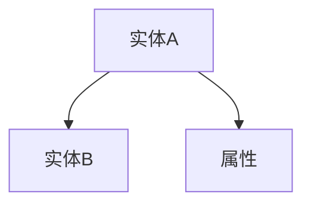
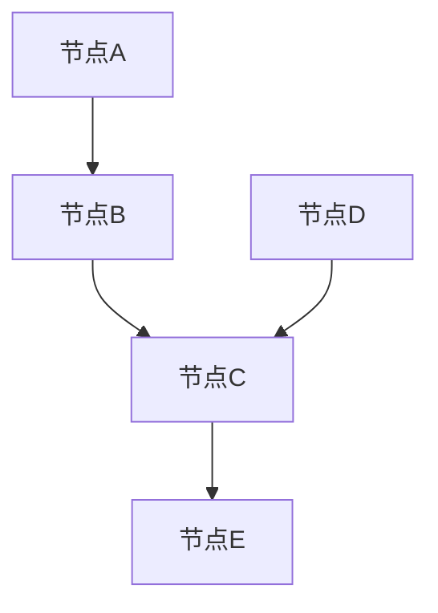
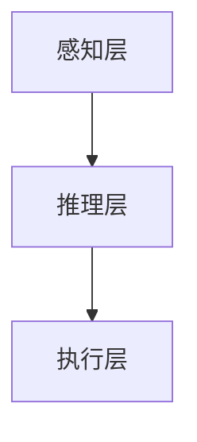
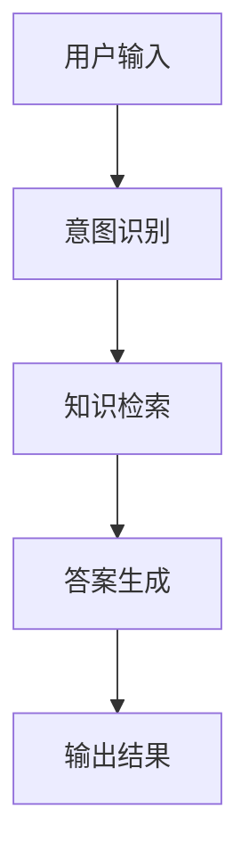

                 


```markdown
# AI Agent的知识图谱应用

## 关键词
- 知识图谱
- AI Agent
- 智能问答
- 系统架构
- 项目实战

## 摘要
本文详细探讨了知识图谱在AI Agent中的应用，从知识图谱的构建方法到AI Agent的工作原理，再到实际应用案例的分析。文章首先介绍了知识图谱的基本概念和构建技术，然后阐述了AI Agent的核心能力和任务规划方法。接着，重点分析了知识图谱在智能问答系统中的应用，详细讲解了基于知识图谱的问答系统的构建过程，包括数据建模、知识推理和对话系统设计。最后，通过一个具体的项目实战，展示了如何将知识图谱与AI Agent结合，实现智能问答系统。本文内容详实，结合理论与实践，为读者提供了全面的知识图谱在AI Agent中的应用指南。

---

## 第一部分: 知识图谱基础

### 第1章: 知识图谱的定义与构建

#### 1.1 知识图谱的背景与概念

知识图谱是一种结构化的数据表示方式，旨在将分散在不同数据源中的信息整合成一个统一的知识网络。其核心概念包括实体、关系和属性，这些元素通过图结构连接，形成一个语义网络。知识图谱的构建需要经过数据抽取、清洗、融合和存储等多个步骤，旨在为AI Agent提供高效的知识检索和推理能力。

**背景介绍：**
知识图谱的概念起源于互联网早期的信息整合需求。随着大数据技术的发展，知识图谱逐渐成为连接数据与智能应用的重要桥梁。其核心目标是将非结构化的数据转化为可计算的结构化知识，从而为AI Agent提供强大的知识库支持。

#### 1.2 知识图谱的构建方法

知识图谱的构建过程包括以下几个关键步骤：

1. **数据抽取与实体识别：**
   - 从文本、数据库等多源数据中提取实体信息。
   - 使用NLP技术进行实体识别和命名实体识别（NER）。

2. **关系抽取与属性建模：**
   - 通过模式匹配和句法分析提取实体之间的关系。
   - 建立属性模型，描述实体的特征和属性。

3. **知识融合与冲突处理：**
   - 将多个数据源中的知识进行整合，解决数据冗余和冲突问题。
   - 使用本体论（Ontology）进行知识标准化。

**核心概念与联系：**
知识图谱的构建涉及多个核心概念，包括实体（Entity）、关系（Relation）、属性（Attribute）和实例（Instance）。实体是知识图谱的基本单元，关系描述实体之间的关联，属性则用于描述实体的特征。以下是一个简单的实体关系示例：



#### 1.3 知识图谱的表示方法

知识图谱的表示方法主要有三种：RDF、知识图谱嵌入和数据库存储。

1. **RDF与知识图谱表示：**
   - RDF（Resource Description Framework）是一种基于属性的语法，用于描述资源及其属性。
   - 在知识图谱中，每个三元组（subject, predicate, object）表示一个事实。

2. **图嵌入与向量表示：**
   - 图嵌入技术将图结构数据转换为低维向量，便于机器学习模型处理。
   - 常用的图嵌入算法包括Word2Vec、GraphSAGE和Node2Vec。

3. **知识图谱的存储与管理：**
   - 使用图数据库（如Neo4j）存储知识图谱。
   - 数据库设计需要考虑实体关系的层次结构和索引优化。

**算法原理讲解：**
知识图谱嵌入的核心算法是通过训练模型将图结构数据映射到低维空间。以下是GraphSAGE算法的简要流程：



**数学模型：**
GraphSAGE的目标是最小化预测错误，通过以下损失函数实现：

$$ L = \sum_{(i,j)\in D} (y_{ij} - f(i,j))^2 $$

其中，$y_{ij}$是标签，$f(i,j)$是模型预测值。

---

## 第二部分: AI Agent的基本概念与工作原理

### 第2章: AI Agent的基本概念与工作原理

#### 2.1 AI Agent的定义

AI Agent是一种智能体，能够感知环境、自主决策并执行任务。AI Agent的核心能力包括感知、推理、学习和行动。

**背景介绍：**
AI Agent的概念源于人工智能研究，其目标是实现具备人类智能水平的自主系统。与传统程序不同，AI Agent具备动态环境中的适应能力和问题解决能力。

#### 2.2 AI Agent的任务规划

任务规划是AI Agent完成目标的关键步骤，包括任务分解、优先级排序和状态空间建模。

1. **任务分解与优先级排序：**
   - 将复杂任务分解为子任务，根据重要性排序。
   - 使用优先级队列管理任务执行顺序。

2. **状态空间与动作空间：**
   - 状态空间描述系统可能的状态。
   - 动作空间定义系统可执行的动作。

**系统分析与架构设计方案：**
AI Agent的系统架构通常包括感知层、推理层和执行层。以下是一个简化的系统架构图：



#### 2.3 AI Agent的决策与推理

决策与推理是AI Agent的核心功能，基于知识图谱的推理方法能够提高决策的准确性。

1. **基于知识图谱的推理方法：**
   - 使用规则推理和逻辑推理进行知识推导。
   - 在智能问答系统中，通过知识图谱进行语义匹配和推理。

2. **概率推理与不确定性处理：**
   - 使用贝叶斯网络处理不确定性。
   - 基于概率论计算最优解。

**数学模型：**
贝叶斯定理用于计算条件概率：

$$ P(A|B) = \frac{P(B|A) \cdot P(A)}{P(B)} $$

---

## 第三部分: 知识图谱在AI Agent中的应用

### 第3章: 知识图谱驱动的智能问答

#### 3.1 智能问答系统概述

智能问答系统是一种基于自然语言处理的交互系统，通过理解用户意图并提供准确答案。基于知识图谱的问答系统具有高准确性和快速响应的特点。

**背景介绍：**
智能问答系统广泛应用于客服、教育、医疗等领域。传统的基于关键词的问答系统存在准确率低的问题，而基于知识图谱的问答系统能够通过语义理解提供更精确的答案。

#### 3.2 基于知识图谱的问答系统设计

知识图谱在问答系统中的应用包括数据建模、知识推理和对话系统设计。

1. **数据建模：**
   - 将问答系统的知识库建模为知识图谱。
   - 使用实体识别和关系抽取技术构建知识图谱。

2. **知识推理：**
   - 通过路径分析和语义匹配进行推理。
   - 使用规则推理和逻辑推理提高准确性。

3. **对话系统设计：**
   - 设计对话流程，包括用户意图识别和答案生成。
   - 使用知识图谱进行语境管理和上下文跟踪。

**系统设计与实现：**
以下是智能问答系统的系统架构图：



#### 3.3 项目实战: 智能问答系统实现

1. **环境安装：**
   - 安装Python和必要的库（如numpy、pandas、spacy）。
   - 安装图数据库（如Neo4j）并配置好REST API。

2. **核心代码实现：**
   ```python
   import neo4j
   from neo4j.exceptions import ServiceUnavailable

   def query_kg(question):
       driver = neo4j.Driver('bolt://localhost:7687', auth=('neo4j', 'password'))
       with driver.session() as session:
           result = session.run(
               "MATCH (n) WHERE n.name = $question RETURN n", 
               question=question
           )
           return [record["n"].properties for record in result]

       driver.close()

   print(query_kg("What is AI?"))
   ```

3. **案例分析与结果解读：**
   - 系统接收到用户的查询后，首先进行意图识别，确定用户的问题类型。
   - 然后通过知识图谱进行检索，找到相关实体和关系。
   - 最后生成答案并返回给用户。

**项目小结：**
通过项目实战，我们可以看到知识图谱在智能问答系统中的巨大潜力。基于知识图谱的问答系统不仅提高了准确率，还能够支持更复杂的语义理解和推理。

---

## 第四部分: 总结与展望

### 第4章: 总结与展望

#### 4.1 知识图谱与AI Agent的结合

知识图谱为AI Agent提供了强大的知识支持，使其能够更高效地完成任务。通过知识图谱，AI Agent能够理解上下文，进行推理和决策，从而实现更智能的交互。

#### 4.2 未来展望

未来，随着知识图谱技术的不断发展，AI Agent将具备更强的自主学习和问题解决能力。知识图谱的动态更新、多模态知识表示和跨语言支持将成为研究的重点方向。

#### 4.3 最佳实践与注意事项

- 在构建知识图谱时，要注意数据的多样性和准确性。
- 在设计AI Agent时，要确保系统的可扩展性和可维护性。
- 在实际应用中，要结合具体场景进行优化和调整。

---

## 参考文献

1. 知识图谱相关论文
2. AI Agent相关书籍
3. 智能问答系统研究文献

---

通过本文的详细讲解，读者可以全面了解知识图谱在AI Agent中的应用，并掌握实际项目中的实现方法。希望本文能够为相关领域的研究和实践提供有价值的参考。
```

