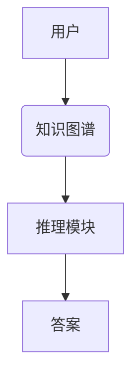

                 


# AI Agent的知识图谱构建与推理机制

> 关键词：知识图谱，AI Agent，推理机制，自然语言处理，智能推荐，知识表示，深度学习

> 摘要：  
本文将详细探讨AI Agent在知识图谱构建与推理机制中的应用。首先，我们将介绍知识图谱的基本概念及其在AI Agent中的重要性。接着，我们将深入分析知识图谱的构建过程，包括知识抽取、融合与表示。然后，我们将讨论AI Agent的推理机制，涵盖基于规则、概率和深度学习的推理方法。最后，我们通过实际案例展示如何将知识图谱应用于智能系统，并总结最佳实践和未来发展方向。

---

## 第一部分：AI Agent与知识图谱的背景

### 第1章：知识图谱的基本概念

#### 1.1 知识图谱的定义与特点
知识图谱是一种以图结构形式表示知识的语义网络，由实体（概念、事件或物质）及其关系组成。知识图谱的特点包括：
- **结构化**：实体和关系以形式化的方式表示。
- **语义化**：通过关系和属性描述实体的语义。
- **动态更新**：支持实时更新和扩展。

#### 1.2 AI Agent的定义与特点
AI Agent是一种智能实体，能够感知环境并自主决策，执行任务。其特点包括：
- **自主性**：无需外部干预。
- **反应性**：实时感知并响应环境变化。
- **学习能力**：通过经验改进性能。

#### 1.3 知识图谱在AI Agent中的作用
知识图谱为AI Agent提供了知识库，支持其进行推理、决策和问题解决。通过知识图谱，AI Agent能够理解复杂场景中的语义关系。

---

### 第2章：知识图谱的应用场景

#### 2.1 自然语言处理
- 知识图谱为NLP提供语义理解的基础，例如实体识别和关系抽取。
- 示例：在文本中识别“苹果是水果”这一关系。

#### 2.2 智能推荐
- 基于知识图谱构建用户画像，推荐个性化内容。
- 示例：根据用户购买历史推荐相关产品。

#### 2.3 智慧城市
- 知识图谱支持城市数据的整合与分析，优化资源配置。
- 示例：实时监控交通流量，优化信号灯控制。

---

## 第二部分：知识图谱的构建与管理

### 第3章：知识图谱的构建过程

#### 3.1 知识抽取与表示
- **知识抽取**：从文本中提取实体及其关系。
- **知识表示**：使用符号或嵌入向量表示知识。

#### 3.2 知识融合与推理
- **知识融合**：整合多个来源的知识，消除冲突。
- **知识推理**：基于现有知识推导新的事实。

#### 3.3 知识图谱的动态更新
- 定期更新知识图谱以反映最新信息。
- 示例：实时更新股票市场的最新数据。

---

### 第4章：知识图谱的存储与管理

#### 4.1 知识图谱的存储技术
- 使用图数据库（如Neo4j）存储知识图谱。
- 示例：在Neo4j中存储人物关系网络。

#### 4.2 知识图谱的查询语言
- 使用SPARQL查询知识图谱。
- 示例：查询“所有与苹果相关的公司”。

#### 4.3 知识图谱的可视化工具
- 使用Gephi或Neo4j Browser可视化知识图谱。
- 示例：绘制人物关系网络图。

---

## 第三部分：AI Agent的推理机制

### 第5章：推理机制的基本原理

#### 5.1 基于规则的推理
- 使用逻辑规则进行推理。
- 示例：根据规则“所有鸟都会飞”推断“鸵鸟会飞”。

#### 5.2 基于概率的推理
- 使用概率论计算事件的可能性。
- 示例：根据天气数据预测明天的降水概率。

#### 5.3 基于深度学习的推理
- 使用神经网络模型进行推理。
- 示例：利用BERT模型进行文本推理。

---

### 第6章：推理机制的实现

#### 6.1 基于规则的推理实现
- 使用Python编写规则，并应用到知识图谱中。
- 示例：定义规则“如果A是B的父亲，那么A是B的父母之一”。

#### 6.2 基于概率的推理实现
- 使用贝叶斯网络计算概率。
- 示例：计算某疾病在特定人群中的患病概率。

#### 6.3 基于深度学习的推理实现
- 使用预训练的大语言模型进行推理。
- 示例：利用GPT模型生成自然语言回答。

---

## 第四部分：系统架构与项目实战

### 第7章：系统架构设计

#### 7.1 问题场景介绍
- 构建一个智能客服系统，帮助用户解答问题。

#### 7.2 系统功能设计
- 知识图谱构建模块：抽取和存储客服知识库。
- 推理模块：基于知识图谱进行问题解答。

#### 7.3 系统架构图


---

### 第8章：项目实战

#### 8.1 环境安装
- 安装Python、Neo4j和相关库。

#### 8.2 核心代码实现
```python
# 知识图谱构建
from neo4j import GraphDatabase

def add_relationship(tx, entity1, relation, entity2):
    tx.run("MATCH (a {name: $entity1}), (b {name: $entity2}) "
            "CREATE (a)-[r:$relation]->(b)",
            entity1=entity1, relation=relation, entity2=entity2)

# 推理模块
def query_kg(tx, entity):
    result = tx.run("MATCH (a {name: $entity}) "
                    "RETURN a.name as name, relationships(a) as relations", entity=entity)
    return {row["name"]: row["relations"] for row in result}
```

#### 8.3 案例分析与总结
- 案例分析：基于知识图谱实现智能问答系统。
- 总结：知识图谱为AI Agent提供了强大的知识基础，支持其进行高效推理。

---

## 第五部分：总结与展望

### 第9章：总结与小结

#### 9.1 核心内容回顾
- 知识图谱的构建与管理。
- AI Agent的推理机制。

#### 9.2 最佳实践
- 选择合适的工具和算法。
- 定期更新知识图谱。

#### 9.3 注意事项
- 注意数据隐私和安全。
- 确保系统的可扩展性。

### 第10章：未来展望

#### 10.1 知识图谱的发展方向
- 更加智能化的知识构建方法。
- 更强的实时性与动态性。

#### 10.2 AI Agent的未来趋势
- 更广泛的应用场景。
- 更强的自主性和学习能力。

---

通过本文的详细讲解，我们希望读者能够全面理解AI Agent的知识图谱构建与推理机制，并能够将其应用于实际项目中。

