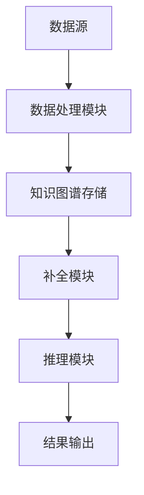
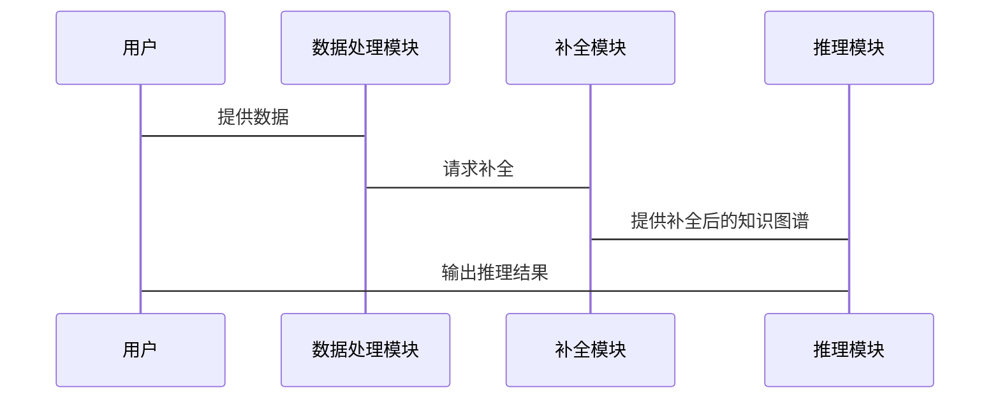

                 


---

# AI Agent的知识图谱补全技术在推理中的应用

> **关键词**: 知识图谱, AI Agent, 推理, 补全技术, 系统架构

> **摘要**: 本文详细探讨了AI Agent在知识图谱补全技术中的应用，分析了知识图谱补全技术如何增强AI Agent的推理能力。文章从知识图谱的基本概念、构建与补全技术入手，深入解析了AI Agent的推理机制，结合实际案例展示了知识图谱补全技术在推理中的应用，并提出了系统的架构设计与优化建议。

---

# 第1章 知识图谱与AI Agent概述

## 1.1 知识图谱的基本概念

### 1.1.1 知识图谱的定义与特点

知识图谱是一种以图结构形式表示知识的语义网络，节点代表实体或概念，边表示实体之间的关系。知识图谱具有语义丰富、结构化、可扩展性强等特点，广泛应用于搜索、推荐、问答系统等领域。

### 1.1.2 知识图谱的构建与应用

知识图谱的构建流程包括数据抽取、实体识别、关系抽取等步骤。常见的知识图谱构建方法有基于规则的抽取、统计学习和深度学习等。知识图谱在搜索优化、智能问答、推荐系统等领域有广泛应用。

### 1.1.3 知识图谱与推理的关系

知识图谱为推理提供了语义基础，推理则帮助知识图谱完善和扩展。基于知识图谱的推理可以发现隐含关系，增强知识图谱的完整性和准确性。

## 1.2 AI Agent的基本概念

### 1.2.1 AI Agent的定义与分类

AI Agent是一种智能体，能够感知环境、执行任务并做出决策。AI Agent可以分为简单反射型、基于模型型、实用推理型和目标驱动型等。

### 1.2.2 AI Agent的核心能力

AI Agent的核心能力包括感知能力、推理能力、决策能力和学习能力。其中，推理能力是AI Agent完成复杂任务的关键。

### 1.2.3 AI Agent与知识图谱的结合

知识图谱为AI Agent提供了丰富的知识库，AI Agent利用知识图谱进行推理和决策，从而实现更智能的任务执行。

## 1.3 知识图谱补全技术的背景与意义

### 1.3.1 知识图谱的不完整问题

知识图谱在构建过程中可能存在数据不完整、关系缺失等问题，导致其在推理中的应用受限。

### 1.3.2 补全技术在推理中的作用

补全技术可以填补知识图谱中的空白，增强其推理能力，提升AI Agent的智能水平。

### 1.3.3 技术发展的现状与趋势

知识图谱补全技术正朝着深度学习、图神经网络等方向发展，未来将在AI Agent、智能问答等领域发挥重要作用。

---

# 第2章 知识图谱的构建与补全技术

## 2.1 知识图谱的构建流程

### 2.1.1 数据抽取与清洗

从多源数据中提取结构化数据，去除噪声，确保数据质量。

### 2.1.2 实体识别与链接

通过实体识别技术，将文本中的实体提取出来，并建立实体之间的关联。

### 2.1.3 关系抽取与构建

利用自然语言处理技术，抽取实体之间的关系，并构建图结构。

## 2.2 知识图谱的补全方法

### 2.2.1 基于规则的补全技术

通过预定义的规则，填充知识图谱中的空白节点或关系。

### 2.2.2 基于统计的补全技术

利用统计学习方法，预测知识图谱中缺失的关系或属性。

### 2.2.3 基于深度学习的补全技术

采用图神经网络等深度学习模型，学习知识图谱的隐含结构，自动补全缺失信息。

## 2.3 知识图谱补全的挑战与解决方案

### 2.3.1 数据稀疏性问题

知识图谱中某些实体或关系的样本较少，导致补全效果不佳。解决方案包括数据增强和模型优化。

### 2.3.2 知识关联性问题

知识图谱中实体之间的关联复杂，补全时需要考虑多方面的关联性。解决方案包括多任务学习和知识融合。

### 2.3.3 补全算法的性能优化

通过模型压缩、分布式计算等方法，提升补全算法的效率和 scalability。

---

# 第3章 AI Agent的推理机制

## 3.1 推理的定义与分类

### 3.1.1 推理的基本概念

推理是通过已有知识得出新结论的过程，分为逻辑推理、概率推理、语义推理等类型。

### 3.1.2 推理的类型与特点

- **逻辑推理**: 基于逻辑规则进行推理。
- **概率推理**: 基于概率模型进行推理。
- **语义推理**: 基于语义理解进行推理。

### 3.1.3 推理在AI Agent中的作用

推理是AI Agent完成复杂任务的核心能力，帮助其理解环境、做出决策。

## 3.2 知识图谱在推理中的应用

### 3.2.1 基于知识图谱的路径推理

通过遍历知识图谱，找到实体之间的最短路径或特定路径，支持推理过程。

### 3.2.2 基于知识图谱的逻辑推理

利用逻辑规则和知识图谱中的事实进行推理，得出新的知识。

### 3.2.3 基于知识图谱的语义推理

通过语义理解技术，推理出隐含在知识图谱中的语义信息。

## 3.3 推理算法的实现与优化

### 3.3.1 常见推理算法概述

- **前向链推理**: 从已知事实出发，逐步推导出新结论。
- **反向链推理**: 从目标结论出发，逆向推导出前提条件。
- **基于规则的推理**: 基于预定义规则进行推理。

### 3.3.2 基于知识图谱的推理模型

- **规则推理模型**: 基于逻辑规则的推理。
- **神经推理模型**: 基于深度学习的推理。

### 3.3.3 推理算法的性能优化

通过剪枝、缓存等技术，提升推理算法的效率。

---

# 第4章 知识图谱补全技术在推理中的应用

## 4.1 知识图谱补全技术的核心原理

### 4.1.1 知识图谱补全的数学模型

利用图神经网络模型，学习知识图谱的节点表示和边表示，预测缺失信息。

### 4.1.2 补全技术的实现流程

- 数据预处理
- 模型训练
- 缺失信息预测

### 4.1.3 补全技术的性能评估

通过准确率、召回率、F1值等指标，评估补全技术的效果。

## 4.2 知识图谱补全技术在推理中的具体应用

### 4.2.1 知识图谱补全与路径推理

通过补全技术完善知识图谱，支持更复杂的路径推理。

### 4.2.2 知识图谱补全与逻辑推理

利用补全后的知识图谱，进行更准确的逻辑推理。

### 4.2.3 知识图谱补全与语义推理

通过补全技术增强语义理解，提升语义推理的准确性。

## 4.3 实际案例分析

### 4.3.1 案例背景

假设有一个医疗领域的知识图谱，包含疾病、症状、治疗方案等信息。

### 4.3.2 补全过程

通过深度学习模型，补全知识图谱中缺失的疾病与症状之间的关系。

### 4.3.3 推理应用

利用补全后的知识图谱，推理出新的治疗方案。

---

# 第5章 知识图谱补全技术的系统架构与实现

## 5.1 系统架构设计

### 5.1.1 系统功能模块

- 数据处理模块
- 补全模块
- 推理模块

### 5.1.2 系统架构图



### 5.1.3 系统交互流程



## 5.2 算法实现与优化

### 5.2.1 补全算法的实现

```python
class KnowledgeGraphCompleter:
    def __init__(self, graph):
        self.graph = graph

    def complete(self):
        # 补全算法实现
        pass
```

### 5.2.2 推理算法的实现

```python
class Reasoner:
    def __init__(self, graph):
        self.graph = graph

    def infer(self, query):
        # 推理算法实现
        pass
```

### 5.2.3 模型优化

通过参数调整、模型结构优化等方法，提升补全和推理的效率与准确性。

---

# 第6章 项目实战与最佳实践

## 6.1 项目实战

### 6.1.1 项目背景

开发一个基于知识图谱补全技术的智能问答系统。

### 6.1.2 项目需求

实现知识图谱的构建、补全和推理功能，支持智能问答。

### 6.1.3 系统实现

- 数据预处理
- 知识图谱构建
- 缺失信息补全
- 推理与问答

## 6.2 最佳实践

### 6.2.1 技术选型

选择合适的知识图谱构建和补全技术，结合高效的推理算法。

### 6.2.2 性能优化

通过分布式计算、缓存优化等方法，提升系统性能。

### 6.2.3 未来扩展

探索新的知识图谱补全技术，如生成式AI的应用。

---

# 结语

知识图谱补全技术在AI Agent的推理中发挥着重要作用。通过完善知识图谱，AI Agent能够进行更智能、更准确的推理，从而更好地服务于实际应用。未来，随着技术的发展，知识图谱补全技术将在更多领域展现出其强大的潜力。

---

**参考文献**  
[此处列出相关文献和资料]

---

**附录**  
[附录内容，如代码片段、数据集说明等]

