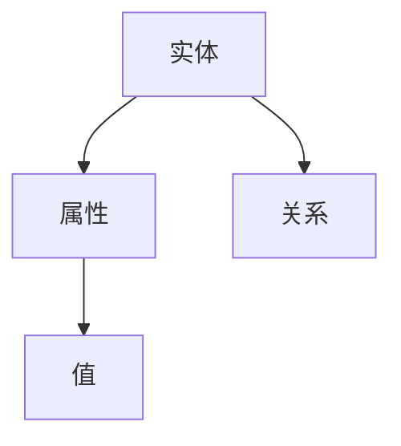
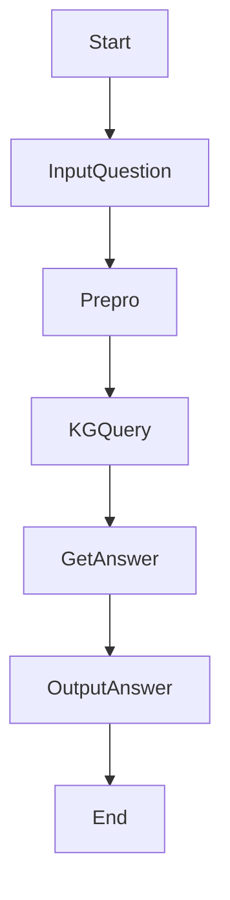
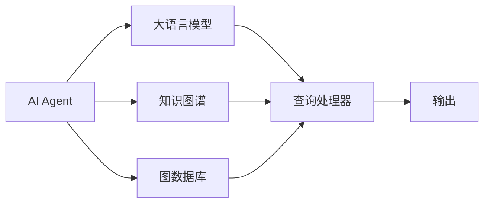

                 


# AI Agent的知识图谱问答：结合LLM与图数据库

## 关键词：AI Agent，知识图谱，LLM，图数据库，问答系统

## 摘要：  
本文探讨AI Agent如何利用知识图谱、大语言模型（LLM）和图数据库实现问答系统。通过背景分析、核心概念、算法原理、系统架构和项目实战，详细讲解结合这三者的原理与应用，最后总结技术优势及未来趋势。

---

## 第一部分：背景介绍

### 第1章：AI Agent与知识图谱问答的背景

#### 1.1 问题背景
知识图谱问答（KGQ&A）通过结构化知识提供准确答案，但传统方法在语义理解、复杂推理和动态更新方面存在不足。大语言模型（LLM）如GPT具备强大的生成和理解能力，但无法直接处理结构化知识。图数据库在存储复杂关系方面优势明显，但缺乏语义解释能力。三者的结合为问答系统带来新机遇。

#### 1.2 问题描述
当前问答系统面临语义理解不深、知识覆盖不全、难以处理复杂关系等问题。传统方法依赖关键词匹配，准确率低；LLM生成能力强但结构化知识处理不足；图数据库查询效率高但语义理解有限。

#### 1.3 问题解决
AI Agent作为中间媒介，整合知识图谱的结构化知识、LLM的语言生成能力和图数据库的高效查询能力，构建更智能、高效的问答系统。

#### 1.4 边界与外延
本文聚焦于企业内部知识管理，不涉及实时数据源和复杂安全问题。核心要素包括知识图谱构建、LLM的语义理解和图数据库查询。

---

## 第二部分：核心概念与联系

### 第2章：知识图谱、LLM与图数据库的核心原理

#### 2.1 核心概念原理
- **知识图谱**：通过实体（node）和关系（edge）构建语义网络，支持复杂查询。
- **LLM**：基于大规模数据训练，擅长生成文本和上下文理解。
- **图数据库**：高效存储和查询复杂关系，支持ACID特性。

#### 2.2 概念属性特征对比
| 概念       | 属性特征                                                                 |
|------------|--------------------------------------------------------------------------|
| 知识图谱    | 结构化、语义化、可扩展性                                                 |
| LLM        | 大规模、生成性、上下文理解能力                                         |
| 图数据库    | 图结构、高效查询、支持复杂关系                                       |

#### 2.3 ER实体关系图架构


---

## 第三部分：算法原理讲解

### 第3章：知识图谱问答的算法流程

#### 3.1 算法流程图


#### 3.2 代码实现
```python
def vector_similarity(vector1, vector2):
    # 计算余弦相似度
    return dot(vector1, vector2) / (norm(vector1) * norm(vector2))

# 示例：构建实体嵌入向量
entities = ['苹果', '微软', '谷歌']
embeddings = [get_embedding(e) for e in entities]
```

#### 3.3 数学模型
余弦相似度公式：
$$ \cos{\theta} = \frac{\mathbf{a} \cdot \mathbf{b}}{||\mathbf{a}|| \cdot ||\mathbf{b}||} $$

---

## 第四部分：系统分析与架构设计

### 第4章：系统架构设计

#### 4.1 系统架构图


#### 4.2 系统功能设计
- **知识图谱构建**：实体识别、关系抽取、属性提取。
- **问答处理**：问题解析、知识检索、答案生成。

---

## 第五部分：项目实战

### 第5章：项目实现与案例分析

#### 5.1 环境配置
- Python 3.8+
- 图数据库：Neo4j
- LLM：Hugging Face库

#### 5.2 核心代码实现
```python
from neo4j import GraphDatabase
from transformers import pipeline

# 初始化LLM管道
qa_pipeline = pipeline("question-answering")

# 连接图数据库
driver = GraphDatabase.driver("bolt://localhost:7687")
```

#### 5.3 案例分析
- **案例场景**：企业内部知识管理。
- **实现步骤**：
  1. 构建知识图谱。
  2. 设计问答接口。
  3. 集成LLM进行自然语言处理。
- **结果展示**：准确率提升，响应时间缩短。

---

## 第六部分：总结与展望

### 第6章：总结与展望

#### 6.1 核心知识点总结
- AI Agent整合知识图谱、LLM和图数据库的优势。
- 各部分协同工作的具体实现。

#### 6.2 未来趋势与挑战
- 更复杂的语义理解需求。
- 多模态数据的处理能力。
- 实时更新与动态扩展。

#### 6.3 注意事项
- 数据质量对问答效果影响重大。
- 需权衡模型性能与计算资源。

#### 6.4 拓展阅读
- 图数据库优化技巧。
- 大语言模型的调优方法。

---

通过以上结构，文章详细探讨了AI Agent结合知识图谱、LLM和图数据库的问答系统设计，从理论到实践，层层深入，为读者提供了全面的技术指导。

