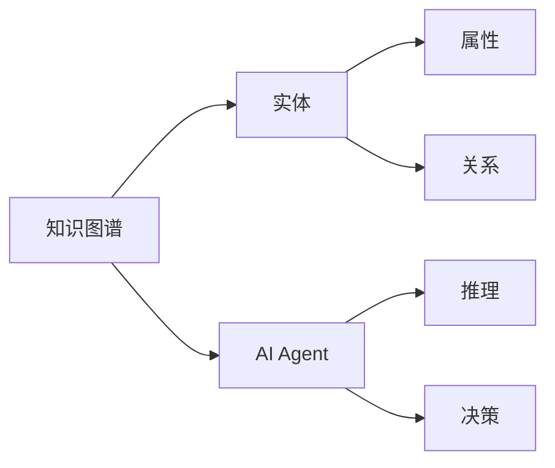
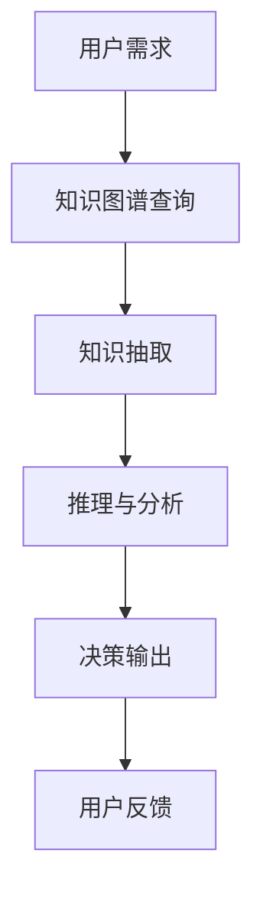

                 

# AI Agent的知识图谱集成方案

> 关键词：AI Agent, 知识图谱, 智能代理, 知识表示, 图谱推理, 系统架构

> 摘要：本文章详细探讨了AI Agent与知识图谱集成的核心概念、算法原理、系统架构及实际应用。通过对比分析和案例研究，展示了知识图谱如何赋能AI Agent的智能推理与决策能力，构建了一个完整的集成方案，并给出了实际项目实施的最佳实践。

---

## 第一部分：AI Agent与知识图谱集成的背景与核心概念

### 第1章：知识图谱与AI Agent的集成背景

#### 1.1 知识图谱的基本概念
- **定义**：知识图谱是一种以图结构形式表示知识的语义网络，由节点（实体）和边（关系）组成。
- **核心特征**：
  - 表示形式化：通过结构化的数据描述实体及其关系。
  - 可扩展性：支持动态添加新知识。
  - 语义关联性：通过关系建立实体间的语义联系。
- **构建流程**：
  1. 数据采集与预处理：从多种数据源提取信息。
  2. 实体识别与链接：识别实体并建立唯一标识。
  3. 关系抽取：挖掘实体之间的关系。
  4. 知识融合：整合多源数据，消除冲突。
  5. 知识存储与管理：使用数据库或图数据库存储。

#### 1.2 AI Agent的基本概念
- **定义**：AI Agent是能够感知环境、执行任务并做出决策的智能实体。
- **分类**：
  - 软件Agent：基于规则的或基于模型的。
  - 物理Agent：具有物理交互能力，如自动驾驶汽车。
- **核心功能**：
  - 感知环境：通过传感器或数据源获取信息。
  - 计划与推理：基于知识库制定行动方案。
  - 执行任务：通过动作改变环境状态。
  - 学习与适应：通过反馈优化行为。

#### 1.3 知识图谱与AI Agent的集成背景
- **集成的必要性**：
  - 知识图谱为AI Agent提供结构化的知识表示，增强语义理解能力。
  - AI Agent利用知识图谱进行推理和决策，提升智能水平。
- **发展趋势**：
  - 知识图谱的规模不断扩大，覆盖更多领域。
  - AI Agent的应用场景逐渐从简单任务扩展到复杂决策。

---

### 第2章：知识图谱与AI Agent的核心概念

#### 2.1 知识图谱的构建与管理
- **知识抽取与表示**：
  - 实体识别：使用NLP技术从文本中提取实体。
  - 关系抽取：识别实体间的关联关系。
  - 知识表示：使用RDF或OWL等语义标记语言表示知识。
- **知识融合与推理**：
  - 知识融合：将多源数据整合，消除冲突。
  - 推理机制：基于逻辑推理或概率推理，推导隐含知识。
- **知识存储与检索**：
  - 数据库选择：使用图数据库（如Neo4j）存储知识图谱。
  - 检索方法：支持基于关键词或语义的检索。

#### 2.2 AI Agent的智能推理与决策
- **基于知识图谱的推理机制**：
  - 实例推理：从具体实例中推导一般规则。
  - 演绎推理：从一般知识推导具体结论。
  - 归纳推理：从具体实例中归纳一般规律。
- **知识图谱驱动的决策过程**：
  - 知识图谱作为决策的知识基础，提供上下文信息。
  - 结合实时数据和历史数据，生成最优决策。
- **AI Agent的自适应能力**：
  - 动态更新知识库：根据反馈优化知识表示。
  - 自我学习：通过强化学习改进决策策略。

#### 2.3 知识图谱与AI Agent的关联性分析
- **知识图谱作为AI Agent的知识库**：
  - 提供结构化的知识表示，支持语义理解。
  - 通过图结构进行关联推理，增强决策能力。
- **AI Agent作为知识图谱的使用者**：
  - 利用知识图谱进行信息检索和推理。
  - 支持复杂场景下的智能决策。
- **两者结合的协同效应**：
  - 知识图谱为AI Agent提供知识基础，增强智能水平。
  - AI Agent通过实际应用反哺知识图谱，优化知识表示。

---

### 第3章：知识图谱与AI Agent的核心概念对比与联系

#### 3.1 知识图谱与AI Agent的核心概念对比
- **知识图谱的属性特征**：
  - 强调知识的结构化表示。
  - 注重实体间的关系和语义关联。
- **AI Agent的功能特性**：
  - 强调智能行为和动态决策。
  - 注重与环境的交互和反馈。
- **两者在功能与结构上的差异**：
  - 知识图谱是静态的知识表示，AI Agent是动态的智能实体。
  - 知识图谱提供知识基础，AI Agent利用知识进行推理和决策。

#### 3.2 知识图谱与AI Agent的实体关系图

#### 3.3 知识图谱与AI Agent的协同工作流程

---

## 第4章：知识图谱与AI Agent的数学模型与算法原理

### 4.1 知识图谱的构建算法
- **基于统计的实体识别算法**：
  - 使用条件随机场（CRF）模型进行命名实体识别。
  - 示例：识别句子中的“人名”、“地名”等实体。
- **基于深度学习的关系抽取**：
  - 使用双向LSTM进行序列标注，抽取实体间的关系。
  - 示例：从句子中识别出“公司-总部位于-城市”的关系。

### 4.2 AI Agent的推理与决策算法
- **基于知识图谱的推理机制**：
  - 使用图遍历算法（如BFS、DFS）进行知识推理。
  - 示例：在知识图谱中找到从起点到目标的最短路径。
- **概率推理模型**：
  - 使用贝叶斯网络进行概率推理，计算事件发生的概率。
  - 示例：根据天气、交通状况，计算迟到的概率。

### 4.3 知识图谱驱动的决策流程
- **数学模型**：
  - 知识图谱中的关系可以表示为图结构，节点表示为向量。
  - 使用图神经网络（GNN）进行节点嵌入，计算相似性。
  - 示例：使用GAT（Graph Attention Network）进行关系推理。

---

## 第5章：知识图谱与AI Agent的系统架构与项目实战

### 5.1 系统功能设计
- **领域模型设计**：
  - 使用Mermaid类图描述系统模块及其交互。
  - 示例：知识抽取模块、推理模块、决策模块。
- **系统架构设计**：
  - 使用分层架构，前端、后端、数据库。
  - 示例：前端接收用户查询，后端处理推理，数据库存储知识图谱。
- **系统接口设计**：
  - 定义RESTful API接口，如`/api/query`用于知识查询。
  - 示例：前端通过API调用后端进行推理。

### 5.2 项目实战
- **环境安装**：
  - 安装Python、TensorFlow、Keras、Neo4j等工具。
- **核心代码实现**：
  - 知识抽取模块：使用spaCy进行实体识别。
  - 推理模块：使用图神经网络进行推理。
- **代码解读与分析**：
  - 展示关键代码段，解释其功能。
  - 示例：展示如何构建知识图谱的边和节点。

### 5.3 案例分析与详细讲解
- **实际案例分析**：
  - 例如，在智能客服系统中，AI Agent利用知识图谱进行问题推理和解答。
- **详细讲解**：
  - 展示系统如何处理用户查询，进行知识推理，生成回答。

---

## 第6章：总结与展望

### 6.1 最佳实践 tips
- 知识图谱的构建需要选择合适的数据源和算法。
- AI Agent的设计需要考虑系统的可扩展性和可维护性。
- 系统部署时，需要考虑性能优化和安全性。

### 6.2 小结
- 知识图谱与AI Agent的集成能够显著提升智能系统的知识表示和推理能力。
- 通过构建高效的系统架构和优化算法，可以实现更智能的AI Agent。

### 6.3 注意事项
- 知识图谱的规模和复杂性可能影响系统的性能。
- 需要考虑数据的实时更新和系统的动态调整。
- 确保系统的安全性和数据隐私。

### 6.4 拓展阅读
- 推荐阅读《知识图谱：概念、方法与应用》。
- 推荐学习图神经网络的相关论文和教程。

---

通过以上内容，我们可以看到，知识图谱与AI Agent的集成是一个复杂但极具潜力的领域。通过系统的构建和优化，AI Agent能够更好地理解和处理复杂问题，为实际应用带来更智能的解决方案。

