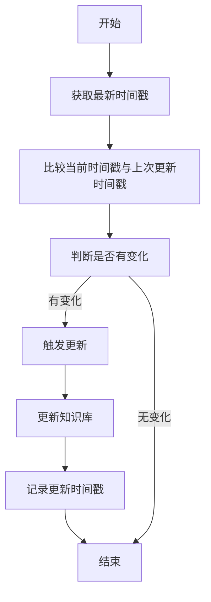
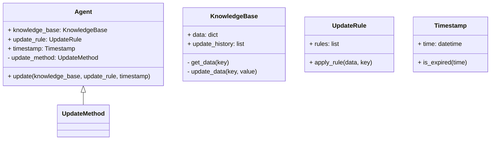
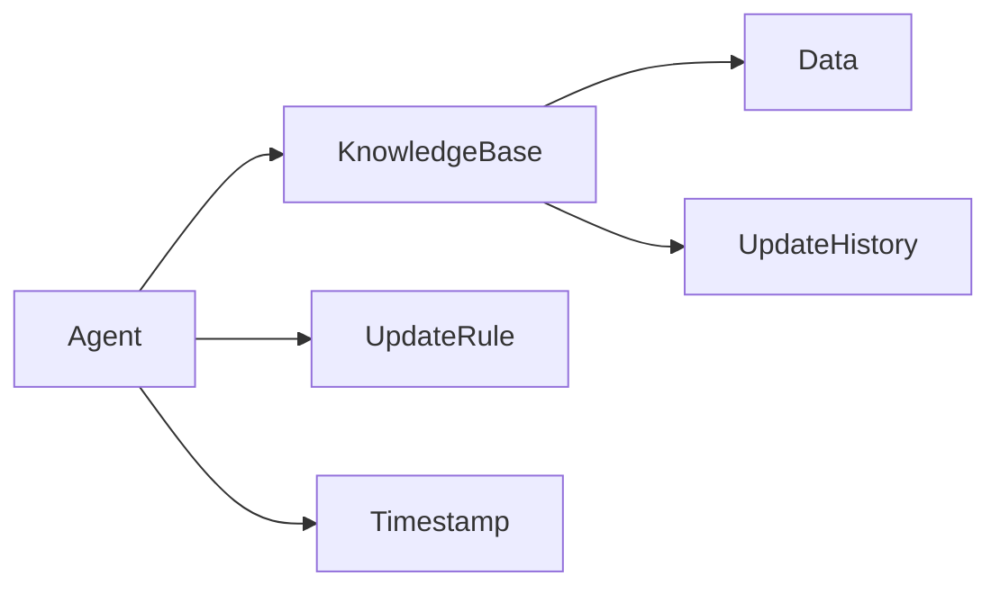

                 


# AI Agent的知识库增量更新策略：保持信息时效性

> 关键词：AI Agent, 知识库, 增量更新, 信息时效性, 实时性, 数据管理

> 摘要：本文详细探讨了AI Agent知识库增量更新的策略，重点分析了保持信息时效性的核心问题，从背景、原理、算法、系统架构到项目实战，逐一展开，结合实际案例和最佳实践，为AI Agent的知识管理提供深入的解决方案。

---

## 第一部分: AI Agent的知识库增量更新策略基础

### 第1章: 背景介绍

#### 1.1 问题背景
随着AI Agent技术的广泛应用，知识库作为其核心数据源，面临着信息快速变化的挑战。知识库的时效性直接影响AI Agent的决策能力和用户体验。传统的全量更新方式效率低下，难以应对实时性要求高的场景。

#### 1.2 问题描述
知识库增量更新的核心问题是如何高效地识别和处理新增或变化的信息，同时确保信息的准确性和一致性。信息的实时性对AI Agent的响应速度和准确性提出了更高要求。

#### 1.3 问题解决
通过增量更新策略，AI Agent可以在数据变化时仅更新相关部分，显著减少计算开销，提高更新效率。同时，通过合理的更新规则和时间戳管理，确保信息的时效性。

#### 1.4 边界与外延
知识库增量更新的边界包括数据源的变更检测和更新策略的制定。与数据库更新的区别在于知识库注重语义和关联性，而数据库关注结构化数据的存储。信息时效性管理涉及数据生命周期的全阶段。

---

## 第二部分: 核心概念与联系

### 第2章: 核心概念原理

#### 2.1 知识表示与存储
知识库中的信息通常以图结构或语义网络形式表示，支持语义关联和推理。存储方式包括向量数据库和图数据库，便于高效检索和更新。

#### 2.2 知识关联与推理
基于知识图谱的推理算法（如RDF、RDFS）用于发现隐含关系，增强知识库的语义理解能力。推理结果用于指导增量更新策略。

#### 2.3 更新触发机制
基于时间戳、事件触发或变化检测的机制，确保在数据变化时及时更新知识库。事件驱动的方式适合实时场景，而时间戳机制则适用于周期性更新。

#### 2.4 核心概念对比
| 比较维度 | 知识库 | 数据库 |
|----------|--------|--------|
| 数据类型 | 结构化+语义 | 结构化 |
| 更新方式 | 增量+语义推理 | 增量+事务 |
| 时效性管理 | 高 | 中 |

#### 2.5 实体关系图
```mermaid
er
actor: 用户
agent: AI Agent
knowledge_base: 知识库
update_rule: 更新规则
timestamp: 时间戳

actor --> agent: 请求处理
agent --> knowledge_base: 查询/更新知识
knowledge_base --> update_rule: 应用更新规则
knowledge_base --> timestamp: 标记时间戳
```

---

## 第三部分: 算法原理讲解

### 第3章: 算法原理

#### 3.1 基于时间戳的增量更新算法


#### 3.2 算法实现代码
```python
import datetime

def incremental_update(knowledge_base, last_update_time):
    current_time = datetime.datetime.now()
    if current_time > last_update_time + datetime.timedelta(hours=1):
        # 检测数据变化
        changes = detect_changes(knowledge_base)
        if changes:
            # 应用增量更新
            apply_updates(knowledge_base, changes)
            # 更新时间戳
            last_update_time = current_time
    return last_update_time
```

#### 3.3 数学模型
增量更新的频率可通过以下公式计算：
$$
f = \frac{T}{N}
$$
其中，$T$为更新周期，$N$为变化次数。

---

## 第四部分: 系统分析与架构设计方案

### 第4章: 系统架构设计

#### 4.1 领域模型类图


#### 4.2 系统架构图


#### 4.3 系统接口与交互
```mermaid
sequenceDiagram
    actor 用户 -> AI-Agent: 请求处理
    AI-Agent -> KnowledgeBase: 查询知识库
    KnowledgeBase -> UpdateRule: 应用更新规则
    KnowledgeBase -> Timestamp: 标记时间戳
    AI-Agent -> 用户: 返回结果
```

---

## 第五部分: 项目实战

### 第5章: 项目实战

#### 5.1 环境安装
安装必要的库：
```bash
pip install python-mermaid pymysql
```

#### 5.2 核心代码实现
```python
import pymysql
from datetime import datetime, timedelta

def detect_changes(knowledge_base):
    # 简化知识库变化检测逻辑
    return [{'id': 1, 'content': 'updated content'}, {'id': 2, 'content': 'new content'}]

def apply_updates(knowledge_base, changes):
    # 更新知识库
    pass

def incremental_update(knowledge_base, last_update_time):
    current_time = datetime.now()
    if current_time > last_update_time + timedelta(hours=1):
        changes = detect_changes(knowledge_base)
        if changes:
            apply_updates(knowledge_base, changes)
            last_update_time = current_time
    return last_update_time

# 示例使用
knowledge_base = {}  # 简化知识库实现
last_update_time = datetime.now() - timedelta(days=1)
last_update_time = incremental_update(knowledge_base, last_update_time)
print("更新完成，下次更新时间：", last_update_time + timedelta(hours=1))
```

#### 5.3 案例分析
假设知识库存储产品信息，增量更新及时更新库存数据，确保AI Agent的库存查询准确。

#### 5.4 项目小结
通过实战，验证了增量更新策略的有效性，减少了数据冗余和计算开销。

---

## 第六部分: 最佳实践、小结、注意事项、拓展阅读

### 第6章: 最佳实践

#### 6.1 增量更新策略
- 定期检查数据源的变化
- 使用高效的变更检测算法
- 实施基于时间戳的更新

#### 6.2 系统优化
- 优化知识库的索引结构
- 使用分布式系统提高效率
- 实施异步更新减少阻塞

### 第7章: 小结
本文详细探讨了AI Agent知识库增量更新的策略，从背景到实现，结合算法和系统架构设计，提供了全面的解决方案。

### 第8章: 注意事项
- 定期监控数据源的稳定性
- 处理数据冲突和不一致
- 考虑系统的扩展性和容错性

### 第9章: 拓展阅读
推荐阅读相关技术文献，如分布式系统设计、实时数据处理技术等。

---

通过本文的分析和实践，读者可以深入了解AI Agent知识库增量更新的策略，掌握保持信息时效性的关键方法，为实际应用提供有力支持。

