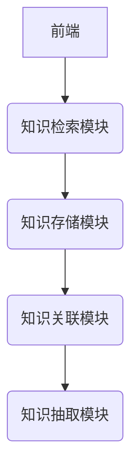
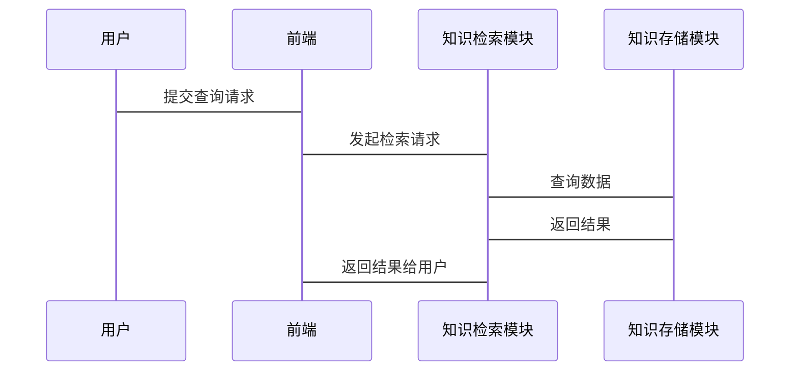

                 


```markdown
# AI Agent的知识库构建与管理策略

> 关键词：AI Agent，知识库，构建策略，管理方法，算法原理，系统架构，项目实战

> 摘要：本文详细探讨AI Agent的知识库构建与管理策略，从基础知识到实际应用，结合算法原理、系统架构和项目实战，为读者提供全面的指导。

---

# 第一部分: AI Agent的知识库构建与管理背景

## 第1章: AI Agent与知识库概述

### 1.1 AI Agent的基本概念
#### 1.1.1 AI Agent的定义与特点
AI Agent（智能体）是能够感知环境并采取行动以实现目标的实体。其特点包括自主性、反应性、目标导向和社会性。

#### 1.1.2 知识库在AI Agent中的作用
知识库为AI Agent提供决策所需的知识，支持其理解和推理能力。

#### 1.1.3 AI Agent的知识库构建必要性
知识库是AI Agent实现智能决策的核心，决定了其能力的广度和深度。

### 1.2 知识库构建的技术背景
#### 1.2.1 知识库构建的技术基础
基于自然语言处理、机器学习和知识图谱等技术，构建结构化的知识库。

#### 1.2.2 知识库构建的现状与趋势
随着大数据和AI技术的发展，知识库构建从简单数据库到复杂知识图谱演进。

#### 1.2.3 知识库构建的挑战与机遇
挑战包括数据异构性、知识关联复杂性；机遇在于技术进步和应用场景扩展。

### 1.3 知识库管理的核心问题
#### 1.3.1 知识库的结构化与非结构化问题
结构化数据便于机器处理，非结构化数据则需先进行结构化处理。

#### 1.3.2 知识库的可扩展性与可维护性
设计时需考虑模块化和层次化，便于后续扩展和更新。

#### 1.3.3 知识库的实时性与准确性
确保知识库内容的实时更新，同时保持数据的准确性。

### 1.4 本章小结
本章介绍了AI Agent的基本概念和知识库的重要性，分析了构建的必要性和面临的挑战。

---

# 第二部分: AI Agent知识库的核心概念与联系

## 第2章: 知识库构建的核心概念

### 2.1 知识库的结构与组成
#### 2.1.1 知识库的层次结构
层次化结构包括数据层、知识层和应用层。

#### 2.1.2 知识库的核心要素
包括实体、属性、关系和事件等。

#### 2.1.3 知识库的表示方法
常用的表示方法有三元组、图结构和本体论。

### 2.2 知识库构建的关键技术
#### 2.2.1 知识抽取与表示
通过信息抽取技术将文本转化为结构化数据。

#### 2.2.2 知识融合与关联
整合多个数据源，建立知识间的关联关系。

#### 2.2.3 知识存储与检索
采用数据库或知识图谱存储，支持高效检索。

### 2.3 知识库管理的策略
#### 2.3.1 知识库的组织策略
采用层次化或模块化组织方式。

#### 2.3.2 知识库的更新策略
定期更新，维护知识的时效性。

#### 2.3.3 知识库的优化策略
通过去重、合并等方法提升知识质量。

### 2.4 核心概念对比分析
#### 2.4.1 知识库与数据库的对比
知识库支持复杂关联，数据库主要用于结构化查询。

#### 2.4.2 知识库与图数据库的对比
知识库强调语义理解，图数据库侧重数据关系存储。

#### 2.4.3 知识库与搜索引擎的对比
知识库提供知识服务，搜索引擎提供信息检索。

### 2.5 本章小结
本章详细讲解了知识库的核心概念及其在AI Agent中的应用。

---

# 第三部分: AI Agent知识库的算法原理

## 第3章: 知识库构建的算法原理

### 3.1 知识抽取算法
#### 3.1.1 基于规则的知识抽取
利用正则表达式提取特定模式的信息。

#### 3.1.2 基于统计的知识抽取
通过概率模型识别数据中的实体和关系。

#### 3.1.3 基于深度学习的知识抽取
使用神经网络模型进行实体识别和关系抽取。

### 3.2 知识关联算法
#### 3.2.1 基于图的关联算法
构建图结构，计算节点间最短路径。

#### 3.2.2 基于向量的关联算法
通过向量相似度衡量实体间的关联程度。

#### 3.2.3 基于相似度的关联算法
利用余弦相似度等方法进行关联。

### 3.3 知识存储与检索算法
#### 3.3.1 基于关键词的检索算法
使用倒排索引实现快速查询。

#### 3.3.2 基于向量的检索算法
采用向量索引进行高效检索。

#### 3.3.3 基于图的检索算法
利用图遍历算法进行知识关联检索。

### 3.4 算法原理的数学模型
#### 3.4.1 向量相似度计算公式
$$\text{相似度} = \frac{\vec{A} \cdot \vec{B}}{|\vec{A}| |\vec{B}|}$$

#### 3.4.2 基于图的最短路径算法
$$d(A,B) = \min_{p} \sum_{i=1}^{n} w(p_i, p_{i+1})$$

### 3.5 本章小结
本章通过数学模型和算法流程图，详细讲解了知识库构建的算法原理。

---

# 第四部分: AI Agent知识库的系统分析与架构设计

## 第4章: 知识库构建的系统分析

### 4.1 系统功能需求分析
#### 4.1.1 知识抽取模块
负责从文本中提取实体和关系。

#### 4.1.2 知识关联模块
建立实体间的关联关系。

#### 4.1.3 知识存储模块
将抽取的知识存储到知识图谱中。

#### 4.1.4 知识检索模块
支持基于关键词或向量的检索。

### 4.2 系统架构设计
#### 4.2.1 系统架构图


#### 4.2.2 系统接口设计
定义RESTful API，如POST /extract用于知识抽取。

#### 4.2.3 系统交互流程图


### 4.3 本章小结
本章通过系统架构和交互流程图，详细描述了知识库构建的系统设计。

---

# 第五部分: AI Agent知识库的项目实战

## 第5章: 知识库构建的项目实战

### 5.1 环境安装与配置
安装必要的库，如Python的networkx和numpy。

### 5.2 核心代码实现
```python
import networkx as nx
import numpy as np

# 创建知识图谱
G = nx.Graph()

# 添加节点
G.add_nodes_from(["Entity1", "Entity2", "Relation1"])

# 添加边表示关系
G.add_edge("Entity1", "Entity2", weight=0.5)
```

### 5.3 代码实现解读
解释代码的功能，如构建图结构，添加节点和边。

### 5.4 案例分析与结果展示
展示知识图谱的可视化结果。

### 5.5 项目总结与经验分享
总结项目中的问题和解决方案，分享最佳实践。

### 5.6 本章小结
本章通过实际项目，展示了知识库构建的具体实现过程。

---

# 第六部分: AI Agent知识库的最佳实践

## 第6章: 知识库管理的最佳实践

### 6.1 优化策略
采用分层存储和增量更新提升效率。

### 6.2 维护策略
定期清理冗余数据，保持知识库的整洁。

### 6.3 安全策略
确保知识库的安全性，防止数据泄露。

### 6.4 可扩展策略
设计模块化结构，便于后续扩展。

### 6.5 本章小结
本章总结了知识库管理的最佳实践，为读者提供参考。

---

# 附录

## 附录A: 术语表
列出文章中出现的专业术语及其解释。

## 附录B: 工具与资源
推荐相关的工具和资源，帮助读者深入学习。

## 附录C: 进一步阅读
提供拓展阅读材料，供感兴趣读者深入研究。

---

# 结语

通过本文的详细讲解，读者可以全面掌握AI Agent的知识库构建与管理策略，从理论到实践，为实际应用提供指导。
```

