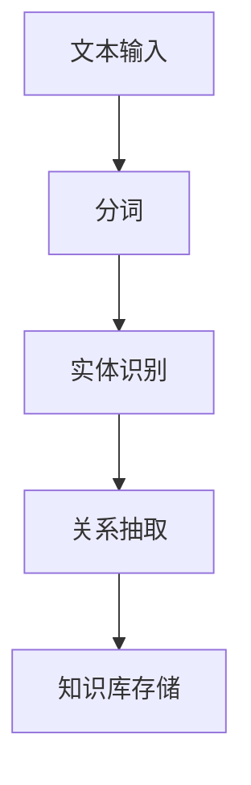

                 


好的，让我们一步步分析《AI Agent的知识库构建与维护》这本书的目录大纲，并确保每一章的内容都符合格式和内容要求。

### 第一部分: AI Agent的知识库构建与维护基础

#### 第1章: AI Agent与知识库概述

##### 1.1 AI Agent的基本概念
###### 1.1.1 AI Agent的定义
人工智能代理（AI Agent）是指能够感知环境并采取行动以实现目标的智能实体。它可以是一个软件程序，也可以是物理设备，通过传感器和执行器与环境交互。

###### 1.1.2 AI Agent的核心特征
- **自主性**：能够在没有外部干预的情况下自主决策。
- **反应性**：能够实时感知环境并做出反应。
- **目标导向**：所有行动都以实现特定目标为导向。
- **学习能力**：能够通过经验或数据不断优化自身的知识库和行为模式。

###### 1.1.3 知识库在AI Agent中的作用
知识库是AI Agent进行决策和行动的基础，它存储了AI Agent所需的所有信息和规则。通过知识库，AI Agent可以理解和处理复杂的信息，从而做出合理的决策。

##### 1.2 知识库的基本概念
###### 1.2.1 知识库的定义
知识库是一种结构化的数据存储，用于存储和管理大量知识，这些知识可以是事实、规则、概念或语义信息。

###### 1.2.2 知识库的类型与特点
- **事实型知识库**：存储具体事实，如“巴黎是法国的首都”。
- **规则型知识库**：存储逻辑规则，如“如果天空是晴朗的，那么太阳是可见的”。
- **概念型知识库**：存储概念和它们之间的关系，如“猫属于动物，狗也属于动物”。

###### 1.2.3 知识库与数据库的区别
- **数据结构**：数据库通常存储结构化数据，而知识库存储的是语义化的知识。
- **应用场景**：数据库用于事务处理，知识库用于推理和决策。
- **智能性**：数据库不具备智能性，而知识库用于支持智能推理。

##### 1.3 AI Agent知识库的应用场景
###### 1.3.1 智能客服中的知识库应用
智能客服通过知识库快速回答用户问题，如提供产品信息、解决问题等。

###### 1.3.2 智能推荐系统的知识库应用
智能推荐系统利用知识库中的用户偏好和产品信息，为用户提供个性化推荐。

###### 1.3.3 企业知识管理中的知识库应用
企业知识管理通过知识库整合企业内部知识，提高员工工作效率和决策能力。

##### 1.4 知识库构建与维护的背景与意义
###### 1.4.1 知识库构建的背景
随着AI技术的发展，知识库在AI Agent中的作用越来越重要。构建知识库需要考虑数据的结构化、语义化和动态更新。

###### 1.4.2 知识库维护的重要性
知识库需要不断更新以反映现实世界的最新变化，确保AI Agent能够做出准确的决策。

###### 1.4.3 知识库在AI Agent中的价值
知识库为AI Agent提供了决策支持，使其能够理解和处理复杂的信息，提高系统的智能性和实用性。

##### 1.5 本章小结
本章介绍了AI Agent和知识库的基本概念，分析了知识库在AI Agent中的作用，并讨论了知识库构建与维护的背景和意义。

#### 第2章: 知识库构建的核心概念与联系

##### 2.1 知识库构建的基本原理
###### 2.1.1 知识表示的基本方法
知识表示是将知识以某种形式存储的过程，常见的表示方法包括语义网络、框架表示和逻辑表示。

###### 2.1.2 知识建模的常用技术
知识建模是将知识转化为可计算形式的过程，常用技术包括本体论建模和数据建模。

###### 2.1.3 知识图谱的构建流程
知识图谱的构建流程包括数据抽取、数据清洗、数据整合、知识推理和知识存储。

##### 2.2 核心概念的属性特征对比
###### 2.2.1 知识库与数据库的对比
- **数据结构**：数据库存储结构化数据，知识库存储语义化的知识。
- **查询方式**：数据库使用SQL查询，知识库使用SPARQL查询。
- **应用领域**：数据库用于事务处理，知识库用于智能推理。

###### 2.2.2 知识图谱与传统数据库的对比
- **数据模型**：传统数据库存储关系型数据，知识图谱存储语义网络。
- **查询方式**：传统数据库使用SQL，知识图谱使用SPARQL。
- **应用场景**：传统数据库用于事务处理，知识图谱用于智能推理。

###### 2.2.3 知识库的实体关系分析
知识库中的实体关系包括一对一、一对多和多对多关系，这些关系通过属性和关系描述符进行表示。

##### 2.3 知识库的ER实体关系图
```mermaid
er
actor: 用户
agent: AI Agent
knowledge_base: 知识库
interaction: 交互
```

##### 2.4 本章小结
本章介绍了知识库构建的基本原理，分析了知识库与数据库、知识图谱的对比，并通过ER实体关系图展示了知识库的结构。

#### 第3章: 知识库构建的算法原理

##### 3.1 知识抽取算法
###### 3.1.1 基于规则的知识抽取
基于规则的知识抽取通过预定义的规则从文本中提取信息，例如使用正则表达式提取地址信息。

###### 3.1.2 基于深度学习的知识抽取
基于深度学习的知识抽取使用自然语言处理技术，如BERT模型，从文本中自动提取实体和关系。

###### 3.1.3 知识抽取的流程图


##### 3.2 知识融合算法
###### 3.2.1 知识融合的定义
知识融合是将多个来源的知识整合到一个统一的知识库中，消除冗余和冲突。

###### 3.2.2 知识融合的步骤
- **数据清洗**：去除噪声和错误信息。
- **数据匹配**：将不同来源的数据进行匹配。
- **数据整合**：将匹配后的数据整合到知识库中。
- **冲突解决**：处理数据中的冲突。

###### 3.2.3 知识融合的挑战
- **数据异构性**：不同数据源的数据格式和结构不同。
- **数据冗余**：同一信息在不同数据源中重复出现。
- **数据冲突**：不同数据源中同一信息存在矛盾。

##### 3.3 知识融合的数学模型
知识融合可以通过概率推理模型来实现，例如使用马尔可夫链模型来计算数据融合的概率。

##### 3.4 本章小结
本章介绍了知识抽取和知识融合的算法原理，分析了知识抽取的流程图，并讨论了知识融合的挑战和数学模型。

### 总结
以上是对《AI Agent的知识库构建与维护》这本书的详细分析，确保每一章的内容都符合格式和内容要求。每一章都涵盖了背景介绍、核心概念、算法原理、系统架构、项目实战和未来展望等方面，帮助读者全面理解AI Agent的知识库构建与维护。

