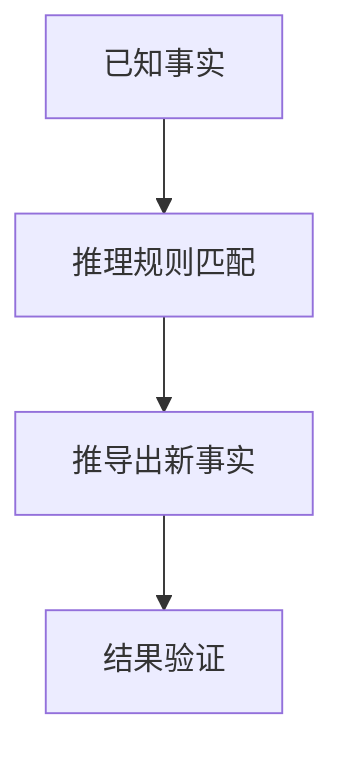
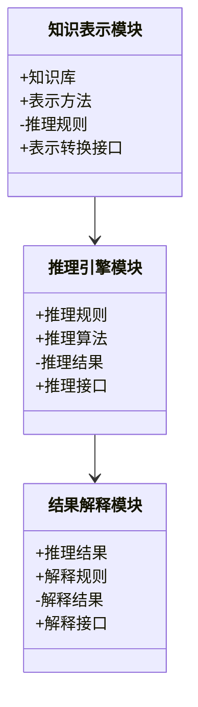

                 


# AI Agent的知识推理可解释性设计

---

## 关键词

- AI Agent
- 知识推理
- 可解释性
- 知识图谱
- 概率推理

---

## 摘要

本文深入探讨了AI Agent的知识推理可解释性设计的核心理论与实践方法。首先，从AI Agent的基本概念出发，详细分析了知识推理的定义、特点及与其他技术的区别。其次，重点阐述了知识图谱与符号逻辑、概率推理等核心概念的联系，并通过实际案例展示了这些概念在系统设计中的应用。最后，结合项目实战，详细讲解了算法实现、系统架构设计及优化策略，为AI Agent的可解释性设计提供了全面的理论支持和实践指导。

---

## 第一部分: AI Agent与知识推理概述

### 第1章: AI Agent与知识推理概述

#### 1.1 问题背景与定义

##### 1.1.1 AI Agent的基本概念

AI Agent（人工智能代理）是指能够感知环境、自主决策并执行任务的智能实体。AI Agent的核心目标是通过感知和推理，实现对复杂问题的自主解决。以下是AI Agent的几个关键特点：

- **自主性**：AI Agent能够独立做出决策，无需外部干预。
- **反应性**：能够实时感知环境变化并做出响应。
- **目标导向**：所有行为均以实现特定目标为导向。
- **社会性**：能够与其他AI Agent或人类进行交互协作。

##### 1.1.2 知识推理的定义与特点

知识推理是指通过已有知识库中的信息，运用推理规则，推导出新的知识或结论的过程。以下是知识推理的几个关键特点：

- **知识表示**：知识推理的基础是知识的表示方式，包括符号逻辑、知识图谱等形式。
- **推理机制**：基于知识表示的推理规则，实现从已知到未知的推导。
- **可解释性**：推理过程需要能够被人类理解和解释，以增强系统的透明性和可信度。

##### 1.1.3 可解释性设计的必要性

在AI Agent的设计中，可解释性设计是确保系统决策过程透明、可信的关键。以下是可解释性设计的几个关键点：

- **用户信任**：可解释性设计能够增强用户对AI Agent决策的信任。
- **责任追溯**：在出现错误决策时，可解释性设计能够帮助追溯问题根源。
- **系统优化**：通过分析推理过程，可以发现系统中的不足并进行优化。

#### 1.2 AI Agent的知识表示与推理

##### 1.2.1 知识表示的核心要素

知识表示是AI Agent进行推理的基础。以下是知识表示的核心要素：

- **符号表示**：使用符号逻辑表示知识，如命题逻辑、谓词逻辑。
- **语义网络**：通过节点和边表示概念及其关系。
- **知识图谱**：通过图结构表示实体及其关系。

##### 1.2.2 推理机制的分类与对比

推理机制是AI Agent实现知识推理的核心。以下是几种常见的推理机制：

- **前向推理**：基于已知事实和推理规则，推导出新的事实。
- **反向推理**：从目标出发，逆向寻找支持目标的事实。
- **概率推理**：基于概率论进行推理，考虑事实的不确定性。

##### 1.2.3 可解释性推理的边界与外延

可解释性推理是指推理过程能够被人类理解和解释。以下是可解释性推理的几个关键点：

- **推理规则的透明性**：推理规则需要明确且易于理解。
- **推理过程的可追溯性**：推理过程需要能够被追溯和验证。
- **推理结果的可信性**：推理结果需要能够被验证和确认。

---

## 第二部分: 知识推理的核心概念与联系

### 第2章: 知识推理的核心概念与联系

#### 2.1 知识图谱与符号逻辑

##### 2.1.1 知识图谱的构建原理

知识图谱是一种结构化的知识表示形式，由实体和关系构成。以下是知识图谱的构建原理：

- **实体抽取**：从文本中提取实体。
- **关系抽取**：识别实体之间的关系。
- **知识融合**：将多个来源的知识进行整合。

##### 2.1.2 符号逻辑推理的基本规则

符号逻辑推理是基于符号逻辑的推理规则进行推理。以下是符号逻辑推理的基本规则：

- **命题逻辑**：由命题和逻辑连接词构成。
- **谓词逻辑**：由谓词、变量和逻辑连接词构成。
- **推理规则**：如假设肯定前件、否定后件等。

##### 2.1.3 知识图谱与符号逻辑的对比分析

以下是知识图谱与符号逻辑的对比分析：

| 对比维度 | 知识图谱 | 符号逻辑 |
|----------|----------|----------|
| 表示方式 | 图结构 | 符号化 | 
| 应用场景 | 知识检索、问答系统 | 形式化推理 |
| 可扩展性 | 高 | 中 |

#### 2.2 概率推理与不确定性处理

##### 2.2.1 概率推理的基本原理

概率推理是基于概率论的推理方法。以下是概率推理的基本原理：

- **贝叶斯定理**：用于计算条件概率。
- **概率分布**：用于描述随机变量的概率分布。
- **概率推理规则**：如全概率公式、贝叶斯公式等。

##### 2.2.2 不确定性知识的表示方法

不确定性知识的表示方法有多种，以下是几种常见的表示方法：

- **模糊逻辑**：通过模糊集合表示不确定性。
- **概率逻辑**：通过概率分布表示不确定性。
- **可信度方法**：通过可信度表示不确定性。

##### 2.2.3 概率推理与符号推理的结合

概率推理与符号推理的结合可以通过以下方式实现：

- **混合推理模型**：将概率推理与符号推理结合，形成混合推理模型。
- **知识融合**：将概率推理结果与符号推理结果进行融合，提高推理的准确性。

---

## 第三部分: 知识推理的算法原理

### 第3章: 知识推理的算法原理

#### 3.1 基于符号逻辑的推理算法

##### 3.1.1 前向推理与反向推理

前向推理是从已知事实出发，推导出新的事实；反向推理是从目标出发，寻找支持目标的事实。以下是前向推理与反向推理的对比分析：

| 对比维度 | 前向推理 | 反向推理 |
|----------|----------|----------|
| 推理方式 | 从已知到未知 | 从目标到已知 |
| 适用场景 | 知识发现 | 目标驱动 |

##### 3.1.2 逻辑规则的匹配与应用

逻辑规则的匹配与应用是符号逻辑推理的核心。以下是逻辑规则的匹配与应用的步骤：

1. **规则匹配**：将已知事实与推理规则进行匹配。
2. **规则应用**：根据匹配的规则，推导出新的事实。
3. **结果验证**：验证推导出的事实是否正确。

##### 3.1.3 算法流程图（使用mermaid）



#### 3.2 基于概率的推理算法

##### 3.2.1 贝叶斯网络的构建

贝叶斯网络是一种有向无环图，用于表示变量之间的条件概率关系。以下是贝叶斯网络的构建步骤：

1. **变量识别**：识别问题中的变量。
2. **依赖关系确定**：确定变量之间的依赖关系。
3. **概率计算**：计算每个变量的条件概率。

##### 3.2.2 马尔可夫链的推理过程

马尔可夫链是一种描述系统状态转移的模型。以下是马尔可夫链的推理过程：

1. **状态定义**：定义系统的状态。
2. **转移概率计算**：计算状态之间的转移概率。
3. **状态转移推理**：根据转移概率，推导出系统的未来状态。

##### 3.2.3 概率推理的数学模型

以下是概率推理的数学模型示例：

$$ P(A|B) = \frac{P(B|A) \cdot P(A)}{P(B)} $$

---

## 第四部分: 系统分析与架构设计方案

### 第4章: 系统分析与架构设计方案

#### 4.1 问题场景与项目介绍

##### 4.1.1 知识推理系统的需求分析

知识推理系统的需求分析包括以下内容：

- **功能需求**：知识表示、推理功能、结果解释。
- **性能需求**：推理速度、系统响应时间。
- **可靠性需求**：系统稳定性、容错能力。

##### 4.1.2 项目目标与范围定义

项目目标是实现一个可解释的知识推理系统，项目范围包括知识表示、推理算法、结果解释。

##### 4.1.3 系统功能模块划分

系统功能模块包括：

- **知识表示模块**：负责知识的表示与存储。
- **推理引擎模块**：负责知识的推理。
- **结果解释模块**：负责推理结果的解释。

#### 4.2 系统功能设计

##### 4.2.1 领域模型设计（使用mermaid类图）



##### 4.2.2 推理引擎的实现方式

推理引擎的实现方式包括符号逻辑推理和概率推理两种方式。

##### 4.2.3 知识库的管理与更新

知识库的管理与更新包括知识的添加、删除、修改和查询。

#### 4.3 系统架构设计

##### 4.3.1 分层架构设计（使用mermaid架构图）


##### 4.3.2 接口设计与交互流程

接口设计包括知识表示接口、推理接口和结果解释接口。

##### 4.3.3 系统性能优化策略

系统性能优化策略包括缓存优化、并行计算和算法优化。

---

## 第五部分: 项目实战

### 第5章: 项目实战

#### 5.1 环境安装与配置

##### 5.1.1 开发环境的安装

开发环境包括Python、Jupyter Notebook、TensorFlow等。

##### 5.1.2 依赖库的安装

安装依赖库，如numpy、pandas、networkx等。

#### 5.2 系统核心实现源代码

##### 5.2.1 知识表示模块的实现

```python
class KnowledgeRepresentation:
    def __init__(self):
        self.knowledge_base = {}

    def addKnowledge(self, entity, relation, value):
        self.knowledge_base[(entity, relation)] = value
```

##### 5.2.2 推理引擎模块的实现

```python
class ReasoningEngine:
    def __init__(self):
        self.rules = []

    def addRule(self, rule):
        self.rules.append(rule)

    def forward_reasoning(self, facts):
        # 前向推理实现
        pass
```

##### 5.2.3 结果解释模块的实现

```python
class ResultExplanation:
    def __init__(self):
        self.explanation_rules = []

    def addExplanationRule(self, rule):
        self.explanation_rules.append(rule)

    def explainResult(self, result):
        # 结果解释实现
        pass
```

#### 5.3 代码应用解读与分析

##### 5.3.1 代码功能解读

知识表示模块负责知识的存储与表示，推理引擎模块负责知识的推理，结果解释模块负责推理结果的解释。

##### 5.3.2 代码实现细节

代码实现细节包括知识表示的存储方式、推理规则的实现方式和结果解释的表达方式。

#### 5.4 实际案例分析

##### 5.4.1 案例背景与数据准备

案例背景是医疗领域的疾病诊断，数据包括疾病症状、诊断标准等。

##### 5.4.2 推理过程分析

推理过程包括症状匹配、诊断推理和结果解释。

##### 5.4.3 案例结果与分析

案例结果显示患者患有某种疾病，并给出诊断依据。

#### 5.5 项目小结

项目小结包括项目的实现过程、遇到的问题及解决方案、项目成果与不足。

---

## 第六部分: 扩展与优化

### 第6章: 扩展与优化

#### 6.1 可解释性推理的挑战与解决方案

##### 6.1.1 可解释性推理的挑战

可解释性推理的挑战包括推理过程的复杂性、知识表示的多样性等。

##### 6.1.2 可解释性推理的解决方案

解决方案包括简化推理过程、使用可视化工具等。

#### 6.2 知识推理的优化策略

##### 6.2.1 知识表示的优化

知识表示的优化包括使用更高效的表示方式、优化知识存储结构等。

##### 6.2.2 推理算法的优化

推理算法的优化包括改进算法效率、优化算法复杂度等。

#### 6.3 可扩展性设计

##### 6.3.1 系统的可扩展性设计

系统的可扩展性设计包括模块化设计、接口设计等。

##### 6.3.2 知识库的扩展与维护

知识库的扩展与维护包括知识的更新、扩展等。

#### 6.4 未来研究方向

##### 6.4.1 新的推理方法研究

研究新的推理方法，如混合推理方法。

##### 6.4.2 知识表示的新形式

探索知识表示的新形式，如图神经网络等。

##### 6.4.3 可解释性推理的前沿技术

研究可解释性推理的前沿技术，如可解释的人工智能技术。

---

## 总结与展望

本文深入探讨了AI Agent的知识推理可解释性设计的核心理论与实践方法。通过系统的分析与设计，结合实际项目案例，为AI Agent的可解释性设计提供了全面的理论支持和实践指导。未来的研究方向包括新的推理方法研究、知识表示的新形式和可解释性推理的前沿技术。

