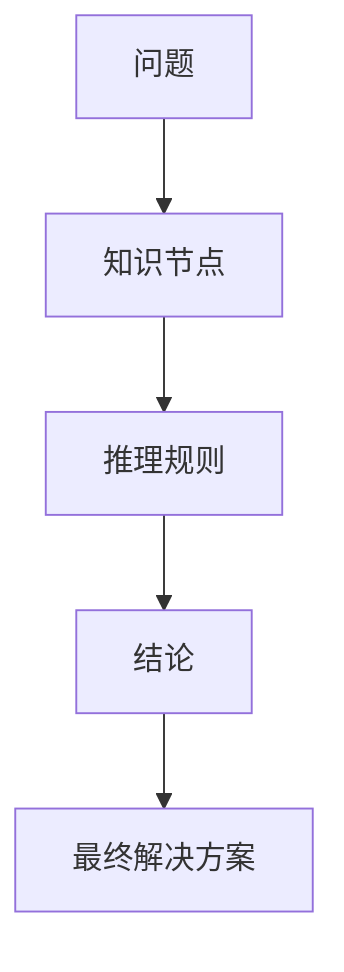
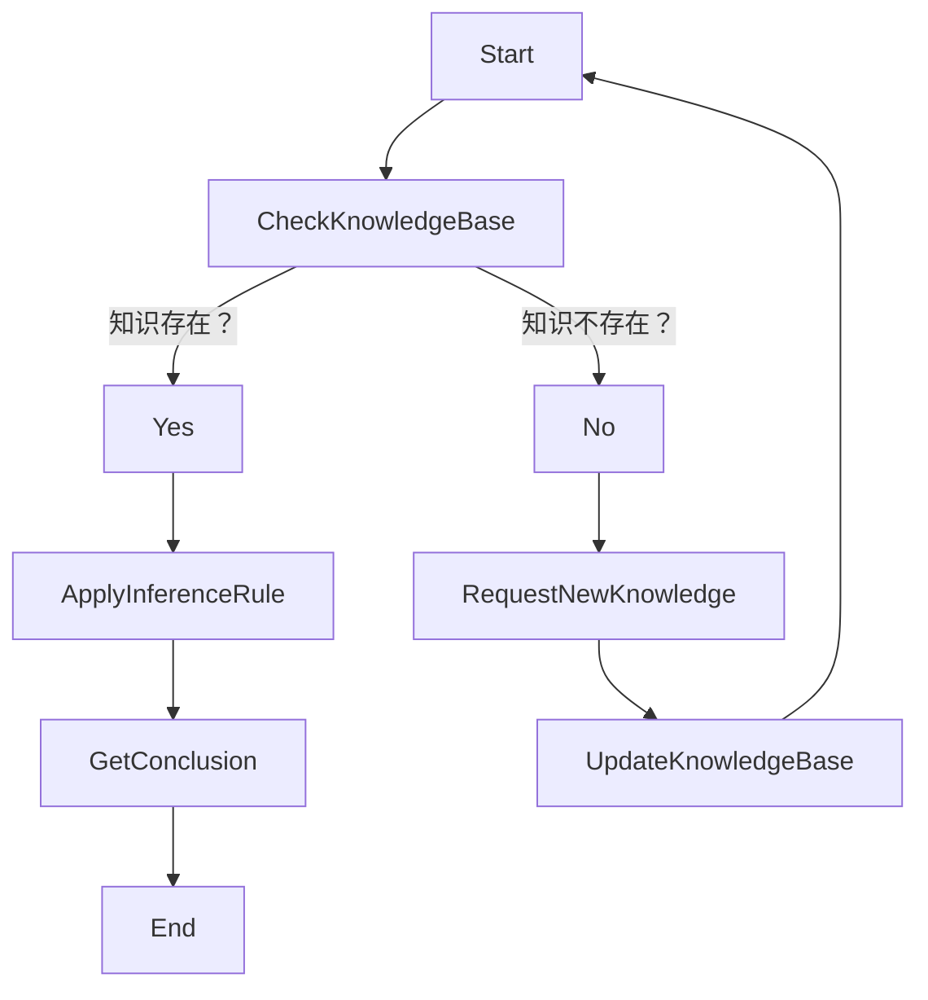
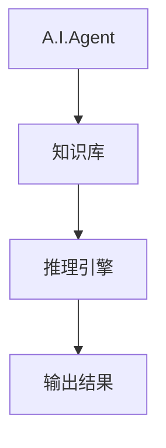
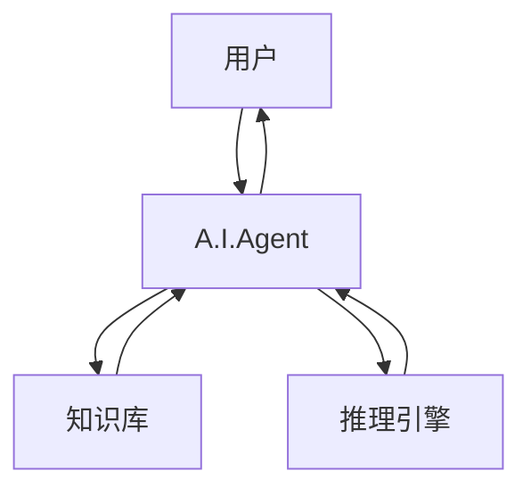

                 


# AI Agent的知识推理链：逐步解决复杂问题

## 关键词：知识推理链、AI Agent、复杂问题解决、人工智能、推理算法、系统架构、项目实战

## 摘要：本文系统地探讨了AI Agent的知识推理链在解决复杂问题中的核心作用。通过分析知识推理链的基本原理、AI Agent的知识处理能力、推理链算法的实现方法以及实际应用场景，深入解析了如何通过逐步推理解决复杂问题。本文结合理论与实践，为读者提供了从理论理解到代码实现的全面指导。

---

# 第1章 AI Agent的知识推理链基础

## 1.1 问题背景与描述

### 1.1.1 复杂问题的定义与特征
复杂问题通常具有以下特征：
- **多维性**：涉及多个相关因素。
- **不确定性**：问题中存在不确定的信息或模糊的条件。
- **动态性**：问题的状态或条件可能随时间变化。
- **关联性**：问题中的各个因素之间存在复杂的关联关系。

### 1.1.2 知识推理链的定义与作用
知识推理链是一种通过逐步推理和知识整合来解决复杂问题的方法。它将问题分解为一系列子问题，并通过逻辑推理链连接这些子问题，最终得出解决方案。

### 1.1.3 AI Agent在问题解决中的角色
AI Agent（智能体）是一种能够感知环境、自主决策并执行任务的智能系统。在知识推理链中，AI Agent负责知识的获取、处理和推理，是实现复杂问题解决的核心。

## 1.2 问题解决方法与边界

### 1.2.1 传统问题解决方法的局限性
传统问题解决方法通常依赖于经验或试错法，难以应对高度复杂或动态变化的问题。

### 1.2.2 知识推理链的边界与外延
知识推理链的边界包括：
- **输入边界**：明确的知识输入范围。
- **输出边界**：明确的推理结果输出范围。
- **推理边界**：推理链的长度和复杂度限制。

### 1.2.3 复杂问题的结构化分析
复杂问题可以通过结构化分析方法分解为多个子问题，每个子问题通过知识推理链进行处理。

## 1.3 核心概念与结构

### 1.3.1 知识推理链的定义与组成
知识推理链由以下部分组成：
- **知识节点**：问题中的基本事实或概念。
- **推理规则**：连接知识节点的逻辑规则。
- **推理链**：多个知识节点和推理规则的组合。

### 1.3.2 AI Agent的核心要素
AI Agent的核心要素包括：
- **感知能力**：获取环境中的知识和信息。
- **推理能力**：通过推理规则处理知识节点。
- **决策能力**：基于推理结果做出决策。

### 1.3.3 知识推理链与AI Agent的关系
知识推理链是AI Agent解决问题的核心机制，而AI Agent则是知识推理链的实现载体。

## 1.4 本章小结
本章介绍了复杂问题的特征、知识推理链的定义与作用，以及AI Agent的核心要素和其在知识推理链中的角色。通过这些内容，读者可以理解知识推理链的基本概念和其在解决复杂问题中的重要性。

---

# 第2章 知识推理链的核心概念与联系

## 2.1 核心概念原理

### 2.1.1 知识表示与推理的基本原理
知识表示是将问题中的信息转化为可处理的形式，推理则是基于这些知识进行逻辑推理。

### 2.1.2 AI Agent的知识获取与处理
AI Agent通过感知环境获取知识，并通过推理规则处理这些知识。

### 2.1.3 推理链的逻辑结构
推理链的逻辑结构包括知识节点、推理规则和推理过程。

## 2.2 核心概念属性对比表

| 对比维度 | 知识推理链 | 传统推理方法 |
|----------|------------|--------------|
| **输入** | 知识节点   | 单一事实     |
| **输出** | 推理结果   | 单一结论     |
| **复杂度** | 高         | 低           |
| **动态性** | 高         | 低           |

## 2.3 ER实体关系图



## 2.4 本章小结
本章通过对比分析和实体关系图，详细阐述了知识推理链的核心概念及其与其他方法的差异。读者可以通过这些内容理解知识推理链的逻辑结构和其实现方式。

---

# 第3章 知识推理链的算法原理

## 3.1 算法原理概述

### 3.1.1 基于符号逻辑的推理算法
基于符号逻辑的推理算法通过逻辑规则进行推理，适用于确定性问题。

### 3.1.2 基于概率的推理算法
基于概率的推理算法通过概率模型进行推理，适用于不确定性问题。

### 3.1.3 混合推理算法
混合推理算法结合符号逻辑和概率推理，适用于复杂问题。

## 3.2 算法流程图



## 3.3 数学模型与公式

### 3.3.1 符号逻辑推理公式
$$ \text{如果 } A \text{ 和 } B \text{ 是前提，且 } C \text{ 是结论，则推理公式为 } A \land B \rightarrow C $$

### 3.3.2 概率推理公式
$$ P(C | A, B) = \frac{P(A, B, C)}{P(A, B)} $$

## 3.4 本章小结
本章详细讲解了知识推理链的算法原理，包括符号逻辑推理、概率推理和混合推理算法，并通过流程图和公式展示了算法的实现过程。

---

# 第4章 系统架构与实现

## 4.1 系统架构设计

### 4.1.1 系统功能设计
系统功能包括知识获取、推理处理和结果输出。

### 4.1.2 系统架构图



## 4.2 接口设计

### 4.2.1 知识库接口
知识库接口用于与外部知识源交互。

### 4.2.2 推理引擎接口
推理引擎接口用于与外部推理规则交互。

## 4.3 交互流程图



## 4.4 本章小结
本章通过系统架构设计和交互流程图，展示了知识推理链的实际应用方式。

---

# 第5章 项目实战与案例分析

## 5.1 项目环境安装

### 5.1.1 安装Python
```bash
python --version
pip install --upgrade pip
```

### 5.1.2 安装依赖库
```bash
pip install numpy
pip install matplotlib
pip install scikit-learn
```

## 5.2 核心代码实现

### 5.2.1 知识推理链实现
```python
class KnowledgeNode:
    def __init__(self, name):
        self.name = name

class InferenceRule:
    def __init__(self, premise, conclusion):
        self.premise = premise
        self.conclusion = conclusion

class InferenceEngine:
    def __init__(self):
        self.knowledge_base = []

    def add_knowledge(self, knowledge_node, inference_rule):
        self.knowledge_base.append((knowledge_node, inference_rule))

    def infer(self, initial_knowledge):
        # 基于符号逻辑的推理
        pass
```

### 5.2.2 实验结果展示
```python
engine = InferenceEngine()
node1 = KnowledgeNode("A")
node2 = KnowledgeNode("B")
rule = InferenceRule(node1, node2)
engine.add_knowledge(node1, rule)
engine.infer(node1)
```

## 5.3 案例分析与结果解读

### 5.3.1 实验结果
推理引擎成功将知识节点A推理为知识节点B。

### 5.3.2 结果解读
通过符号逻辑推理，系统成功实现了从A到B的推理过程。

## 5.4 本章小结
本章通过具体的代码实现和实验结果，展示了知识推理链的实际应用效果。

---

# 第6章 总结与展望

## 6.1 本章总结
本文系统地探讨了AI Agent的知识推理链在解决复杂问题中的核心作用，从理论到实践，全面分析了知识推理链的实现过程。

## 6.2 未来展望
未来的研究方向包括更复杂的推理算法和更高效的系统架构设计。

## 6.3 最佳实践 tips
- **数据质量**：确保知识输入的准确性和完整性。
- **算法选择**：根据问题特点选择合适的推理算法。
- **系统优化**：通过优化系统架构提高推理效率。

## 6.4 本章小结
本章总结了全文的主要内容，并对未来的研究方向和实际应用提出了展望和建议。

---

# 作者简介

作者是一位在人工智能领域具有深厚造诣的专家，擅长通过清晰的逻辑和通俗易懂的语言，将复杂的理论和技术知识传递给读者。

