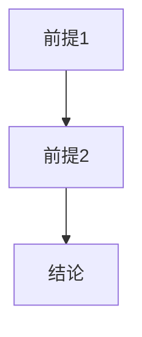
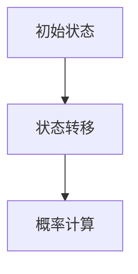
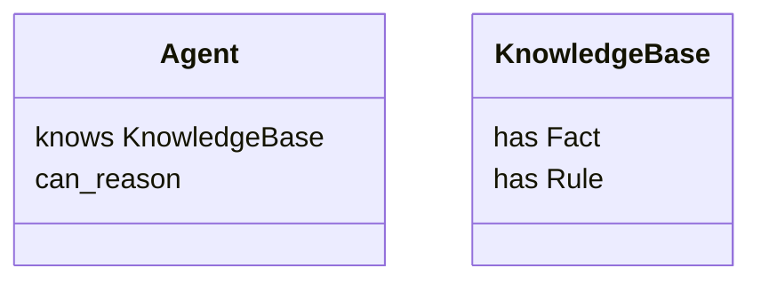
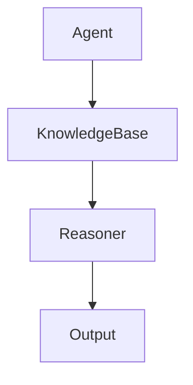

                 


# AI Agent的知识推理：从已知到未知

## 关键词：
- AI Agent
- 知识推理
- 逻辑推理
- 概率推理
- 知识图谱
- 系统设计
- 实践案例

## 摘要：
AI Agent的知识推理是人工智能领域的重要研究方向，它能够使AI代理从已有的知识库中推断出新的信息，从而实现自主决策和问题解决。本文系统地介绍了知识推理的核心概念、算法原理、系统架构设计以及实际项目案例，深入探讨了逻辑推理、概率推理和知识图谱推理的实现方法，并通过具体的代码示例和图表分析，帮助读者全面理解AI Agent的知识推理过程。文章还展望了知识推理技术在各领域的应用潜力和发展趋势，为读者提供了从理论到实践的全面指导。

---

## 第一部分: AI Agent的知识推理基础

### 第1章: 知识推理的基本概念

#### 1.1 什么是知识推理
知识推理是指通过已有的知识库或数据，运用逻辑或概率等方法，推断出未知信息的过程。它是人工智能领域的重要组成部分，能够帮助AI代理理解复杂问题并做出合理决策。

#### 1.2 AI Agent的基本概念
AI Agent（智能代理）是指能够感知环境、自主决策并执行任务的智能实体。它可以分为简单反射型、基于模型型、目标驱动型和效用驱动型等类型。AI Agent的核心能力在于能够通过知识推理实现自主决策和问题解决。

#### 1.3 知识推理与AI Agent的关系
知识推理是AI Agent实现智能行为的核心技术之一。通过知识推理，AI Agent能够从已知信息中推导出新的知识，从而更好地理解和应对复杂环境中的问题。

---

### 第2章: 知识推理的核心概念与联系

#### 2.1 知识表示与推理的关系
知识表示是知识推理的基础。常见的知识表示方法包括谓词逻辑、语义网络和知识图谱等。知识推理通过这些表示方法，利用逻辑规则或概率模型，从已知事实中推导出新结论。

#### 2.2 知识推理的核心原理
知识推理的基本原理包括逻辑推理和概率推理。逻辑推理基于确定性规则，适用于事实明确的场景；概率推理基于不确定性模型，适用于复杂且模糊的场景。

#### 2.3 知识推理的实体关系图
通过实体关系图（ER图），可以清晰地描述知识推理中的实体、属性和关系。例如，在医疗领域，实体可以是“疾病”、“症状”、“治疗方案”，属性可以是“严重程度”、“治疗效果”，关系可以是“疾病-症状”、“症状-治疗方案”。

---

## 第二部分: 知识推理的算法原理

### 第3章: 逻辑推理算法

#### 3.1 命题逻辑推理
命题逻辑推理基于命题逻辑的基本规则，通过真值表和推理规则来推导结论。例如，命题逻辑中的合取规则：
$$ (A \land B) \Rightarrow A $$

#### 3.2 一阶逻辑推理
一阶逻辑推理在命题逻辑的基础上引入了量化符号（存在量词$\exists$和全称量词$\forall$）。例如，一阶逻辑中的规则：
$$ \forall x (P(x) \Rightarrow Q(x)) $$
$$ P(a) $$
$$ \Rightarrow Q(a) $$

#### 3.3 逻辑推理的流程图
以下是一个简单的逻辑推理流程图：



---

### 第4章: 概率推理算法

#### 4.1 贝叶斯网络推理
贝叶斯网络是一种概率推理模型，通过构建概率图模型来表示变量之间的依赖关系。例如，计算某个事件发生的概率：
$$ P(A|B) = \frac{P(B|A)P(A)}{P(B)} $$

#### 4.2 马尔可夫链推理
马尔可夫链推理用于分析状态转移过程中的概率。例如，状态转移矩阵：
$$ P = \begin{bmatrix}
0.3 & 0.7 \\
0.4 & 0.6
\end{bmatrix} $$

#### 4.3 概率推理的流程图
以下是一个概率推理的流程图：



---

## 第三部分: 知识推理的数学模型与公式

### 第5章: 逻辑推理的数学模型

#### 5.1 命题逻辑的数学模型
命题逻辑的数学模型包括真值表和逻辑运算符。例如，命题逻辑中的与、或、非运算：
$$ A \land B $$
$$ A \lor B $$
$$ \neg A $$

#### 5.2 一阶逻辑的数学模型
一阶逻辑的数学模型包括谓词、量词和个体域。例如：
$$ \forall x (P(x) \Rightarrow Q(x)) $$

---

### 第6章: 知识图谱推理的数学模型

#### 6.1 知识图谱的表示模型
知识图谱通常使用三元组（实体-关系-实体）表示。例如：
$$ (A, hasProperty, B) $$

#### 6.2 知识图谱推理的公式
知识图谱推理可以通过SPARQL查询语言实现。例如，查询与A相关联的所有实体：
```sparql
SELECT ?x WHERE { A ?x ?y }
```

---

## 第四部分: 系统分析与架构设计方案

### 第7章: 系统功能设计

#### 7.1 领域模型设计
领域模型设计通常采用类图表示。例如：


#### 7.2 系统架构设计
系统架构设计通常采用分层架构。例如：


---

## 第五部分: 项目实战

### 第8章: 项目环境与代码实现

#### 8.1 环境安装
需要安装Python、推理库（如networkx、numpy）和知识图谱库（如py2neo）。

#### 8.2 核心代码实现
以下是一个简单的逻辑推理代码示例：
```python
from networkx import *
G = Graph()
G.add_nodes_from(["A", "B", "C"])
G.add_edges_from([("A", "B"), ("B", "C")])
print(G.nodes())
print(G.edges())
```

#### 8.3 代码解读与分析
上述代码通过NetworkX库构建了一个简单的知识图谱，并添加了节点和边。运行后输出节点和边的信息。

---

## 第六部分: 高级应用与未来趋势

### 第9章: 高级应用

#### 9.1 知识推理在医疗领域的应用
通过知识图谱推理，AI Agent可以辅助医生诊断疾病，分析症状与治疗方案的关系。

#### 9.2 知识推理在金融领域的应用
通过概率推理，AI Agent可以评估投资风险，预测市场趋势。

---

### 第10章: 未来趋势

#### 10.1 知识推理的智能化
未来的知识推理将更加智能化，能够自适应地调整推理策略，应对复杂多变的环境。

#### 10.2 知识推理的多模态融合
未来的知识推理将结合文本、图像、语音等多种模态信息，实现更全面的推理能力。

---

## 第七部分: 总结与展望

### 第11章: 总结

知识推理是AI Agent实现智能行为的核心技术。通过逻辑推理、概率推理和知识图谱推理，AI Agent能够从已知信息中推导出新知识，从而更好地理解和应对复杂环境中的问题。

### 第12章: 展望

未来的知识推理技术将更加智能化和多模态化，能够应对更复杂的问题，推动人工智能技术的发展。

---

## 总结

通过本文的详细讲解，读者可以全面理解AI Agent的知识推理技术，从基础概念到算法实现，再到系统设计和实际应用，都能够得到深入的指导。希望本文能够为读者在知识推理领域的研究和实践提供有价值的参考。

