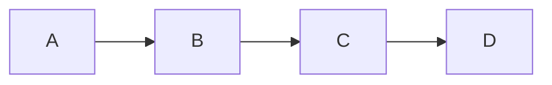
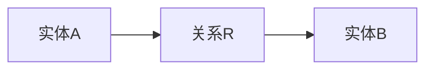
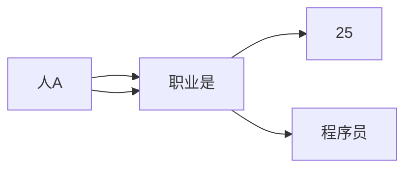
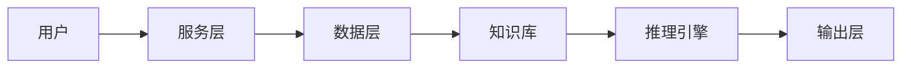

                 


# AI Agent的知识整合：融合多源信息

> 关键词：AI Agent, 知识整合, 多源信息, 数据融合, 知识图谱

> 摘要：本文深入探讨了AI Agent的知识整合技术，重点分析了多源信息的融合方法、知识表示与推理机制、系统架构设计以及实际应用场景。通过详细的技术分析和案例讲解，为读者提供了一套系统化的知识整合解决方案。

---

# 第一部分: AI Agent的知识整合基础

## 第1章: AI Agent的基本概念与背景

### 1.1 AI Agent的定义与特点
AI Agent（智能代理）是指能够感知环境、自主决策并执行任务的智能实体。它具有以下核心特点：
- **自主性**：能够在没有外部干预的情况下自主运行。
- **反应性**：能够实时感知环境并做出反应。
- **目标导向**：具有明确的目标，能够为实现目标而采取行动。
- **学习能力**：能够通过经验改进自身的知识和能力。

### 1.2 知识整合的背景与意义
知识整合是AI Agent实现智能决策的核心能力。随着数据来源的多样化（文本、图像、语音等），如何有效地整合多源信息成为关键挑战。知识整合的意义在于：
- **提升决策能力**：通过融合多源信息，AI Agent能够做出更准确的决策。
- **增强适应性**：能够更好地应对复杂多变的环境。
- **扩展应用场景**：适用于智能推荐、自动驾驶、智能客服等领域。

### 1.3 多源信息的挑战与机遇
多源信息的整合面临以下挑战：
- **数据多样性**：不同数据源可能具有不同的格式和语义。
- **数据冲突**：多源数据可能存在矛盾或不一致。
- **数据质量**：数据可能存在噪声或缺失。

然而，这些挑战也带来了机遇：
- **提升准确性**：通过融合多源信息，可以降低单一数据源的局限性。
- **增强鲁棒性**：通过冗余数据源，可以提高系统的容错能力。
- **扩展应用潜力**：多源信息的整合能够为AI Agent提供更全面的感知能力。

---

## 第2章: 多源信息的融合方法

### 2.1 数据融合的基本概念
数据融合是指将来自不同数据源的信息进行整合，以提高信息的准确性和完整性。数据融合的过程通常包括：
1. 数据预处理：清洗、标准化和转换数据。
2. 数据融合：将预处理后的数据进行融合。
3. 数据后处理：评估融合结果的质量。

### 2.2 基于概率的融合方法
基于概率的方法是数据融合的重要方法之一，主要包括：
- **贝叶斯网络**：通过概率分布建模变量之间的依赖关系。
- **马尔可夫链**：用于描述系统状态的转移过程。
- **概率密度函数**：描述随机变量的概率分布。

#### 示例：贝叶斯网络的实现
假设我们有三个变量A、B、C，贝叶斯网络的结构可以用以下Mermaid图表示：



贝叶斯网络的计算公式如下：
$$ P(C|A,B) = \frac{P(A,B,C)}{P(A,B)} $$

### 2.3 基于规则的融合方法
基于规则的融合方法通过预定义的规则来处理多源信息。常见的规则包括：
- **逻辑推理**：通过逻辑规则进行推理。
- **专家系统**：基于专家的知识规则进行决策。
- **知识图谱**：通过语义网络表示知识。

#### 示例：知识图谱的构建
知识图谱的构建可以用以下Mermaid图表示：



### 2.4 本章小结
本章介绍了数据融合的基本概念和两种主要方法：基于概率的方法和基于规则的方法。通过概率模型和知识图谱的示例，详细讲解了数据融合的核心原理和实现方法。

---

## 第3章: AI Agent的知识表示与推理

### 3.1 知识表示的基本概念
知识表示是将知识以计算机可处理的形式表示出来。常见的知识表示方法包括：
- **符号表示**：使用符号（如字符串、数字）表示知识。
- **语义表示**：通过语义网络或向量表示知识。
- **规则表示**：通过逻辑规则表示知识。

### 3.2 知识推理的基本原理
知识推理是通过已有知识推导出新知识的过程。常见的推理方法包括：
- **演绎推理**：从一般性知识推导出具体知识。
- **归纳推理**：从具体知识推导出一般性知识。
- ** abduction推理**：通过观察现象推导出可能的解释。

#### 示例：知识图谱中的推理
假设我们有以下知识图谱：



通过推理可以得出“人A是一名25岁的程序员”。

### 3.3 本章小结
本章介绍了知识表示与推理的基本概念和方法，重点讲解了知识图谱的表示和推理过程。通过实例分析，展示了知识推理在AI Agent中的应用。

---

# 第二部分: AI Agent的知识整合应用

## 第4章: 系统架构与设计

### 4.1 问题场景介绍
假设我们正在开发一个智能客服系统，需要整合来自多个数据源的信息，包括用户的历史记录、实时对话内容等。

### 4.2 系统功能设计
系统功能包括：
1. 数据采集：从多个数据源采集信息。
2. 数据融合：对采集的信息进行融合。
3. 知识推理：基于融合后的信息进行推理。
4. 决策输出：输出最终的决策结果。

### 4.3 系统架构设计
系统架构可以用以下Mermaid图表示：



### 4.4 本章小结
本章介绍了智能客服系统的系统架构设计，重点讲解了数据层、知识库和推理引擎的核心作用。

---

## 第5章: 项目实战

### 5.1 环境安装
需要安装以下工具：
- Python 3.8+
- TensorFlow 2.0+
- Scikit-learn 0.24+

### 5.2 核心代码实现
以下是数据融合的核心代码示例：

```python
import numpy as np
from sklearn.metrics import accuracy_score

# 数据预处理
def preprocess_data(data):
    # 假设data是数据集
    # 这里进行标准化处理
    return (data - data.mean()) / data.std()

# 数据融合
def fuse_data(source1, source2):
    # 假设source1和source2是预处理后的数据
    return (source1 + source2) / 2

# 知识推理
def infer Knowledge(fused_data):
    # 假设fused_data是融合后的数据
    # 这里进行分类推理
    model = train_classifier(fused_data)
    return model.predict(fused_data)

# 主函数
def main():
    data1 = np.array([1, 2, 3, 4])
    data2 = np.array([2, 3, 4, 5])
    preprocessed_data1 = preprocess_data(data1)
    preprocessed_data2 = preprocess_data(data2)
    fused_data = fuse_data(preprocessed_data1, preprocessed_data2)
    result = infer Knowledge(fused_data)
    print("推理结果:", result)

if __name__ == "__main__":
    main()
```

### 5.3 案例分析
通过上述代码，我们可以实现对多源数据的融合和推理。例如，在智能客服系统中，可以通过融合用户的历史记录和实时对话内容，准确判断用户的需求。

### 5.4 项目小结
本章通过实际案例，详细讲解了AI Agent的知识整合的实现过程，包括数据预处理、数据融合和知识推理。

---

## 第6章: 总结与展望

### 6.1 总结
本文深入探讨了AI Agent的知识整合技术，重点分析了多源信息的融合方法、知识表示与推理机制、系统架构设计以及实际应用场景。

### 6.2 注意事项
- 数据融合需要考虑数据的多样性和一致性。
- 知识推理需要结合具体应用场景进行优化。
- 系统设计需要注重可扩展性和可维护性。

### 6.3 拓展阅读
建议读者进一步阅读以下内容：
- 深度学习在知识整合中的应用。
- 多模态数据融合的最新研究。

### 6.4 小结
本文为AI Agent的知识整合提供了系统的解决方案，未来的研究可以进一步探索更高效的数据融合算法和更智能的知识推理方法。

---

# 结语

通过本文的详细讲解，读者可以深入了解AI Agent的知识整合技术，并能够将其应用于实际场景中。希望本文对读者在AI Agent领域的研究和实践有所帮助。

