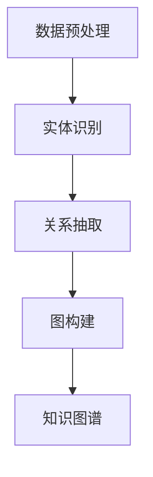
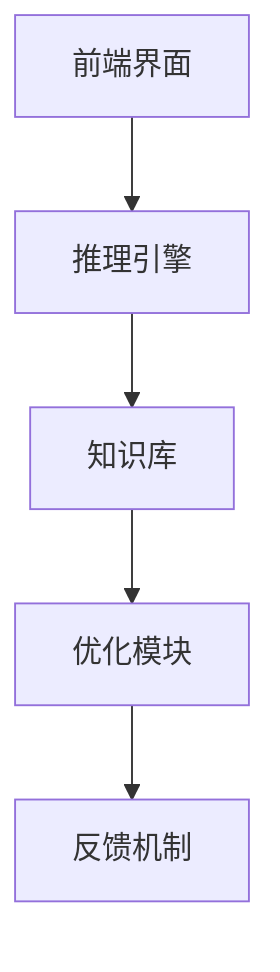

                 


# AI Agent的知识演化：模拟LLM的认知发展过程

---

## 关键词：AI Agent、知识演化、LLM、认知发展、算法原理

---

## 摘要

AI Agent作为一种智能实体，其核心能力依赖于知识的获取、表示、推理和演化。本文探讨了AI Agent的知识演化过程，模拟了大型语言模型（LLM）的认知发展过程。通过分析LLM的知识获取、表示、推理和优化机制，结合AI Agent的知识演化模型和算法，深入阐述了AI Agent如何通过知识演化实现智能提升。文章从理论分析到实践应用，详细讲解了AI Agent的知识演化过程，并提供了实际案例和代码实现，帮助读者全面理解AI Agent与LLM认知发展的关系。

---

# 第一部分: AI Agent的知识演化基础

## 第1章: AI Agent与知识演化概述

### 1.1 AI Agent的基本概念

#### 1.1.1 什么是AI Agent
AI Agent（人工智能代理）是指能够感知环境、自主决策并采取行动的智能实体。它可以是一个软件程序、机器人或其他智能系统，其核心目标是通过与环境交互来实现特定任务。

#### 1.1.2 AI Agent的核心特征
- **自主性**：AI Agent能够自主决策，无需外部干预。
- **反应性**：能够实时感知环境并做出反应。
- **目标导向**：具有明确的目标，行为围绕目标展开。
- **学习能力**：能够通过经验或数据进行知识更新和能力提升。

#### 1.1.3 AI Agent与传统程序的区别
AI Agent与传统程序的区别在于其自主性和智能性。传统程序通常按照固定的逻辑执行任务，而AI Agent能够根据环境反馈动态调整行为，并通过学习不断优化自身能力。

### 1.2 知识演化的基本概念

#### 1.2.1 知识演化的定义
知识演化是指知识通过获取、表示、推理和应用的过程不断更新和优化的过程。它是AI Agent实现智能提升的核心机制。

#### 1.2.2 知识演化的过程与阶段
知识演化通常包括以下几个阶段：
1. **知识获取**：从数据中提取信息，构建知识库。
2. **知识表示**：将知识以某种形式表示，便于计算机理解和推理。
3. **知识推理**：基于知识库进行推理，生成新的知识或解决方案。
4. **知识优化**：通过反馈和学习不断优化知识表示和推理过程。

#### 1.2.3 知识演化的核心要素
- **知识获取**：数据来源和采集方法。
- **知识表示**：知识的组织形式和表达方式。
- **知识推理**：推理算法和逻辑框架。
- **知识优化**：反馈机制和学习策略。

### 1.3 AI Agent与知识演化的关系

#### 1.3.1 AI Agent如何实现知识演化
AI Agent通过知识演化实现智能提升。它通过不断获取新知识、优化知识表示和推理过程，逐步增强自身的认知能力和决策能力。

#### 1.3.2 知识演化对AI Agent的影响
知识演化直接影响AI Agent的能力水平。通过知识演化，AI Agent能够更好地理解环境、解决复杂问题，并适应新的任务需求。

#### 1.3.3 AI Agent在知识演化中的角色
AI Agent既是知识演化的过程参与者，也是知识演化的结果应用者。它通过知识演化不断优化自身的智能水平，从而更好地完成任务。

### 1.4 本章小结
本章介绍了AI Agent的基本概念、知识演化的基本概念以及两者之间的关系。AI Agent通过知识演化实现智能提升，而知识演化则是AI Agent实现目标的重要手段。

---

## 第2章: LLM的认知发展过程

### 2.1 LLM的基本原理

#### 2.1.1 什么是LLM
LLM（Large Language Model）是基于深度学习的自然语言处理模型，能够理解和生成人类语言。它通过大量数据的训练，掌握了语言的规律和语义信息。

#### 2.1.2 LLM的核心算法
LLM的核心算法通常基于Transformer架构，包括编码器和解码器两部分。编码器负责将输入文本转化为向量表示，解码器则根据向量生成输出文本。

#### 2.1.3 LLM的训练过程
LLM的训练过程包括以下几个步骤：
1. **数据预处理**：清洗数据、分词、构建语料库。
2. **模型初始化**：定义模型结构、初始化参数。
3. **损失函数计算**：通过交叉熵损失函数计算预测值与真实值之间的差异。
4. **反向传播与优化**：通过梯度下降优化模型参数。

### 2.2 LLM的认知模型

#### 2.2.1 LLM的认知结构
LLM的认知结构包括编码器和解码器两部分。编码器负责将输入文本转化为向量表示，解码器则根据向量生成输出文本。

#### 2.2.2 LLM的认知过程
LLM的认知过程包括以下几个阶段：
1. **输入处理**：将输入文本转化为向量表示。
2. **上下文理解**：通过自注意力机制理解输入文本的语义和上下文。
3. **生成输出**：基于向量表示和上下文理解生成输出文本。

#### 2.2.3 LLM的认知能力
- **理解能力**：能够理解输入文本的语义和上下文。
- **生成能力**：能够生成符合语法规则和语义逻辑的文本。
- **学习能力**：通过大量数据训练，不断优化模型参数，提升认知能力。

### 2.3 LLM的认知发展与知识演化

#### 2.3.1 LLM的知识获取与存储
LLM通过大量数据的训练获取知识。知识以参数形式存储在模型中，通过参数调整不断优化模型性能。

#### 2.3.2 LLM的知识推理与应用
LLM通过自注意力机制进行知识推理，生成符合语义逻辑的输出。知识推理是LLM实现文本生成的关键步骤。

#### 2.3.3 LLM的知识更新与优化
LLM的知识更新与优化通过模型微调和持续学习实现。通过不断训练新的数据，模型能够适应新的语义变化和语言习惯。

### 2.4 本章小结
本章介绍了LLM的基本原理、认知模型和认知发展过程。LLM的认知发展过程为AI Agent的知识演化提供了重要的参考和借鉴。

---

## 第3章: AI Agent的知识表示与推理

### 3.1 知识表示的基本方法

#### 3.1.1 知识表示的定义
知识表示是指将知识以某种形式表示，便于计算机理解和推理。常见的知识表示方法包括符号表示、向量表示和图表示。

#### 3.1.2 常见的知识表示方法
- **符号表示**：使用符号和规则表示知识，例如逻辑规则。
- **向量表示**：使用向量表示知识，例如词嵌入。
- **图表示**：使用图结构表示知识，例如知识图谱。

#### 3.1.3 知识图谱的构建
知识图谱是一种图结构的知识表示方法，节点表示实体，边表示实体之间的关系。知识图谱的构建包括数据抽取、实体识别、关系抽取和图构建等步骤。

### 3.2 AI Agent的知识推理

#### 3.2.1 知识推理的定义
知识推理是指基于知识库进行推理，生成新的知识或解决方案。知识推理通常基于逻辑推理和概率推理。

#### 3.2.2 推理算法的分类
- **逻辑推理**：基于逻辑规则进行推理，例如谓词逻辑。
- **概率推理**：基于概率论进行推理，例如贝叶斯网络。

#### 3.2.3 基于知识图谱的推理
基于知识图谱的推理包括路径推理和子图推理。路径推理通过遍历图结构找到实体之间的关系，子图推理通过分析图结构中的子图进行推理。

### 3.3 知识表示与推理的优化

#### 3.3.1 知识表示的优化策略
- **减少冗余**：通过压缩和合并重复知识，减少知识表示的冗余。
- **提高可解释性**：通过使用更直观的知识表示方法，提高知识的可解释性。

#### 3.3.2 推理算法的优化方法
- **优化推理效率**：通过优化算法复杂度，提高推理效率。
- **提高推理准确性**：通过引入先验知识和上下文信息，提高推理准确性。

#### 3.3.3 知识表示与推理的结合
知识表示与推理的结合是通过知识表示方法和推理算法的协同优化实现的。例如，使用图表示方法进行知识表示，结合路径推理算法进行推理。

### 3.4 本章小结
本章介绍了知识表示的基本方法、知识推理的算法分类以及知识表示与推理的优化策略。知识表示与推理是AI Agent实现知识演化的重要基础。

---

## 第4章: AI Agent的知识演化模型

### 4.1 知识演化模型的构建

#### 4.1.1 知识演化模型的定义
知识演化模型是指描述知识从获取到优化的整个过程的模型。它包括知识获取、知识表示、知识推理和知识优化四个阶段。

#### 4.1.2 知识演化模型的构建步骤
1. **知识获取**：从数据中提取信息，构建知识库。
2. **知识表示**：将知识以某种形式表示，便于计算机理解和推理。
3. **知识推理**：基于知识库进行推理，生成新的知识或解决方案。
4. **知识优化**：通过反馈和学习不断优化知识表示和推理过程。

#### 4.1.3 知识演化模型的核心要素
- **知识库**：存储知识的载体。
- **推理引擎**：基于知识库进行推理的算法。
- **优化模块**：优化知识表示和推理过程的模块。

### 4.2 知识演化模型的实现

#### 4.2.1 知识演化模型的算法实现
知识演化模型的算法实现包括知识获取、知识表示、知识推理和知识优化四个步骤。例如，使用图神经网络进行知识推理，通过反馈机制优化知识表示。

#### 4.2.2 知识演化模型的优化方法
- **优化知识表示**：通过压缩和合并重复知识，减少知识表示的冗余。
- **优化推理算法**：通过引入先验知识和上下文信息，提高推理准确性。

#### 4.2.3 知识演化模型的验证与评估
知识演化模型的验证与评估包括以下几个方面：
1. **知识表示的准确性**：评估知识表示的准确性和完整性。
2. **推理结果的准确性**：评估推理结果的准确性和相关性。
3. **模型的效率**：评估模型的推理效率和响应速度。

### 4.3 知识演化模型的应用

#### 4.3.1 知识演化模型在AI Agent中的应用
知识演化模型在AI Agent中的应用包括知识获取、知识表示、知识推理和知识优化四个阶段。例如，AI Agent通过知识演化模型不断优化自身的知识库，提高智能水平。

#### 4.3.2 知识演化模型的实际案例
例如，AI Agent可以通过知识演化模型不断优化自身的对话生成能力。通过对话历史和反馈信息，AI Agent可以不断优化对话生成算法，提高对话质量。

#### 4.3.3 知识演化模型的未来发展方向
知识演化模型的未来发展方向包括：
1. **多模态知识表示**：结合文本、图像等多种模态信息进行知识表示。
2. **自适应推理算法**：根据环境变化动态调整推理算法。
3. **分布式知识演化**：通过分布式计算和协作学习实现知识演化。

### 4.4 本章小结
本章介绍了知识演化模型的构建步骤、实现方法以及实际应用。知识演化模型是AI Agent实现知识演化的核心机制。

---

## 第5章: AI Agent的知识演化算法

### 5.1 知识演化算法的基本原理

#### 5.1.1 知识演化算法的定义
知识演化算法是指描述知识从获取到优化的整个过程的算法。它包括知识获取、知识表示、知识推理和知识优化四个步骤。

#### 5.1.2 知识演化算法的核心思想
知识演化算法的核心思想是通过不断优化知识表示和推理过程，实现知识的动态更新和智能提升。

#### 5.1.3 知识演化算法的实现步骤
1. **知识获取**：从数据中提取信息，构建知识库。
2. **知识表示**：将知识以某种形式表示，便于计算机理解和推理。
3. **知识推理**：基于知识库进行推理，生成新的知识或解决方案。
4. **知识优化**：通过反馈和学习不断优化知识表示和推理过程。

### 5.2 知识演化算法的优化方法

#### 5.2.1 知识表示的优化策略
- **减少冗余**：通过压缩和合并重复知识，减少知识表示的冗余。
- **提高可解释性**：通过使用更直观的知识表示方法，提高知识的可解释性。

#### 5.2.2 推理算法的优化方法
- **优化推理效率**：通过优化算法复杂度，提高推理效率。
- **提高推理准确性**：通过引入先验知识和上下文信息，提高推理准确性。

#### 5.2.3 知识表示与推理的结合
知识表示与推理的结合是通过知识表示方法和推理算法的协同优化实现的。例如，使用图表示方法进行知识表示，结合路径推理算法进行推理。

### 5.3 知识演化算法的实际应用

#### 5.3.1 知识演化算法在AI Agent中的应用
知识演化算法在AI Agent中的应用包括知识获取、知识表示、知识推理和知识优化四个阶段。例如，AI Agent通过知识演化算法不断优化自身的知识库，提高智能水平。

#### 5.3.2 知识演化算法的实际案例
例如，AI Agent可以通过知识演化算法不断优化自身的对话生成能力。通过对话历史和反馈信息，AI Agent可以不断优化对话生成算法，提高对话质量。

#### 5.3.3 知识演化算法的未来发展方向
知识演化算法的未来发展方向包括：
1. **多模态知识表示**：结合文本、图像等多种模态信息进行知识表示。
2. **自适应推理算法**：根据环境变化动态调整推理算法。
3. **分布式知识演化**：通过分布式计算和协作学习实现知识演化。

### 5.4 本章小结
本章介绍了知识演化算法的基本原理、优化方法以及实际应用。知识演化算法是AI Agent实现知识演化的重要工具。

---

## 第6章: 项目实战——基于LLM的AI Agent知识演化系统

### 6.1 项目背景与目标
本项目旨在通过模拟LLM的认知发展过程，构建一个基于LLM的AI Agent知识演化系统。系统的目标是通过知识演化实现AI Agent的智能提升。

### 6.2 系统功能设计

#### 6.2.1 功能需求
- **知识获取**：从数据中提取信息，构建知识库。
- **知识表示**：将知识以某种形式表示，便于计算机理解和推理。
- **知识推理**：基于知识库进行推理，生成新的知识或解决方案。
- **知识优化**：通过反馈和学习不断优化知识表示和推理过程。

#### 6.2.2 领域模型设计
领域模型包括以下几个部分：
- **知识库**：存储知识的载体。
- **推理引擎**：基于知识库进行推理的算法。
- **优化模块**：优化知识表示和推理过程的模块。

#### 6.2.3 系统架构设计
系统架构包括以下几个部分：
- **前端界面**：用户与系统交互的界面。
- **知识库**：存储知识的数据库。
- **推理引擎**：基于知识库进行推理的算法。
- **优化模块**：优化知识表示和推理过程的模块。

### 6.3 系统实现

#### 6.3.1 环境安装
- **Python 3.8以上版本**
- **TensorFlow或PyTorch框架**
- **必要的Python库**：numpy、pandas、matplotlib等。

#### 6.3.2 核心实现代码

```python
# 知识表示模块
def knowledge_representation(data):
    # 数据预处理
    processed_data = preprocess(data)
    # 生成向量表示
    vector = model.encode(processed_data)
    return vector

# 知识推理模块
def knowledge_reasoning(knowledge_base):
    # 初始化推理引擎
    engine = ReasoningEngine(knowledge_base)
    # 执行推理
    result = engine.reasoning()
    return result

# 知识优化模块
def knowledge_optimization(feedback):
    # 更新知识库
    update_knowledge_base(feedback)
    # 优化推理算法
    optimize_reasoning_algorithm(feedback)
```

#### 6.3.3 代码解读与分析
1. **知识表示模块**：通过模型将输入数据转化为向量表示。
2. **知识推理模块**：基于知识库进行推理，生成新的知识或解决方案。
3. **知识优化模块**：通过反馈优化知识表示和推理过程。

### 6.4 实际案例分析
通过实际案例分析，验证系统的有效性。例如，通过对话历史和反馈信息，优化AI Agent的对话生成能力。

### 6.5 项目小结
本章通过项目实战，详细讲解了基于LLM的AI Agent知识演化系统的实现过程。通过实际案例分析，验证了系统的有效性。

---

## 第7章: 最佳实践与未来展望

### 7.1 最佳实践

#### 7.1.1 知识表示的优化策略
- **减少冗余**：通过压缩和合并重复知识，减少知识表示的冗余。
- **提高可解释性**：通过使用更直观的知识表示方法，提高知识的可解释性。

#### 7.1.2 推理算法的优化方法
- **优化推理效率**：通过优化算法复杂度，提高推理效率。
- **提高推理准确性**：通过引入先验知识和上下文信息，提高推理准确性。

#### 7.1.3 系统架构设计的优化建议
- **模块化设计**：通过模块化设计，提高系统的可维护性和可扩展性。
- **分布式计算**：通过分布式计算，提高系统的计算能力和响应速度。

### 7.2 小结
通过最佳实践，总结了AI Agent知识演化系统的设计与实现中的关键点。

### 7.3 注意事项
- **数据安全**：确保知识库的数据安全，防止数据泄露。
- **系统稳定性**：确保系统的稳定性，避免系统崩溃。
- **用户体验**：优化用户体验，提高用户的满意度。

### 7.4 拓展阅读
建议读者进一步阅读以下内容：
1. **知识图谱**：深入学习知识图谱的构建与应用。
2. **图神经网络**：研究图神经网络在知识推理中的应用。
3. **强化学习**：探索强化学习在知识演化中的应用。

---

## 附录

### 附录A: 数学公式

#### 1. 交叉熵损失函数
$$
\text{Loss} = -\sum_{i=1}^{n} y_i \log(p_i) + (1 - y_i) \log(1 - p_i)
$$

#### 2. 梯度下降算法
$$
\theta = \theta - \eta \frac{\partial L}{\partial \theta}
$$

### 附录B: Mermaid图表

#### 1. 知识图谱构建流程图


#### 2. 系统架构图


---

# 结语

AI Agent的知识演化是实现智能提升的核心机制。通过模拟LLM的认知发展过程，AI Agent能够不断优化自身的知识表示和推理能力。本文从理论分析到实践应用，详细讲解了AI Agent的知识演化过程，并提供了实际案例和代码实现，帮助读者全面理解AI Agent与LLM认知发展的关系。未来，随着技术的不断进步，AI Agent的知识演化将更加智能化和个性化，为人类社会带来更多创新和价值。

