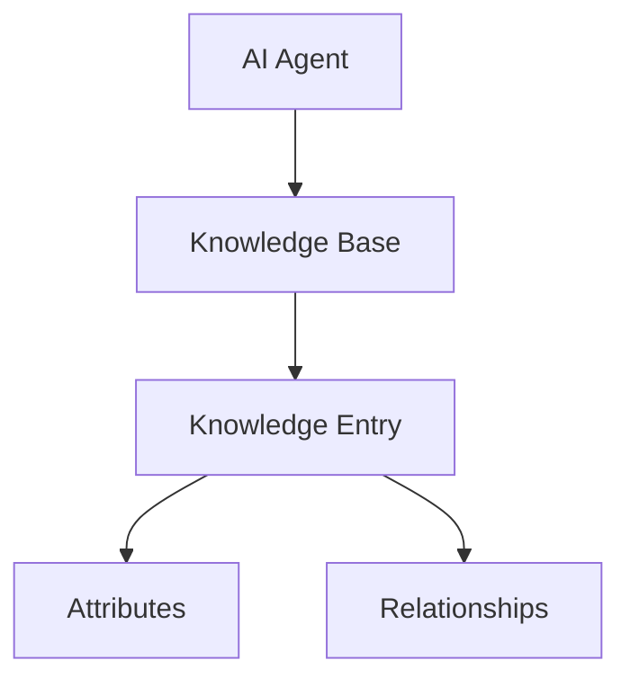
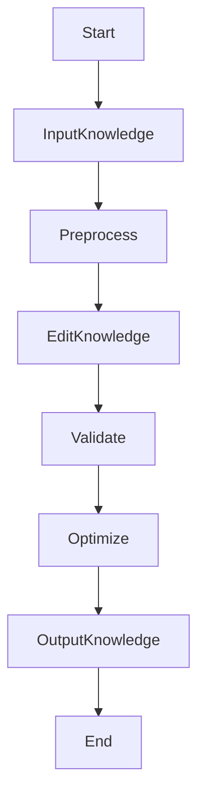
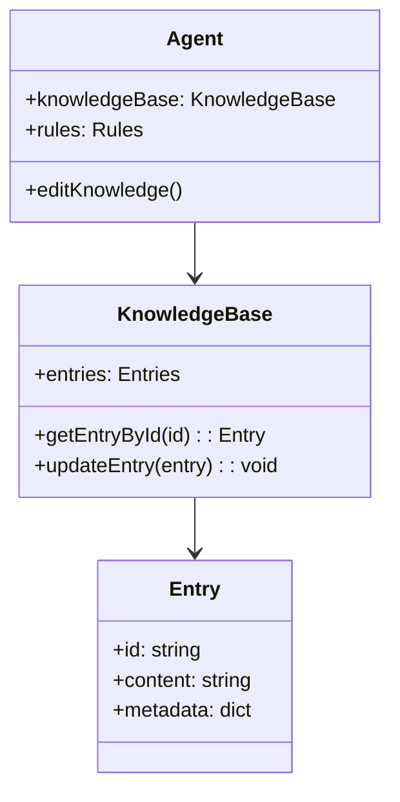
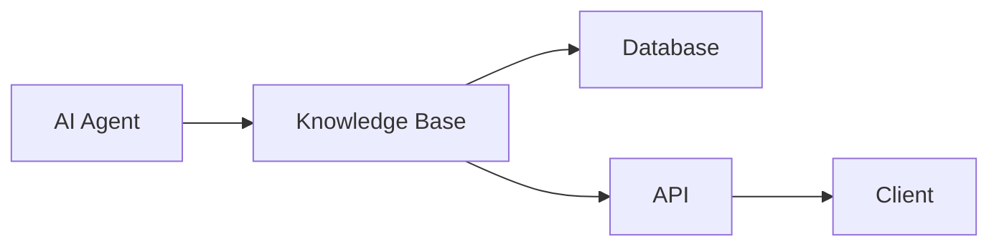
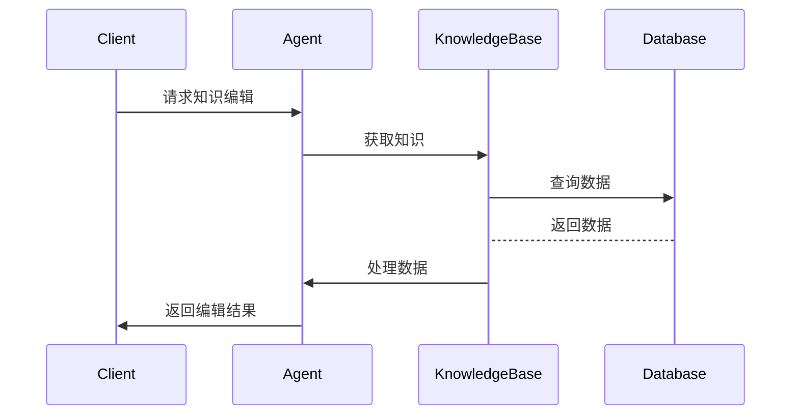

                 


# AI Agent的知识编辑系统：动态管理LLM的知识库

## 关键词：AI Agent, 知识编辑系统, LLM, 知识库动态管理, 系统架构设计

## 摘要：  
AI Agent的知识编辑系统是一种用于动态管理大型语言模型（LLM）知识库的智能化系统。本文深入探讨了AI Agent在知识编辑中的角色，分析了知识编辑系统的原理、算法和架构设计，结合实际案例展示了系统的实现与应用。通过本文，读者将了解如何设计和实现一个高效的AI Agent知识编辑系统，以满足不断变化的知识管理需求。

---

## 第一部分: AI Agent的知识编辑系统概述

### 第1章: AI Agent与知识编辑系统概述

#### 1.1 问题背景与目标
##### 1.1.1 LLM知识库的动态管理需求  
随着AI技术的快速发展，大型语言模型（LLM）的知识库规模不断扩大，但其内容需要根据实时数据、用户反馈和环境变化进行动态更新。传统的静态知识库管理方法已无法满足需求，亟需一种动态、智能的知识编辑系统来维护LLM的知识库。  

##### 1.1.2 AI Agent在知识管理中的角色  
AI Agent作为一种智能代理，能够通过感知环境、理解需求并执行任务，成为动态知识管理的核心。它负责监控知识库的状态，识别更新需求，并协调知识编辑过程。  

##### 1.1.3 知识编辑系统的定义与目标  
知识编辑系统是一种用于管理LLM知识库的智能化系统，其目标是实现知识的动态更新、版本控制和质量优化，确保知识库的准确性和时效性。  

---

#### 1.2 核心概念与问题描述
##### 1.2.1 AI Agent的知识编辑机制  
AI Agent通过自然语言处理、推理和机器学习算法，对知识库进行分析、理解和编辑，确保知识的准确性和一致性。  

##### 1.2.2 动态知识库管理的核心问题  
动态知识库管理的核心问题包括知识的实时更新、冲突解决、版本控制和性能优化。  

##### 1.2.3 知识编辑系统的边界与外延  
知识编辑系统的边界包括输入的知识源、编辑规则和输出的优化知识库。其外延则涵盖知识表示、语义理解、推理和自适应优化等技术。  

---

#### 1.3 知识编辑系统的结构与核心要素
##### 1.3.1 系统整体架构  
知识编辑系统通常由知识获取模块、编辑规则引擎、知识验证模块和优化模块组成。  

##### 1.3.2 核心要素组成  
核心要素包括：  
1. 知识源：输入的知识数据或文本。  
2. 编辑规则：定义知识编辑的规则和策略。  
3. 知识验证模块：用于检查编辑后知识的准确性和一致性。  
4. 优化模块：对知识进行优化，确保其质量。  

##### 1.3.3 系统功能模块划分  
系统功能模块包括：  
1. 知识获取模块：从多源输入知识数据。  
2. 编辑规则引擎：根据规则进行知识编辑。  
3. 知识验证模块：验证编辑后知识的质量。  
4. 优化模块：对知识进行优化处理。  
5. 输出模块：输出优化后的知识库。  

---

### 第2章: AI Agent知识编辑系统的原理与核心概念

#### 2.1 核心概念原理
##### 2.1.1 AI Agent的知识获取与处理机制  
AI Agent通过自然语言处理技术从多源获取知识，并进行语义理解和知识表示。  

##### 2.1.2 知识库的动态更新与维护  
知识库的动态更新包括实时数据的插入、删除和修改，以及历史数据的版本管理。  

##### 2.1.3 知识编辑的自动化流程  
自动化知识编辑流程包括知识预处理、编辑规则应用、知识验证和优化等步骤。  

---

#### 2.2 核心概念属性特征对比
##### 2.2.1 知识编辑系统的关键属性  
| 属性 | 描述 |  
|------|------|  
| 动态性 | 知识库的实时更新能力 |  
| 智能性 | 系统的自主决策能力 |  
| 可扩展性 | 系统的扩展能力 |  

##### 2.2.2 不同知识编辑方法的特征对比  
| 方法 | 特征 |  
|------|------|  
| 基于规则的编辑 | 简单、可解释性高 |  
| 基于机器学习的编辑 | 高效、可自适应 |  
| 混合方法 | 结合规则与机器学习的优势 |  

##### 2.2.3 系统性能指标与评估标准  
主要性能指标包括编辑效率、知识准确性、系统响应时间和资源消耗。  

---

#### 2.3 ER实体关系图  
以下是一个简化的知识编辑系统ER图：  


---

### 第3章: 知识编辑系统的算法原理

#### 3.1 算法流程概述
##### 3.1.1 知识获取与预处理  
AI Agent从多源获取知识数据，并进行清洗和结构化处理。  

##### 3.1.2 知识编辑与更新  
根据编辑规则对知识进行编辑，并实时更新知识库。  

##### 3.1.3 知识验证与优化  
验证编辑后知识的准确性和一致性，并进行优化处理。  

---

#### 3.2 算法流程图  
以下是一个知识编辑算法的流程图：  


---

#### 3.3 数学模型与公式
##### 3.3.1 知识编辑的权重计算  
权重计算公式：  
$$ w = \frac{freq}{total\_count} $$  

##### 3.3.2 知识更新的相似度计算  
相似度计算公式：  
$$ similarity = 1 - \frac{d_{text}}{d_{max}} $$  

---

## 第二部分: 系统架构与实现

### 第4章: 系统分析与架构设计

#### 4.1 系统分析
##### 4.1.1 问题场景介绍  
知识编辑系统需要处理实时数据更新、多源知识融合和知识冲突解决等问题。  

##### 4.1.2 项目介绍  
本项目旨在设计一个AI Agent驱动的知识编辑系统，实现LLM知识库的动态管理。  

---

#### 4.2 系统功能设计
##### 4.2.1 领域模型设计  
以下是一个领域模型的类图：  


##### 4.2.2 系统架构设计  
以下是一个系统架构图：  


##### 4.2.3 系统接口设计  
主要接口包括：  
1. Agent接口：与知识库交互。  
2. KnowledgeBase接口：提供知识获取和更新功能。  
3. API接口：供外部系统调用。  

##### 4.2.4 系统交互设计  
以下是一个交互序列图：  


---

### 第5章: 项目实战

#### 5.1 环境安装
##### 5.1.1 系统依赖  
- Python 3.8+  
- Mermaid CLI  
- matplotlib  

##### 5.1.2 知识编辑系统实现  
以下是一个Python实现的示例代码：  

```python
class Agent:
    def __init__(self, knowledge_base):
        self.knowledge_base = knowledge_base

    def edit_knowledge(self, entry_id, new_content):
        entry = self.knowledge_base.get_entry(entry_id)
        entry.content = new_content
        self.knowledge_base.update_entry(entry)
        return entry

class KnowledgeBase:
    def __init__(self, database):
        self.database = database

    def get_entry(self, entry_id):
        # 查询数据库，返回Entry对象
        pass

    def update_entry(self, entry):
        # 更新数据库中的entry
        pass
```

---

#### 5.2 知识编辑系统实现
##### 5.2.1 知识验证与优化  
在代码实现中，可以通过机器学习模型对编辑后的内容进行验证和优化。  

##### 5.2.2 代码实现与解读  
以下是一个完整的实现示例：  

```python
from typing import Dict, Any

class Entry:
    def __init__(self, id: str, content: str, metadata: Dict[str, Any]):
        self.id = id
        self.content = content
        self.metadata = metadata

class KnowledgeBase:
    def __init__(self, database):
        self.database = database

    def get_entry(self, entry_id: str) -> Entry:
        # 简化实现，直接返回一个示例Entry
        return Entry(entry_id, "Sample content", {"source": "example"})

    def update_entry(self, entry: Entry):
        # 简化实现，直接更新数据库
        pass

class Agent:
    def __init__(self, knowledge_base):
        self.knowledge_base = knowledge_base

    def edit_knowledge(self, entry_id: str, new_content: str) -> Entry:
        entry = self.knowledge_base.get_entry(entry_id)
        entry.content = new_content
        self.knowledge_base.update_entry(entry)
        return entry

# 使用示例
knowledge_base = KnowledgeBase({"entries": {}})
agent = Agent(knowledge_base)
new_entry = agent.edit_knowledge("123", "Updated content")
print(new_entry.content)  # 输出：Updated content
```

---

#### 5.3 实际案例分析  
假设我们有一个简单的知识库，包含公司员工信息。通过AI Agent对员工信息进行动态更新，例如修改员工的职位信息。  

---

### 第6章: 最佳实践与小结

#### 6.1 最佳实践 tips
##### 6.1.1 系统设计建议  
- 使用模块化设计，便于扩展和维护。  
- 引入日志和监控系统，便于排查问题。  

##### 6.1.2 代码实现建议  
- 采用面向对象的设计方法，提高代码的可维护性。  
- 使用现有的库和框架，减少开发时间。  

##### 6.1.3 系统优化建议  
- 对知识编辑过程进行并行化，提高效率。  
- 使用分布式存储，增强系统的扩展性。  

---

#### 6.2 小结  
通过本文的介绍，我们了解了AI Agent知识编辑系统的原理、算法和架构设计，并通过实际案例展示了系统的实现过程。  

---

#### 6.3 注意事项  
在实际应用中，需要注意以下几点：  
1. 确保知识编辑规则的准确性和可解释性。  
2. 处理好知识冲突和版本控制问题。  
3. 保护数据安全和隐私。  

---

#### 6.4 拓展阅读  
推荐以下资源：  
- 《Large Language Models》  
- 《知识图谱构建与应用》  
- 《AI Agent开发指南》  

---

通过本文的详细讲解，读者可以深入了解AI Agent知识编辑系统的实现细节，并能够将其应用于实际项目中。

