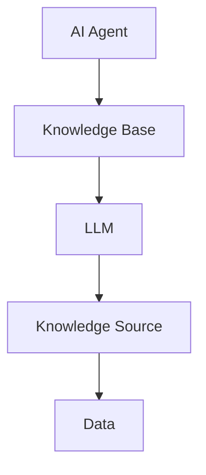
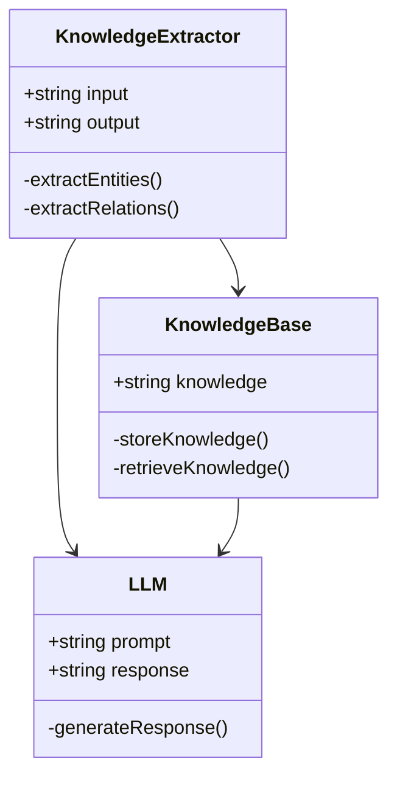
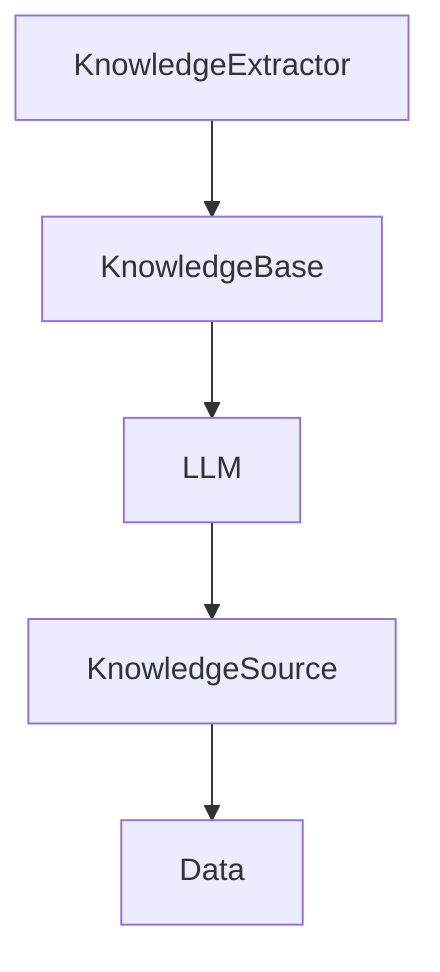
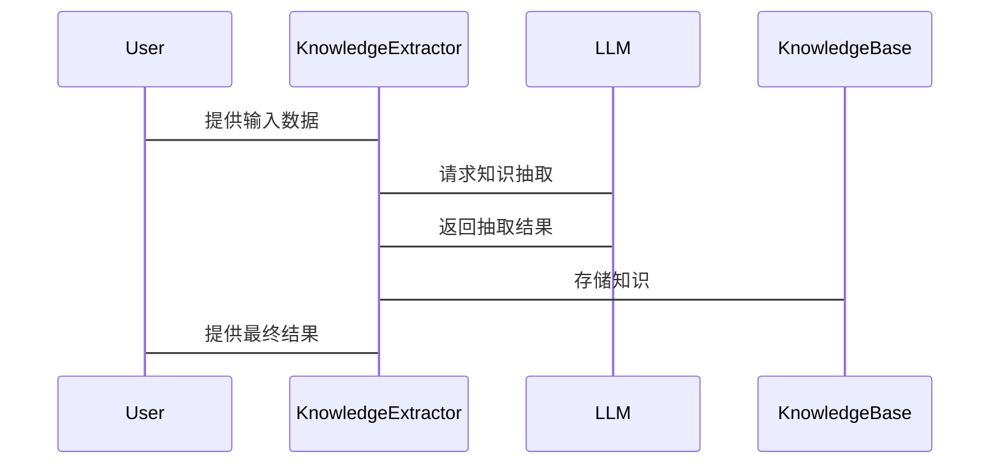

                 


# AI Agent的知识获取：利用LLM进行持续学习

---

## 关键词：
AI Agent，知识获取，大语言模型，LLM，持续学习，自然语言处理，知识图谱，机器学习

---

## 摘要：
随着人工智能技术的快速发展，AI Agent（人工智能代理）在各个领域的应用越来越广泛。为了使AI Agent能够持续进化和适应复杂环境，知识获取成为了关键。本文将探讨如何利用大语言模型（LLM）进行AI Agent的知识获取，分析其原理、实现方法、系统架构，并通过实际案例展示其应用。文章内容涵盖知识获取的基本概念、LLM的核心原理、算法实现、系统设计以及项目实战，为读者提供全面而深入的技术解析。

---

# 第一部分: AI Agent的知识获取概述

---

## 第1章: AI Agent与知识获取概述

### 1.1 AI Agent的基本概念

#### 1.1.1 AI Agent的定义与特点
AI Agent是一种能够感知环境、自主决策并执行任务的智能实体。它具有以下特点：
- **自主性**：能够在没有外部干预的情况下独立运行。
- **反应性**：能够实时感知环境并做出响应。
- **目标导向性**：具有明确的目标，并能够通过行动实现目标。
- **社会性**：能够与其他Agent或人类进行交互协作。

#### 1.1.2 知识获取在AI Agent中的作用
知识获取是AI Agent的核心能力之一，它决定了AI Agent能否有效理解和处理信息。知识获取的作用包括：
- **信息处理**：将复杂的信息转化为结构化的知识。
- **决策支持**：为AI Agent的决策提供可靠的知识支持。
- **持续进化**：通过不断获取新知识，使AI Agent能够适应变化的环境。

#### 1.1.3 LLM在知识获取中的优势
大语言模型（LLM）具有以下优势，使其成为AI Agent知识获取的理想工具：
- **强大的语义理解能力**：LLM能够理解上下文并提取隐含信息。
- **知识覆盖广泛**：通过海量数据训练，LLM掌握了丰富的常识和领域知识。
- **可扩展性**：LLM可以通过微调或提示工程（Prompt Engineering）快速适应新任务。

---

### 1.2 知识获取的背景与问题背景

#### 1.2.1 知识获取的基本问题
知识获取面临以下挑战：
- **信息的复杂性**：数据来源多样，格式不统一，存在噪声。
- **知识的动态性**：知识需要不断更新以适应变化的环境。
- **计算资源的限制**：知识获取需要大量的计算资源。

#### 1.2.2 LLM在知识获取中的应用场景
LLM在知识获取中的应用场景包括：
- **问答系统**：通过LLM回答用户的问题。
- **信息抽取**：从文本中提取结构化知识。
- **对话系统**：通过对话生成回答。

#### 1.2.3 知识获取的边界与外延
知识获取的边界包括：
- **数据的可获得性**：数据来源和质量影响知识获取的效果。
- **模型的限制**：LLM的性能受限于训练数据和模型架构。
- **伦理问题**：知识获取可能涉及隐私和伦理问题。

---

### 1.3 问题描述与解决方案

#### 1.3.1 知识获取的核心问题
知识获取的核心问题包括：
- **如何高效地从海量数据中提取知识？**
- **如何确保知识的准确性和完整性？**
- **如何使知识获取过程自动化和可扩展？**

#### 1.3.2 LLM如何解决知识获取问题
LLM通过以下方式解决知识获取问题：
- **大规模预训练**：利用海量数据进行预训练，掌握广泛的知识。
- **提示工程**：通过设计提示（Prompt）引导模型输出所需知识。
- **持续学习**：通过微调或增量学习，使模型不断更新知识。

#### 1.3.3 知识获取的边界与限制
知识获取的边界和限制包括：
- **模型的能力限制**：LLM对某些领域的知识可能不够深入。
- **数据偏差**：训练数据中的偏差可能影响知识的准确性。
- **计算成本**：知识获取需要大量的计算资源。

---

### 1.4 核心概念与联系

#### 1.4.1 核心概念原理
核心概念包括：
- **知识表示**：将知识以结构化的形式表示，如知识图谱。
- **知识推理**：基于知识图谱进行推理，得到新的知识。
- **知识学习**：通过机器学习方法从数据中学习知识。

#### 1.4.2 核心概念属性特征对比表
| 概念         | 特性                           |
|--------------|--------------------------------|
| 知识表示      | 结构化、可扩展性                |
| 知识推理      | 基于规则或学习模型             |
| 知识学习      | 数据驱动、可定制性             |

#### 1.4.3 ER实体关系图（Mermaid流程图）


---

## 第2章: LLM与知识获取的关系

### 2.1 LLM的基本原理

#### 2.1.1 大语言模型的定义
大语言模型（LLM）是一种基于深度学习的自然语言处理模型，具有以下特点：
- **大规模训练**：通过海量数据预训练。
- **上下文理解**：能够理解文本的上下文关系。
- **生成能力**：能够生成自然语言文本。

#### 2.1.2 LLM的核心算法
LLM的核心算法包括：
- **Transformer架构**：通过自注意力机制捕捉文本的全局关系。
- **前馈网络**：对输入进行非线性变换。

#### 2.1.3 LLM的训练与优化
LLM的训练过程包括：
1. **预训练**：在大规模数据上进行无监督学习。
2. **微调**：在特定任务上进行有监督微调。
3. **推理优化**：通过蒸馏（Distillation）等技术优化推理效率。

---

### 2.2 知识获取的基本原理

#### 2.2.1 知识获取的定义
知识获取是指通过算法从数据中提取结构化知识的过程。

#### 2.2.2 知识获取的实现方法
知识获取的实现方法包括：
- **信息抽取**：从文本中提取实体、关系等信息。
- **知识融合**：将多个来源的知识进行整合。
- **知识推理**：基于已有知识推导新的知识。

#### 2.2.3 知识获取的评估指标
知识获取的评估指标包括：
- **准确率**：提取知识的准确性。
- **召回率**：提取知识的完整性。
- **F1值**：综合准确率和召回率的指标。

---

### 2.3 LLM在知识获取中的应用

#### 2.3.1 LLM作为知识源
LLM可以作为知识源，通过回答问题提供知识。

#### 2.3.2 LLM作为知识处理工具
LLM可以作为工具，用于信息抽取、知识融合等任务。

#### 2.3.3 LLM作为知识推理引擎
LLM可以作为知识推理引擎，基于已有知识进行推理。

---

## 第3章: LLM的知识获取算法原理

### 3.1 知识获取的算法原理

#### 3.1.1 知识抽取算法
知识抽取算法包括：
- **实体抽取**：从文本中提取实体。
- **关系抽取**：从文本中提取实体之间的关系。

#### 3.1.2 知识融合算法
知识融合算法包括：
- **冲突检测**：检测知识中的冲突。
- **冲突解决**：通过规则或学习模型解决冲突。

#### 3.1.3 知识推理算法
知识推理算法包括：
- **基于规则的推理**：根据预定义规则进行推理。
- **基于学习的推理**：通过机器学习模型进行推理。

---

### 3.2 LLM的知识获取流程

#### 3.2.1 数据输入与处理
数据输入与处理包括：
- **数据清洗**：去除噪声数据。
- **数据转换**：将数据转换为模型可接受的格式。

#### 3.2.2 知识抽取与表示
知识抽取与表示包括：
- **实体表示**：将实体表示为向量或符号。
- **关系表示**：将关系表示为向量或符号。

#### 3.2.3 知识推理与应用
知识推理与应用包括：
- **基于规则的推理**：根据预定义规则进行推理。
- **基于学习的推理**：通过机器学习模型进行推理。

---

### 3.3 算法原理的数学模型与公式

#### 3.3.1 知识抽取的数学模型
知识抽取的数学模型可以表示为：
$$
f(x) = \arg\max_{y} P(y|x)
$$
其中，$x$是输入文本，$y$是抽取的知识。

#### 3.3.2 知识融合的数学模型
知识融合的数学模型可以表示为：
$$
g(x_1, x_2) = \arg\max_{y} P(y|x_1, x_2)
$$
其中，$x_1$和$x_2$是两个不同的知识源。

#### 3.3.3 知识推理的数学模型
知识推理的数学模型可以表示为：
$$
h(y) = \arg\max_{z} P(z|y)
$$
其中，$y$是已知知识，$z$是推理结果。

---

## 第4章: 系统分析与架构设计

### 4.1 系统分析

#### 4.1.1 问题场景介绍
问题场景包括：
- **数据获取**：从多个来源获取数据。
- **知识抽取**：从数据中提取知识。
- **知识推理**：基于知识进行推理。

#### 4.1.2 项目介绍
项目介绍包括：
- **项目目标**：实现一个基于LLM的知识获取系统。
- **项目范围**：覆盖知识抽取、融合和推理。
- **项目需求**：提供高效的知识获取服务。

---

### 4.2 系统功能设计

#### 4.2.1 领域模型（Mermaid类图）


---

### 4.3 系统架构设计

#### 4.3.1 系统架构（Mermaid架构图）


---

### 4.4 系统接口设计

#### 4.4.1 系统接口
系统接口包括：
- **输入接口**：接收输入数据。
- **输出接口**：输出抽取的知识。
- **API接口**：提供RESTful API供其他系统调用。

---

### 4.5 系统交互设计

#### 4.5.1 系统交互（Mermaid序列图）


---

## 第5章: 项目实战

### 5.1 环境安装

#### 5.1.1 安装Python
```bash
python --version
```

#### 5.1.2 安装依赖
```bash
pip install transformers
pip install numpy
```

---

### 5.2 系统核心实现源代码

#### 5.2.1 知识抽取代码
```python
from transformers import pipeline

# 实体抽取
nlp = pipeline("ner")
result = nlp("John works in Google.")
print(result)
```

#### 5.2.2 知识推理代码
```python
from transformers import AutoModelForCausalLM, AutoTokenizer

model = AutoModelForCausalLM.from_pretrained("gpt2")
tokenizer = AutoTokenizer.from_pretrained("gpt2")

input_text = "What is AI?"
inputs = tokenizer(input_text, return_tensors="pt")
outputs = model.generate(inputs.input_ids, max_length=100)
print(tokenizer.decode(outputs[0], skip_special_tokens=True))
```

---

### 5.3 代码应用解读与分析

#### 5.3.1 知识抽取代码解读
```python
nlp = pipeline("ner")
result = nlp("John works in Google.")
print(result)
```
上述代码使用了`transformers`库中的`pipeline`函数，实现了命名实体识别任务。

---

## 第6章: 最佳实践与总结

### 6.1 最佳实践

#### 6.1.1 小结
- **知识获取是AI Agent的核心能力**。
- **LLM是知识获取的理想工具**。

#### 6.1.2 注意事项
- **确保数据质量**：数据的准确性和完整性直接影响知识获取的效果。
- **选择合适的模型**：根据任务需求选择合适的LLM模型。
- **处理伦理问题**：注意隐私和伦理问题。

#### 6.1.3 拓展阅读
- **推荐书籍**：《大语言模型的原理与应用》。
- **推荐论文**：《利用大语言模型进行知识获取的研究》。

---

## 总结

通过本文的分析，我们可以看到，利用LLM进行AI Agent的知识获取是一种高效且可行的方法。未来，随着技术的不断发展，知识获取将更加智能化和自动化，为AI Agent的应用开辟更广阔的可能性。

---

