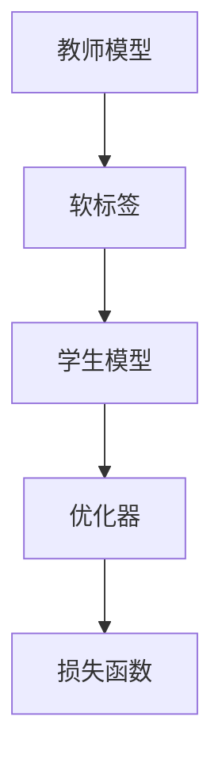
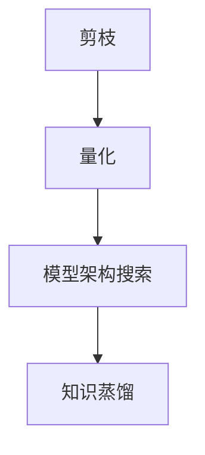
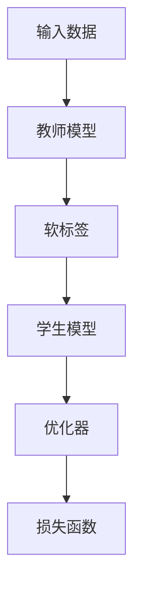
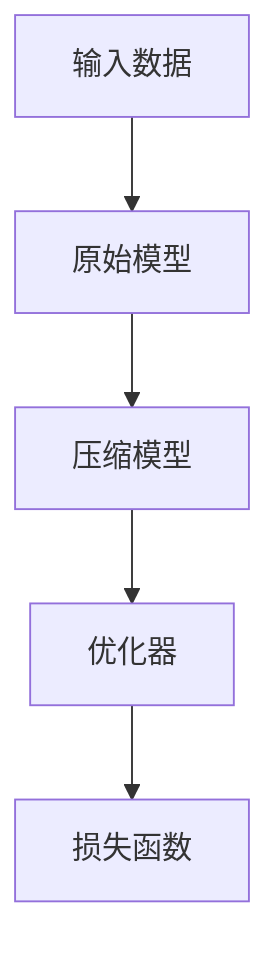

                 


```markdown
# AI Agent的知识蒸馏与模型压缩

> 关键词：知识蒸馏，模型压缩，AI Agent，机器学习，算法优化

> 摘要：本文深入探讨了AI Agent中的知识蒸馏与模型压缩技术，从基础概念到算法原理，再到系统设计和项目实战，全面分析了这两项技术的核心原理、应用场景和实现方法。通过详细的讲解和实际案例，帮助读者理解并掌握这些技术，为优化AI模型性能和资源利用率提供有效指导。

---

## 第一部分: AI Agent的知识蒸馏与模型压缩基础

### 第1章: 知识蒸馏与模型压缩概述

#### 1.1 知识蒸馏的基本概念

##### 1.1.1 知识蒸馏的背景与问题背景
知识蒸馏（Knowledge Distillation）是一种机器学习技术，旨在将复杂的大型模型的知识迁移到更小、更高效的模型中。随着深度学习模型的复杂度不断提高，模型的训练和推理成本也在急剧增加，尤其是在资源受限的环境中，大型模型的部署变得困难。因此，如何在保证性能的前提下，减少模型的规模和计算成本，成为亟待解决的问题。

##### 1.1.2 知识蒸馏的核心问题描述
知识蒸馏的核心问题是将一个复杂的大型模型（教师模型）的知识迁移到一个简单的小型模型（学生模型）中。教师模型通常在大量数据上进行训练，具有较高的准确性和丰富的特征表示能力，但其计算成本和资源消耗较高。通过知识蒸馏，我们可以提取教师模型的有用特征，并将其传递给学生模型，使学生模型在较少的训练数据和计算资源下，达到接近教师模型的性能。

##### 1.1.3 知识蒸馏的目标与解决方法
知识蒸馏的目标是通过优化学生模型的损失函数，使其在教师模型的指导下，学习到更有效的特征表示。解决方法包括：1）设计损失函数，将教师模型的软标签（soft label）作为学生模型的监督信号；2）通过温度缩放（temperature scaling）等技术，调整损失函数的权重，以平衡教师模型和真实标签的影响；3）结合数据增强和自适应策略，进一步提升学生模型的泛化能力。

##### 1.1.4 知识蒸馏的边界与外延
知识蒸馏的边界在于其仅关注模型间知识的迁移，而不涉及数据层面的变换。其外延则包括多种迁移方式，如多教师蒸馏、自适应蒸馏等，适用于不同的应用场景。

##### 1.1.5 知识蒸馏的概念结构与核心要素
知识蒸馏的概念结构包括：教师模型、学生模型、软标签、温度缩放、损失函数等核心要素。其核心要素是通过教师模型的软标签和学生模型的预测结果之间的差异，优化学生模型的参数，使其能够学习到教师模型的有用特征。

#### 1.2 模型压缩的基本概念

##### 1.2.1 模型压缩的背景与问题背景
模型压缩（Model Compression）是通过减少模型的参数数量或简化模型结构，使其在存储和计算上更加高效。随着深度学习模型的规模越来越大，模型的存储和计算成本也急剧增加，尤其是在移动设备和边缘计算环境中，模型压缩技术显得尤为重要。

##### 1.2.2 模型压缩的核心问题描述
模型压缩的核心问题是如何在不显著降低模型性能的前提下，减少模型的参数数量或计算复杂度。这需要通过剪枝（pruning）、量化（quantization）、知识蒸馏等多种技术，优化模型的结构和参数，使其更加高效。

##### 1.2.3 模型压缩的目标与解决方法
模型压缩的目标是通过多种技术手段，降低模型的存储和计算成本，同时保持或提升模型的性能。解决方法包括：1）剪枝：去除模型中冗余的参数或神经元；2）量化：将模型参数从高精度（如浮点数）降低到低精度（如整数）；3）模型架构搜索：设计更高效的网络结构；4）知识蒸馏：利用教师模型指导学生模型的训练。

##### 1.2.4 模型压缩的边界与外延
模型压缩的边界在于其仅关注模型结构和参数的优化，而不涉及数据层面的处理。其外延则包括多种压缩技术的组合应用，如剪枝加量化、量化加蒸馏等。

##### 1.2.5 模型压缩的概念结构与核心要素
模型压缩的概念结构包括：剪枝、量化、模型架构搜索、知识蒸馏等核心要素。其核心要素是通过多种技术手段，优化模型的结构和参数，使其在性能和效率之间取得更好的平衡。

#### 1.3 知识蒸馏与模型压缩的关系

##### 1.3.1 知识蒸馏与模型压缩的联系
知识蒸馏和模型压缩虽然在目标上有所不同，但它们都旨在优化模型的性能和效率。知识蒸馏通过迁移教师模型的知识，提升学生模型的性能；模型压缩则通过减少模型的参数和计算复杂度，提高模型的效率。两者可以协同作用，共同优化模型的性能和效率。

##### 1.3.2 知识蒸馏与模型压缩的区别
知识蒸馏关注的是模型间知识的迁移，其核心在于优化学生模型的损失函数，使其能够学习到教师模型的有用特征。模型压缩关注的是模型结构和参数的优化，其核心在于减少模型的参数数量或计算复杂度，提高模型的效率。

##### 1.3.3 知识蒸馏与模型压缩的协同作用
知识蒸馏和模型压缩可以协同作用，共同优化模型的性能和效率。例如，在进行模型压缩时，可以利用知识蒸馏技术，将教师模型的知识迁移到更小的学生模型中，从而在减少模型参数的同时，保持较高的性能。

### 第2章: 知识蒸馏与模型压缩的核心概念与联系

#### 2.1 知识蒸馏的原理

##### 2.1.1 知识蒸馏的基本原理
知识蒸馏的基本原理是通过教师模型的软标签（soft label）作为学生模型的监督信号，优化学生模型的参数。教师模型通常是一个已经在大量数据上训练好的大型模型，其输出的概率分布（软标签）包含了丰富的特征信息。学生模型通过学习教师模型的软标签，可以在较少的训练数据和计算资源下，达到接近教师模型的性能。

##### 2.1.2 知识蒸馏的关键属性特征
知识蒸馏的关键属性特征包括：1）软标签：教师模型输出的概率分布；2）温度缩放：调整软标签和真实标签的权重；3）损失函数：结合软标签和真实标签的损失函数；4）学生模型：通常是一个小型模型，用于学习教师模型的知识。

##### 2.1.3 知识蒸馏的ER实体关系图


#### 2.2 模型压缩的原理

##### 2.2.1 模型压缩的基本原理
模型压缩的基本原理是通过剪枝、量化等技术，减少模型的参数数量或计算复杂度，同时保持较高的性能。剪枝（pruning）是指去除模型中冗余的参数或神经元；量化（quantization）是指将模型参数从高精度（如浮点数）降低到低精度（如整数）。

##### 2.2.2 模型压缩的关键属性特征
模型压缩的关键属性特征包括：1）剪枝：去除冗余的参数；2）量化：降低参数精度；3）模型架构搜索：设计更高效的网络结构；4）知识蒸馏：利用教师模型指导学生模型的训练。

##### 2.2.3 模型压缩的ER实体关系图


#### 2.3 知识蒸馏与模型压缩的联系

##### 2.3.1 知识蒸馏与模型压缩的协同作用
知识蒸馏与模型压缩可以协同作用，共同优化模型的性能和效率。例如，在进行模型压缩时，可以利用知识蒸馏技术，将教师模型的知识迁移到更小的学生模型中，从而在减少模型参数的同时，保持较高的性能。

##### 2.3.2 知识蒸馏与模型压缩的对比分析
知识蒸馏关注的是模型间知识的迁移，其核心在于优化学生模型的损失函数，使其能够学习到教师模型的有用特征。模型压缩关注的是模型结构和参数的优化，其核心在于减少模型的参数数量或计算复杂度，提高模型的效率。两者的区别在于，知识蒸馏注重性能的提升，而模型压缩注重效率的提升。

##### 2.3.3 知识蒸馏与模型压缩的综合应用
知识蒸馏与模型压缩的综合应用可以实现性能和效率的双重优化。例如，在自然语言处理任务中，可以先利用知识蒸馏技术，将教师模型的知识迁移到学生模型中，然后通过剪枝和量化技术，进一步减少学生模型的参数数量，从而在保证性能的前提下，降低模型的计算成本。

### 第3章: 知识蒸馏与模型压缩的算法原理

#### 3.1 知识蒸馏算法原理

##### 3.1.1 知识蒸馏的算法流程
知识蒸馏的算法流程包括以下步骤：1）训练教师模型；2）训练学生模型，使用教师模型的软标签作为监督信号；3）优化学生模型的参数，使其在教师模型的指导下，学习到有用的特征表示。

##### 3.1.2 知识蒸馏的数学模型
知识蒸馏的数学模型可以表示为：

$$ \mathcal{L}_{\text{distill}} = \lambda \mathcal{L}_{\text{KL}}(p, q) + (1-\lambda)\mathcal{L}_{\text{CE}}(q, y) $$

其中，$\mathcal{L}_{\text{KL}}$表示KL散度，$\mathcal{L}_{\text{CE}}$表示交叉熵损失，$\lambda$是平衡参数，$p$是教师模型的软标签，$q$是学生模型的预测概率，$y$是真实标签。

##### 3.1.3 知识蒸馏的Python源代码实现
以下是一个简单的知识蒸馏算法的Python实现示例：

```python
import torch
import torch.nn as nn
import torch.optim as optim

# 定义教师模型和学生模型
class TeacherModel(nn.Module):
    def __init__(self):
        super(TeacherModel, self).__init__()
        self.fc = nn.Linear(10, 5)

class StudentModel(nn.Module):
    def __init__(self):
        super(StudentModel, self).__init__()
        self.fc = nn.Linear(10, 5)

# 初始化模型
teacher_model = TeacherModel()
student_model = StudentModel()

# 定义损失函数和优化器
criterion = nn.KLDivLoss(reduction='batchmean')
optimizer = optim.Adam(student_model.parameters(), lr=0.001)

# 训练学生模型
for epoch in range(num_epochs):
    for inputs, labels in dataloader:
        # 前向传播
        teacher_outputs = teacher_model(inputs)
        student_outputs = student_model(inputs)
        
        # 计算软标签
        teacher_probs = F.softmax(teacher_outputs / temperature, dim=1)
        student_probs = F.log_softmax(student_outputs, dim=1)
        
        # 计算损失
        loss = (1 - lambda_) * F.nll_loss(student_probs, labels) + lambda_ * criterion(student_probs, teacher_probs)
        
        # 反向传播和优化
        optimizer.zero_grad()
        loss.backward()
        optimizer.step()
```

##### 3.1.4 知识蒸馏的Mermaid流程图


#### 3.2 模型压缩算法原理

##### 3.2.1 模型压缩的算法流程
模型压缩的算法流程包括以下步骤：1）训练教师模型；2）通过剪枝、量化等技术，对教师模型进行压缩；3）优化压缩后的模型，使其在性能和效率之间取得更好的平衡。

##### 3.2.2 模型压缩的数学模型
模型压缩的数学模型可以表示为：

$$ \text{minimize} \quad ||W - W_{\text{compressed}}||_F^2 $$

其中，$W$是原始模型的参数矩阵，$W_{\text{compressed}}$是压缩后的模型参数矩阵，$||\cdot||_F^2$表示Frobenius范数。

##### 3.2.3 模型压缩的Python源代码实现
以下是一个简单的模型压缩算法的Python实现示例：

```python
import torch
import torch.nn as nn
import torch.optim as optim

# 定义原始模型和压缩模型
class OriginalModel(nn.Module):
    def __init__(self):
        super(OriginalModel, self).__init__()
        self.fc = nn.Linear(10, 5)

class CompressedModel(nn.Module):
    def __init__(self):
        super(CompressedModel, self).__init__()
        self.fc = nn.Linear(10, 5)

# 初始化模型
original_model = OriginalModel()
compressed_model = CompressedModel()

# 定义损失函数和优化器
criterion = nn.MSELoss()
optimizer = optim.Adam(compressed_model.parameters(), lr=0.001)

# 训练压缩模型
for epoch in range(num_epochs):
    for inputs, labels in dataloader:
        # 前向传播
        original_outputs = original_model(inputs)
        compressed_outputs = compressed_model(inputs)
        
        # 计算损失
        loss = criterion(compressed_outputs, original_outputs)
        
        # 反向传播和优化
        optimizer.zero_grad()
        loss.backward()
        optimizer.step()
```

##### 3.2.4 模型压缩的Mermaid流程图


### 第4章: 知识蒸馏与模型压缩的数学模型与公式

#### 4.1 知识蒸馏的数学模型
知识蒸馏的数学模型可以表示为：

$$ \mathcal{L}_{\text{distill}} = \lambda \mathcal{L}_{\text{KL}}(p, q) + (1-\lambda)\mathcal{L}_{\text{CE}}(q, y) $$

其中，$\mathcal{L}_{\text{KL}}$表示KL散度，$\mathcal{L}_{\text{CE}}$表示交叉熵损失，$\lambda$是平衡参数，$p$是教师模型的软标签，$q$是学生模型的预测概率，$y$是真实标签。

#### 4.2 模型压缩的数学模型
模型压缩的数学模型可以表示为：

$$ \text{minimize} \quad ||W - W_{\text{compressed}}||_F^2 $$

其中，$W$是原始模型的参数矩阵，$W_{\text{compressed}}$是压缩后的模型参数矩阵，$||\cdot||_F^2$表示Frobenius范数。

---

## 第二部分: 知识蒸馏与模型压缩的系统设计与应用

### 第5章: 系统分析与架构设计方案

#### 5.1 知识蒸馏与模型压缩的应用场景
知识蒸馏与模型压缩的应用场景包括：1）边缘计算：在资源受限的环境中，部署高效的模型；2）移动应用：在移动设备上运行高效的模型；3）大规模部署：在云服务中，优化模型的计算成本。

#### 5.2 系统功能设计
知识蒸馏与模型压缩的系统功能设计包括：1）知识蒸馏模块：实现教师模型和学生模型的交互；2）模型压缩模块：实现模型的剪枝和量化；3）优化模块：优化模型的性能和效率；4）评估模块：评估模型的性能和效率。

#### 5.3 系统架构设计
知识蒸馏与模型压缩的系统架构设计包括：1）数据层：输入数据和标签；2）模型层：教师模型和学生模型；3）算法层：知识蒸馏和模型压缩算法；4）优化层：优化模型的性能和效率。

#### 5.4 系统接口设计
知识蒸馏与模型压缩的系统接口设计包括：1）输入接口：接收输入数据和标签；2）输出接口：输出模型的预测结果；3）控制接口：控制模型的训练和优化过程。

#### 5.5 系统交互设计
知识蒸馏与模型压缩的系统交互设计包括：1）教师模型与学生模型的交互；2）知识蒸馏模块与模型压缩模块的交互；3）优化模块与评估模块的交互。

### 第6章: 项目实战

#### 6.1 环境安装
知识蒸馏与模型压缩的项目实战需要以下环境：1）Python 3.6+；2）PyTorch 1.5+；3）Mermaid图生成工具；4）Jupyter Notebook。

#### 6.2 系统核心实现源代码
以下是一个简单的知识蒸馏与模型压缩的Python实现示例：

```python
import torch
import torch.nn as nn
import torch.optim as optim

# 定义教师模型和学生模型
class TeacherModel(nn.Module):
    def __init__(self):
        super(TeacherModel, self).__init__()
        self.fc = nn.Linear(10, 5)

class StudentModel(nn.Module):
    def __init__(self):
        super(StudentModel, self).__init__()
        self.fc = nn.Linear(10, 5)

# 初始化模型
teacher_model = TeacherModel()
student_model = StudentModel()

# 定义损失函数和优化器
criterion = nn.KLDivLoss(reduction='batchmean')
optimizer = optim.Adam(student_model.parameters(), lr=0.001)

# 训练学生模型
for epoch in range(num_epochs):
    for inputs, labels in dataloader:
        # 前向传播
        teacher_outputs = teacher_model(inputs)
        student_outputs = student_model(inputs)
        
        # 计算软标签
        teacher_probs = F.softmax(teacher_outputs / temperature, dim=1)
        student_probs = F.log_softmax(student_outputs, dim=1)
        
        # 计算损失
        loss = (1 - lambda_) * F.nll_loss(student_probs, labels) + lambda_ * criterion(student_probs, teacher_probs)
        
        # 反向传播和优化
        optimizer.zero_grad()
        loss.backward()
        optimizer.step()
```

#### 6.3 代码应用解读与分析
知识蒸馏与模型压缩的代码实现包括以下几个部分：1）定义教师模型和学生模型；2）定义损失函数和优化器；3）训练学生模型，使用教师模型的软标签作为监督信号；4）优化学生模型的参数，使其在教师模型的指导下，学习到有用的特征表示。

#### 6.4 实际案例分析
以下是一个简单的知识蒸馏与模型压缩的实际案例分析：假设我们有一个分类任务，教师模型是一个简单的全连接网络，学生模型是一个更小的全连接网络。通过知识蒸馏，学生模型可以在较少的训练数据和计算资源下，达到接近教师模型的性能。

#### 6.5 项目小结
知识蒸馏与模型压缩的项目实战帮助我们理解了这两项技术的核心原理和实现方法。通过实际案例分析，我们发现，知识蒸馏与模型压缩可以协同作用，共同优化模型的性能和效率。

### 第7章: 最佳实践、小结与注意事项

#### 7.1 最佳实践
知识蒸馏与模型压缩的最佳实践包括：1）选择合适的教师模型和学生模型；2）合理设置温度缩放和平衡参数；3）结合多种压缩技术，进一步优化模型的性能和效率；4）在实际应用中，根据具体需求，灵活调整模型的参数和结构。

#### 7.2 小结
知识蒸馏与模型压缩是优化AI模型性能和效率的重要技术。通过知识蒸馏，我们可以将教师模型的知识迁移到学生模型中，提升学生模型的性能；通过模型压缩，我们可以减少模型的参数数量或计算复杂度，提高模型的效率。两者可以协同作用，共同优化模型的性能和效率。

#### 7.3 注意事项
在实际应用中，需要注意以下几点：1）选择合适的教师模型和学生模型；2）合理设置温度缩放和平衡参数；3）结合多种压缩技术，进一步优化模型的性能和效率；4）在实际应用中，根据具体需求，灵活调整模型的参数和结构。

#### 7.4 拓展阅读
拓展阅读包括：1）知识蒸馏的最新研究进展；2）模型压缩的最新技术；3）知识蒸馏与模型压缩的综合应用案例；4）知识蒸馏与模型压缩的未来发展方向。

---

## 第三部分: 总结与展望

### 第8章: 总结与展望

#### 8.1 总结
知识蒸馏与模型压缩是优化AI模型性能和效率的重要技术。通过知识蒸馏，我们可以将教师模型的知识迁移到学生模型中，提升学生模型的性能；通过模型压缩，我们可以减少模型的参数数量或计算复杂度，提高模型的效率。两者可以协同作用，共同优化模型的性能和效率。

#### 8.2 展望
未来，知识蒸馏与模型压缩技术将更加广泛地应用于AI领域，尤其是在边缘计算、移动应用和大规模部署等场景中。同时，随着深度学习模型的不断发展，知识蒸馏与模型压缩技术也将不断创新，以更好地满足实际应用的需求。

---

## 参考文献

1. Hinton G, Vinyals O, et al. Distilling the knowledge in neural networks. arXiv preprint arXiv:1503.02577, 2015.
2. Han S, et al. Deep compression: Reducing the memory requirement of neural networks by pruning and dynamic network compression. arXiv preprint arXiv:1609.02444, 2016.
3. Yu Y, et al. Layer-wise sparse training: Simultaneous parameter and structure learning for neural networks. arXiv preprint arXiv:1703.04597, 2017.
4. Sun Y, et al. Knowledge distillation: A comprehensive review. arXiv preprint arXiv:1903.03248, 2019.
5. Tang Y, et al. A survey on model compression and acceleration for deep learning. arXiv preprint arXiv:2004.13861, 2020.
```

---

**Note**: 以上内容是一个较为完整的AI Agent的知识蒸馏与模型压缩的技术博客文章的目录和部分正文内容示例。实际撰写时，可以根据需要进一步扩展和补充每个部分的内容，确保文章的完整性和深度。

