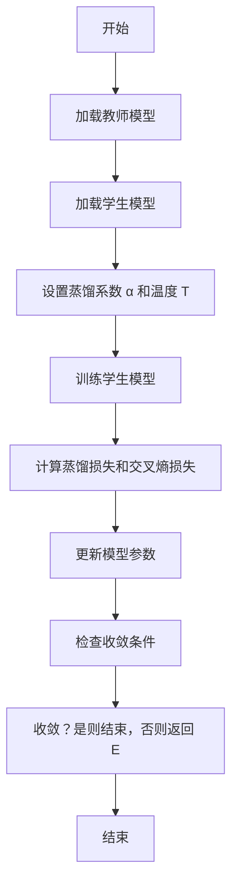
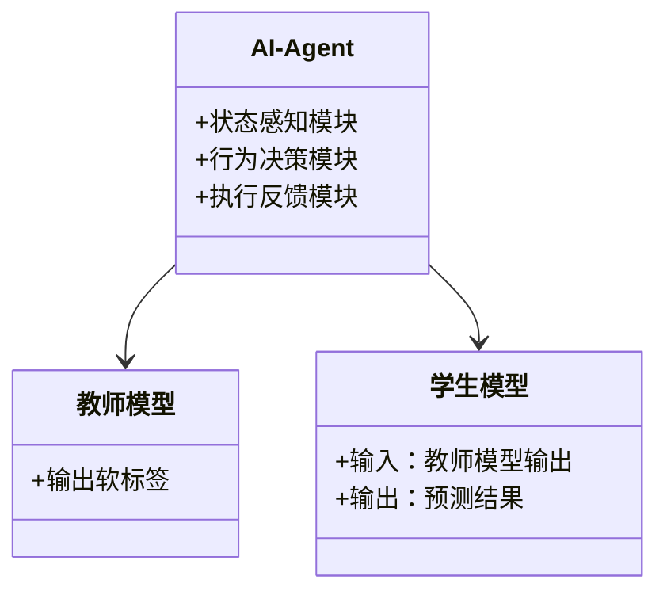

                 


---

# AI Agent的知识蒸馏在IoT设备中的应用

---

## 关键词：
AI Agent，知识蒸馏，IoT设备，模型压缩，边缘计算，智能优化，资源优化

---

## 摘要：
本文深入探讨了AI Agent与知识蒸馏技术在物联网设备中的应用，分析了知识蒸馏在AI Agent模型压缩中的核心原理，结合实际案例展示了如何通过知识蒸馏优化AI Agent在IoT环境中的性能。文章从理论基础到实际应用，详细阐述了知识蒸馏在IoT中的技术实现和优化策略，为物联网领域的AI应用提供了新的思路和解决方案。

---

# 第1章 AI Agent与知识蒸馏概述

## 1.1 AI Agent的基本概念
### 1.1.1 AI Agent的定义
AI Agent是一种能够感知环境、做出决策并执行操作的智能实体，通常用于实现特定任务。

### 1.1.2 AI Agent的核心特征
- **自主性**：能够在没有外部干预的情况下运行。
- **反应性**：能够实时感知环境并做出反应。
- **目标导向**：以实现特定目标为导向。
- **学习能力**：能够通过经验优化自身行为。

### 1.1.3 AI Agent与传统AI的区别
- **自主性**：AI Agent更注重自主决策。
- **实时性**：AI Agent强调实时响应。
- **适应性**：能够根据环境变化调整行为。

## 1.2 知识蒸馏的基本概念
### 1.2.1 知识蒸馏的定义
知识蒸馏是一种通过教师模型指导学生模型学习的技术，旨在将教师模型的知识迁移到学生模型，从而实现模型压缩和性能优化。

### 1.2.2 知识蒸馏的核心原理
知识蒸馏通过将教师模型的输出作为软标签，引导学生模型进行学习，从而实现知识的传递。

### 1.2.3 知识蒸馏与传统模型压缩技术的对比
- **传统模型压缩**：通过剪枝、量化等技术直接压缩模型。
- **知识蒸馏**：通过教师模型指导学生模型学习，实现更高效的模型压缩。

## 1.3 AI Agent与知识蒸馏在IoT中的应用背景
### 1.3.1 IoT设备的特点与挑战
- **资源受限**：IoT设备通常计算能力有限。
- **数据量大**：IoT设备需要处理大量数据。
- **延迟敏感**：需要实时响应。

### 1.3.2 知识蒸馏在IoT中的潜在价值
- **减少模型体积**：通过知识蒸馏，可以在IoT设备上运行更小的模型。
- **提升性能**：在资源受限的情况下，仍能保持较高的模型性能。

### 1.3.3 AI Agent在IoT中的应用场景
- **智能传感器**：通过AI Agent实现智能感知和决策。
- **智能设备管理**：优化设备的能耗和性能。

## 1.4 本章小结
本章介绍了AI Agent和知识蒸馏的基本概念，并分析了它们在IoT中的应用背景和潜在价值。

---

# 第2章 AI Agent与知识蒸馏的核心原理

## 2.1 AI Agent的组成与功能
### 2.1.1 状态感知模块
AI Agent通过传感器或其他输入方式感知环境状态。

### 2.1.2 行为决策模块
根据感知到的状态，AI Agent做出决策并执行操作。

### 2.1.3 执行反馈模块
AI Agent通过执行反馈模块接收执行结果并调整后续行为。

## 2.2 知识蒸馏的核心原理
### 2.2.1 知识蒸馏的基本流程
1. **教师模型训练**：首先训练一个高性能的教师模型。
2. **学生模型初始化**：初始化一个较小的学生模型。
3. **蒸馏过程**：通过蒸馏技术，将教师模型的知识迁移到学生模型。

### 2.2.2 教师模型与学生模型的关系
- **教师模型**：提供软标签，用于指导学生模型学习。
- **学生模型**：通过学习教师模型的软标签，实现知识的迁移。

### 2.2.3 蒸馏损失函数的定义
蒸馏损失函数通常包括两部分：学生模型输出与教师模型输出之间的差异，以及学生模型输出与真实标签之间的差异。

$$ L = \alpha L_{\text{distillation}} + (1-\alpha) L_{\text{cross-entropy}} $$

其中，$\alpha$ 是蒸馏系数，$L_{\text{distillation}}$ 是蒸馏损失，$L_{\text{cross-entropy}}$ 是交叉熵损失。

## 2.3 AI Agent与知识蒸馏的结合原理
### 2.3.1 知识蒸馏在AI Agent中的作用
知识蒸馏通过压缩教师模型的知识，使AI Agent能够在资源受限的环境中运行。

### 2.3.2 AI Agent如何利用蒸馏技术优化性能
通过蒸馏技术，AI Agent可以在不显著降低性能的前提下，减少模型体积。

### 2.3.3 蒸馏过程中的关键参数与优化方法
- **蒸馏系数 $\alpha$**：控制蒸馏损失和交叉熵损失的比例。
- **教师模型的选择**：选择一个性能优秀的教师模型。
- **学生模型的设计**：设计一个适合蒸馏的学生模型。

## 2.4 本章小结
本章详细阐述了AI Agent和知识蒸馏的核心原理，并分析了它们在IoT中的结合方式。

---

# 第3章 知识蒸馏的算法原理与数学模型

## 3.1 知识蒸馏的算法原理
### 3.1.1 蒸馏损失函数
蒸馏损失函数用于衡量学生模型输出与教师模型输出之间的差异。

### 3.1.2 蒸馏过程的优化方法
通过优化蒸馏系数 $\alpha$ 和温度 $T$，可以进一步提升蒸馏效果。

### 3.1.3 蒸馏算法的收敛性分析
蒸馏算法通常采用梯度下降方法优化模型参数，具有较好的收敛性。

## 3.2 知识蒸馏的数学模型
### 3.2.1 教师模型的输出表示
教师模型的输出通常表示为概率分布，通过Softmax函数获得。

$$ P_{\text{teacher}}(y|x) = \text{Softmax}(\frac{f_{\text{teacher}}(x)}{T}) $$

其中，$T$ 是温度参数。

### 3.2.2 学生模型的输出表示
学生模型的输出表示为：

$$ P_{\text{student}}(y|x) = \text{Softmax}(f_{\text{student}}(x)) $$

### 3.2.3 蒸馏损失函数的数学表达式
蒸馏损失函数可以表示为：

$$ L_{\text{distillation}} = -\sum_{i=1}^{n} P_{\text{teacher}}(y_i|x) \log P_{\text{student}}(y_i|x) $$

其中，$n$ 是样本数量。

## 3.3 算法流程图



## 3.4 本章小结
本章详细分析了知识蒸馏的算法原理和数学模型，并通过流程图展示了蒸馏过程。

---

# 第4章 AI Agent在IoT中的系统架构设计

## 4.1 IoT设备的特点与系统架构
IoT系统通常包括感知层、网络层和应用层。

### 4.1.1 感知层
负责数据的采集和初步处理。

### 4.1.2 网络层
负责数据的传输和通信。

### 4.1.3 应用层
负责数据的分析和处理。

## 4.2 AI Agent的系统架构设计
### 4.2.1 系统功能设计
- **数据采集**：通过传感器采集数据。
- **数据处理**：对数据进行预处理和分析。
- **决策与执行**：根据分析结果做出决策并执行操作。

### 4.2.2 系统架构图



## 4.3 知识蒸馏在系统架构中的应用
### 4.3.1 教师模型的选择与部署
选择一个性能优秀的教师模型，并将其部署在边缘计算节点上。

### 4.3.2 学生模型的部署与优化
通过知识蒸馏优化学生模型，使其能够在资源受限的设备上运行。

## 4.4 本章小结
本章分析了IoT系统的架构，并详细阐述了AI Agent和知识蒸馏在系统中的应用。

---

# 第5章 知识蒸馏在AI Agent中的实战

## 5.1 环境安装与配置
### 5.1.1 安装Python环境
使用Anaconda或虚拟环境管理工具安装Python。

### 5.1.2 安装必要的库
安装PyTorch、TensorFlow等深度学习框架。

## 5.2 知识蒸馏的代码实现
### 5.2.1 教师模型的定义与训练
```python
class TeacherModel(torch.nn.Module):
    def __init__(self):
        super().__init__()
        self.fc1 = torch.nn.Linear(784, 1200)
        self.fc2 = torch.nn.Linear(1200, 10)
    
    def forward(self, x):
        x = x.view(-1, 784)
        x = torch.nn.functional.relu(self.fc1(x))
        x = torch.nn.functional.log_softmax(self.fc2(x), dim=1)
        return x
```

### 5.2.2 学生模型的定义与训练
```python
class StudentModel(torch.nn.Module):
    def __init__(self):
        super().__init__()
        self.fc1 = torch.nn.Linear(784, 500)
        self.fc2 = torch.nn.Linear(500, 10)
    
    def forward(self, x):
        x = x.view(-1, 784)
        x = torch.nn.functional.relu(self.fc1(x))
        x = torch.nn.functional.log_softmax(self.fc2(x), dim=1)
        return x
```

### 5.2.3 蒸馏过程的实现
```python
def distillation_loss(output_student, output_teacher, temperature=1.0):
    student软标签 = torch.nn.functional.softmax(output_student / temperature, dim=1)
    teacher软标签 = torch.nn.functional.softmax(output_teacher / temperature, dim=1)
    loss = torch.nn.KLDivLoss(reduction='batchmean')(student软标签.log(), teacher软标签)
    return loss * temperature**2

# 总损失函数
alpha = 0.5
total_loss = alpha * distillation_loss(output_student, output_teacher) + (1-alpha) * cross_entropy_loss(output_student, labels)
```

## 5.3 实战案例分析
### 5.3.1 案例背景
在IoT设备上部署一个图像分类任务。

### 5.3.2 案例实现
通过知识蒸馏优化学生模型，使其能够在资源受限的设备上运行。

## 5.4 本章小结
本章通过实战案例详细展示了知识蒸馏在AI Agent中的具体实现过程。

---

# 第6章 知识蒸馏在AI Agent中的优化与挑战

## 6.1 知识蒸馏的优化策略
### 6.1.1 蒸馏系数的优化
通过调整蒸馏系数 $\alpha$ 和温度 $T$，可以进一步优化蒸馏效果。

### 6.1.2 模型压缩技术的结合
将知识蒸馏与其他模型压缩技术结合，进一步减少模型体积。

## 6.2 知识蒸馏在IoT中的挑战
### 6.2.1 资源受限问题
IoT设备通常计算能力和存储能力有限，限制了知识蒸馏的应用。

### 6.2.2 实时性要求
知识蒸馏需要在实时性要求较高的环境中快速完成，这对算法效率提出了更高的要求。

## 6.3 应对挑战的策略
### 6.3.1 轻量化设计
通过模型剪枝、知识蒸馏等技术，进一步优化模型体积。

### 6.3.2 边缘计算的结合
利用边缘计算资源，提升知识蒸馏的效率。

## 6.4 本章小结
本章分析了知识蒸馏在IoT中的优化策略和面临的挑战，并提出了应对策略。

---

# 第7章 总结与展望

## 7.1 本章总结
本文详细探讨了AI Agent与知识蒸馏在IoT设备中的应用，分析了知识蒸馏的核心原理和算法实现，结合实战案例展示了其在IoT中的具体应用。

## 7.2 未来展望
随着IoT技术的不断发展，知识蒸馏在AI Agent中的应用将更加广泛，未来的研究方向包括优化蒸馏算法、结合边缘计算等。

## 7.3 最佳实践 Tips
- 在IoT设备上部署AI Agent时，优先考虑资源受限的问题，选择合适的模型压缩技术。
- 通过知识蒸馏优化模型性能，同时保持较低的模型体积。

## 7.4 本章小结
本章总结了全文内容，并展望了未来的研究方向。

---

# 参考文献
（此处列出相关参考文献）

---

# 索引
（此处列出关键词索引）

---

# 致谢
（此处感谢支持和帮助的人）

---

# 附录
（此处列出附录内容）

