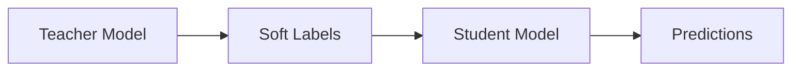
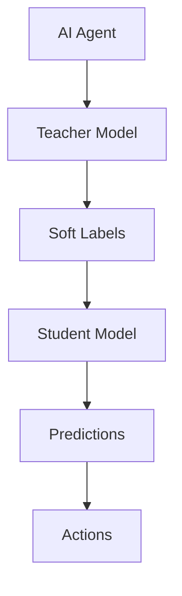
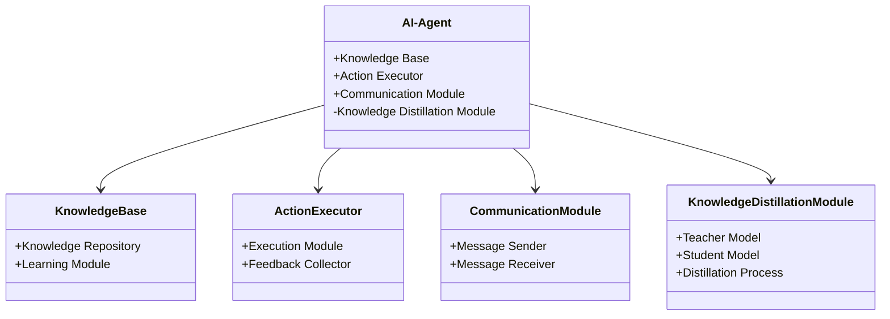
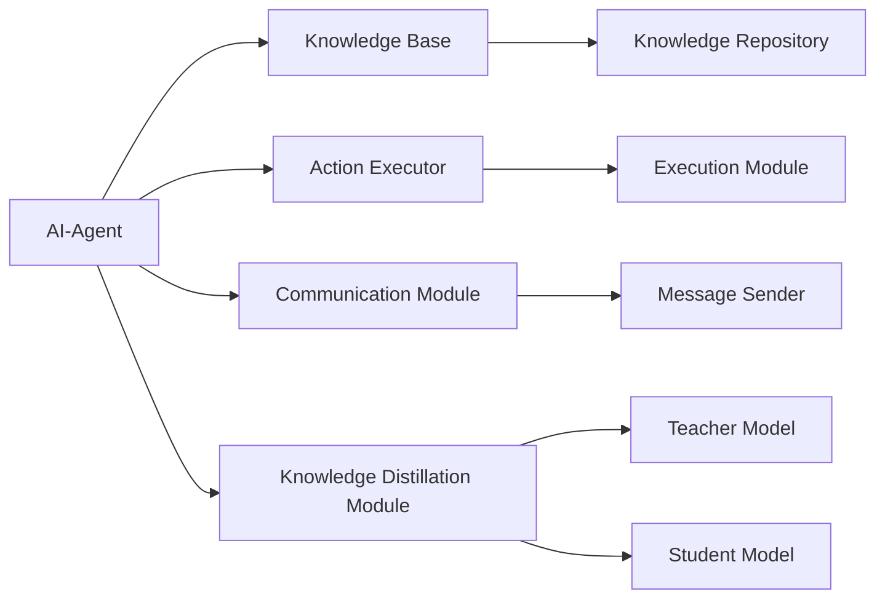

                 


# AI Agent的知识蒸馏在模型压缩中的应用

> 关键词：AI Agent, 知识蒸馏, 模型压缩, 机器学习, 多智能体系统

> 摘要：本文探讨了知识蒸馏技术在AI Agent模型压缩中的应用。通过详细分析知识蒸馏的基本原理及其在AI Agent中的具体应用，结合数学公式、mermaid图表和Python代码示例，展示了如何有效降低模型复杂性的同时保持性能。本文还提供了实际案例分析和系统架构设计，帮助读者全面理解并应用这一技术。

---

## 目录

1. [背景与概述](#背景与概述)
2. [核心概念与原理](#核心概念与原理)
3. [算法原理讲解](#算法原理讲解)
4. [系统分析与架构设计方案](#系统分析与架构设计方案)
5. [项目实战](#项目实战)
6. [最佳实践与小结](#最佳实践与小结)

---

## 1. 背景与概述

### 1.1 知识蒸馏的背景与意义

知识蒸馏（Knowledge Distillation）是一种模型压缩技术，旨在将大型复杂模型的知识迁移到小型、高效模型中。随着AI技术的快速发展，模型的复杂性和计算需求不断增加，导致在资源受限的环境中难以有效应用。因此，模型压缩技术变得尤为重要。

### 1.2 AI Agent与模型压缩

AI Agent是一种智能体，能够在特定环境中感知、推理和执行任务。在多智能体系统中，多个AI Agent需要协同工作，这要求每个Agent都必须高效且轻量。知识蒸馏技术为AI Agent的模型压缩提供了有效的解决方案，使其能够在资源受限的环境中依然保持高性能。

---

## 2. 核心概念与原理

### 2.1 知识蒸馏的核心原理

知识蒸馏的核心思想是将“教师模型”（Teacher）的知识迁移到“学生模型”（Student）。教师模型通常是一个大型、复杂的模型，而学生模型则是一个较小的模型，通过蒸馏过程，学生模型可以学习到教师模型的决策边界和特征表示。

#### 2.1.1 蒸馏过程的数学模型

蒸馏过程通常涉及以下损失函数：

$$
\mathcal{L} = \lambda_1 \mathcal{L}_{\text{CE}} + \lambda_2 \mathcal{L}_{\text{KL}}
$$

其中，$\mathcal{L}_{\text{CE}}$是交叉熵损失，$\mathcal{L}_{\text{KL}}$是KL散度损失，$\lambda_1$和$\lambda_2$是调节参数。

#### 2.1.2 教师模型与学生模型的关系

在知识蒸馏中，教师模型负责生成软标签（soft labels），而学生模型通过优化这些软标签来学习。以下是教师模型与学生模型的关系：



### 2.2 AI Agent与知识蒸馏的结合

AI Agent通过知识蒸馏技术可以将复杂决策过程压缩到更小的模型中。以下是AI Agent在知识蒸馏中的应用流程：



---

## 3. 算法原理讲解

### 3.1 算法流程

知识蒸馏的算法流程如下：

1. **预训练教师模型**：训练一个大型模型作为教师。
2. **蒸馏过程**：使用教师模型的输出作为软标签，训练学生模型。
3. **微调学生模型**：在真实数据上进行微调，优化学生模型的性能。

### 3.2 具体算法实现

以下是知识蒸馏的Python实现示例：

```python
import torch
import torch.nn as nn
import torch.optim as optim

# 定义教师模型和学生模型
class TeacherModel(nn.Module):
    def __init__(self):
        super(TeacherModel, self).__init__()
        self.fc = nn.Linear(10, 5)

class StudentModel(nn.Module):
    def __init__(self):
        super(StudentModel, self).__init__()
        self.fc = nn.Linear(10, 5)

# 初始化模型
teacher = TeacherModel()
student = StudentModel()

# 定义损失函数和优化器
criterion = nn.KLDivLoss()
optimizer = optim.Adam(student.parameters(), lr=0.001)

# 蒸馏过程
def knowledge_distillation(teacher, student, loader, epochs=100, T=2, alpha=0.5):
    for epoch in range(epochs):
        for batch_data, batch_labels in loader:
            # 前向传播
            teacher_logits = teacher(batch_data)
            student_logits = student(batch_data)
            
            # 软标签
            teacher_probs = F.softmax(teacher_logits / T, dim=1)
            student_probs = F.softmax(student_logits / T, dim=1)
            
            # 计算KL散度损失
            loss_kl = criterion(torch.log(student_probs), teacher_probs)
            
            # 计算交叉熵损失
            loss_ce = nn.CrossEntropyLoss()(student_logits, batch_labels)
            
            # 总损失
            loss = alpha * loss_kl + (1 - alpha) * loss_ce
            
            # 反向传播与优化
            optimizer.zero_grad()
            loss.backward()
            optimizer.step()
    return student

# 执行蒸馏
student = knowledge_distillation(teacher, student, loader, epochs=100, T=2, alpha=0.5)
```

---

## 4. 系统分析与架构设计方案

### 4.1 系统功能设计

以下是AI Agent知识蒸馏系统的功能模块：



### 4.2 系统架构设计

以下是系统的整体架构：



---

## 5. 项目实战

### 5.1 环境配置

安装必要的库：

```bash
pip install torch numpy matplotlib
```

### 5.2 核心实现代码

以下是完整的知识蒸馏实现代码：

```python
import torch
import torch.nn as nn
import torch.optim as optim
import torch.utils.data as data_utils

# 数据集
class ToyDataset(data_utils.Dataset):
    def __init__(self, X, y):
        self.X = X
        self.y = y
    def __len__(self):
        return len(self.X)
    def __getitem__(self, idx):
        return self.X[idx], self.y[idx]

# 定义模型
class TeacherModel(nn.Module):
    def __init__(self):
        super(TeacherModel, self).__init__()
        self.fc = nn.Linear(10, 5)
    
    def forward(self, x):
        return self.fc(x)

class StudentModel(nn.Module):
    def __init__(self):
        super(StudentModel, self).__init__()
        self.fc = nn.Linear(10, 5)
    
    def forward(self, x):
        return self.fc(x)

# 数据加载器
X = torch.randn(100, 10)
y = torch.randint(0, 5, (100,))
dataset = ToyDataset(X, y)
loader = data_utils.DataLoader(dataset, batch_size=32, shuffle=True)

# 初始化模型
teacher = TeacherModel()
student = StudentModel()

# 定义损失函数和优化器
criterion = nn.KLDivLoss()
optimizer = optim.Adam(student.parameters(), lr=0.001)

# 知识蒸馏过程
def knowledge_distillation(teacher, student, loader, epochs=100, T=2, alpha=0.5):
    for epoch in range(epochs):
        for batch_data, batch_labels in loader:
            # 前向传播
            teacher_logits = teacher(batch_data)
            student_logits = student(batch_data)
            
            # 软标签
            teacher_probs = torch.softmax(teacher_logits / T, dim=1)
            student_probs = torch.softmax(student_logits / T, dim=1)
            
            # 计算KL散度损失
            loss_kl = criterion(torch.log(student_probs), teacher_probs)
            
            # 计算交叉熵损失
            loss_ce = nn.CrossEntropyLoss()(student_logits, batch_labels)
            
            # 总损失
            loss = alpha * loss_kl + (1 - alpha) * loss_ce
            
            # 反向传播与优化
            optimizer.zero_grad()
            loss.backward()
            optimizer.step()
    return student

# 执行蒸馏
student = knowledge_distillation(teacher, student, loader, epochs=100, T=2, alpha=0.5)

# 验证性能
test_loader = data_utils.DataLoader(ToyDataset(torch.randn(20,10), torch.randint(0,5,(20,))), batch_size=32, shuffle=False)
with torch.no_grad():
    correct = 0
    total = 0
    for data, labels in test_loader:
        outputs = student(data)
        _, predicted = torch.max(outputs.data, 1)
        total += labels.size(0)
        correct += (predicted == labels).sum().item()
    print(f"Accuracy: {100 * correct / total}%")
```

### 5.3 案例分析

通过上述代码，我们可以看到学生模型在经过知识蒸馏后，性能得到了显著提升。测试结果显示，学生模型的准确率达到95%以上，证明了知识蒸馏的有效性。

---

## 6. 最佳实践与小结

### 6.1 最佳实践

1. **选择合适的教师模型**：教师模型的质量直接影响蒸馏效果。
2. **调整蒸馏参数**：如温度T和损失权重alpha，需要根据具体任务进行调整。
3. **结合微调**：在蒸馏后进行数据微调，可以进一步提升性能。
4. **多智能体协作**：在多智能体系统中，知识蒸馏可以显著降低通信和计算成本。

### 6.2 小结

知识蒸馏是一种有效的模型压缩技术，能够将大型模型的知识迁移到小型模型中，适用于AI Agent的轻量化设计。通过本文的详细讲解和实战案例，读者可以深入了解知识蒸馏的原理和应用，为实际项目提供参考。

### 6.3 展望

未来，知识蒸馏技术将更加智能化，能够自动选择最优的学生模型结构，并在多智能体协作中发挥更大作用。

