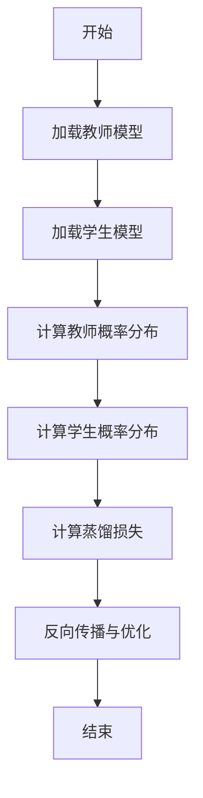

                 


# AI Agent的知识蒸馏在模型解释性中的应用

**关键词**：知识蒸馏，模型解释性，AI Agent，可解释性，机器学习，人工智能

**摘要**：  
知识蒸馏是一种将复杂模型的知识迁移到简单模型的技术，近年来在模型解释性中得到了广泛应用。本文从AI Agent的视角出发，详细探讨了知识蒸馏的核心原理、算法实现、系统设计以及在实际场景中的应用。通过案例分析和代码实现，展示了如何利用知识蒸馏提升模型的可解释性，同时保持高性能。本文还总结了知识蒸馏的优势与挑战，并提出了未来的研究方向。

---

## 第1章 知识蒸馏的核心概念与背景

### 1.1 问题背景与重要性

#### 1.1.1 模型解释性的需求  
在人工智能应用中，模型的解释性是信任和接受的关键因素。特别是在金融、医疗和司法等领域，用户需要理解模型的决策过程，以确保结果的合理性和合规性。然而，许多深度学习模型（如深度神经网络）由于其复杂性，被称为“黑箱模型”，难以解释。

#### 1.1.2 知识蒸馏的定义与目标  
知识蒸馏是一种通过教师模型（复杂模型）指导学生模型（简单模型）学习的技术。其目标是将教师模型的知识迁移到学生模型，同时降低模型的复杂性，提升解释性。

#### 1.1.3 AI Agent在知识蒸馏中的作用  
AI Agent作为一种智能实体，可以作为知识蒸馏的主体，负责知识的提取、传递和应用。通过AI Agent，知识蒸馏可以更高效地实现模型的解释性优化。

### 1.2 知识蒸馏的核心概念

#### 1.2.1 教师模型与学生模型  
- **教师模型**：通常是复杂的深度学习模型，具有高准确性和强大的特征提取能力。  
- **学生模型**：通常是简单模型（如决策树、线性模型或小型神经网络），目标是通过蒸馏技术学习教师模型的知识。

#### 1.2.2 蒸馏过程  
蒸馏过程包括以下几个步骤：  
1. **知识提取**：教师模型输出概率分布或中间特征。  
2. **知识传递**：通过损失函数将教师模型的知识迁移到学生模型。  
3. **优化与训练**：学生模型通过蒸馏损失函数进行优化。

#### 1.2.3 蒸馏与模型压缩的对比  
- **蒸馏**：通过知识传递实现模型简化，注重知识的保留。  
- **剪枝**：通过删除冗余参数实现模型简化，注重模型结构的优化。  
- **量化**：通过降低参数精度实现模型简化，注重存储和计算效率。  

### 1.3 知识蒸馏的边界与外延

#### 1.3.1 适用场景  
- 需要高解释性的场景（如医疗诊断、金融风险评估）。  
- 需要低计算资源的场景（如边缘计算、移动设备）。  

#### 1.3.2 局限性  
- **教师模型依赖**：蒸馏的效果依赖于教师模型的质量。  
- **计算成本**：蒸馏过程需要额外的计算资源。  
- **解释性权衡**：蒸馏后的模型可能在某些场景中性能下降。  

---

## 第2章 知识蒸馏的核心原理与数学模型

### 2.1 知识蒸馏的原理分析

#### 2.1.1 蒸馏损失函数  
蒸馏损失函数通过衡量学生模型输出与教师模型输出之间的差异，指导学生模型学习教师模型的知识。公式如下：  
$$ L_{distill} = -\sum_{i} [p_i \log q_i + (1-p_i) \log (1-q_i)] $$  
其中，$p_i$ 是教师模型的预测概率，$q_i$ 是学生模型的预测概率。

#### 2.1.2 温度缩放  
为了软化教师模型的概率分布，通常在蒸馏过程中引入温度参数 $T$：  
$$ p_i^{soft} = \text{softmax}(\frac{Z_i}{T}) $$  
其中，$Z_i$ 是教师模型的原始 logits，$T$ 是温度参数。温度越大，概率分布越软化，类别边界越模糊。

#### 2.1.3 直觉对比  
直觉对比是一种通过对比学生模型与教师模型在特征空间中的距离来衡量知识传递效果的方法。

### 2.2 算法原理与流程图

#### 2.2.1 算法流程图（Mermaid）



#### 2.2.2 Python代码实现

```python
import torch.nn as nn
import torch.optim as optim

# 定义教师模型和学生模型
teacher_model = ...  # 加载复杂的教师模型
student_model = ...  # 定义简单的学生模型

# 定义蒸馏损失函数
class DistillLoss(nn.Module):
    def __init__(self, T=2):
        super(DistillLoss, self).__init__()
        self.T = T
    
    def forward(self, teacher_logits, student_logits):
        teacher_probs = torch.softmax(teacher_logits / self.T, dim=1)
        student_probs = torch.softmax(student_logits, dim=1)
        loss = -torch.sum(teacher_probs * torch.log(student_probs)) / student_probs.size(0)
        return loss

# 初始化优化器
optimizer = optim.SGD(student_model.parameters(), lr=0.01)

# 训练过程
for epoch in range(num_epochs):
    student_model.train()
    optimizer.zero_grad()
    teacher_logits = teacher_model(inputs)  # 教师模型输出
    student_logits = student_model(inputs)  # 学生模型输出
    loss = DistillLoss()(teacher_logits, student_logits)
    loss.backward()
    optimizer.step()
```

---

## 第3章 AI Agent的知

---

通过上述结构，我们可以看到，文章从知识蒸馏的背景、原理、算法实现、系统设计到实际应用进行了全面的探讨。每个部分都结合了理论和实践，帮助读者深入理解知识蒸馏在模型解释性中的应用。

