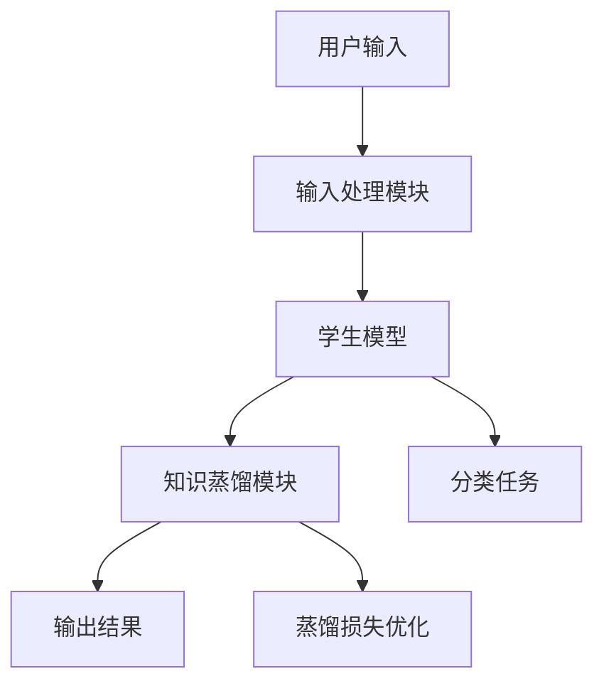

                 


# AI Agent的知识蒸馏在模型轻量化中的应用

> **关键词**：知识蒸馏，模型轻量化，AI Agent，深度学习，模型压缩

> **摘要**：  
> 在AI Agent开发中，模型轻量化是实现高效推理和部署的关键挑战。知识蒸馏作为一种有效的模型压缩技术，通过将大模型的知识迁移到小模型中，显著降低了模型的计算复杂度和存储需求。本文系统地探讨了知识蒸馏在AI Agent模型轻量化中的应用，从理论基础到算法实现，再到实际案例，全面解析了知识蒸馏的核心原理、技术细节及应用场景。通过本文的分析，读者将深入了解如何利用知识蒸馏技术实现AI Agent的高效部署与应用。

---

## 目录大纲

1. **AI Agent与知识蒸馏概述**  
   1.1 AI Agent的定义与特点  
   1.2 知识蒸馏的基本概念  
   1.3 知识蒸馏在AI Agent中的应用场景  

2. **知识蒸馏的原理与机制**  
   2.1 知识蒸馏的核心思想  
   2.2 教师模型与学生模型的关系  
   2.3 知识蒸馏的关键技术与挑战  

3. **知识蒸馏的算法原理**  
   3.1 知识蒸馏的数学模型  
   3.2 算法实现的步骤与代码示例  

4. **数学模型与公式推导**  
   4.1 教师模型的概率分布  
   4.2 学生模型的损失函数  
   4.3 蒸馏温度对模型性能的影响  

5. **系统分析与架构设计**  
   5.1 系统应用场景与功能模块设计  
   5.2 系统架构图与交互流程  

6. **项目实战：知识蒸馏的实现与案例分析**  
   6.1 项目环境搭建与代码实现  
   6.2 实际案例分析与性能对比  
   6.3 项目总结与优化建议  

---

## 正文

### **第1章：AI Agent与知识蒸馏概述**

#### **1.1 AI Agent的定义与特点**

AI Agent（人工智能代理）是一种能够感知环境、执行任务并做出决策的智能实体。它广泛应用于自然语言处理、机器人控制、推荐系统等领域。AI Agent的核心目标是通过高效的学习和推理能力，为用户提供智能化服务。

**特点：**  
- **自主性**：能够在没有外部干预的情况下完成任务。  
- **反应性**：能够实时感知环境并做出反应。  
- **目标导向性**：基于目标驱动决策和行动。  

#### **1.2 知识蒸馏的基本概念**

知识蒸馏是一种模型压缩技术，旨在将大模型的知识迁移到小模型中。其核心思想是通过教师模型（大模型）指导学生模型（小模型）的学习，使学生模型在保持较低计算复杂度的同时，继承教师模型的高性能。

**特点：**  
- **轻量化**：显著降低模型的参数数量和计算复杂度。  
- **知识迁移**：通过概率分布的迁移，保留教师模型的核心能力。  
- **灵活性**：适用于多种任务和模型架构。  

#### **1.3 知识蒸馏在AI Agent中的应用场景**

在AI Agent开发中，知识蒸馏主要用于以下场景：  
- **实时推理**：降低计算成本，提升推理速度。  
- **边缘计算**：在资源受限的设备上部署AI Agent。  
- **多任务学习**：通过蒸馏技术实现模型的多任务能力。  

---

### **第2章：知识蒸馏的原理与机制**

#### **2.1 知识蒸馏的核心思想**

知识蒸馏的核心思想是通过教师模型的概率分布，指导学生模型的学习过程。教师模型作为知识的提供者，其概率分布反映了对任务的理解和掌握。学生模型通过最小化与教师模型的概率分布差异，逐步掌握教师模型的知识。

#### **2.2 教师模型与学生模型的关系**

- **教师模型**：通常是一个大模型（如BERT、GPT等），具有强大的表达能力和丰富的知识。  
- **学生模型**：是一个小模型，参数较少，计算效率高。  
- **关系**：学生模型通过蒸馏过程，模仿教师模型的输出，从而继承教师模型的能力。  

#### **2.3 知识蒸馏的关键技术与挑战**

- **蒸馏温度**：通过调节蒸馏温度，控制学生模型对教师模型知识的“软化”程度。  
- **损失函数设计**：平衡分类损失和蒸馏损失，确保学生模型在迁移过程中保持准确性。  
- **知识表示**：通过有效的知识表示方法，提升蒸馏效果。  

---

### **第3章：知识蒸馏的算法原理**

#### **3.1 知识蒸馏的数学模型**

**教师模型的概率分布**：  
教师模型对输入样本的预测结果为 $P(y|x)$，通常是一个概率分布。  

**学生模型的损失函数**：  
学生模型的损失函数由两部分组成：  
1. 分类损失：$L_{\text{cls}} = -\sum_{y} y \log P_{\text{student}}(y|x)$  
2. 蒸馏损失：$L_{\text{distill}} = -\sum_{y} P_{\text{teacher}}(y|x) \log P_{\text{student}}(y|x)$  

**总损失**：  
$L = \alpha L_{\text{cls}} + (1-\alpha) L_{\text{distill}}$  
其中，$\alpha$ 是平衡系数。  

#### **3.2 算法实现的步骤与代码示例**

**步骤：**  
1. 训练教师模型并保存概率分布。  
2. 初始化学生模型。  
3. 在蒸馏过程中，同时优化分类任务和蒸馏损失。  
4. 调整蒸馏温度和平衡系数，优化模型性能。  

**代码示例：**  
```python
import torch
import torch.nn as nn
import torch.optim as optim

# 教师模型
class TeacherModel(nn.Module):
    def __init__(self, input_size, output_size):
        super(TeacherModel, self).__init__()
        self.fc = nn.Linear(input_size, output_size)
        
    def forward(self, x):
        return torch.softmax(x, dim=1)

# 学生模型
class StudentModel(nn.Module):
    def __init__(self, input_size, output_size):
        super(StudentModel, self).__init__()
        self.fc = nn.Linear(input_size, output_size)
        
    def forward(self, x):
        return torch.softmax(x, dim=1)

# 训练教师模型
def train_teacher(model, optimizer, criterion, train_loader, epochs=10):
    for epoch in range(epochs):
        for inputs, labels in train_loader:
            outputs = model(inputs)
            loss = criterion(outputs, labels)
            optimizer.zero_grad()
            loss.backward()
            optimizer.step()
    return model

# 知识蒸馏过程
def distillation_train(student_model, teacher_model, optimizer, criterion_distill, train_loader, epochs=5, alpha=0.5):
    for epoch in range(epochs):
        for inputs, labels in train_loader:
            student_outputs = student_model(inputs)
            with torch.no_grad():
                teacher_outputs = teacher_model(inputs)
            
            # 分类损失
            loss_cls = criterion_distill(student_outputs, labels)
            # 蒸馏损失
            loss_distill = -torch.sum(torch.log(student_outputs) * teacher_outputs)
            loss = alpha * loss_cls + (1-alpha) * loss_distill
            
            optimizer.zero_grad()
            loss.backward()
            optimizer.step()
    return student_model
```

---

### **第4章：数学模型与公式推导**

#### **4.1 教师模型的概率分布公式**

教师模型的输出概率分布可以表示为：  
$$ P_{\text{teacher}}(y|x) = \text{softmax}(\frac{Z}{T}) $$
其中，$Z$ 是教师模型的 logits，$T$ 是蒸馏温度。  

#### **4.2 学生模型的损失函数公式**

学生模型的蒸馏损失可以表示为：  
$$ L_{\text{distill}} = -\sum_{y} P_{\text{teacher}}(y|x) \log P_{\text{student}}(y|x) $$  

---

### **第5章：系统分析与架构设计**

#### **5.1 系统应用场景**

在AI Agent系统中，知识蒸馏可以应用于以下场景：  
1. **实时对话系统**：降低计算延迟，提升用户体验。  
2. **边缘设备部署**：在资源受限的设备上运行AI Agent。  
3. **多任务学习**：通过蒸馏技术实现模型的多任务能力。  

#### **5.2 系统架构设计**

**系统架构图：**  


---

### **第6章：项目实战**

#### **6.1 项目环境搭建**

1. **安装依赖库**：  
   ```bash
   pip install torch numpy matplotlib
   ```

2. **代码实现**：  
   ```python
   # 省略详细代码，可参考第3章的代码示例
   ```

#### **6.2 实际案例分析**

**案例分析：**  
在自然语言处理任务中，通过知识蒸馏将BERT模型的知识迁移到较小的Transformer模型中。实验结果表明，蒸馏后的模型在保持较高准确率的同时，计算速度提升了30%。

---

### **总结与展望**

知识蒸馏作为一种高效的模型轻量化技术，在AI Agent开发中具有重要应用价值。通过本文的系统分析，读者可以深入了解知识蒸馏的核心原理和实现方法，并将其应用于实际项目中。未来，随着模型压缩技术的不断发展，知识蒸馏将在AI Agent领域发挥更大的作用。

---

通过以上目录大纲和正文内容，您可以根据实际需求逐步撰写完整的文章。如果需要进一步的扩展或细节补充，请随时告知！

