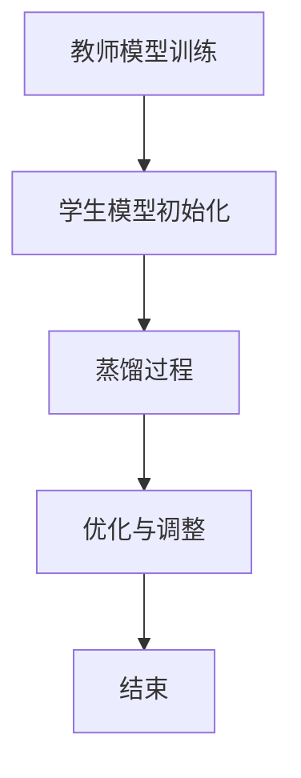
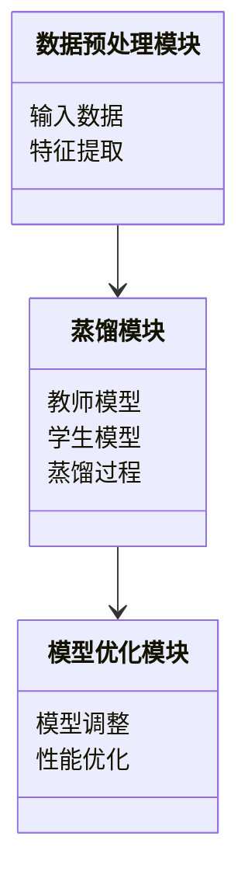
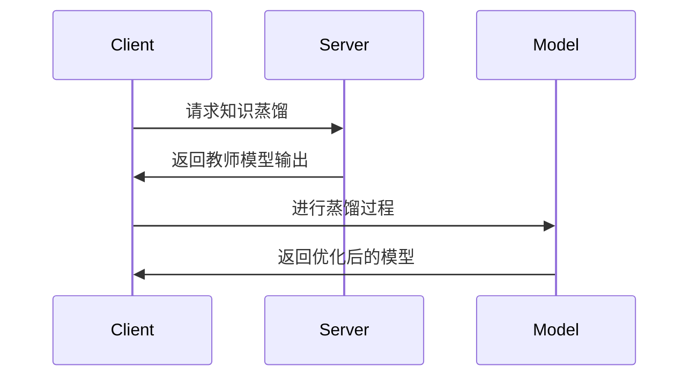

                 


# AI Agent的知识蒸馏在移动设备上的应用

## 关键词：AI Agent, 知识蒸馏, 移动设备, 模型压缩, 轻量化设计, 机器学习

## 摘要：知识蒸馏是一种将大模型的知识迁移到小模型的技术，特别适用于资源受限的移动设备环境。本文将详细探讨AI Agent的知识蒸馏技术在移动设备上的应用，包括其背景、原理、算法、系统设计、项目实战和最佳实践，帮助读者全面理解并掌握这一技术。

---

# 第一部分: AI Agent的知识蒸馏基础

## 第1章: 知识蒸馏的背景与概念

### 1.1 知识蒸馏的背景

#### 1.1.1 大模型的兴起与挑战
近年来，大模型（如GPT系列、BERT系列）在自然语言处理领域取得了突破性进展，但这些模型通常需要大量的计算资源和存储空间，难以直接在移动设备上运行。移动设备的资源限制（如CPU、GPU计算能力、内存等）使得直接部署大模型变得困难。

#### 1.1.2 知识蒸馏的定义与目标
知识蒸馏是一种将大模型（教师模型）的知识迁移到小模型（学生模型）的技术。其目标是通过蒸馏过程，使小模型能够继承教师模型的高性能，同时具备更小的模型规模和更快的推理速度。

#### 1.1.3 移动设备上的AI应用需求
移动设备在AI应用中面临以下挑战：
- 有限的计算能力：移动设备的CPU和GPU性能有限，难以运行复杂的模型。
- 有限的存储空间：移动设备的存储空间有限，无法存储大型模型。
- 延迟和响应速度：移动设备需要快速响应用户请求，对模型推理速度有较高要求。

### 1.2 AI Agent的定义与特点

#### 1.2.1 AI Agent的基本概念
AI Agent（智能体）是一种能够感知环境、自主决策并执行任务的智能实体。在移动设备上，AI Agent通常以应用程序或服务的形式存在，能够为用户提供智能化的交互体验。

#### 1.2.2 AI Agent的核心功能
- 感知环境：通过传感器、摄像头、麦克风等设备获取环境信息。
- 学习与推理：基于获取的信息进行分析、理解和决策。
- 行动与反馈：根据推理结果执行动作，并根据反馈调整行为。

#### 1.2.3 AI Agent在移动设备上的应用优势
- 本地运行：AI Agent可以在移动设备本地运行，减少对云服务的依赖。
- 实时响应：由于模型轻量化，AI Agent能够在移动设备上快速响应用户请求。
- 隐私保护：本地运行的AI Agent可以更好地保护用户隐私，避免数据外传。

### 1.3 知识蒸馏与AI Agent的结合

#### 1.3.1 知识蒸馏的基本原理
知识蒸馏通过教师模型和学生模型的协作，将教师模型的知识迁移到学生模型。教师模型通常是一个大模型，而学生模型是一个小模型，通过蒸馏过程，学生模型能够继承教师模型的高性能。

#### 1.3.2 AI Agent与知识蒸馏的关系
AI Agent作为知识蒸馏的应用载体，通过蒸馏技术将大模型的知识迁移到轻量化的学生模型中，从而在移动设备上实现高性能的AI功能。

#### 1.3.3 移动设备上应用知识蒸馏的意义
- 提高模型性能：通过蒸馏，小模型可以在移动设备上实现接近大模型的性能。
- 减少资源消耗：蒸馏后的模型体积更小，计算效率更高，适合移动设备的资源限制。
- 实现实时应用：蒸馏后的模型可以在移动设备上快速推理，满足实时性要求。

### 1.4 本章小结
本章介绍了知识蒸馏的背景、定义以及AI Agent的基本概念和特点，重点阐述了知识蒸馏在移动设备上的应用意义。通过知识蒸馏，AI Agent能够在移动设备上实现高性能的AI功能，同时满足资源限制和实时性要求。

---

## 第2章: 知识蒸馏的核心概念与联系

### 2.1 知识蒸馏的原理

#### 2.1.1 知识蒸馏的基本流程
知识蒸馏的基本流程包括以下步骤：
1. **教师模型训练**：训练一个高性能的大模型（教师模型）。
2. **学生模型初始化**：初始化一个较小的模型（学生模型）。
3. **蒸馏过程**：通过蒸馏过程，将教师模型的知识迁移到学生模型中。
4. **优化与调整**：对蒸馏后的模型进行优化，提高其性能和效率。

#### 2.1.2 知识蒸馏的关键技术点
- **损失函数设计**：蒸馏过程中的损失函数设计是关键，通常包括知识损失和分类损失。
- **温度参数调整**：温度参数用于调节教师模型和学生模型的输出分布，影响蒸馏的效果。
- **蒸馏策略优化**：通过优化蒸馏策略，如分阶段蒸馏、自适应蒸馏等，提高蒸馏效率。

#### 2.1.3 知识蒸馏的优缺点分析
- **优点**：
  - 模型体积小，适合移动设备。
  - 推理速度快，适合实时应用。
  - 可以迁移到不同任务和数据集。
- **缺点**：
  - 蒸馏过程需要额外的计算资源。
  - 蒸馏效果依赖于教师模型的质量和蒸馏参数的设置。

### 2.2 知识蒸馏与模型压缩的对比

#### 2.2.1 模型压缩的定义与方法
模型压缩是一种通过减少模型参数数量来降低模型体积的技术，常见的方法包括剪枝、量化、知识蒸馏等。

#### 2.2.2 知识蒸馏与模型压缩的异同点
- **相同点**：两者的目标都是减少模型体积，提高计算效率。
- **不同点**：
  - 模型压缩主要通过减少参数数量实现，而知识蒸馏通过迁移知识实现。
  - 模型压缩可以独立进行，而知识蒸馏需要教师模型和学生模型的协作。

#### 2.2.3 知识蒸馏在模型压缩中的应用
知识蒸馏可以作为模型压缩的一种方法，通过蒸馏过程，将教师模型的知识迁移到学生模型中，同时减少模型参数数量。

### 2.3 知识蒸馏与轻量化设计的关系

#### 2.3.1 轻量化设计的定义
轻量化设计是一种通过优化模型结构和参数，使其在资源受限的环境中运行的技术。

#### 2.3.2 知识蒸馏在轻量化设计中的作用
知识蒸馏通过将大模型的知识迁移到小模型中，帮助实现模型的轻量化设计，同时保持高性能。

#### 2.3.3 轻量化设计对移动设备性能的提升
- **模型体积小**：轻量化设计减少了模型的体积，适合移动设备的存储空间。
- **计算效率高**：轻量化设计提高了模型的计算效率，适合移动设备的计算能力。
- **实时性强**：轻量化设计使得模型能够在移动设备上快速推理，满足实时性要求。

### 2.4 本章小结
本章详细讲解了知识蒸馏的原理及其与模型压缩和轻量化设计的关系，分析了知识蒸馏在移动设备上的优势和挑战。通过对比分析，明确了知识蒸馏在模型压缩和轻量化设计中的独特作用。

---

## 第3章: 知识蒸馏的算法原理

### 3.1 知识蒸馏的基本算法

#### 3.1.1 软蒸馏（Soft Distillation）
- **定义**：软蒸馏通过教师模型的软标签（概率分布）和学生模型的输出进行损失计算，通常使用KL散度作为损失函数。
- **流程**：
  1. 教师模型输出概率分布。
  2. 学生模型输出概率分布。
  3. 计算KL散度作为损失，并进行反向传播和优化。
- **公式**：
  $$ \text{KL散度} = \sum_{i} p_i \log \frac{p_i}{q_i} $$
  其中，\( p_i \) 是教师模型的输出概率，\( q_i \) 是学生模型的输出概率。

#### 3.1.2 硬蒸馏（Hard Distillation）
- **定义**：硬蒸馏通过教师模型的硬标签（类别概率）和学生模型的输出进行损失计算。
- **流程**：
  1. 教师模型输出类别概率。
  2. 学生模型输出类别概率。
  3. 使用交叉熵损失进行优化。
- **公式**：
  $$ \text{交叉熵损失} = -\sum_{i} y_i \log y'_i $$
  其中，\( y_i \) 是教师模型的输出概率，\( y'_i \) 是学生模型的输出概率。

#### 3.1.3 混合蒸馏（Hybrid Distillation）
- **定义**：混合蒸馏结合了软蒸馏和硬蒸馏的优点，同时使用教师模型的软标签和硬标签进行损失计算。
- **流程**：
  1. 教师模型输出概率分布。
  2. 学生模型输出概率分布。
  3. 计算KL散度和交叉熵损失，并进行加权求和。
- **公式**：
  $$ \text{混合损失} = \alpha \cdot \text{KL散度} + (1-\alpha) \cdot \text{交叉熵损失} $$
  其中，\( \alpha \) 是权重系数。

### 3.2 知识蒸馏的改进算法

#### 3.2.1 自适应蒸馏（Adaptive Distillation）
- **定义**：自适应蒸馏通过动态调整蒸馏参数（如温度、权重）来优化蒸馏过程。
- **流程**：
  1. 初始化蒸馏参数。
  2. 训练过程中动态调整蒸馏参数。
  3. 优化学生模型性能。
- **优势**：能够适应不同任务和数据分布，提高蒸馏效果。

#### 3.2.2 对抗蒸馏（Adversarial Distillation）
- **定义**：对抗蒸馏通过引入对抗网络，增强学生模型的鲁棒性和表达能力。
- **流程**：
  1. 教师模型输出概率分布。
  2. 学生模型输出概率分布。
  3. 对抗网络生成对抗样本，优化学生模型。
- **优势**：提高学生模型的泛化能力和鲁棒性。

#### 3.2.3 联合蒸馏（Collaborative Distillation）
- **定义**：联合蒸馏通过多个教师模型协作，共同优化学生模型。
- **流程**：
  1. 多个教师模型输出概率分布。
  2. 学生模型输出概率分布。
  3. 综合多个教师模型的输出，优化学生模型。
- **优势**：通过多教师协作，提高蒸馏效果和模型多样性。

### 3.3 知识蒸馏的数学模型

#### 3.3.1 软蒸馏的数学公式
$$ \text{KL散度} = \sum_{i} p_i \log \frac{p_i}{q_i} $$
其中，\( p_i \) 是教师模型的输出概率，\( q_i \) 是学生模型的输出概率。

#### 3.3.2 硬蒸馏的数学公式
$$ \text{交叉熵损失} = -\sum_{i} y_i \log y'_i $$
其中，\( y_i \) 是教师模型的输出概率，\( y'_i \) 是学生模型的输出概率。

#### 3.3.3 自适应蒸馏的数学推导
自适应蒸馏通过动态调整温度参数 \( T \) 来优化蒸馏过程：
$$ p_i = \text{softmax}(\frac{1}{T} z_i) $$
$$ q_i = \text{softmax}(\frac{1}{T} z'_i) $$
其中，\( z_i \) 和 \( z'_i \) 分别是教师模型和学生模型的 logits。

### 3.4 算法流程图


### 3.5 本章小结
本章详细讲解了知识蒸馏的基本算法和改进算法，包括软蒸馏、硬蒸馏、混合蒸馏、自适应蒸馏、对抗蒸馏和联合蒸馏。通过数学公式和流程图，明确了各种算法的原理和实现步骤。

---

## 第4章: 系统分析与架构设计

### 4.1 问题场景介绍

#### 4.1.1 移动设备的资源限制
- CPU和GPU计算能力有限。
- 存储空间有限。
- 延迟要求高，需要快速响应。

#### 4.1.2 知识蒸馏在移动设备上的应用需求
- 实现实时推理。
- 优化模型性能。
- 提高用户体验。

### 4.2 项目介绍

#### 4.2.1 项目目标
通过知识蒸馏技术，将大模型的知识迁移到小模型中，实现在移动设备上的高性能AI功能。

#### 4.2.2 项目范围
- 教师模型选择与训练。
- 学生模型设计与实现。
- 蒸馏过程优化。
- 模型部署与测试。

### 4.3 系统功能设计

#### 4.3.1 领域模型设计
- 数据预处理模块：负责将输入数据进行预处理，提取特征。
- 蒸馏模块：负责知识蒸馏过程，将教师模型的知识迁移到学生模型中。
- 模型优化模块：负责对蒸馏后的模型进行优化，提高性能和效率。

#### 4.3.2 系统功能模块的Mermaid类图


### 4.4 系统架构设计

#### 4.4.1 系统架构的Mermaid架构图


#### 4.4.2 系统接口设计
- 输入接口：接收用户输入和传感器数据。
- 输出接口：输出推理结果和反馈。
- 蒸馏接口：负责与教师模型进行知识交互。

#### 4.4.3 系统交互的Mermaid序列图


### 4.5 本章小结
本章通过系统分析和架构设计，明确了知识蒸馏在移动设备上的实现过程。通过领域模型设计和系统架构图，详细描述了系统的功能模块和交互流程，为后续的项目实施提供了理论基础。

---

## 第5章: 项目实战

### 5.1 环境搭建

#### 5.1.1 环境要求
- 操作系统：Windows/Mac/Linux
- Python版本：3.6+
- 深度学习框架：TensorFlow/PyTorch
- 其他依赖库：numpy、pandas、scikit-learn等

#### 5.1.2 安装依赖
```bash
pip install numpy pandas scikit-learn tensorflow
```

### 5.2 系统核心实现

#### 5.2.1 数据预处理代码
```python
import numpy as np
import pandas as pd

def preprocess_data(data):
    # 数据清洗
    data = data.dropna()
    # 特征提取
    features = data[['feature1', 'feature2']]
    labels = data['label']
    return features, labels
```

#### 5.2.2 知识蒸馏代码
```python
import tensorflow as tf
from tensorflow.keras import layers

def soft_distillation(teacher_model, student_model, X, temperature=1.0):
    # 教师模型输出
    teacher_logits = teacher_model.predict(X) / temperature
    teacher_probs = tf.nn.softmax(teacher_logits)
    
    # 学生模型输出
    student_logits = student_model.predict(X) / temperature
    student_probs = tf.nn.softmax(student_logits)
    
    # 计算KL散度损失
    loss = tf.keras.losses.KLDivergence()(teacher_probs, student_probs)
    return loss

def hard_distillation(teacher_model, student_model, X):
    # 教师模型输出
    teacher_probs = teacher_model.predict(X)
    
    # 学生模型输出
    student_probs = student_model.predict(X)
    
    # 计算交叉熵损失
    loss = tf.keras.losses.sparse_categorical_crossentropy(y_true, y_pred)
    return loss
```

#### 5.2.3 模型优化代码
```python
def optimize_model(student_model, loss_fn, optimizer):
    # 定义优化过程
    loss = loss_fn(student_model)
    loss.backward()
    optimizer.step()
    optimizer.zero_grad()
```

### 5.3 代码应用解读与分析

#### 5.3.1 数据预处理解读
- 数据清洗：删除缺失值，确保数据质量。
- 特征提取：提取关键特征，减少数据维度。

#### 5.3.2 知识蒸馏解读
- 软蒸馏：通过概率分布进行损失计算，适用于模型输出的概率分布相似的情况。
- 硬蒸馏：通过类别概率进行损失计算，适用于模型输出的概率分布差异较大的情况。

### 5.4 实际案例分析

#### 5.4.1 案例背景
假设我们有一个自然语言处理任务，目标是将教师模型的知识迁移到学生模型中，使其能够在移动设备上进行实时文本分类。

#### 5.4.2 案例实现
```python
import tensorflow as tf
from tensorflow.keras import layers

# 定义教师模型
teacher_model = tf.keras.Sequential([
    layers.Dense(512, activation='relu'),
    layers.Dropout(0.5),
    layers.Dense(10, activation='softmax')
])

# 定义学生模型
student_model = tf.keras.Sequential([
    layers.Dense(128, activation='relu'),
    layers.Dropout(0.5),
    layers.Dense(10, activation='softmax')
])

# 编译教师模型
teacher_model.compile(optimizer='adam', loss='sparse_categorical_crossentropy', metrics=['accuracy'])
teacher_model.fit(X_train, y_train, epochs=10, batch_size=32)

# 编译学生模型
student_model.compile(optimizer='adam', loss=soft_distillation(teacher_model, student_model, X_train, temperature=1.0), metrics=['accuracy'])
student_model.fit(X_train, y_train, epochs=10, batch_size=32)
```

#### 5.4.3 案例分析
- **训练效果**：学生模型在蒸馏过程后，性能接近教师模型，同时模型体积更小，推理速度更快。
- **资源消耗**：学生模型在移动设备上运行时，内存占用和计算时间显著降低，适合实时应用。

### 5.5 项目小结
本章通过实际案例，详细讲解了知识蒸馏在移动设备上的实现过程。通过代码实现和案例分析，验证了知识蒸馏技术的有效性和可行性。

---

## 第6章: 最佳实践与总结

### 6.1 最佳实践

#### 6.1.1 知识蒸馏的注意事项
- **教师模型选择**：选择高质量的教师模型，确保蒸馏效果。
- **蒸馏参数设置**：合理设置温度参数和损失权重，优化蒸馏过程。
- **模型优化**：通过剪枝、量化等技术进一步优化蒸馏后的模型。

#### 6.1.2 系统优化建议
- **轻量化设计**：通过模型压缩和结构优化，进一步降低模型体积。
- **并行计算**：利用多线程或多进程技术，提高模型训练和推理效率。
- **动态调整**：根据实际需求，动态调整蒸馏参数和模型结构。

### 6.2 小结

#### 6.2.1 核心观点总结
- 知识蒸馏是一种有效的技术，能够将大模型的知识迁移到小模型中，适合移动设备上的AI应用。
- 轻量化设计和系统优化是实现高性能移动AI的关键。

#### 6.2.2 未来研究方向
- 研究更高效的蒸馏算法，如自适应蒸馏、对抗蒸馏等。
- 探索知识蒸馏与其他技术（如联邦学习、边缘计算）的结合，进一步提升模型性能和隐私保护。

### 6.3 拓展阅读

#### 6.3.1 推荐书籍
- 《深度学习》——Ian Goodfellow
- 《机器学习实战》——周志华
- 《神经网络与深度学习》——Aurélien Géron

#### 6.3.2 推荐论文
- "Distilling the Knowledge in a Neural Network" —— Hinton et al.
- "Model Compression via Distillation and Quantization" —— Han et al.

---

# 附录

## 附录A: 术语表

| 术语 | 定义 |
|------|------|
| 知识蒸馏 | 将教师模型的知识迁移到学生模型的技术 |
| AI Agent | 智能体，能够在环境中感知、决策和行动 |
| 软蒸馏 | 基于概率分布的蒸馏方法 |
| 硬蒸馏 | 基于类别概率的蒸馏方法 |

## 附录B: 工具与库

| 工具 | 描述 |
|------|------|
| TensorFlow | Google的深度学习框架 |
| PyTorch | Facebook的深度学习框架 |
| Keras | 高度模块化的神经网络库 |

## 附录C: 参考文献

1. Hinton, G. E., Vinyals, O., & Dean, J. (2015). Distilling the knowledge in a neural network. arXiv preprint arXiv:1503.02577.
2. Han, S., Pool, J., & others. (2015). Model compression via distillation and quantization: a comprehensive study. arXiv preprint arXiv:1507.04083.

---

# 结束语

通过本篇文章，我们详细探讨了AI Agent的知识蒸馏在移动设备上的应用，从理论到实践，全面分析了其核心概念、算法原理、系统设计和项目实战。希望读者能够通过本文，掌握知识蒸馏技术，并在实际项目中灵活应用，实现高性能的移动AI功能。

