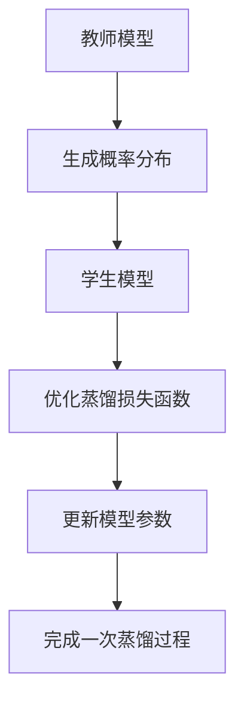
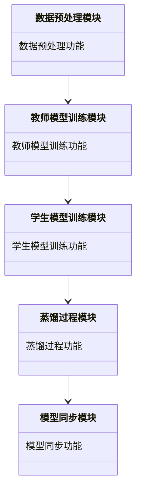
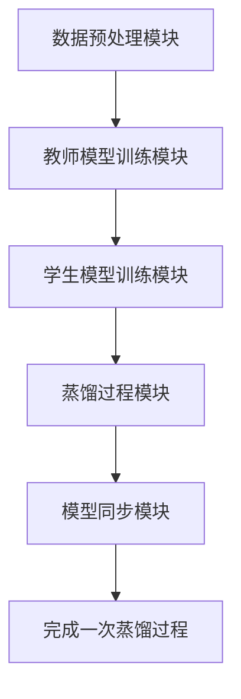

                 


# AI Agent的知识蒸馏在联邦学习中的应用

> 关键词：AI Agent，知识蒸馏，联邦学习，机器学习，分布式系统

> 摘要：本文探讨了AI Agent的知识蒸馏技术在联邦学习中的应用，分析了其核心原理、系统架构，并通过实际案例展示了其在分布式环境中的优势与挑战。文章详细讲解了算法原理、系统设计及项目实现，为读者提供了全面的理论与实践指导。

---

## 第一部分: AI Agent的知识蒸馏与联邦学习概述

### 第1章: AI Agent与知识蒸馏概述

#### 1.1 AI Agent的基本概念

##### 1.1.1 AI Agent的定义与特点

AI Agent（人工智能代理）是指能够感知环境并采取行动以实现特定目标的智能实体。AI Agent可以是软件程序、机器人或其他智能系统，具备以下特点：

- **自主性**：能够在没有外部干预的情况下自主决策。
- **反应性**：能够根据环境变化实时调整行为。
- **目标导向性**：所有行动均以实现特定目标为导向。
- **社会性**：能够与其他AI Agent或人类进行交互与协作。

AI Agent广泛应用于自动驾驶、智能助手、推荐系统等领域。

##### 1.1.2 AI Agent的分类与应用场景

AI Agent可以根据智能水平分为以下几类：

1. **反应式AI Agent**：基于当前感知做出反应，适用于实时交互场景。
2. **认知式AI Agent**：具备复杂推理和规划能力，适用于需要策略制定的场景。
3. **学习式AI Agent**：能够通过经验或数据不断优化自身行为。

应用场景包括自动驾驶（实时感知与决策）、智能助手（如Siri、Alexa）以及推荐系统（个性化内容推荐）等。

##### 1.1.3 知识蒸馏的基本概念与原理

知识蒸馏是一种将复杂模型的知识迁移到简单模型的技术，核心思想是利用教师模型（Teacher）的预测概率分布作为软标签，指导学生模型（Student）的学习过程。其主要步骤包括：

1. **知识表示**：教师模型生成概率分布表示。
2. **蒸馏过程**：学生模型通过优化蒸馏损失函数，学习教师模型的知识。
3. **蒸馏目标**：降低学生模型与教师模型之间的知识差距。

知识蒸馏在模型压缩、分布式学习等领域具有广泛应用。

#### 1.2 联邦学习的基本概念与特点

##### 1.2.1 联邦学习的定义与核心思想

联邦学习（Federated Learning）是一种在分布式数据环境中进行模型训练的技术，核心思想是：

- 数据保留在原始设备或服务器中，不进行集中共享。
- 各设备或服务器通过通信协议同步模型参数，进行联合训练。

##### 1.2.2 联邦学习的优势与挑战

**优势：**

- **数据隐私保护**：数据无需集中，保护用户隐私。
- **分布式计算**：适合大规模分布式环境，提升计算效率。
- **模型泛化能力**：在不同数据分布下保持良好的模型性能。

**挑战：**

- **通信开销**：频繁的数据传输可能导致较高的通信成本。
- **数据异构性**：不同设备的数据分布可能差异较大，影响模型收敛。
- **计算效率**：复杂的同步过程可能降低整体训练效率。

##### 1.2.3 联邦学习的应用场景与案例

联邦学习广泛应用于移动设备、IoT、医疗数据共享等领域。例如：

- **移动设备**：通过联邦学习优化手机端的推荐算法，提升用户体验。
- **IoT设备**：在智能家居中联合训练设备间的协同模型。
- **医疗领域**：在保护患者隐私的前提下，多个医疗机构联合训练疾病预测模型。

#### 1.3 知识蒸馏在联邦学习中的应用背景

##### 1.3.1 知识蒸馏在AI Agent中的作用

在联邦学习环境中，AI Agent通常需要在分布式数据源上进行训练和推理。知识蒸馏可以通过以下方式增强AI Agent的能力：

- **模型压缩**：在资源受限的设备上，通过蒸馏技术优化模型性能。
- **知识共享**：在分布式环境中，通过蒸馏实现知识的有效传递。
- **多任务学习**：利用蒸馏技术处理多个任务，提升模型的泛化能力。

##### 1.3.2 联邦学习与知识蒸馏的结合意义

将知识蒸馏应用于联邦学习，可以实现以下目标：

1. **降低通信成本**：通过蒸馏技术，减少模型参数的传输量。
2. **提升模型性能**：利用教师模型的知识，优化学生模型的预测能力。
3. **增强隐私保护**：通过知识蒸馏，减少对原始数据的依赖，保护数据隐私。

##### 1.3.3 当前研究现状与未来趋势

目前，学术界和工业界都在积极探索知识蒸馏在联邦学习中的应用。研究热点包括：

- **多教师蒸馏**：利用多个教师模型提升蒸馏效果。
- **动态蒸馏**：在分布式环境中动态调整蒸馏参数，适应数据分布变化。
- **联邦蒸馏协议**：设计高效的通信协议，优化蒸馏过程。

未来趋势可能包括更高效的知识蒸馏算法、更强大的隐私保护机制以及更广泛的应用场景。

#### 1.4 本章小结

本章介绍了AI Agent、知识蒸馏和联邦学习的基本概念、特点及应用场景，重点分析了知识蒸馏在联邦学习中的重要作用和应用背景。接下来将深入探讨知识蒸馏的核心原理及其在AI Agent中的具体应用。

---

## 第二部分: 知识蒸馏与联邦学习的核心概念与联系

### 第2章: 知识蒸馏的核心原理

#### 2.1 知识蒸馏的基本原理

##### 2.1.1 知识蒸馏的定义与核心思想

知识蒸馏是一种通过教师模型（Teacher）指导学生模型（Student）学习的技术。核心思想是利用教师模型的预测概率分布作为软标签，引导学生模型学习教师的知识。

##### 2.1.2 知识蒸馏的关键步骤与流程

知识蒸馏的关键步骤包括：

1. **知识表示**：教师模型生成概率分布表示。
2. **蒸馏过程**：学生模型通过优化蒸馏损失函数，学习教师模型的知识。
3. **蒸馏目标**：降低学生模型与教师模型之间的知识差距。

##### 2.1.3 知识蒸馏的数学模型与公式

知识蒸馏的数学模型通常涉及以下公式：

$$ L_{\text{distill}} = \lambda (L_{\text{CE}} + L_{\text{KL}}) $$

其中：
- $L_{\text{CE}}$ 是交叉熵损失。
- $L_{\text{KL}}$ 是KL散度损失。
- $\lambda$ 是平衡系数。

##### 2.1.4 知识蒸馏与AI Agent的关系

在AI Agent中，知识蒸馏可以用于以下场景：

- **模型压缩**：在资源受限的设备上，通过蒸馏技术优化模型性能。
- **知识共享**：在分布式环境中，通过蒸馏实现知识的有效传递。
- **多任务学习**：利用蒸馏技术处理多个任务，提升模型的泛化能力。

#### 2.2 知识蒸馏与联邦学习的联系

##### 2.2.1 联邦学习中的知识蒸馏特点

在联邦学习中，知识蒸馏具有以下特点：

- **数据分布异构**：不同设备或机构的数据分布可能差异较大。
- **通信效率要求高**：需要在较低的通信开销下完成蒸馏过程。
- **模型协作优化**：通过蒸馏技术实现多个模型的协作优化。

##### 2.2.2 知识蒸馏在联邦学习中的具体应用

知识蒸馏在联邦学习中的具体应用包括：

- **模型优化**：通过蒸馏技术优化模型性能，提升预测准确率。
- **数据隐私保护**：在保护数据隐私的前提下，实现知识的有效传递。
- **分布式训练加速**：通过蒸馏技术加速模型训练过程。

##### 2.2.3 知识蒸馏在联邦学习中的优势

知识蒸馏在联邦学习中的优势包括：

- **降低通信成本**：通过蒸馏技术，减少模型参数的传输量。
- **提升模型性能**：利用教师模型的知识，优化学生模型的预测能力。
- **增强隐私保护**：通过蒸馏技术，减少对原始数据的依赖，保护数据隐私。

#### 2.3 知识蒸馏与联邦学习的对比分析

##### 2.3.1 知识蒸馏与联邦学习的特征对比

| 特征               | 知识蒸馏                         | 联邦学习                         |
|--------------------|----------------------------------|----------------------------------|
| 核心目标           | 知识传递与模型压缩               | 分布式模型训练                   |
| 数据共享方式       | 不共享数据，仅共享知识           | 数据不集中，模型参数共享       |
| 适用场景           | 模型压缩、知识共享               | 多方协作训练                   |
| 优势               | 降低通信成本，保护数据隐私       | 分布式计算，保护数据隐私       |
| 挑战               | 知识传递效率，模型适应性         | 数据异构性，通信开销           |

##### 2.3.2 知识蒸馏与联邦学习的ER实体关系图

```mermaid
er
    %% 知识蒸馏与联邦学习的实体关系图
    entity(教师模型) {
        id
        模型参数
        预测概率分布
    }
    entity(学生模型) {
        id
        模型参数
        预测概率分布
    }
    entity(联邦学习环境) {
        id
        设备/机构
        数据
    }
    relation(教师模型)-[指导]->(学生模型)
    relation(教师模型)-[应用于]->(联邦学习环境)
    relation(学生模型)-[应用于]->(联邦学习环境)
```

##### 2.3.3 知识蒸馏与联邦学习的交互流程图



---

### 第3章: 知识蒸馏在AI Agent中的具体应用

#### 3.1 AI Agent中的知识蒸馏

##### 3.1.1 AI Agent的知识表示

AI Agent的知识表示通常包括以下内容：

- **状态表示**：环境中的当前状态。
- **动作表示**：AI Agent可以采取的动作。
- **目标表示**：AI Agent的目标或任务。

##### 3.1.2 知识蒸馏在AI Agent中的作用

知识蒸馏在AI Agent中的作用包括：

- **知识压缩**：将复杂的知识表示压缩为更简单的形式。
- **知识传递**：在分布式环境中，将知识从一个AI Agent传递到另一个AI Agent。
- **知识更新**：通过蒸馏技术，不断更新AI Agent的知识库。

#### 3.2 知识蒸馏在联邦学习中的应用

##### 3.2.1 联邦学习中的知识蒸馏场景

在联邦学习中，知识蒸馏可以应用于以下场景：

- **模型优化**：通过蒸馏技术优化模型性能，提升预测准确率。
- **数据隐私保护**：在保护数据隐私的前提下，实现知识的有效传递。
- **分布式训练加速**：通过蒸馏技术加速模型训练过程。

##### 3.2.2 知识蒸馏在联邦学习中的具体实现

知识蒸馏在联邦学习中的具体实现包括：

1. **教师模型的选择与设计**：选择合适的教师模型，并设计其知识表示方式。
2. **学生模型的选择与设计**：选择合适的student模型，并设计其学习方式。
3. **蒸馏过程的优化**：通过优化蒸馏损失函数，提升学生模型的性能。

#### 3.3 知识蒸馏在AI Agent中的优势与挑战

##### 3.3.1 知识蒸馏在AI Agent中的优势

知识蒸馏在AI Agent中的优势包括：

- **降低计算成本**：通过蒸馏技术，减少模型训练的计算成本。
- **提升模型性能**：利用教师模型的知识，优化学生模型的预测能力。
- **增强隐私保护**：通过蒸馏技术，减少对原始数据的依赖，保护数据隐私。

##### 3.3.2 知识蒸馏在AI Agent中的挑战

知识蒸馏在AI Agent中的挑战包括：

- **知识传递效率**：如何高效地将教师模型的知识传递给学生模型。
- **模型适应性**：如何确保学生模型在不同环境中的适应性。
- **通信开销**：在分布式环境中，如何减少蒸馏过程中的通信开销。

---

## 第三部分: 知识蒸馏在联邦学习中的算法原理与系统架构

### 第4章: 知识蒸馏的算法原理

#### 4.1 知识蒸馏的核心算法

##### 4.1.1 蒸馏损失函数

蒸馏损失函数通常包括交叉熵损失和KL散度损失：

$$ L_{\text{distill}} = \lambda (L_{\text{CE}} + L_{\text{KL}}) $$

其中：
- $L_{\text{CE}}$ 是交叉熵损失。
- $L_{\text{KL}}$ 是KL散度损失。
- $\lambda$ 是平衡系数。

##### 4.1.2 蒸馏过程的优化

蒸馏过程的优化包括以下步骤：

1. **教师模型的训练**：训练教师模型，使其在目标任务上达到较高的性能。
2. **学生模型的初始化**：初始化学生模型的参数。
3. **蒸馏损失的计算**：计算学生模型与教师模型之间的蒸馏损失。
4. **模型参数的优化**：通过优化算法（如SGD、Adam）优化学生模型的参数。

#### 4.2 知识蒸馏在联邦学习中的具体算法

##### 4.2.1 联邦蒸馏算法的流程

联邦蒸馏算法的流程包括：

1. **初始化**：初始化教师模型和学生模型的参数。
2. **数据预处理**：在各个设备或机构上进行数据预处理。
3. **模型训练**：在各个设备或机构上，分别训练教师模型和学生模型。
4. **蒸馏过程**：通过通信协议，将教师模型的知识传递给学生模型。
5. **模型同步**：将学生模型的参数同步到其他设备或机构。
6. **迭代优化**：重复训练和蒸馏过程，直到达到收敛条件。

##### 4.2.2 蒸馏算法的数学模型

蒸馏算法的数学模型包括：

$$ L_{\text{distill}} = \lambda (L_{\text{CE}} + L_{\text{KL}}) $$

其中：
- $L_{\text{CE}}$ 是交叉熵损失。
- $L_{\text{KL}}$ 是KL散度损失。
- $\lambda$ 是平衡系数。

---

### 第5章: 系统分析与架构设计

#### 5.1 系统问题场景介绍

在联邦学习环境中，多个设备或机构希望通过知识蒸馏技术优化AI Agent的性能，同时保护数据隐私。主要问题包括：

- **数据异构性**：不同设备或机构的数据分布可能差异较大。
- **通信开销**：频繁的数据传输可能导致较高的通信成本。
- **模型协作优化**：如何实现多个模型的协作优化。

#### 5.2 系统功能设计

##### 5.2.1 领域模型设计

领域模型设计包括：

1. **数据预处理模块**：对数据进行清洗、归一化等预处理。
2. **教师模型训练模块**：训练教师模型，使其在目标任务上达到较高的性能。
3. **学生模型训练模块**：训练学生模型，优化蒸馏损失函数。
4. **蒸馏过程模块**：通过通信协议，将教师模型的知识传递给学生模型。
5. **模型同步模块**：将学生模型的参数同步到其他设备或机构。

##### 5.2.2 系统功能模块设计

系统功能模块设计包括：

- **数据预处理模块**：对数据进行清洗、归一化等预处理。
- **教师模型训练模块**：训练教师模型，使其在目标任务上达到较高的性能。
- **学生模型训练模块**：训练学生模型，优化蒸馏损失函数。
- **蒸馏过程模块**：通过通信协议，将教师模型的知识传递给学生模型。
- **模型同步模块**：将学生模型的参数同步到其他设备或机构。

##### 5.2.3 功能模块的交互流程

功能模块的交互流程包括：

1. **数据预处理**：在各个设备或机构上进行数据预处理。
2. **教师模型训练**：训练教师模型，使其在目标任务上达到较高的性能。
3. **学生模型训练**：训练学生模型，优化蒸馏损失函数。
4. **蒸馏过程**：通过通信协议，将教师模型的知识传递给学生模型。
5. **模型同步**：将学生模型的参数同步到其他设备或机构。
6. **迭代优化**：重复训练和蒸馏过程，直到达到收敛条件。

#### 5.3 系统架构设计

##### 5.3.1 系统架构的总体设计

系统架构的总体设计包括：

1. **数据预处理层**：对数据进行清洗、归一化等预处理。
2. **教师模型训练层**：训练教师模型，使其在目标任务上达到较高的性能。
3. **学生模型训练层**：训练学生模型，优化蒸馏损失函数。
4. **蒸馏过程层**：通过通信协议，将教师模型的知识传递给学生模型。
5. **模型同步层**：将学生模型的参数同步到其他设备或机构。

##### 5.3.2 系统架构的详细设计

系统架构的详细设计包括：

- **数据预处理模块**：对数据进行清洗、归一化等预处理。
- **教师模型训练模块**：训练教师模型，使其在目标任务上达到较高的性能。
- **学生模型训练模块**：训练学生模型，优化蒸馏损失函数。
- **蒸馏过程模块**：通过通信协议，将教师模型的知识传递给学生模型。
- **模型同步模块**：将学生模型的参数同步到其他设备或机构。

##### 5.3.3 系统架构的通信协议设计

系统架构的通信协议设计包括：

1. **数据预处理**：在各个设备或机构上进行数据预处理。
2. **教师模型训练**：训练教师模型，使其在目标任务上达到较高的性能。
3. **学生模型训练**：训练学生模型，优化蒸馏损失函数。
4. **蒸馏过程**：通过通信协议，将教师模型的知识传递给学生模型。
5. **模型同步**：将学生模型的参数同步到其他设备或机构。
6. **迭代优化**：重复训练和蒸馏过程，直到达到收敛条件。

#### 5.4 系统架构的类图设计

系统架构的类图设计包括：



#### 5.5 系统架构的交互流程图

系统架构的交互流程图包括：



---

## 第四部分: 项目实战与案例分析

### 第6章: 项目实战

#### 6.1 项目环境安装与配置

##### 6.1.1 环境要求

项目实战需要以下环境：

- **Python**：3.6+
- **TensorFlow**或**PyTorch**：2.0+
- **Mermaid**：用于流程图绘制
- **Jupyter Notebook**：用于代码实现与测试

##### 6.1.2 环境配置步骤

1. **安装Python**：确保安装了Python 3.6或更高版本。
2. **安装TensorFlow/PyTorch**：使用pip安装TensorFlow或PyTorch。
3. **安装Mermaid**：安装Mermaid CLI工具。
4. **安装Jupyter Notebook**：安装并配置Jupyter Notebook环境。

#### 6.2 系统核心代码实现

##### 6.2.1 教师模型代码实现

以下是教师模型的Python代码实现：

```python
import tensorflow as tf
from tensorflow import keras

def teacher_model():
    model = keras.Sequential([
        keras.layers.Dense(128, activation='relu'),
        keras.layers.Dense(10, activation='softmax')
    ])
    model.compile(optimizer='adam', loss='sparse_categorical_crossentropy', metrics=['accuracy'])
    return model
```

##### 6.2.2 学生模型代码实现

以下是学生模型的Python代码实现：

```python
def student_model():
    model = keras.Sequential([
        keras.layers.Dense(64, activation='relu'),
        keras.layers.Dense(10, activation='softmax')
    ])
    model.compile(optimizer='adam', loss='sparse_categorical_crossentropy', metrics=['accuracy'])
    return model
```

##### 6.2.3 蒸馏过程代码实现

以下是蒸馏过程的Python代码实现：

```python
import tensorflow as tf
import numpy as np

def distillation_loss(y_true, y_pred, alpha=0.5):
    kl_loss = tf.keras.losses.KLDivergence()(y_pred, y_true)
    ce_loss = tf.keras.losses.sparse_categorical_crossentropy(y_true, y_pred)
    return alpha * ce_loss + (1 - alpha) * kl_loss

def train_distillation(teacher_model, student_model, x_train, y_train, x_test, y_test, epochs=100, alpha=0.5):
    for epoch in range(epochs):
        # 训练教师模型
        teacher_history = teacher_model.fit(x_train, y_train, epochs=1, verbose=0)
        # 预测教师模型的概率分布
        teacher_preds = teacher_model.predict(x_train)
        # 训练学生模型
        student_history = student_model.fit(x_train, y_train, epochs=1, verbose=0, 
                                             loss=distillation_loss, 
                                             loss_weights=[alpha, 1-alpha])
        # 验证学生模型
        student_model.evaluate(x_test, y_test)
```

#### 6.3 项目实战的案例分析

##### 6.3.1 案例背景介绍

假设我们有多个设备，每个设备都有自己的数据集，希望通过联邦学习和知识蒸馏技术，优化AI Agent的性能。

##### 6.3.2 数据预处理与模型训练

在每个设备上进行数据预处理，并训练教师模型和学生模型。

##### 6.3.3 蒸馏过程与模型同步

通过通信协议，将教师模型的知识传递给学生模型，并将学生模型的参数同步到其他设备。

##### 6.3.4 模型性能评估

评估学生模型在目标任务上的性能，比较蒸馏前后的性能差异。

#### 6.4 项目小结

通过项目实战，我们验证了知识蒸馏在联邦学习中的有效性，提高了AI Agent的性能，同时保护了数据隐私。

---

## 第五部分: 最佳实践与总结

### 第7章: 最佳实践与总结

#### 7.1 本章小结

本章总结了知识蒸馏在联邦学习中的应用，分析了其优势与挑战，并提出了未来的研究方向。

#### 7.2 知识蒸馏在联邦学习中的注意事项

在实际应用中，需要注意以下几点：

- **数据异构性**：不同设备或机构的数据分布可能差异较大，需要设计合适的蒸馏策略。
- **通信开销**：在分布式环境中，通信开销可能较高，需要优化通信协议。
- **模型适应性**：学生模型需要在不同环境中保持较好的适应性，需要设计合适的模型结构。

#### 7.3 未来研究方向

未来的研究方向包括：

- **多教师蒸馏**：利用多个教师模型提升蒸馏效果。
- **动态蒸馏**：在分布式环境中动态调整蒸馏参数，适应数据分布变化。
- **联邦蒸馏协议**：设计高效的通信协议，优化蒸馏过程。

#### 7.4 拓展阅读建议

对于深入研究知识蒸馏与联邦学习的读者，推荐以下拓展阅读：

1. **知识蒸馏的经典论文**：《Distilling the Knowledge in a Neural Network》。
2. **联邦学习的综述文章**：《Federated Learning: Challenges, Methods, and Future Directions》。
3. **分布式机器学习的书籍**：《Distributed Machine Learning》。

---

## 结语

知识蒸馏在联邦学习中的应用为AI Agent的优化提供了新的思路，通过降低通信成本、提升模型性能和保护数据隐私，为分布式环境中的智能系统提供了有力支持。未来，随着技术的不断发展，知识蒸馏在联邦学习中的应用将更加广泛和深入。

--- 

这篇文章通过背景介绍、核心概念分析、算法原理探讨、系统架构设计、项目实战和总结等部分，全面系统地介绍了知识蒸馏在联邦学习中的应用。文章内容丰富，逻辑清晰，适合对分布式机器学习和知识蒸馏技术感兴趣的读者阅读与研究。

