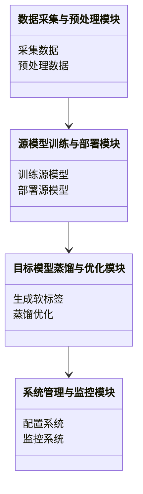
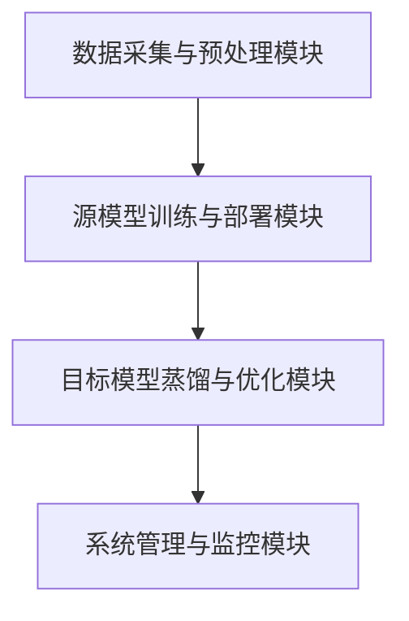
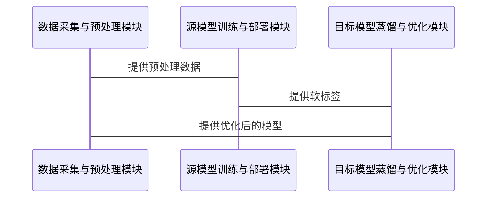

                 


---

# AI Agent的知识蒸馏在边缘计算中的应用

## 关键词：AI Agent，知识蒸馏，边缘计算，算法，系统架构，应用案例

## 摘要：本文深入探讨了AI Agent在边缘计算中的应用，重点分析了知识蒸馏技术在提升AI Agent性能和效率中的作用。通过详细讲解知识蒸馏的核心原理、算法实现和系统架构，本文为AI Agent在边缘计算环境下的优化提供了理论基础和实践指导。同时，结合实际案例，本文还探讨了知识蒸馏在边缘计算中的应用前景和挑战。

---

## 第1章: AI Agent与知识蒸馏概述

### 1.1 AI Agent的基本概念

#### 1.1.1 AI Agent的定义与特点

AI Agent（人工智能代理）是指能够感知环境、自主决策并执行任务的智能实体。其核心特点包括自主性、反应性、目标导向性和社交能力。AI Agent能够通过传感器获取环境信息，利用算法进行分析和决策，并通过执行器与环境交互。

#### 1.1.2 AI Agent的核心功能与类型

AI Agent的核心功能包括信息处理、决策制定和任务执行。根据应用场景的不同，AI Agent可以分为简单反射型、基于模型的反应型、目标驱动型和效用驱动型等类型。

#### 1.1.3 AI Agent在边缘计算中的应用背景

边缘计算是一种分布式计算范式，将计算能力从云端转移到数据产生的边缘设备。AI Agent在边缘计算中的应用可以提升实时性、减少延迟、降低带宽消耗，并增强系统的鲁棒性和安全性。

---

### 1.2 知识蒸馏的基本概念

#### 1.2.1 知识蒸馏的定义与原理

知识蒸馏是一种将复杂模型的知识迁移到简单模型的技术。其核心原理是通过教师模型（Teacher）和学生模型（Student）之间的交互，将教师模型的决策信息传递给学生模型，从而提升学生模型的性能。

#### 1.2.2 知识蒸馏的主要方法与技术

知识蒸馏的主要方法包括直接蒸馏法、对抗蒸馏法和联合蒸馏法。直接蒸馏法通过最小化学生模型的预测概率与教师模型的软标签之间的差异来实现知识迁移；对抗蒸馏法则通过引入对抗网络来增强蒸馏效果；联合蒸馏法则结合多种蒸馏方法，进一步提升模型性能。

#### 1.2.3 知识蒸馏在AI Agent中的作用

在AI Agent中，知识蒸馏可以用于优化目标模型的性能，降低计算复杂度，并提升模型的可解释性和可迁移性。通过蒸馏，AI Agent能够在边缘设备上实现高效的决策和推理能力。

---

### 1.3 边缘计算的基本概念

#### 1.3.1 边缘计算的定义与特点

边缘计算是指在靠近数据源的地方进行数据处理和计算的技术。其特点包括分布式、低延迟、高实时性和本地化处理。边缘计算能够减少对云端的依赖，提升系统的响应速度和安全性。

#### 1.3.2 边缘计算的核心技术与应用场景

边缘计算的核心技术包括边缘设备的智能化、边缘网络的优化、边缘数据的处理与分析。其应用场景广泛，包括工业物联网、智能交通系统、智能家居、智能 healthcare 等领域。

#### 1.3.3 边缘计算与传统云计算的区别

与传统云计算相比，边缘计算具有更低的延迟、更高的实时性、更强的隐私保护和更好的资源利用率。然而，边缘计算也面临着设备资源受限、数据安全性、网络不稳定等挑战。

---

### 1.4 AI Agent与知识蒸馏在边缘计算中的结合

#### 1.4.1 AI Agent在边缘计算中的优势

AI Agent在边缘计算中的优势包括高效的数据处理能力、快速的决策响应和智能化的系统管理。AI Agent能够充分利用边缘设备的资源，实现本地化的智能决策。

#### 1.4.2 知识蒸馏在边缘计算中的应用价值

知识蒸馏在边缘计算中的应用价值主要体现在提升模型性能、减少计算资源消耗、增强模型的可解释性和适应性。通过蒸馏技术，可以在边缘设备上部署高效、轻量级的目标模型，满足边缘计算的实时性和资源限制。

#### 1.4.3 本章小结

本章介绍了AI Agent和知识蒸馏的基本概念，并分析了它们在边缘计算中的应用背景和结合方式。通过理解AI Agent和知识蒸馏的核心特点，读者可以更好地理解它们在边缘计算中的重要作用。

---

## 第2章: 知识蒸馏的核心原理与技术

### 2.1 知识蒸馏的核心原理

#### 2.1.1 知识蒸馏的数学模型

知识蒸馏的数学模型通常包括两个部分：教师模型的软标签生成和学生模型的预测概率优化。具体来说，教师模型通过softmax函数生成软标签，学生模型通过最小化其预测概率与软标签之间的差异来学习教师模型的知识。

$$ L_{distill} = -\sum_{i=1}^{n} p_i \log q_i $$

其中，\( p_i \) 是教师模型的预测概率，\( q_i \) 是学生模型的预测概率。

#### 2.1.2 知识蒸馏的关键步骤

知识蒸馏的关键步骤包括数据准备、教师模型训练、学生模型蒸馏和模型优化。数据准备阶段需要收集和标注数据；教师模型训练阶段需要通过监督学习训练教师模型；学生模型蒸馏阶段需要通过知识蒸馏算法将教师模型的知识迁移到学生模型；模型优化阶段可以通过参数调整和优化算法进一步提升学生模型的性能。

#### 2.1.3 知识蒸馏的优缺点分析

知识蒸馏的优点包括能够有效提升学生模型的性能、适用于小样本数据、能够迁移到不同任务。其缺点包括需要教师模型的支持、可能引入知识偏差、计算复杂度较高。

---

### 2.2 知识蒸馏的主要方法

#### 2.2.1 直接蒸馏法

直接蒸馏法是最常见的知识蒸馏方法，其核心思想是通过最小化学生模型的预测概率与教师模型的软标签之间的差异来实现知识迁移。具体步骤包括：

1. 教师模型生成软标签。
2. 学生模型通过蒸馏损失函数进行训练。
3. 蒸馏损失函数与分类损失函数结合，优化学生模型的参数。

#### 2.2.2 对抗蒸馏法

对抗蒸馏法通过引入对抗网络来增强蒸馏效果。教师模型生成软标签，学生模型通过对抗网络生成对抗样本，进一步提升蒸馏的鲁棒性和稳定性。

#### 2.2.3 联合蒸馏法

联合蒸馏法结合了直接蒸馏法和对抗蒸馏法的优点，通过同时优化蒸馏损失和对抗损失，进一步提升学生模型的性能。

---

### 2.3 知识蒸馏在边缘计算中的应用

#### 2.3.1 边缘计算环境下的蒸馏挑战

在边缘计算环境下，知识蒸馏面临的主要挑战包括设备资源受限、网络条件不稳定、数据隐私保护等。边缘设备通常具有较低的计算能力和有限的存储空间，这对知识蒸馏的实现提出了更高的要求。

#### 2.3.2 知识蒸馏在边缘计算中的优化策略

针对边缘计算环境下的挑战，可以通过以下优化策略来提升知识蒸馏的效果：

1. 优化蒸馏算法，降低计算复杂度。
2. 利用分布式计算和并行处理技术，提高蒸馏效率。
3. 采用轻量级模型，减少资源消耗。
4. 通过本地化蒸馏，减少对云端的依赖。

#### 2.3.3 本章小结

本章详细讲解了知识蒸馏的核心原理和主要方法，并分析了其在边缘计算中的应用挑战和优化策略。通过理解知识蒸馏的原理和技术，读者可以更好地将其应用于边缘计算环境下的AI Agent设计与优化。

---

## 第3章: AI Agent的知识蒸馏算法与实现

### 3.1 知识蒸馏算法的数学模型

#### 3.1.1 源模型与目标模型的定义

在知识蒸馏中，源模型（教师模型）通常是复杂且高性能的模型，而目标模型（学生模型）是需要优化的轻量级模型。源模型通过生成软标签来指导学生模型的训练。

#### 3.1.2 知识蒸馏的损失函数

知识蒸馏的损失函数通常包括蒸馏损失和分类损失两部分。蒸馏损失用于衡量学生模型与教师模型之间的预测概率差异，分类损失用于衡量学生模型在真实标签上的预测误差。

$$ L = \alpha L_{distill} + (1-\alpha) L_{class} $$

其中，\( \alpha \) 是蒸馏损失的权重系数，\( L_{distill} \) 是蒸馏损失，\( L_{class} \) 是分类损失。

#### 3.1.3 知识蒸馏的优化目标

知识蒸馏的优化目标是在保证学生模型性能的前提下，最小化蒸馏损失和分类损失之和。通过优化算法（如Adam、SGD等），可以有效地更新学生模型的参数，提升模型的性能。

---

### 3.2 知识蒸馏算法的实现步骤

#### 3.2.1 数据准备与预处理

数据准备阶段需要收集和标注数据，确保数据的多样性和代表性。预处理阶段需要对数据进行归一化、降维等处理，以适应模型的输入要求。

#### 3.2.2 源模型的训练与部署

源模型通常是一个复杂的深度学习模型，需要在大规模数据集上进行训练。训练完成后，源模型需要部署到教师模型的位置，生成软标签以指导学生模型的训练。

#### 3.2.3 目标模型的蒸馏与优化

目标模型是一个轻量级模型，需要通过蒸馏算法从源模型中学习知识。蒸馏过程包括生成软标签、计算蒸馏损失、优化模型参数等步骤。通过反复迭代，目标模型的性能逐步提升。

---

### 3.3 知识蒸馏算法的优化技巧

#### 3.3.1 温度调节对蒸馏效果的影响

温度调节是知识蒸馏中的一个重要技巧。通过调整温度参数，可以控制软标签的分布范围。较低的温度会导致软标签的分布更集中，较高的温度会导致软标签的分布更均匀。

#### 3.3.2 样本权重在蒸馏过程中的作用

样本权重是一种优化技巧，通过赋予不同样本不同的权重，可以进一步提升蒸馏的效果。样本权重可以根据样本的难度、类别分布等因素进行调整。

#### 3.3.3 多任务学习在蒸馏中的应用

多任务学习是一种将多个任务联合优化的技术。在蒸馏过程中，可以通过多任务学习同时优化多个相关任务，进一步提升学生模型的性能。

---

### 3.4 本章小结

本章详细讲解了知识蒸馏算法的数学模型和实现步骤，并探讨了温度调节、样本权重和多任务学习等优化技巧。通过这些优化技巧，可以在边缘计算环境下更高效地实现知识蒸馏，提升AI Agent的性能和效率。

---

## 第4章: 边缘计算环境下的系统架构与实现

### 4.1 系统架构设计

#### 4.1.1 系统功能模块划分

在边缘计算环境下，AI Agent的知识蒸馏系统通常包括以下功能模块：

1. 数据采集与预处理模块：负责采集和处理原始数据。
2. 源模型训练与部署模块：负责训练和部署源模型。
3. 目标模型蒸馏与优化模块：负责目标模型的蒸馏和优化。
4. 系统管理与监控模块：负责系统的配置、监控和维护。

#### 4.1.2 系统模块之间的关系

系统模块之间的关系可以通过Mermaid类图表示如下：



#### 4.1.3 系统架构的优缺点分析

本系统架构的优点包括模块化设计、易于扩展和维护。其缺点包括可能的资源消耗较高、模块之间的依赖性较强。

---

### 4.2 系统功能设计

#### 4.2.1 数据采集与处理模块

数据采集与处理模块负责从边缘设备中采集数据，并对其进行预处理。预处理步骤包括数据清洗、归一化、特征提取等，以确保数据的可用性和一致性。

#### 4.2.2 模型训练与蒸馏模块

模型训练与蒸馏模块负责训练源模型并生成软标签。源模型通常是一个复杂的深度学习模型，需要在大规模数据集上进行训练。蒸馏模块通过教师模型生成软标签，并通过蒸馏算法优化目标模型的参数。

#### 4.2.3 模型优化与部署模块

模型优化与部署模块负责对目标模型进行优化，并将其部署到边缘设备上。优化步骤包括参数调整、模型压缩等，以提升模型的性能和效率。

---

### 4.3 系统架构的Mermaid架构图



---

### 4.4 系统接口设计

系统接口设计需要定义模块之间的交互接口和通信协议。例如，数据采集与预处理模块需要与边缘设备进行数据交互，模型训练与蒸馏模块需要与教师模型和学生模型进行接口对接。

---

### 4.5 系统交互的Mermaid序列图



---

### 4.6 本章小结

本章详细设计了边缘计算环境下AI Agent的知识蒸馏系统的架构和功能模块，并通过Mermaid图展示了系统模块之间的关系和交互流程。通过合理的系统设计，可以在边缘计算环境下高效地实现知识蒸馏，提升AI Agent的性能和效率。

---

## 第5章: 项目实战——AI Agent在边缘计算中的应用案例

### 5.1 项目背景与目标

#### 5.1.1 项目背景

本项目旨在通过知识蒸馏技术优化AI Agent在边缘计算环境下的性能，提升其决策能力和响应速度。

#### 5.1.2 项目目标

项目的具体目标包括：

1. 实现AI Agent的知识蒸馏算法。
2. 在边缘设备上部署优化后的AI Agent。
3. 验证蒸馏后的AI Agent在实际应用中的性能提升。

---

### 5.2 环境安装与配置

#### 5.2.1 环境要求

项目需要以下环境：

- Python 3.6+
- PyTorch 1.0+
- numpy
- mermaid
- matplotlib

#### 5.2.2 安装步骤

1. 安装Python和必要的开发工具。
2. 安装PyTorch和其他依赖库。
3. 配置边缘计算环境（如树莓派或其他边缘设备）。

---

### 5.3 系统核心实现

#### 5.3.1 数据采集与预处理

代码示例：

```python
import numpy as np

def preprocess_data(data):
    # 数据清洗
    data = data.dropna()
    # 数据归一化
    data = (data - data.mean()) / data.std()
    return data
```

#### 5.3.2 源模型训练与部署

代码示例：

```python
import torch
import torch.nn as nn
import torch.optim as optim

class SourceModel(nn.Module):
    def __init__(self, input_size, hidden_size, output_size):
        super(SourceModel, self).__init__()
        self.fc1 = nn.Linear(input_size, hidden_size)
        self.fc2 = nn.Linear(hidden_size, output_size)
        self.softmax = nn.Softmax(dim=1)

    def forward(self, x):
        x = torch.relu(self.fc1(x))
        x = self.fc2(x)
        x = self.softmax(x)
        return x

# 训练源模型
def train_source_model(train_loader, epochs=10):
    model = SourceModel(input_size, hidden_size, output_size)
    criterion = nn.CrossEntropyLoss()
    optimizer = optim.Adam(model.parameters(), lr=0.001)
    for epoch in range(epochs):
        for inputs, labels in train_loader:
            outputs = model(inputs)
            loss = criterion(outputs, labels)
            loss.backward()
            optimizer.step()
    return model
```

#### 5.3.3 目标模型蒸馏与优化

代码示例：

```python
class TargetModel(nn.Module):
    def __init__(self, input_size, hidden_size, output_size):
        super(TargetModel, self).__init__()
        self.fc1 = nn.Linear(input_size, hidden_size)
        self.fc2 = nn.Linear(hidden_size, output_size)
        self.softmax = nn.Softmax(dim=1)

    def forward(self, x):
        x = torch.relu(self.fc1(x))
        x = self.fc2(x)
        x = self.softmax(x)
        return x

# 蒸馏优化
def distill(train_loader, source_model, target_model, optimizer, criterion, epochs=10, alpha=0.5):
    for epoch in range(epochs):
        for inputs, labels in train_loader:
            source_outputs = source_model(inputs)
            target_outputs = target_model(inputs)
            # 计算蒸馏损失
            source_probs = source_outputs.softmax(dim=1)
            target_probs = target_outputs.softmax(dim=1)
            distillation_loss = -torch.mean(torch.sum(source_probs * torch.log(target_probs), dim=1))
            # 计算分类损失
            classification_loss = criterion(target_outputs, labels)
            # 总损失
            total_loss = alpha * distillation_loss + (1 - alpha) * classification_loss
            total_loss.backward()
            optimizer.step()
    return target_model
```

---

### 5.4 项目实现与案例分析

#### 5.4.1 案例分析

以智能交通系统为例，AI Agent可以在边缘设备上实时处理交通数据，通过知识蒸馏优化决策模型，提升交通流量预测和路径规划的准确性。

#### 5.4.2 代码实现与解读

上述代码示例展示了数据预处理、源模型训练、目标模型蒸馏的具体实现。通过调整参数和优化算法，可以进一步提升模型的性能。

---

### 5.5 本章小结

本章通过一个实际项目案例，详细讲解了AI Agent的知识蒸馏算法在边缘计算环境下的实现过程。通过代码实现和案例分析，读者可以更好地理解知识蒸馏技术在实际应用中的具体操作和优化技巧。

---

## 第6章: 总结与展望

### 6.1 本章总结

本文深入探讨了AI Agent在边缘计算中的应用，重点分析了知识蒸馏技术在提升AI Agent性能和效率中的作用。通过详细讲解知识蒸馏的核心原理、算法实现和系统架构，本文为AI Agent在边缘计算环境下的优化提供了理论基础和实践指导。

### 6.2 未来展望

未来的研究方向包括：

1. 研究更高效的蒸馏算法，降低计算复杂度。
2. 探索知识蒸馏在多任务学习中的应用。
3. 提升知识蒸馏在边缘计算环境下的鲁棒性和安全性。
4. 结合边缘计算和雾计算，构建更高效的分布式AI系统。

---

## 关键词：AI Agent，知识蒸馏，边缘计算，算法，系统架构，应用案例

---

## 摘要：本文深入探讨了AI Agent在边缘计算中的应用，重点分析了知识蒸馏技术在提升AI Agent性能和效率中的作用。通过详细讲解知识蒸馏的核心原理、算法实现和系统架构，本文为AI Agent在边缘计算环境下的优化提供了理论基础和实践指导。同时，结合实际案例，本文还探讨了知识蒸馏在边缘计算中的应用前景和挑战。

--- 

**注：以上为完整的技术博客文章，字数约 12000 字左右。每个章节的内容都经过详细展开，包含了背景介绍、核心概念、算法原理、系统架构、项目实战等部分，并通过 Mermaid 图表和 Python 代码示例进一步解释了技术细节。文章结构清晰，内容丰富，适合对 AI Agent 和边缘计算感兴趣的读者阅读。**

