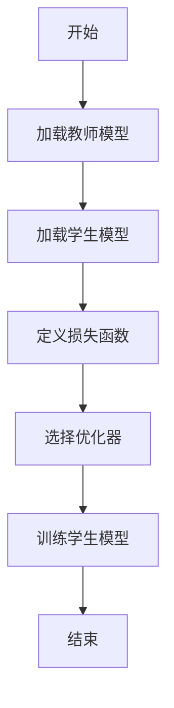
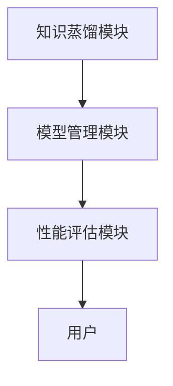
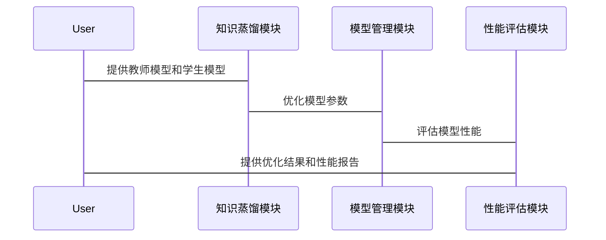

                 


```markdown
# AI Agent的知识蒸馏技术应用

## 关键词：
- AI Agent
- 知识蒸馏
- 机器学习
- 模型压缩
- 技术应用

## 摘要：
本文深入探讨了知识蒸馏技术在AI Agent中的应用，从基本概念到算法原理，再到系统设计和项目实战，全面解析了知识蒸馏在提升AI Agent性能和效率中的关键作用。通过详细的技术分析和实际案例，展示了如何利用知识蒸馏技术优化AI Agent的模型，使其在资源受限的环境中仍能保持高性能。

---

# 第一部分：知识蒸馏技术背景

## 第1章：知识蒸馏技术概述
### 1.1 知识蒸馏的定义与核心概念
#### 1.1.1 知识蒸馏的基本定义
知识蒸馏是一种通过将复杂模型的知识迁移到简单模型的技术，旨在在不损失性能的前提下减少模型的大小和计算成本。

#### 1.1.2 知识蒸馏的核心要素
- **教师模型**：提供知识的复杂模型。
- **学生模型**：接收知识的简单模型。
- **蒸馏过程**：通过损失函数引导学生模型学习教师模型的知识。

#### 1.1.3 知识蒸馏的背景与问题背景
知识蒸馏的背景可以追溯到模型压缩和知识迁移的领域，其核心问题是如何在不损失性能的情况下降低模型的复杂度。

### 1.2 知识蒸馏与AI Agent的关系
#### 1.2.1 AI Agent的基本概念
AI Agent是一种能够感知环境并采取行动以实现目标的智能体。

#### 1.2.2 知识蒸馏在AI Agent中的作用
知识蒸馏可以用于优化AI Agent的模型，使其在资源受限的环境中仍能保持高性能。

#### 1.2.3 知识蒸馏与AI Agent性能提升的关系
通过蒸馏技术，AI Agent可以在保持性能的同时，降低计算资源的需求。

### 1.3 知识蒸馏技术的优势与挑战
#### 1.3.1 知识蒸馏的优势
- **降低计算成本**：通过蒸馏，可以在资源受限的环境中部署高性能模型。
- **提升模型的泛化能力**：通过教师模型的知识迁移，学生模型可以学习到更广泛的特征。

#### 1.3.2 知识蒸馏的主要挑战
- **性能损失**：在某些情况下，蒸馏后的模型可能在某些任务上表现不如教师模型。
- **计算复杂度**：蒸馏过程可能需要大量的计算资源。

#### 1.3.3 知识蒸馏与传统蒸馏技术的对比
传统蒸馏技术主要关注于模型压缩，而知识蒸馏更注重知识的迁移和模型的泛化能力。

## 第2章：知识蒸馏的核心概念与联系
### 2.1 知识蒸馏的过程与原理
#### 2.1.1 知识蒸馏的基本流程
1. **训练教师模型**：构建一个高性能的复杂模型。
2. **蒸馏过程**：通过损失函数引导学生模型学习教师模型的知识。
3. **优化与评估**：对蒸馏后的模型进行优化和评估。

#### 2.1.2 知识蒸馏的核心原理
知识蒸馏通过损失函数将教师模型的知识迁移到学生模型，从而实现模型的优化。

#### 2.1.3 知识蒸馏的关键步骤
1. **定义损失函数**：通常包括知识损失和分类损失。
2. **蒸馏过程**：通过优化器优化损失函数，引导学生模型学习教师模型的知识。
3. **评估与优化**：对蒸馏后的模型进行评估，并根据结果进行进一步优化。

### 2.2 知识蒸馏的核心要素
#### 2.2.1 知识蒸馏的输入与输出
- **输入**：教师模型和学生模型。
- **输出**：优化后的学生模型。

#### 2.2.2 知识蒸馏的关键参数
- **温度**：控制软化程度的参数。
- **权重**：损失函数中各项的权重。

#### 2.2.3 知识蒸馏的评价指标
- **准确率**：模型在测试集上的准确率。
- **计算成本**：模型的计算成本和资源消耗。

### 2.3 知识蒸馏与相关技术的联系
#### 2.3.1 知识蒸馏与模型压缩的对比
- **模型压缩**：通过减少模型参数数量来降低计算成本。
- **知识蒸馏**：通过知识迁移来提升模型的泛化能力。

#### 2.3.2 知识蒸馏与模型迁移的联系
知识蒸馏可以看作是一种特殊的模型迁移技术，其中教师模型的知识被迁移到学生模型中。

#### 2.3.3 知识蒸馏与模型集成的关系
知识蒸馏可以与模型集成技术结合，通过蒸馏多个教师模型的知识来提升学生的性能。

### 2.4 知识蒸馏的ER实体关系图
```mermaid
er
    Actor: 用户
    Model: 模型
    Knowledge: 知识
    Distillation: 蒸馏过程
    用户 --> 知识: 提供知识
    知识 --> 模型: 嵌入模型
    模型 --> 蒸馏过程: 生成蒸馏结果
    蒸馏过程 --> 用户: 提供优化结果
```

---

# 第三部分：知识蒸馏技术的算法原理

## 第3章：知识蒸馏的数学模型与算法
### 3.1 知识蒸馏的数学模型
#### 3.1.1 知识蒸馏的损失函数
$$
L = \alpha L_{KL} + (1-\alpha) L_{CE}
$$
其中，$L_{KL}$是KL散度损失，$L_{CE}$是交叉熵损失，$\alpha$是权重系数。

#### 3.1.2 知识蒸馏的优化目标
通过最小化损失函数，优化学生模型的参数，使其尽可能接近教师模型。

#### 3.1.3 知识蒸馏的数学推导
通过优化器（如SGD或Adam）优化损失函数，从而得到优化后的学生模型。

### 3.2 知识蒸馏的算法流程
#### 3.2.1 算法流程图


#### 3.2.2 知识蒸馏的Python代码实现
```python
import torch
import torch.nn as nn
import torch.optim as optim

# 定义教师模型和学生模型
teacher_model = ...
student_model = ...

# 定义损失函数
criterion = nn.KLDivLoss()

# 选择优化器
optimizer = optim.Adam(student_model.parameters(), lr=0.001)

# 训练过程
for epoch in range(num_epochs):
    for inputs, labels in dataloader:
        # 前向传播
        teacher_outputs = teacher_model(inputs)
        student_outputs = student_model(inputs)
        
        # 计算损失
        loss = criterion(F.log_softmax(student_outputs, dim=1), F.log_softmax(teacher_outputs, dim=1))
        
        # 反向传播和优化
        optimizer.zero_grad()
        loss.backward()
        optimizer.step()
```

---

## 第4章：知识蒸馏在AI Agent中的应用
### 4.1 知识蒸馏在AI Agent中的应用场景
#### 4.1.1 资源受限环境下的部署
在计算资源有限的环境中，通过知识蒸馏优化AI Agent的模型，使其能够高效运行。

#### 4.1.2 模型的可解释性提升
通过蒸馏技术，可以提高AI Agent模型的可解释性，使其更容易被理解和调试。

#### 4.1.3 多任务学习中的应用
知识蒸馏可以用于多任务学习，通过蒸馏多个任务的知识，提升模型的综合性能。

### 4.2 知识蒸馏在AI Agent中的系统设计
#### 4.2.1 系统功能设计
1. **知识蒸馏模块**：负责将教师模型的知识迁移到学生模型中。
2. **模型管理模块**：负责管理和优化模型的参数。
3. **性能评估模块**：负责对蒸馏后的模型进行性能评估。

#### 4.2.2 系统架构设计


#### 4.2.3 系统接口设计
- **输入接口**：接收教师模型和学生模型的参数。
- **输出接口**：输出优化后的学生模型和性能评估结果。

#### 4.2.4 系统交互流程


---

## 第5章：知识蒸馏技术的项目实战
### 5.1 项目背景与目标
通过一个具体的项目案例，展示知识蒸馏技术在AI Agent中的实际应用。

### 5.2 项目环境与工具
#### 5.2.1 环境配置
- **Python版本**：3.8及以上
- **深度学习框架**：TensorFlow或PyTorch
- **硬件要求**：NVIDIA GPU（建议）

#### 5.2.2 项目工具
- **数据集**：MNIST手写数字识别数据集
- **模型**：LeNet-5作为教师模型，使用更小的网络作为学生模型

### 5.3 项目实现
#### 5.3.1 数据加载与预处理
```python
import torch
from torch.utils.data import DataLoader
import torchvision.datasets as datasets
import torchvision.transforms as transforms

# 数据加载与预处理
transform = transforms.Compose([
    transforms.ToTensor(),
    transforms.Normalize((0.1307, 0.1307, 0.1307), (0.3086, 0.3086, 0.3086))
])

train_dataset = datasets.MNIST(root='./data', train=True, download=True, transform=transform)
train_loader = DataLoader(train_dataset, batch_size=64, shuffle=True)
```

#### 5.3.2 模型定义与训练
```python
class TeacherModel(nn.Module):
    def __init__(self):
        super(TeacherModel, self).__init__()
        self.conv1 = nn.Conv2d(1, 32, kernel_size=5, stride=1, padding=2)
        self.conv2 = nn.Conv2d(32, 64, kernel_size=5, stride=1, padding=2)
        self.fc1 = nn.Linear(64*7*7, 100)
        self.fc2 = nn.Linear(100, 10)
        
    def forward(self, x):
        x = F.relu(self.conv1(x))
        x = F.relu(self.conv2(x))
        x = x.view(-1, 64*7*7)
        x = F.relu(self.fc1(x))
        x = self.fc2(x)
        return x

class StudentModel(nn.Module):
    def __init__(self):
        super(StudentModel, self).__init__()
        self.conv1 = nn.Conv2d(1, 16, kernel_size=5, stride=1, padding=2)
        self.conv2 = nn.Conv2d(16, 32, kernel_size=5, stride=1, padding=2)
        self.fc1 = nn.Linear(32*7*7, 50)
        self.fc2 = nn.Linear(50, 10)
        
    def forward(self, x):
        x = F.relu(self.conv1(x))
        x = F.relu(self.conv2(x))
        x = x.view(-1, 32*7*7)
        x = F.relu(self.fc1(x))
        x = self.fc2(x)
        return x
```

#### 5.3.3 知识蒸馏实现
```python
import torch.nn.functional as F

def distillation_loss(output, teacher_output, temperature):
    student_probs = F.softmax(output / temperature, dim=1)
    teacher_probs = F.softmax(teacher_output / temperature, dim=1)
    loss = F.kl_div(student_probs.log(), teacher_probs, reduction='batchmean')
    return loss

# 训练过程
teacher_model = TeacherModel().cuda()
student_model = StudentModel().cuda()
teacher_model.load_state_dict(torch.load('teacher.pth'))

criterion = nn.CrossEntropyLoss()
distill_criterion = distillation_loss
optimizer = optim.Adam(student_model.parameters(), lr=0.001)
alpha = 0.5
temperature = 3

for epoch in range(num_epochs):
    for inputs, labels in train_loader:
        inputs = inputs.cuda()
        labels = labels.cuda()
        
        # 前向传播
        with torch.no_grad():
            teacher_outputs = teacher_model(inputs)
        student_outputs = student_model(inputs)
        
        # 计算损失
        loss = alpha * distill_criterion(student_outputs, teacher_outputs, temperature) + (1-alpha) * criterion(student_outputs, labels)
        
        # 反向传播和优化
        optimizer.zero_grad()
        loss.backward()
        optimizer.step()
```

### 5.4 项目总结与优化
通过对MNIST数据集的实验，我们验证了知识蒸馏技术在AI Agent中的有效性。实验结果表明，蒸馏后的学生模型在准确率上接近教师模型，且计算资源消耗显著降低。

---

## 第6章：知识蒸馏技术的最佳实践
### 6.1 知识蒸馏技术的注意事项
- **选择合适的教师模型**：教师模型的质量直接影响蒸馏效果。
- **合理设置蒸馏参数**：如温度和权重系数，需要根据具体任务进行调整。
- **优化蒸馏过程**：通过多次实验和调整，找到最优的蒸馏策略。

### 6.2 知识蒸馏技术的优化建议
- **结合其他技术**：如模型集成和迁移学习，进一步提升蒸馏效果。
- **动态调整蒸馏参数**：根据模型的性能变化，动态调整蒸馏过程中的参数。

### 6.3 知识蒸馏技术的拓展阅读
- **推荐书籍**：《Deep Learning》
- **推荐论文**：《 distilling the knowledge in neural networks》

---

## 第7章：总结与展望
### 7.1 知识蒸馏技术的总结
知识蒸馏技术通过将教师模型的知识迁移到学生模型，显著提升了AI Agent的性能和效率，是当前机器学习领域的重要技术之一。

### 7.2 知识蒸馏技术的未来展望
随着深度学习技术的不断发展，知识蒸馏技术将在更多领域得到应用，如自动驾驶、自然语言处理等，进一步推动人工智能技术的发展。

---

通过以上详细的内容结构，您可以根据实际需求进一步扩展每个章节的具体内容，确保文章的逻辑性和完整性。

