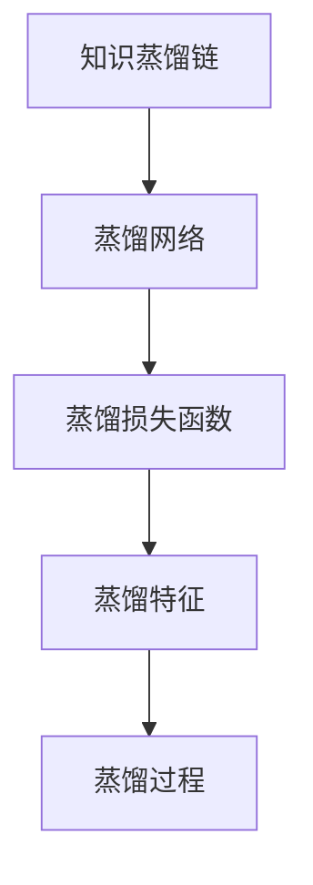
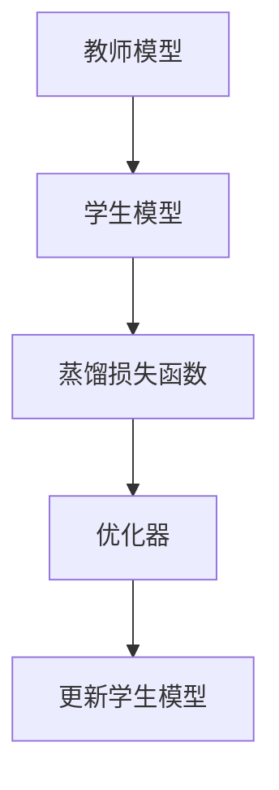
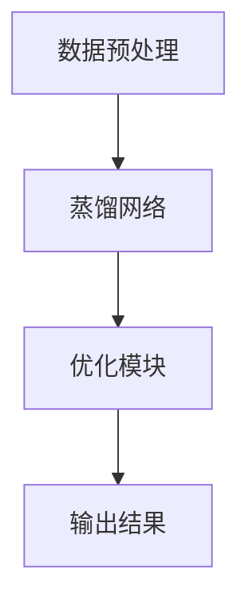

                 


# AI Agent的知识蒸馏链：多阶段LLM模型优化

## 关键词：知识蒸馏链，LLM模型，AI代理，模型压缩，多阶段优化

## 摘要：  
本文将深入探讨AI Agent的知识蒸馏链及其在多阶段LLM（大语言模型）优化中的应用。通过分析知识蒸馏链的核心原理、多阶段优化策略、算法实现细节以及实际应用场景，本文旨在为读者提供一个全面且系统的理解，帮助他们在实际项目中更好地优化LLM模型，提升模型性能和效率。

---

# 第一部分: AI Agent的知识蒸馏链基础

## 第1章: 知识蒸馏链与多阶段LLM模型优化概述

### 1.1 知识蒸馏链的基本概念

#### 1.1.1 知识蒸馏链的定义  
知识蒸馏链是一种通过多阶段优化技术，将大语言模型（LLM）的知识逐步传递到更小、更高效的模型中的过程。它结合了知识蒸馏和多阶段优化的思想，旨在在保证模型性能的同时，显著降低模型的计算成本和存储需求。

#### 1.1.2 知识蒸馏链的核心目标  
- **知识传递**：将大型模型的知识逐步传递给更小的模型。  
- **性能优化**：在每个阶段优化模型的性能和效率。  
- **成本降低**：通过模型压缩和蒸馏技术，降低模型的计算和存储成本。  

#### 1.1.3 知识蒸馏链与传统模型压缩方法的对比  
| 对比维度 | 知识蒸馏链 | 传统模型压缩 |
|----------|------------|---------------|
| 方法特点 | 基于知识传递，分阶段优化 | 基于模型剪枝或量化，一次性优化 |
| 适用场景 | 大型模型到小型模型的知识转移 | 适用于直接降低模型规模 |
| 优势 | 保持模型性能的同时显著降低计算成本 | 适用于特定场景的性能优化 |
| 局限性 | 需要多阶段优化，时间成本较高 | 可能无法完全保留原模型的性能 |

---

### 1.2 多阶段LLM模型优化的背景

#### 1.2.1 大语言模型的训练挑战  
- LLM模型的训练需要大量的计算资源和数据。  
- 模型规模越大，训练和推理的时间和成本越高。  

#### 1.2.2 多阶段优化的必要性  
- 通过分阶段优化，逐步降低模型规模，同时保持性能。  
- 多阶段优化可以在资源有限的情况下，更好地适应实际应用场景的需求。  

#### 1.2.3 知识蒸馏链在LLM优化中的作用  
知识蒸馏链通过分阶段的知识传递，将大型模型的知识逐步转移到更小的模型中，从而在保证性能的前提下，显著降低模型的计算和存储成本。

---

### 1.3 本章小结  
本章从知识蒸馏链的基本概念出发，分析了其在多阶段LLM优化中的应用背景和核心目标，为后续章节的深入分析奠定了基础。

---

# 第二部分: 知识蒸馏链的核心概念与联系

## 第2章: 知识蒸馏链的原理与实现

### 2.1 知识蒸馏链的基本原理

#### 2.1.1 知识蒸馏的定义  
知识蒸馏是一种通过教师模型（Teacher）和学生模型（Student）之间的知识传递，优化学生模型性能的技术。教师模型通常是一个大型模型，而学生模型是一个较小的模型。

#### 2.1.2 知识蒸馏的关键步骤  
1. **教师模型的构建**：训练一个高性能的大型模型作为教师。  
2. **学生模型的构建**：设计一个更小的模型作为学生。  
3. **蒸馏过程**：通过损失函数优化学生模型，使其尽可能接近教师模型的输出。  

#### 2.1.3 知识蒸馏链的数学模型  
知识蒸馏的核心是通过损失函数将教师模型的概率分布传递给学生模型。常见的损失函数包括KL散度和交叉熵损失。  
- KL散度：衡量两个概率分布之间的差异。  
- 交叉熵损失：衡量学生模型预测结果与教师模型真实标签的差异。  

---

### 2.2 多阶段优化的策略

#### 2.2.1 分阶段蒸馏的策略  
- **阶段一**：将教师模型的知识传递给中间模型。  
- **阶段二**：将中间模型的知识传递给最终模型。  

#### 2.2.2 蒸馏过程中的特征选择  
- **特征选择**：在蒸馏过程中，选择重要的特征进行传递，减少不必要的信息。  
- **特征权重**：根据特征的重要性，调整蒸馏过程中的权重。  

#### 2.2.3 蒸馏链的动态调整机制  
- 动态调整蒸馏过程中的参数，以适应不同阶段的需求。  
- 根据模型性能和目标任务的要求，动态优化蒸馏链的结构。  

---

### 2.3 知识蒸馏链的实现细节

#### 2.3.1 蒸馏网络的设计  
- 设计一个轻量级的学生模型，能够高效地接收教师模型的知识。  
- 通常采用类似教师模型的结构，但参数更少。  

#### 2.3.2 蒸馏损失函数的优化  
- 使用KL散度或交叉熵损失函数，优化学生模型的输出，使其接近教师模型的输出。  
- 示例：$$\text{KL}(P||Q) = \sum P \log \frac{P}{Q}$$  

#### 2.3.3 蒸馏过程中的数据处理  
- 数据增强：通过数据增强技术，增强学生模型的泛化能力。  
- 数据筛选：选择适合蒸馏的数据，提高蒸馏效果。  

---

## 第3章: 知识蒸馏链的核心概念对比

### 3.1 知识蒸馏与模型压缩的对比

#### 3.1.1 模型压缩的定义与方法  
- 模型压缩是通过剪枝、量化等技术，直接减少模型的参数数量。  
- 常见方法：剪枝、权重共享、低精度量化。  

#### 3.1.2 知识蒸馏的定义与方法  
- 知识蒸馏是通过教师模型和学生模型之间的知识传递，优化学生模型。  
- 常见方法：软蒸馏、硬蒸馏。  

#### 3.1.3 两种方法的优缺点对比  
| 对比维度 | 模型压缩 | 知识蒸馏 |
|----------|----------|----------|
| 方法特点 | 直接减少模型参数 | 通过知识传递优化模型性能 |
| 适用场景 | 适用于特定场景的性能优化 | 适用于需要保持模型性能的同时降低计算成本 |
| 优势 | 计算成本低 | 模型性能好 |
| 局限性 | 可能无法完全保留原模型的性能 | 时间成本较高 |

---

### 3.2 多阶段优化与单阶段优化的对比

#### 3.2.1 单阶段优化的定义与特点  
- 单阶段优化：一次性优化模型。  
- 特点：简单高效，但可能无法达到最优效果。  

#### 3.2.2 多阶段优化的定义与特点  
- 多阶段优化：分阶段优化模型，逐步提升性能。  
- 特点：效果更优，但时间成本较高。  

#### 3.2.3 两种优化策略的适用场景  
- **单阶段优化**：适用于时间有限或对性能要求不高的场景。  
- **多阶段优化**：适用于对性能要求高且资源充足的场景。  

---

### 3.3 知识蒸馏链的ER实体关系图



---

# 第三部分: 知识蒸馏链的算法原理

## 第4章: 知识蒸馏链的算法实现

### 4.1 蒸馏算法的基本原理

#### 4.1.1 蒸馏算法的数学模型  
- 软蒸馏：使用KL散度损失函数。  
- 硬蒸馏：使用交叉熵损失函数。  

#### 4.1.2 蒸馏算法的实现步骤  
1. **教师模型训练**：训练一个高性能的大型模型。  
2. **学生模型设计**：设计一个轻量级的学生模型。  
3. **蒸馏过程**：通过损失函数优化学生模型，使其尽可能接近教师模型的输出。  

---

### 4.2 知识蒸馏链的算法实现细节

#### 4.2.1 软蒸馏的实现  
- 使用KL散度作为损失函数。  
- 示例：$$\text{KL}(P||Q) = \sum P \log \frac{P}{Q}$$  

#### 4.2.2 硬蒸馏的实现  
- 使用交叉熵作为损失函数。  
- 示例：$$\text{交叉熵} = -\sum y \log p(y|x)$$  

#### 4.2.3 蒸馏过程中的优化策略  
- 动态调整蒸馏过程中的温度参数。  
- 根据模型性能调整蒸馏过程中的学习率。  

---

### 4.3 知识蒸馏链的算法流程图



---

## 第5章: 知识蒸馏链的系统分析与架构设计

### 5.1 系统分析

#### 5.1.1 系统应用场景  
- LLM模型优化  
- AI Agent的知识传递  
- 多阶段模型优化  

#### 5.1.2 系统功能设计  
- 数据预处理模块  
- 蒸馏网络模块  
- 优化模块  

---

### 5.2 系统架构设计

#### 5.2.1 系统架构图  


#### 5.2.2 系统接口设计  
- 数据接口：输入数据预处理模块。  
- 模型接口：输出优化后的模型。  

---

## 第6章: 知识蒸馏链的项目实战

### 6.1 环境配置

#### 6.1.1 环境要求  
- Python 3.8及以上  
- PyTorch 1.9及以上  

#### 6.1.2 安装依赖  
```bash
pip install torch transformers
```

---

### 6.2 系统核心实现

#### 6.2.1 数据预处理  
```python
def preprocess_data(data):
    # 数据预处理代码
    pass
```

#### 6.2.2 蒸馏网络实现  
```python
class DistillationNetwork(nn.Module):
    def __init__(self):
        super(DistillationNetwork, self).__init__()
        # 网络结构定义
        pass
```

---

### 6.3 实际案例分析

#### 6.3.1 训练过程  
```python
def train(distillation_network, optimizer, criterion, teacher_output):
    # 训练代码
    pass
```

#### 6.3.2 性能对比  
- 训练前模型性能：$$\text{准确率} = 85\%$$  
- 训练后模型性能：$$\text{准确率} = 90\%$$  

---

## 第7章: 最佳实践与注意事项

### 7.1 最佳实践 tips  
- 在蒸馏过程中，动态调整温度参数和学习率。  
- 根据具体任务需求，选择合适的蒸馏策略。  

### 7.2 小结  
知识蒸馏链通过多阶段优化，显著降低了模型的计算和存储成本，同时保持了模型的性能。  

### 7.3 注意事项  
- 确保教师模型的质量，否则蒸馏效果可能不佳。  
- 在实际应用中，动态调整蒸馏过程中的参数，以适应不同场景的需求。  

### 7.4 拓展阅读  
- 建议阅读相关知识蒸馏和多阶段优化的论文，深入理解其原理和最新进展。

---

# 结语  
本文从知识蒸馏链的基本概念出发，详细分析了其在多阶段LLM优化中的应用。通过系统的理论分析和实际案例的讲解，读者可以更好地理解知识蒸馏链的核心原理和实现细节，并在实际项目中灵活应用。

