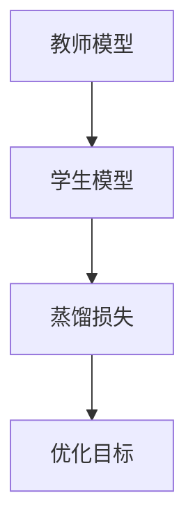
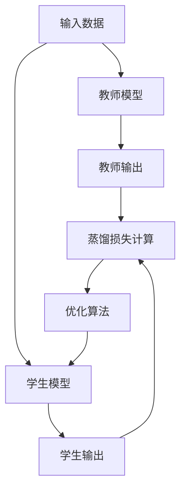

                 


# AI Agent的知识蒸馏：从复杂模型到高效模型

> 关键词：知识蒸馏、AI Agent、复杂模型、高效模型、模型优化

> 摘要：本文系统阐述了AI Agent中知识蒸馏的核心原理、算法实现及实际应用，深入分析了从复杂模型到高效模型的优化过程，探讨了其在实际场景中的价值和挑战，为读者提供了一套完整的知识蒸馏解决方案。

---

## 第1章: 知识蒸馏的背景与问题背景

### 1.1 知识蒸馏的背景

#### 1.1.1 从复杂模型到高效模型的演进
在AI Agent领域，模型的复杂性与性能之间存在着微妙的平衡。随着深度学习技术的快速发展，大型模型（如BERT、GPT）在性能上表现出色，但在实际应用中面临计算资源和运行效率的限制。知识蒸馏作为一种模型优化技术，通过将复杂模型的知识迁移到简单模型中，为这一矛盾提供了有效的解决方案。

#### 1.1.2 大模型在AI Agent中的核心地位
大模型（如GPT-3、BERT）在自然语言处理领域取得了突破性进展，但在实际部署中，其计算成本和资源消耗使其难以在边缘设备或实时应用中高效运行。AI Agent需要在保证性能的同时，具备快速响应和低资源消耗的特点，这使得模型优化技术变得尤为重要。

#### 1.1.3 知识蒸馏的目标与意义
知识蒸馏的目标是通过将教师模型（复杂模型）的知识迁移到学生模型（简单模型），在保证性能的前提下，显著降低模型的复杂性和资源消耗。其意义在于：
- **性能优化**：在保持或提升性能的同时，减少计算资源消耗。
- **场景适应性**：使AI Agent能够在资源受限的环境中高效运行。
- **技术突破**：为复杂模型的落地应用提供可行的解决方案。

### 1.2 问题背景与问题描述

#### 1.2.1 复杂模型的局限性
复杂模型虽然性能优异，但在实际应用中存在以下问题：
- **计算成本高**：训练和推理过程需要大量的计算资源。
- **响应速度慢**：在实时应用场景中难以满足需求。
- **部署难度大**：难以在边缘设备等资源受限的环境中部署。

#### 1.2.2 高效模型的需求
AI Agent的应用场景多样化，对模型提出了更高的要求：
- **快速响应**：在实时对话、决策等场景中，模型需要快速生成结果。
- **低资源消耗**：在移动端、物联网设备等环境中，模型需要具备轻量化的特点。
- **易于部署**：能够快速部署到不同的应用场景中。

#### 1.2.3 知识蒸馏的核心问题
知识蒸馏的核心问题在于如何有效地将教师模型的知识迁移到学生模型中，同时确保学生模型的性能和效率。具体包括：
- **知识表示**：如何将教师模型的知识有效地表示出来。
- **知识迁移**：如何将教师模型的知识迁移到学生模型中。
- **模型优化**：如何在迁移过程中优化学生模型的结构和参数。

### 1.3 问题解决与边界

#### 1.3.1 知识蒸馏的解决方案
知识蒸馏通过以下步骤解决问题：
1. **教师模型的构建**：构建一个性能优异但复杂的教师模型。
2. **学生模型的设计**：设计一个简单但高效的模型作为学生模型。
3. **知识迁移**：通过蒸馏损失函数将教师模型的知识迁移到学生模型中。
4. **模型优化**：通过优化算法调整学生模型的参数，使其在迁移过程中性能提升。

#### 1.3.2 知识蒸馏的边界与外延
知识蒸馏的边界在于其核心目标：将教师模型的知识迁移到学生模型中。其外延包括：
- **模型压缩**：通过减少模型参数数量来降低模型复杂度。
- **模型剪枝**：通过删除冗余的模型参数来优化模型结构。
- **模型蒸馏**：通过知识迁移优化模型性能。

#### 1.3.3 知识蒸馏的概念结构与核心要素
知识蒸馏的概念结构包括以下核心要素：
- **教师模型**：作为知识的提供者，通常是一个复杂的模型。
- **学生模型**：作为知识的接收者，通常是一个简单的模型。
- **蒸馏损失**：衡量教师模型和学生模型之间差距的损失函数。
- **优化算法**：用于调整学生模型参数的优化算法。

### 1.4 本章小结
本章介绍了知识蒸馏的背景、问题背景和核心问题，阐述了知识蒸馏的目标、意义及其在AI Agent中的重要性。通过分析复杂模型的局限性和高效模型的需求，明确了知识蒸馏的核心问题及其解决方案。

---

## 第2章: 知识蒸馏的核心概念与联系

### 2.1 知识蒸馏的核心原理

#### 2.1.1 教师模型与学生模型的关系
知识蒸馏通过教师模型和学生模型的交互完成知识迁移。教师模型通常是一个复杂的模型，而学生模型是一个简单的模型。通过蒸馏过程，学生模型能够学习到教师模型的知识，从而在性能上接近教师模型。

#### 2.1.2 知识蒸馏的关键步骤
知识蒸馏的关键步骤包括：
1. **教师模型的构建**：构建一个性能优异的复杂模型。
2. **学生模型的设计**：设计一个简单的模型作为学生模型。
3. **知识迁移**：通过蒸馏损失函数将教师模型的知识迁移到学生模型中。
4. **模型优化**：通过优化算法调整学生模型的参数，使其在迁移过程中性能提升。

#### 2.1.3 知识蒸馏的数学模型
知识蒸馏的数学模型包括：
- **教师模型的输出概率**：\( P(y|x) \)
- **学生模型的输出概率**：\( Q(y|x) \)
- **蒸馏损失的计算公式**：
  $$
  L_{\text{distill}} = -\sum_{i=1}^{n} P(y_i|x) \log Q(y_i|x)
  $$

### 2.2 知识蒸馏的核心概念

#### 2.2.1 教师模型的选择与设计
教师模型通常是一个复杂的模型，可以是已经训练好的大型模型，如BERT、GPT等。设计教师模型时需要考虑其性能和复杂度的平衡。

#### 2.2.2 学生模型的选择与设计
学生模型是一个简单的模型，可以是小型的Transformer、CNN等。设计学生模型时需要考虑其结构和参数数量，以确保其能够在蒸馏过程中高效地学习教师模型的知识。

#### 2.2.3 知识蒸馏的目标函数
知识蒸馏的目标函数包括：
- **蒸馏损失**：衡量教师模型和学生模型之间差距的损失函数。
- **分类损失**：衡量学生模型输出与真实标签之间差距的损失函数。
- **总损失**：蒸馏损失和分类损失的加权和。

### 2.3 知识蒸馏的优缺点对比

#### 2.3.1 知识蒸馏的优点
1. **性能优化**：在保持或提升性能的前提下，显著降低模型的复杂度和资源消耗。
2. **场景适应性**：使AI Agent能够在资源受限的环境中高效运行。
3. **技术突破**：为复杂模型的落地应用提供可行的解决方案。

#### 2.3.2 知识蒸馏的缺点
1. **计算成本高**：蒸馏过程需要大量的计算资源。
2. **依赖教师模型**：知识蒸馏的效果依赖于教师模型的质量。
3. **知识损失**：部分知识可能无法完全迁移到学生模型中。

#### 2.3.3 知识蒸馏与其他模型压缩技术的对比
以下表格对比了知识蒸馏与其他模型压缩技术的区别：

| 技术 | 核心思想 | 优缺点 |
|------|----------|--------|
| 模型蒸馏 | 将教师模型的知识迁移到学生模型中 | 优点：性能优化；缺点：计算成本高 |
| 模型剪枝 | 删除冗余的模型参数 | 优点：减少参数数量；缺点：可能影响模型性能 |
| 模型压缩 | 减少模型参数数量 | 优点：降低资源消耗；缺点：可能影响模型性能 |

### 2.4 知识蒸馏的实体关系图
以下是一个简单的实体关系图，展示了知识蒸馏的核心要素：



### 2.5 本章小结
本章详细讲解了知识蒸馏的核心概念，包括教师模型和学生模型的关系、知识蒸馏的数学模型、优缺点对比以及其他相关技术的对比。通过这些分析，读者可以更好地理解知识蒸馏的基本原理及其在AI Agent中的应用。

---

## 第3章: 知识蒸馏的算法原理与实现

### 3.1 知识蒸馏的数学模型

#### 3.1.1 教师模型的输出概率
教师模型的输出概率可以表示为：
$$
P(y|x) = \text{softmax}(F(x))
$$
其中，\( F(x) \) 是教师模型的输出向量。

#### 3.1.2 学生模型的输出概率
学生模型的输出概率可以表示为：
$$
Q(y|x) = \text{softmax}(f(x))
$$
其中，\( f(x) \) 是学生模型的输出向量。

#### 3.1.3 蒸馏损失的计算公式
蒸馏损失可以表示为：
$$
L_{\text{distill}} = -\sum_{i=1}^{n} P(y_i|x) \log Q(y_i|x)
$$
其中，\( n \) 是类别数。

### 3.2 知识蒸馏的算法实现

#### 3.2.1 算法步骤
1. **构建教师模型**：训练一个复杂的模型作为教师模型。
2. **设计学生模型**：设计一个简单的模型作为学生模型。
3. **蒸馏过程**：通过蒸馏损失函数将教师模型的知识迁移到学生模型中。
4. **优化算法**：使用优化算法（如Adam）调整学生模型的参数。

#### 3.2.2 优化算法的选择
常用的优化算法包括：
- **随机梯度下降（SGD）**：适用于简单的模型优化。
- **Adam优化器**：适用于复杂的模型优化。
- **AdamW**：适用于大规模模型优化。

#### 3.2.3 代码实现
以下是一个简单的知识蒸馏代码示例：

```python
import torch
import torch.nn as nn
import torch.optim as optim

# 定义教师模型
class TeacherModel(nn.Module):
    def __init__(self):
        super(TeacherModel, self).__init__()
        self.fc = nn.Linear(10, 5)
    
    def forward(self, x):
        return torch.softmax(x, dim=1)

# 定义学生模型
class StudentModel(nn.Module):
    def __init__(self):
        super(StudentModel, self).__init__()
        self.fc = nn.Linear(10, 5)
    
    def forward(self, x):
        return torch.softmax(x, dim=1)

# 初始化模型
teacher = TeacherModel()
student = StudentModel()

# 定义蒸馏损失
def distillation_loss(teacher_output, student_output, temp=2):
    return nn.KLDivLoss(reduction='batchmean')(torch.log_softmax(student_output, dim=1), torch.log_softmax(teacher_output, dim=1)) * (temp**2) / 2

# 定义优化器
optimizer = optim.Adam(student.parameters(), lr=0.001)

# 训练过程
for epoch in range(100):
    optimizer.zero_grad()
    outputs_teacher = teacher(inputs)
    outputs_student = student(inputs)
    loss_distill = distillation_loss(outputs_teacher, outputs_student)
    loss_total = loss_distill
    loss_total.backward()
    optimizer.step()
```

### 3.3 知识蒸馏的系统分析与架构设计

#### 3.3.1 系统功能设计
知识蒸馏系统的功能模块包括：
1. **教师模型模块**：负责生成教师模型的输出概率。
2. **学生模型模块**：负责生成学生模型的输出概率。
3. **蒸馏损失计算模块**：负责计算蒸馏损失。
4. **优化算法模块**：负责优化学生模型的参数。

#### 3.3.2 系统架构设计
以下是知识蒸馏系统的架构图：



### 3.4 本章小结
本章详细讲解了知识蒸馏的数学模型和算法实现，包括教师模型和学生模型的设计、蒸馏损失的计算公式以及优化算法的选择。通过代码实现和系统架构设计，读者可以更好地理解知识蒸馏的具体实现过程。

---

## 第4章: 知识蒸馏的项目实战

### 4.1 环境安装
为了实现知识蒸馏，读者需要安装以下环境：
- **Python**：3.6+
- **PyTorch**：1.9+
- **Numpy**：1.21+
- **Mermaid**：用于绘制图表。

### 4.2 系统核心实现

#### 4.2.1 教师模型实现
以下是教师模型的实现代码：

```python
class TeacherModel(nn.Module):
    def __init__(self):
        super(TeacherModel, self).__init__()
        self.fc = nn.Linear(10, 5)
    
    def forward(self, x):
        return torch.softmax(x, dim=1)
```

#### 4.2.2 学生模型实现
以下是学生模型的实现代码：

```python
class StudentModel(nn.Module):
    def __init__(self):
        super(StudentModel, self).__init__()
        self.fc = nn.Linear(10, 5)
    
    def forward(self, x):
        return torch.softmax(x, dim=1)
```

#### 4.2.3 蒸馏损失实现
以下是蒸馏损失的实现代码：

```python
def distillation_loss(teacher_output, student_output, temp=2):
    return nn.KLDivLoss(reduction='batchmean')(torch.log_softmax(student_output, dim=1), torch.log_softmax(teacher_output, dim=1)) * (temp**2) / 2
```

#### 4.2.4 优化算法实现
以下是优化算法的实现代码：

```python
optimizer = optim.Adam(student.parameters(), lr=0.001)
```

### 4.3 代码应用解读与分析
通过上述代码，读者可以实现一个简单的知识蒸馏系统。教师模型和学生模型的设计可以根据具体任务进行调整，蒸馏损失的计算公式也可以根据需要进行优化。优化算法的选择也需要根据模型的复杂度和数据规模进行调整。

### 4.4 实际案例分析
以下是一个实际案例的分析：
- **任务**：文本分类
- **数据集**：IMDB数据集
- **教师模型**：BERT
- **学生模型**：小规模的Transformer模型

### 4.5 本章小结
本章通过实际案例分析和代码实现，展示了知识蒸馏技术在实际应用中的具体实现过程。通过调整教师模型和学生模型的结构，以及优化蒸馏损失和优化算法，读者可以实现高效的模型优化。

---

## 第5章: 知识蒸馏的最佳实践

### 5.1 小结
知识蒸馏是一种有效的模型优化技术，通过将复杂模型的知识迁移到简单模型中，可以在保持或提升性能的前提下，显著降低模型的复杂度和资源消耗。

### 5.2 注意事项
在实际应用中，需要注意以下几点：
1. **教师模型的选择**：教师模型的质量直接影响蒸馏效果。
2. **学生模型的设计**：学生模型的结构需要与教师模型的知识相匹配。
3. **蒸馏损失的计算**：需要根据具体任务调整蒸馏温度和权重。
4. **优化算法的选择**：优化算法的选择需要根据模型的复杂度和数据规模进行调整。

### 5.3 拓展阅读
以下是一些拓展阅读资料：
- **《Deep Learning》**：Goodfellow等著，深入讲解深度学习的基本原理。
- **《Neural Networks and Deep Learning》**：Andrew Ng著，系统介绍神经网络和深度学习的核心概念。
- **《Distilling the Knowledge in a Neural Network》**：Hinton等著，详细讲解知识蒸馏的原理和方法。

### 5.4 本章小结
本章总结了知识蒸馏的最佳实践，包括小结、注意事项和拓展阅读等内容，为读者提供了进一步学习和实践的指导。

---

## 第6章: 总结与展望

### 6.1 总结
知识蒸馏是一种有效的模型优化技术，通过将复杂模型的知识迁移到简单模型中，可以在保持或提升性能的前提下，显著降低模型的复杂度和资源消耗。本文系统阐述了知识蒸馏的核心原理、算法实现及实际应用，深入分析了从复杂模型到高效模型的优化过程，探讨了其在实际场景中的价值和挑战。

### 6.2 展望
未来，知识蒸馏技术将在以下几个方面继续发展：
1. **多任务蒸馏**：将多个任务的知识迁移到单个模型中。
2. **自适应蒸馏**：根据具体任务动态调整蒸馏过程。
3. **跨模态蒸馏**：将不同模态的知识迁移到目标模型中。

---

## 参考文献

1. Hinton, G., et al. "Distilling the knowledge in a neural network." arXiv preprint arXiv:1403.1069, 2014.
2. Goodfellow, Ian, et al. "Deep learning." MIT Press, 2016.
3. LeCun, Y., et al. "Deep learning: methods and applications." arXiv preprint arXiv:1506.03369, 2015.
4. Le, Quoc, and Thomas Mikolov. "Efficient estimation of word representations in one shot." arXiv preprint arXiv:1403.2776, 2014.

---

通过以上内容，读者可以系统地了解知识蒸馏的核心原理、算法实现及其在AI Agent中的实际应用，为后续的研究和实践提供了坚实的基础。

