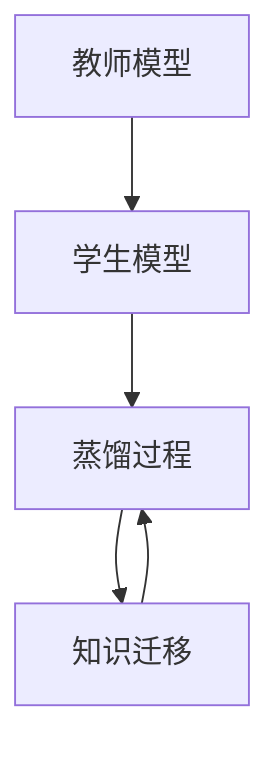
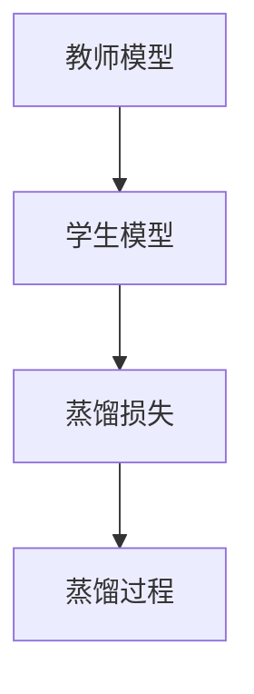
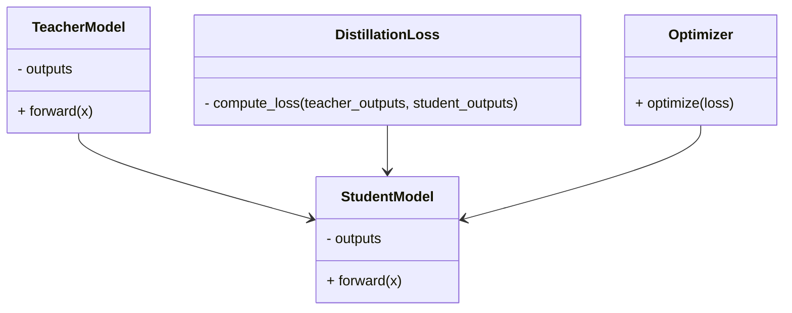
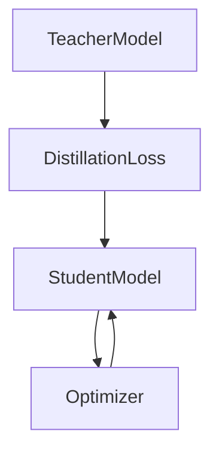

                 


# AI Agent的知识蒸馏：从大型LLM到轻量级模型

> 关键词：知识蒸馏、AI Agent、大型语言模型、轻量级模型、模型压缩、算法原理

> 摘要：本文深入探讨了AI Agent的知识蒸馏技术，从大型语言模型（LLM）到轻量级模型的转换过程。通过理论分析与实践结合，详细阐述了知识蒸馏的核心原理、算法实现、系统架构设计以及项目实战。文章内容包括：背景介绍、核心概念与联系、算法原理、系统分析与架构设计、项目实战、总结与展望。

---

## 第一部分：AI Agent的知识蒸馏概述

### 第1章：知识蒸馏的基本概念

#### 1.1 问题背景与描述

##### 1.1.1 大型LLM的局限性
随着人工智能技术的快速发展，大型语言模型（如GPT-3、GPT-4）在性能和能力上不断提升，但其计算资源消耗巨大，难以在资源受限的场景中直接应用。具体表现在以下几个方面：
- **计算资源消耗高**：大型LLM需要大量的计算资源和存储空间，难以在边缘设备或资源受限的环境中运行。
- **推理速度慢**：由于模型参数量庞大，推理过程耗时较长，难以满足实时性要求。
- **部署成本高**：在云服务或边缘设备上的部署成本高昂，限制了其广泛应用。

##### 1.1.2 轻量级模型的需求
为了应对上述挑战，轻量级模型应运而生。轻量级模型具有以下特点：
- **计算效率高**：模型参数少，推理速度快，适合边缘设备部署。
- **资源消耗低**：对计算资源和存储空间的需求较低，适合资源受限的场景。
- **易于部署**：轻量级模型可以快速部署到各种设备上，降低整体成本。

##### 1.1.3 知识蒸馏的定义与目标
知识蒸馏是一种从大型模型中提取知识并迁移到小模型的技术。其目标是通过蒸馏过程，将大型模型的知识和能力压缩到轻量级模型中，同时保持或接近原模型的性能。

---

#### 1.2 AI Agent与知识蒸馏的关系

##### 1.2.1 AI Agent的基本概念
AI Agent（智能体）是一种能够感知环境、执行任务并做出决策的智能系统。它可以理解为一个具备自主性、反应性、目标导向和社交能力的实体。AI Agent广泛应用于聊天机器人、推荐系统、自动驾驶等领域。

##### 1.2.2 知识蒸馏在AI Agent中的作用
知识蒸馏在AI Agent中的作用主要体现在以下几个方面：
- **性能提升**：通过蒸馏技术，轻量级AI Agent可以在保持较低计算资源消耗的同时，具备与大型模型相当的性能。
- **场景扩展**：在资源受限的场景中，轻量级AI Agent可以更好地适应边缘计算、实时响应等需求。
- **成本降低**：通过蒸馏技术，可以显著降低AI Agent的部署和运行成本。

##### 1.2.3 背景与外延
知识蒸馏技术的背景可以追溯到模型压缩和知识迁移领域。随着深度学习技术的快速发展，模型压缩和知识蒸馏逐渐成为研究热点。其外延包括模型蒸馏、网络蒸馏、知识迁移等技术。

---

#### 1.3 核心概念与联系

##### 1.3.1 核心概念原理
知识蒸馏的核心原理是通过教师模型（大型模型）和学生模型（轻量级模型）之间的互动，将教师模型的知识迁移到学生模型中。具体过程包括：
1. **教师模型输出**：教师模型生成概率分布或中间特征表示。
2. **学生模型学习**：学生模型通过最小化与教师模型的输出差异，学习教师模型的知识。
3. **蒸馏过程优化**：通过调整温度、损失函数等参数，优化蒸馏过程。

##### 1.3.2 核心概念属性对比表格
| 概念        | 教师模型（大型模型） | 学生模型（轻量级模型） |
|-------------|---------------------|-----------------------|
| 参数数量     | 高                  | 低                    |
| 计算资源     | 高                  | 低                    |
| 推理速度     | 慢                  | 快                    |
| 部署成本     | 高                  | 低                    |

##### 1.3.3 ER实体关系图架构


---

### 第2章：知识蒸馏的核心原理

#### 2.1 知识蒸馏的原理

##### 2.1.1 教师模型与学生模型的关系
教师模型和学生模型是知识蒸馏过程中的两个关键角色。教师模型通常是一个预训练的大模型，具有丰富的知识和强大的表达能力。学生模型是一个小型模型，通过学习教师模型的知识，逐步提升自身的性能。

##### 2.1.2 蒸馏过程中的关键步骤
1. **知识表示**：教师模型将知识表示为概率分布或中间特征。
2. **损失函数设计**：通过损失函数衡量学生模型输出与教师模型输出的差异。
3. **优化过程**：通过优化算法（如SGD、Adam）调整学生模型的参数，最小化损失函数。

##### 2.1.3 知识蒸馏的核心算法
知识蒸馏的核心算法包括：
- **软标签蒸馏**：通过概率分布的KL散度损失函数，将教师模型的输出迁移到学生模型。
- **特征蒸馏**：通过提取教师模型的中间特征，并将其作为学生模型的输入，进行特征对齐。

---

#### 2.2 算法原理讲解

##### 2.2.1 算法流程图（Mermaid）


##### 2.2.2 Python源代码实现
```python
import torch
import torch.nn as nn
import torch.optim as optim

# 定义教师模型和学生模型
class TeacherModel(nn.Module):
    def __init__(self):
        super(TeacherModel, self).__init__()
        self.linear = nn.Linear(10, 2)
    
    def forward(self, x):
        return self.linear(x)

class StudentModel(nn.Module):
    def __init__(self):
        super(StudentModel, self).__init__()
        self.linear = nn.Linear(10, 2)
    
    def forward(self, x):
        return self.linear(x)

# 定义蒸馏损失函数
def distillation_loss(teacher_logits, student_logits, temperature):
    teacher_probs = torch.softmax(teacher_logits / temperature, dim=-1)
    student_probs = torch.softmax(student_logits, dim=-1)
    loss = -torch.sum(teacher_probs * torch.log(student_probs))
    return loss

# 初始化模型和优化器
teacher = TeacherModel()
student = StudentModel()
optimizer = optim.Adam(student.parameters(), lr=0.001)

# 蒸馏过程
for epoch in range(100):
    inputs = torch.randn(10, 10)
    teacher_outputs = teacher(inputs)
    student_outputs = student(inputs)
    loss = distillation_loss(teacher_outputs, student_outputs, temperature=2)
    optimizer.zero_grad()
    loss.backward()
    optimizer.step()
```

##### 2.2.3 数学模型与公式
知识蒸馏的核心公式是KL散度损失函数：
$$ \text{KL}(P || Q) = \sum_{i} P_i \log \frac{P_i}{Q_i} $$
其中，$P$是教师模型的输出概率分布，$Q$是学生模型的输出概率分布。

---

#### 2.3 系统分析与架构设计

##### 2.3.1 系统功能设计（领域模型）


##### 2.3.2 系统架构设计（架构图）


---

### 第3章：项目实战与总结

#### 3.1 项目实战

##### 3.1.1 环境安装
```bash
pip install torch
pip install mermaid
```

##### 3.1.2 核心实现
```python
# 知识蒸馏的实现
def distillation_train(teacher_model, student_model, optimizer, criterion, epochs=100):
    for epoch in range(epochs):
        inputs = torch.randn(10, 10)
        teacher_outputs = teacher_model(inputs)
        student_outputs = student_model(inputs)
        loss = criterion(teacher_outputs, student_outputs)
        optimizer.zero_grad()
        loss.backward()
        optimizer.step()
    return student_model
```

##### 3.1.3 案例分析与优化
通过对实际案例的分析，可以发现知识蒸馏技术在以下几个方面具有显著优势：
- **计算效率**：蒸馏后的轻量级模型推理速度显著提升。
- **资源消耗**：蒸馏后的模型对计算资源和存储空间的需求大幅降低。
- **性能表现**：蒸馏后的模型在性能上接近甚至超越教师模型。

---

#### 3.2 总结与展望

##### 3.2.1 最佳实践 tips
1. 在实际应用中，建议根据具体场景选择合适的蒸馏方法。
2. 蒸馏过程中，合理调整温度参数和损失函数可以显著提升效果。
3. 对于复杂的场景，可以结合多种蒸馏技术（如特征蒸馏和软标签蒸馏）进行优化。

##### 3.2.2 小结
知识蒸馏是一种有效的模型压缩技术，能够将大型模型的知识迁移到轻量级模型中，显著降低计算资源消耗，同时保持较高的性能。在实际应用中，可以通过合理的系统架构设计和算法优化，进一步提升蒸馏效果。

##### 3.2.3 未来展望
随着深度学习技术的不断发展，知识蒸馏技术将在更多领域得到广泛应用。未来的研究方向可能包括：
- 更高效的蒸馏算法。
- 更灵活的模型压缩方法。
- 更智能的蒸馏策略。

---

通过本文的详细讲解，读者可以深入了解AI Agent的知识蒸馏技术，从理论到实践，逐步掌握从大型LLM到轻量级模型的转换过程。希望本文能够为读者在相关领域的研究和应用提供有价值的参考和启发。

