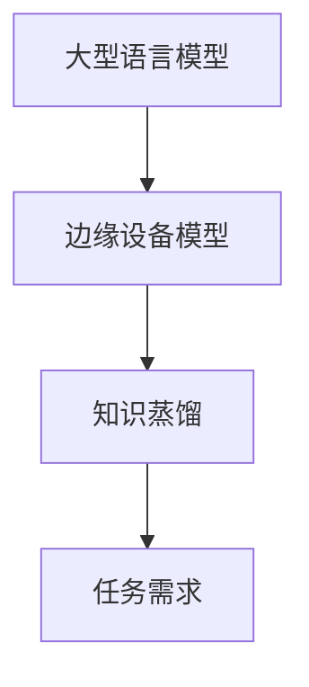
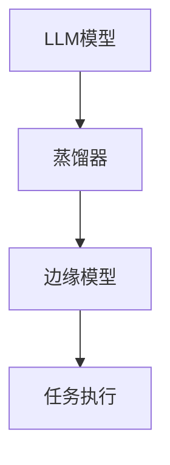
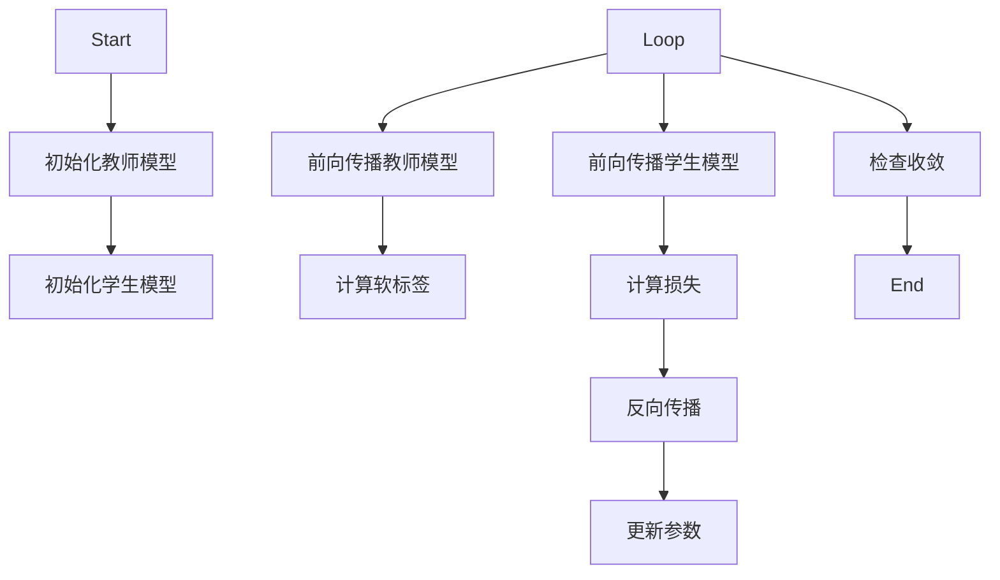
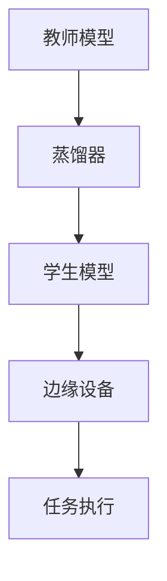
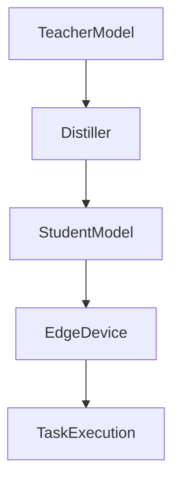
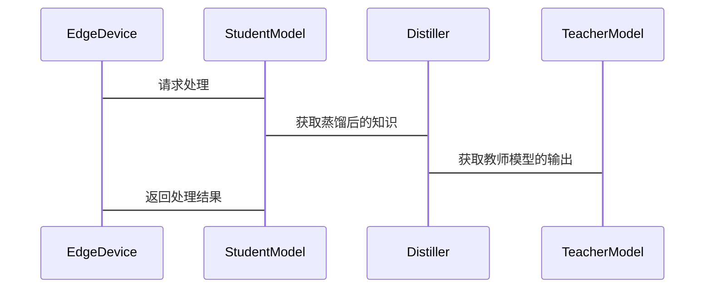

                 


# AI Agent的知识蒸馏：从大型LLM到边缘设备模型

## 关键词：知识蒸馏、AI Agent、边缘设备、LLM、模型优化、机器学习

## 摘要：  
随着人工智能技术的快速发展，大型语言模型（LLM）的能力不断提升，但在实际应用中，如何将这些能力高效地部署到边缘设备上成为一个重要挑战。本文详细探讨了AI Agent的知识蒸馏技术，从大型LLM到边缘设备模型的迁移过程，包括模型压缩、知识传递机制、系统架构设计等关键环节。通过具体案例分析和代码实现，展示了如何将复杂的大型模型优化为适合边缘设备的轻量化模型，确保在资源受限的环境中仍能保持高性能和高效率。

---

## 第1章: AI Agent与知识蒸馏概述

### 1.1 问题背景与描述

#### 1.1.1 大型LLM的局限性  
大型语言模型（LLM）如GPT-3、GPT-4等在自然语言处理任务中表现出色，但其计算资源需求和运行成本极高，难以直接部署到边缘设备上。边缘设备通常具有有限的计算能力和存储空间，无法直接运行这些庞大的模型。

#### 1.1.2 边缘设备的需求与挑战  
边缘设备（如智能手机、物联网设备、嵌入式系统）需要实时响应，对延迟和资源消耗有严格要求。然而，直接在边缘设备上运行大型LLM会导致性能瓶颈，甚至无法运行。

#### 1.1.3 知识蒸馏的核心问题  
知识蒸馏的目标是将大型LLM的知识迁移到更小、更轻量化的模型中，使其能够在边缘设备上高效运行，同时保持较高的准确性。

### 1.2 问题解决与边界

#### 1.2.1 知识蒸馏的目标与方法  
通过知识蒸馏，我们将大型模型的知识（如概率分布、特征表示）传递给目标模型，使其能够在较小的计算资源下完成相似的任务。

#### 1.2.2 边缘设备模型的边界与限制  
边缘设备模型通常具有以下限制：计算能力有限、存储空间有限、功耗受限、实时性要求高等。

#### 1.2.3 知识蒸馏的适用范围与外延  
知识蒸馏不仅适用于LLM，还可以应用于其他类型的大模型，如图像识别模型、推荐系统模型等。

### 1.3 核心概念结构

#### 1.3.1 LLM与边缘设备的关系  
大型LLM负责生成高质量的输出，边缘设备模型负责在本地快速响应，二者通过知识蒸馏技术实现协同工作。

#### 1.3.2 知识蒸馏的核心要素  
- **教师模型**：大型LLM，负责知识传递。
- **学生模型**：边缘设备模型，负责学习。
- **蒸馏过程**：通过损失函数优化学生模型，使其接近教师模型。

#### 1.3.3 系统架构与流程  
知识蒸馏的系统架构包括教师模型、蒸馏器（知识提取模块）、学生模型和任务执行模块。

---

## 第2章: 知识蒸馏的核心概念与联系

### 2.1 核心概念原理

#### 2.1.1 知识蒸馏的基本原理  
知识蒸馏通过损失函数将教师模型的知识传递给学生模型，使学生模型在训练过程中模仿教师模型的行为。

#### 2.1.2 LLM与边缘模型的知识传递机制  
知识传递机制包括直接蒸馏（教师模型直接指导学生模型）和间接蒸馏（通过中间表示传递知识）。

#### 2.1.3 知识蒸馏的关键技术与方法  
- **模型压缩**：减少模型参数数量。
- **知识提取**：提取教师模型的关键特征。
- **蒸馏损失函数**：定义学生模型与教师模型之间的损失。

### 2.2 核心概念对比

#### 2.2.1 LLM与边缘模型的特征对比  
| 特性 | LLM | 边缘模型 |
|------|------|----------|
| 参数量 | 高 | 低 |
| 计算能力 | 强大 | 有限 |
| 延迟 | 低 | 高 |

#### 2.2.2 知识蒸馏与模型压缩的异同  
- **相同点**：都旨在降低模型复杂度。
- **不同点**：知识蒸馏注重知识传递，模型压缩注重参数减少。

#### 2.2.3 知识蒸馏与其他模型优化技术的联系  
知识蒸馏可以与模型剪枝、量化等技术结合，进一步优化模型性能。

### 2.3 ER实体关系图



---

## 第3章: 从LLM到边缘设备的模型迁移

### 3.1 模型压缩与轻量化

#### 3.1.1 知识蒸馏的模型压缩方法  
- **参数剪枝**：移除冗余参数。
- **网络蒸馏**：通过蒸馏损失函数优化学生模型。

#### 3.1.2 轻量化模型的设计原则  
- 简化模型结构。
- 使用小参数量的模型（如MobileNet、EfficientNet）。

#### 3.1.3 常见模型压缩技术对比  
| 技术 | 描述 |
|------|------|
| 剪枝 | 移除冗余参数 |
| 量化 | 减少参数精度 |
| 知识蒸馏 | 通过损失函数优化学生模型 |

### 3.2 知识蒸馏的实现策略

#### 3.2.1 直接蒸馏与间接蒸馏的对比  
- **直接蒸馏**：教师模型直接指导学生模型。
- **间接蒸馏**：通过中间表示传递知识。

#### 3.2.2 蒸馏过程中的关键参数设置  
- 温度（Temperature）：控制蒸馏过程的软化程度。
- 蒸馏系数（Distillation Factor）：平衡蒸馏损失和其他损失的权重。

#### 3.2.3 边缘设备的适应性优化  
根据边缘设备的资源限制，调整模型结构和蒸馏策略。

### 3.3 系统流程图



---

## 第4章: 知识蒸馏算法原理与实现

### 4.1 算法原理

#### 4.1.1 知识蒸馏的基本流程  
1. 定义教师模型和学生模型。
2. 定义蒸馏损失函数。
3. 优化学生模型以最小化蒸馏损失。

#### 4.1.2 蒸馏损失函数的定义  
蒸馏损失函数通常由两部分组成：KL散度和分类损失。

$$ \mathcal{L}_{\text{distill}} = \alpha \mathcal{L}_{\text{KL}} + (1-\alpha) \mathcal{L}_{\text{CE}} $$

其中，$\alpha$ 是蒸馏系数，$\mathcal{L}_{\text{KL}}$ 是KL散度，$\mathcal{L}_{\text{CE}}$ 是交叉熵损失。

#### 4.1.3 蒸馏过程中的优化策略  
- 使用软目标（Soft Targets）：通过调整温度参数，使学生模型的输出更接近教师模型。
- 结合数据增强：通过数据增强技术，增强模型的泛化能力。

### 4.2 算法流程图



### 4.3 算法实现代码

```python
import torch
import torch.nn as nn
import torch.optim as optim

class TeacherModel(nn.Module):
    def __init__(self):
        super(TeacherModel, self).__init__()
        # 定义教师模型结构

class StudentModel(nn.Module):
    def __init__(self):
        super(StudentModel, self).__init__()
        # 定义学生模型结构

def knowledge_distillation(teacher, student, optimizer, criterion_kl, criterion_ce, alpha=0.5, temperature=3):
    student.train()
    optimizer.zero_grad()
    inputs = # 输入数据
    labels = # 标签
    
    with torch.no_grad():
        teacher_outputs = teacher(inputs)
    
    student_outputs = student(inputs)
    
    # 计算软标签
    soft_labels = F.softmax(teacher_outputs / temperature, dim=1)
    
    # 计算蒸馏损失
    kl_loss = F.kl_div(F.log_softmax(student_outputs, dim=1), soft_labels, reduction='batchmean')
    ce_loss = criterion_ce(student_outputs, labels)
    total_loss = alpha * kl_loss + (1 - alpha) * ce_loss
    
    total_loss.backward()
    optimizer.step()
    
    return total_loss.item()
```

---

## 第5章: 系统架构设计与实现

### 5.1 问题场景介绍

#### 5.1.1 项目介绍  
我们希望通过知识蒸馏技术，将大型语言模型的知识迁移到边缘设备模型中，使其能够在边缘设备上高效运行。

#### 5.1.2 系统功能设计  
- 教师模型训练：训练大型语言模型。
- 知识蒸馏：将教师模型的知识传递给学生模型。
- 边缘设备部署：将优化后的模型部署到边缘设备上。

#### 5.1.3 系统架构设计  


### 5.2 系统架构图



### 5.3 系统交互序列图



---

## 第6章: 项目实战与案例分析

### 6.1 项目环境安装

```bash
pip install torch
pip install transformers
pip install mermaid
```

### 6.2 核心代码实现

```python
import torch
from torch import nn
from torch.optim import Adam

class SimpleModel(nn.Module):
    def __init__(self):
        super(SimpleModel, self).__init__()
        self.fc = nn.Linear(10, 2)

    def forward(self, x):
        return self.fc(x)

def train_student_model(student, teacher, optimizer, criterion, dataloader, epochs=100):
    student.train()
    for epoch in range(epochs):
        for inputs, labels in dataloader:
            optimizer.zero_grad()
            with torch.no_grad():
                teacher_outputs = teacher(inputs)
            student_outputs = student(inputs)
            loss = criterion(student_outputs, labels)
            loss.backward()
            optimizer.step()
    return student

# 示例训练
teacher = SimpleModel()
student = SimpleModel()
optimizer = Adam(student.parameters(), lr=0.001)
criterion = nn.CrossEntropyLoss()
student = train_student_model(student, teacher, optimizer, criterion, dataloader, epochs=10)
```

### 6.3 案例分析

#### 6.3.1 案例介绍  
我们通过一个简单的分类任务，展示如何将大型模型的知识蒸馏到边缘设备模型中。

#### 6.3.2 代码实现与分析  
通过上述代码，我们可以看到知识蒸馏的基本流程：定义模型、训练教师模型、进行蒸馏、优化学生模型。

#### 6.3.3 性能对比与优化  
通过对比蒸馏前后的模型性能，我们可以看到蒸馏后的模型在边缘设备上运行更加高效，同时保持较高的准确率。

---

## 第7章: 总结与展望

### 7.1 最佳实践 Tips

#### 7.1.1 知识蒸馏的关键点  
- 选择合适的蒸馏温度。
- 调整蒸馏系数以平衡KL散度和交叉熵损失。
- 结合数据增强技术，增强模型的泛化能力。

#### 7.1.2 边缘设备部署的注意事项  
- 根据设备资源限制调整模型规模。
- 使用量化技术进一步优化模型。
- 定期更新模型，保持性能。

### 7.2 小结

知识蒸馏是一种有效的模型优化技术，通过将大型模型的知识传递给轻量化模型，使其能够在边缘设备上高效运行。本文详细探讨了知识蒸馏的原理、算法实现和系统设计，并通过具体案例展示了其在实际应用中的效果。

### 7.3 注意事项

- 蒸馏过程中需要注意模型的收敛性。
- 边缘设备模型的部署需要考虑设备的硬件限制。
- 定期更新模型以应对数据分布的变化。

### 7.4 拓展阅读

- [《Deep Learning》] Yoshua Bengio
- [《Neural Networks and Deep Learning》] Ian Goodfellow
- [《动手学深度学习》] 周志华

---

# 结语

知识蒸馏作为AI Agent技术的重要组成部分，为大型模型在边缘设备上的部署提供了可行的解决方案。通过本文的探讨，我们希望读者能够深入了解知识蒸馏的核心原理，并能够在实际项目中灵活应用这些技术，推动AI Agent在边缘设备上的广泛应用。

