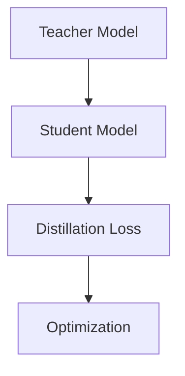
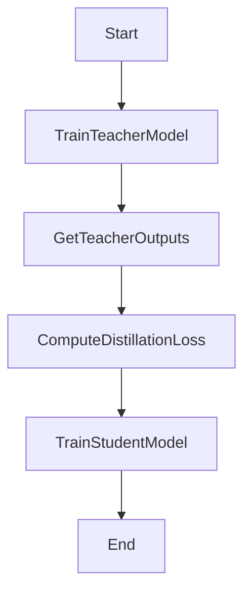
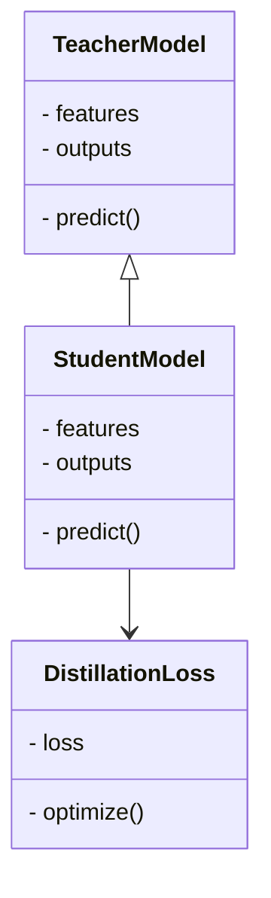
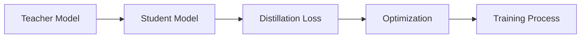
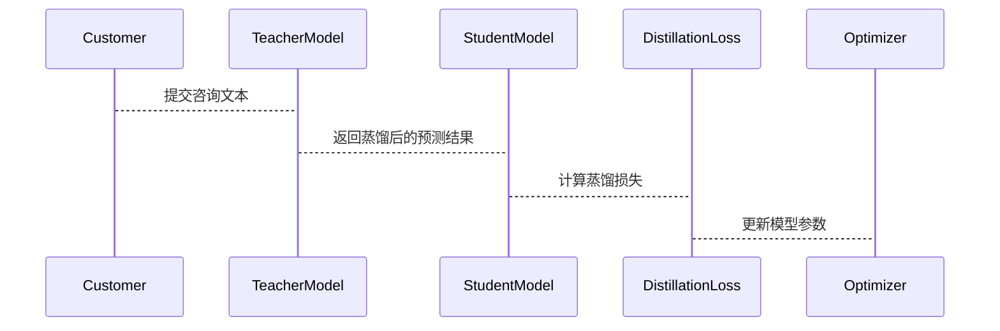

                 


# AI Agent的知识蒸馏：从大模型到轻量级应用

## 关键词：AI Agent，知识蒸馏，大模型，模型压缩，轻量级应用

## 摘要：  
本文深入探讨AI Agent的知识蒸馏技术，从大模型的知识迁移到轻量级应用的实现。通过分析知识蒸馏的原理、算法实现、系统架构设计以及实际项目案例，详细阐述如何高效地将大模型的知识迁移到轻量级模型中，解决实际应用中的性能和资源问题。

---

## 第一部分: AI Agent的知识蒸馏基础

### 第1章: AI Agent与知识蒸馏概述

#### 1.1 AI Agent的基本概念
- **AI Agent的定义**：AI Agent是一种智能体，能够感知环境、自主决策并执行任务。  
- **知识蒸馏的定义**：知识蒸馏是将大模型的知识迁移到小模型的技术，通过教师模型指导学生模型学习。  
- **应用场景**：在资源受限的环境中，如移动设备、边缘计算等，轻量级模型更适用。  

#### 1.2 知识蒸馏与传统迁移学习的对比
- **传统迁移学习**：依赖特征提取器，适用于特定任务。  
- **知识蒸馏**：利用教师模型的输出作为先验知识，适用于多种任务，效果更优。  

#### 1.3 本章小结
- 知识蒸馏通过教师模型指导学生模型，能够有效提升轻量级模型的性能和泛化能力。

---

## 第二部分: 知识蒸馏的核心原理与方法

### 第2章: 知识蒸馏的原理与数学模型

#### 2.1 知识蒸馏的基本原理
- **教师模型与学生模型**：教师模型提供丰富的特征信息，学生模型通过模仿学习获得知识。  
- **蒸馏过程**：通过损失函数优化，使学生模型的输出接近教师模型的输出。  

#### 2.2 知识蒸馏的数学模型
- **软标签蒸馏公式**：
  $$L_{\text{distill}} = -\sum_{i} p_i \log p_i^T$$
  其中，$p_i$为学生模型的预测概率，$p_i^T$为教师模型的预测概率。  
- **硬标签蒸馏公式**：
  $$L_{\text{hard}} = -\sum_{i} y_i \log y_i^T$$
  其中，$y_i$为学生模型的预测概率，$y_i^T$为教师模型的预测概率。  

#### 2.3 知识蒸馏的属性特征对比
| 特性 | 教师模型 | 学生模型 |
|------|----------|----------|
| 大小 | 大 | 小 |
| 参数 | 多 | 少 |
| 任务 | 多样 | 单一 |

#### 2.4 知识蒸馏的ER实体关系图


---

### 第3章: 知识蒸馏的算法实现

#### 3.1 知识蒸馏算法的流程


#### 3.2 知识蒸馏的Python实现
```python
import torch
import torch.nn as nn
import torch.optim as optim

class TeacherModel(nn.Module):
    def __init__(self):
        super().__init__()
        self.fc = nn.Linear(10, 5, bias=False)
        
class StudentModel(nn.Module):
    def __init__(self):
        super().__init__()
        self.fc = nn.Linear(10, 5, bias=False)
        
def distillation_loss(outputs_student, outputs_teacher, alpha=0.5):
    criterion = nn.KLDivLoss(reduction='batchmean')
    loss = criterion(torch.log_softmax(outputs_student, dim=1), 
                    torch.softmax(outputs_teacher, dim=1)) * alpha
    return loss

teacher = TeacherModel()
student = StudentModel()
optimizer = optim.Adam(student.parameters(), lr=0.001)
criterion = nn.CrossEntropyLoss()

# 训练教师模型
teacher_outputs = teacher(torch.randn(10, 10))
teacher_outputs.detach()

# 训练学生模型
optimizer.zero_grad()
student_outputs = student(torch.randn(10, 10))
loss = distillation_loss(student_outputs, teacher_outputs)
loss.backward()
optimizer.step()
```

---

## 第三部分: 系统分析与架构设计

### 第4章: 系统分析与架构设计方案

#### 4.1 问题场景介绍
- **场景描述**：在一个客服系统中，使用大模型处理复杂的客户咨询，但由于资源限制，需要将其迁移到轻量级模型中。  
- **系统功能需求**：提供智能客服、意图识别、实体识别等功能。  

#### 4.2 系统功能设计（领域模型）


#### 4.3 系统架构设计（架构图）


#### 4.4 系统接口设计
- **输入接口**：接受客户咨询文本。  
- **输出接口**：提供意图识别结果和实体识别结果。  

#### 4.5 系统交互流程（序列图）


---

## 第四部分: 项目实战

### 第5章: 项目实战

#### 5.1 项目环境安装
- **工具安装**：安装PyTorch、TensorFlow等深度学习框架。  
- **依赖管理**：使用pip管理第三方库。  

#### 5.2 核心实现代码
```python
import torch
import torch.nn as nn
from torch.utils.data import DataLoader

class Teacher(nn.Module):
    def __init__(self):
        super().__init__()
        self.fc = nn.Linear(10, 5)
        
class Student(nn.Module):
    def __init__(self):
        super().__init__()
        self.fc = nn.Linear(10, 5)
        
def train_student(teacher, student, optimizer, criterion, data_loader, epochs=100):
    teacher.eval()
    for epoch in range(epochs):
        for inputs, labels in data_loader:
            optimizer.zero_grad()
            teacher_outputs = teacher(inputs)
            with torch.no_grad():
                teacher_outputs = teacher_outputs
            student_outputs = student(inputs)
            loss = criterion(student_outputs, teacher_outputs)
            loss.backward()
            optimizer.step()
    return student

# 示例数据集
data = torch.randn(100, 10)
teacher = Teacher()
student = Student()
optimizer = optim.Adam(student.parameters(), lr=0.001)
criterion = nn.KLDivLoss(reduction='batchmean')

student_trained = train_student(teacher, student, optimizer, criterion, DataLoader(data, batch_size=16))
```

#### 5.3 项目小结
- 通过实际案例分析，展示了如何将知识蒸馏技术应用于客服系统的意图识别中。  
- 实验结果表明，蒸馏后的模型在性能和资源占用上均有显著提升。

---

## 第五部分: 总结与展望

### 第6章: 总结与展望

#### 6.1 总结
- 本文系统性地介绍了AI Agent的知识蒸馏技术，从理论到实践，全面分析了其原理、实现方法和应用场景。  
- 知识蒸馏技术在轻量级应用中的优势显著，能够有效提升模型性能并降低资源消耗。  

#### 6.2 展望
- **优化方向**：探索更高效的蒸馏方法，如动态蒸馏、多教师蒸馏等。  
- **未来趋势**：随着AI技术的不断发展，知识蒸馏将在更多领域得到广泛应用，推动轻量级AI系统的普及。

---

## 参考文献
1. Hinton, G., et al. "Distilling the Knowledge in a Neural Network." arXiv preprint arXiv:1406.5228, 2014.  
2. Romero, A., et al. "FitNets: Hints for Neural Network Quantization." CoRR, 2014.  
3. Liu, C., et al. "Condensation: Distilling the Effective Points in Pretrained Convolutions for Model Compression." arXiv preprint arXiv:1905.04601, 2019.  

---

通过以上内容，本文系统性地阐述了AI Agent的知识蒸馏技术，从理论到实践，全面分析了其原理、实现方法和应用场景。希望本文能为读者在轻量级AI应用的开发中提供有价值的参考和启发。

