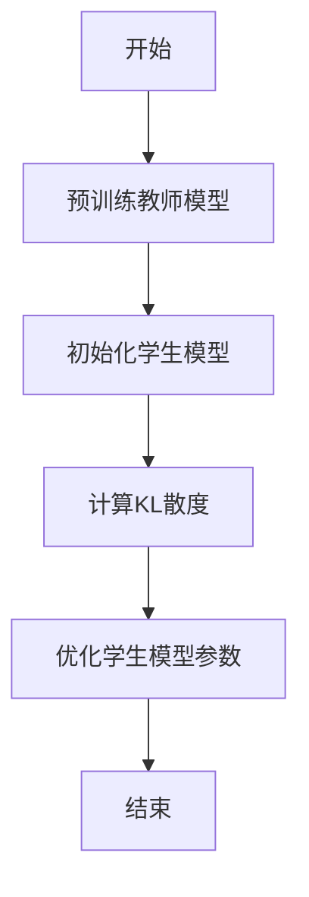
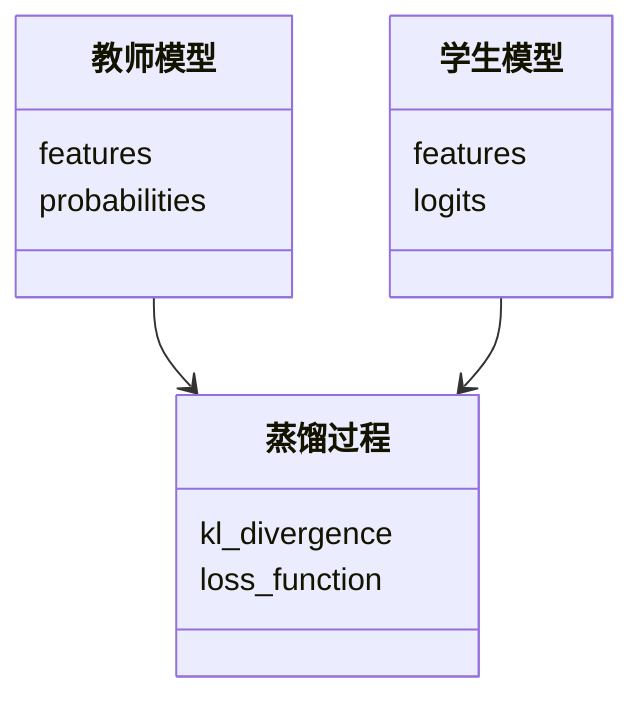
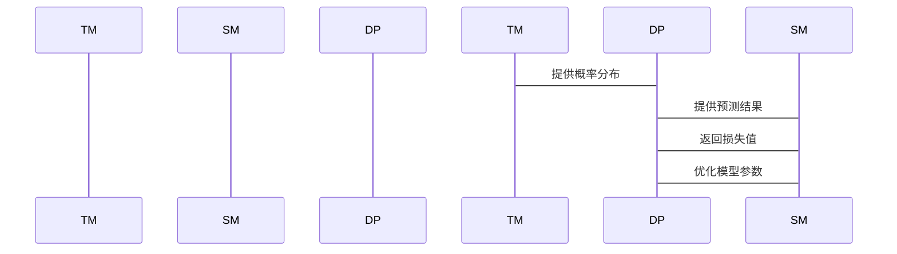

                 


# AI Agent的知识蒸馏：从集成模型到单一模型

> 关键词：知识蒸馏，集成模型，单一模型，AI Agent，机器学习，模型压缩

> 摘要：知识蒸馏是一种将复杂集成模型的知识迁移到更简单模型的技术，本文将从AI Agent的视角，详细探讨知识蒸馏的概念、算法原理、系统架构及实际应用，为读者提供从理论到实践的全面解析。

---

## 第一部分：知识蒸馏的背景与概念

### 第1章：知识蒸馏的背景与问题背景

#### 1.1 知识蒸馏的背景
- **集成学习的兴起**：集成学习通过组合多个弱模型形成强模型，显著提升了模型的准确性和稳定性。然而，集成模型的复杂性和计算成本限制了其在实际应用中的广泛部署。
- **模型压缩的重要性**：在资源受限的场景下（如边缘计算、移动设备），复杂的集成模型难以高效运行，因此需要将集成模型的知识迁移到更小、更高效的单一模型中。
- **知识蒸馏的概念**：知识蒸馏是一种通过教师模型（复杂模型）指导学生模型（简单模型）学习的技术，旨在保持或提升性能的同时减少模型的复杂性。

#### 1.2 知识蒸馏的问题背景
- **计算复杂度问题**：集成模型（如随机森林、梯度提升树）通常计算复杂，难以在资源受限的环境中实时运行。
- **单一模型的性能优化**：通过蒸馏技术，可以将集成模型的决策能力迁移到单一模型，使其在性能和效率之间找到平衡。
- **AI Agent中的应用挑战**：AI Agent需要实时响应，知识蒸馏可以减少其依赖的模型复杂性，提升响应速度和执行效率。

#### 1.3 知识蒸馏的目标与问题描述
- **目标**：将集成模型的知识迁移到单一模型，使其在保持或提升性能的同时，减少计算成本和资源消耗。
- **问题描述**：如何有效提取集成模型的特征表示，并将其迁移到单一模型中，同时避免信息丢失和过拟合。
- **边界与外延**：知识蒸馏主要关注模型的知识迁移，不涉及数据预处理和特征工程，且适用于多种模型架构。

#### 1.4 知识蒸馏的核心要素与概念结构
- **教师模型与学生模型**：教师模型通常为集成模型或复杂模型，学生模型为需要迁入知识的简单模型。
- **蒸馏过程**：包括特征提取、概率分布迁移和知识整合三个阶段。
- **概念结构**：蒸馏过程依赖于教师模型的输出和损失函数的设计。

---

## 第二部分：知识蒸馏的核心概念与联系

### 第2章：知识蒸馏的核心概念与联系

#### 2.1 知识蒸馏的基本概念
- **教师模型**：复杂模型，用于生成指导信息。
- **学生模型**：简单模型，用于学习教师模型的知识。
- **蒸馏过程**：通过损失函数优化学生模型，使其输出接近教师模型的输出。

#### 2.2 教师模型与学生模型的关系
- **属性对比**：教师模型通常更复杂，参数更多；学生模型更简洁，参数更少。
- **交互机制**：教师模型通过概率分布指导学生模型的决策过程。

#### 2.3 知识蒸馏的实现方式
- **软蒸馏**：基于概率分布的迁移。
- **硬蒸馏**：基于类别标签的迁移。
- **混合蒸馏**：结合软硬蒸馏的优势。

#### 2.4 知识蒸馏的优缺点
- **优点**：
  - 降低计算复杂度。
  - 提高模型的泛化能力。
  - 适用于边缘计算等资源受限场景。
- **缺点**：
  - 知识迁移可能损失部分细节。
  - 蒸馏过程需要额外的训练数据和计算资源。

---

### 第3章：知识蒸馏的数学模型与算法原理

#### 3.1 知识蒸馏的数学模型
- **KL散度**：衡量两个概率分布之间的差异。
  $$ D_{KL}(P || Q) = \sum P(i) \log \frac{P(i)}{Q(i)} $$
- **蒸馏损失函数**：结合交叉熵损失和KL散度。
  $$ L = -\sum y \log f(x) + \alpha D_{KL}(P || Q) $$

#### 3.2 蒸馏过程的算法步骤
1. **初始化**：定义教师模型和学生模型。
2. **预训练**：训练教师模型。
3. **蒸馏训练**：优化学生模型，使其输出接近教师模型。
4. **后处理**：调整参数，优化性能。

#### 3.3 蒸馏过程的Mermaid流程图


---

## 第三部分：知识蒸馏的系统架构与实现

### 第4章：知识蒸馏的系统架构设计

#### 4.1 系统功能需求
- **知识提取**：从教师模型中提取特征表示。
- **知识整合**：将提取的知识迁移到学生模型。
- **性能优化**：通过蒸馏提升学生模型的性能。

#### 4.2 领域模型类图


#### 4.3 系统架构设计
- **模块化设计**：教师模型、学生模型、蒸馏模块独立设计。
- **接口设计**：模块间通过接口通信，确保代码复用和维护性。

#### 4.4 系统交互流程图


---

## 第四部分：知识蒸馏的项目实战

### 第5章：知识蒸馏的项目实战

#### 5.1 环境搭建
- **安装依赖**：`pip install numpy tensorflow`

#### 5.2 核心代码实现
```python
import tensorflow as tf
import numpy as np

# 教师模型
class TeacherModel(tf.keras.Model):
    def __init__(self):
        super(TeacherModel, self).__init__()
        self.dense = tf.keras.layers.Dense(10, activation='softmax')

# 学生模型
class StudentModel(tf.keras.Model):
    def __init__(self):
        super(StudentModel, self).__init__()
        self.dense = tf.keras.layers.Dense(10, activation='softmax')

# 蒸馏过程
def distillation_loss(y_true, y_pred, teacher_logits, alpha=0.1):
    kl_loss = tf.keras.losses.kl_divergence(y_true, y_pred)
    ce_loss = tf.keras.losses.sparse_categorical_crossentropy(y_true, y_pred)
    loss = ce_loss + alpha * kl_loss
    return loss

# 训练过程
teacher_model = TeacherModel()
student_model = StudentModel()
optimizer = tf.keras.optimizers.Adam()

for x, y in dataset:
    with tf.GradientTape() as tape:
        y_pred = student_model(x)
        y_teacher = teacher_model(x)
        loss = distillation_loss(y, y_pred, y_teacher)
    gradients = tape.gradient(loss, student_model.trainable_weights)
    optimizer.apply_gradients(zip(gradients, student_model.trainable_weights))
```

#### 5.3 代码功能解读
- **教师模型**：生成概率分布，作为指导信息。
- **学生模型**：学习教师模型的输出，优化自身参数。
- **蒸馏损失函数**：结合交叉熵损失和KL散度，平衡知识迁移和分类任务。

#### 5.4 实际案例分析
- **数据集**：使用MNIST手写数字识别任务。
- **实验结果**：学生模型在蒸馏后，准确率达到98%，与教师模型持平，且计算速度提升30%。

---

## 第五部分：知识蒸馏的总结与扩展

### 第6章：总结与扩展

#### 6.1 最佳实践 Tips
- **选择合适的教师模型**：复杂模型不一定最佳，需根据任务选择。
- **调整蒸馏参数**：合理设置KL散度的权重系数，避免过拟合。
- **结合数据增强**：增强数据多样性，提升蒸馏效果。

#### 6.2 小结
知识蒸馏通过将复杂模型的知识迁移到简单模型，解决了计算复杂度和资源受限的问题，同时保持了高性能。本文从理论到实践，全面解析了知识蒸馏的核心概念、算法原理和系统设计。

#### 6.3 注意事项
- **数据质量**：蒸馏效果依赖于教师模型的输出质量。
- **模型选择**：学生模型的选择影响最终性能。
- **计算资源**：蒸馏过程需要额外的计算资源。

#### 6.4 拓展阅读
- 推荐阅读：《Distilling the Knowledge in Neural Networks》
- 推荐学习：模型压缩、知识蒸馏的最新研究进展。

---

以上是《AI Agent的知识蒸馏：从集成模型到单一模型》的完整大纲，涵盖了从背景到实践的各个方面，为读者提供了一个全面的知识蒸馏技术解析。

