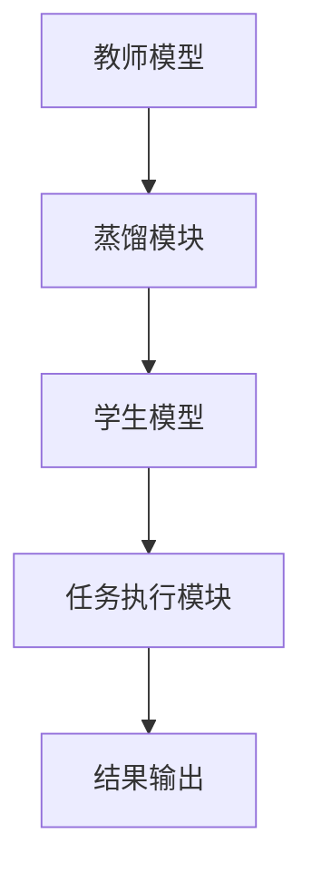
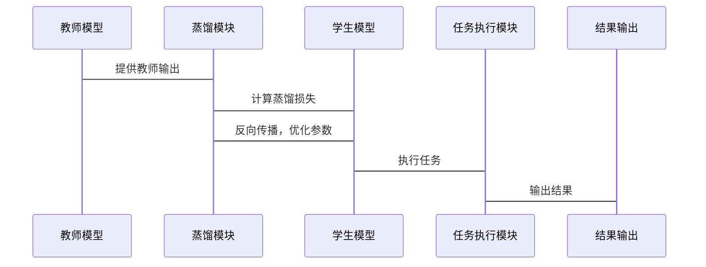

                 


# AI Agent的知识蒸馏：从集成模型到单一高效LLM

---

## 关键词：
AI Agent, 知识蒸馏, 大语言模型, 模型压缩, 机器学习

---

## 摘要：
本文系统地探讨了AI Agent中知识蒸馏技术的应用，从集成模型到单一高效的大语言模型（LLM），详细分析了知识蒸馏的核心概念、算法原理、系统架构及实际应用。通过结合理论与实践，本文揭示了知识蒸馏在提升AI Agent性能和效率中的关键作用，并提供了丰富的案例和代码示例，帮助读者深入理解和应用这一技术。

---

## 第一部分: AI Agent的知识蒸馏概述

---

## 第1章: AI Agent与知识蒸馏概述

### 1.1 AI Agent的基本概念

#### 1.1.1 AI Agent的定义与特点
AI Agent（人工智能代理）是指能够感知环境、自主决策并执行任务的智能实体。其特点包括：
- **自主性**：无需外部干预，自主完成任务。
- **反应性**：能够实时感知环境并做出响应。
- **目标导向**：基于目标驱动行为。
- **社会能力**：能够与其他Agent或人类进行交互与协作。

#### 1.1.2 AI Agent的应用场景
AI Agent广泛应用于以下场景：
- **智能助手**：如虚拟助手、聊天机器人。
- **自动驾驶**：用于车辆的决策和控制。
- **推荐系统**：基于用户行为推荐相关内容。
- **游戏AI**：在游戏开发中实现智能对手或队友。

#### 1.1.3 AI Agent与知识蒸馏的关系
AI Agent通常依赖于复杂的模型（如集成模型）来实现高性能，但这些模型可能在推理阶段消耗大量资源。知识蒸馏作为一种模型压缩技术，能够将复杂模型的知识迁移到更高效、更轻量的模型中，从而提升AI Agent的推理效率和部署能力。

---

### 1.2 知识蒸馏的基本概念

#### 1.2.1 知识蒸馏的定义
知识蒸馏（Knowledge Distillation）是一种将复杂模型（教师模型）的知识迁移到简单模型（学生模型）的技术。通过优化学生模型的输出，使其尽可能接近教师模型的输出，从而继承教师模型的性能。

#### 1.2.2 知识蒸馏的核心思想
知识蒸馏的核心思想是通过软目标（soft targets）来指导学生模型的训练，而不是传统的硬目标（hard targets）。软目标通常是对教师模型输出的概率分布进行平滑处理后得到的。

#### 1.2.3 知识蒸馏与模型压缩的区别
知识蒸馏属于模型压缩技术的一种，但两者有区别：
- **模型压缩**：通过减少模型参数或降低精度来减小模型大小。
- **知识蒸馏**：通过知识迁移来提升目标模型的性能，通常不改变模型的架构或参数数量。

---

### 1.3 知识蒸馏的背景与现状

#### 1.3.1 知识蒸馏的发展历程
知识蒸馏的概念最早由Hinton等人在2015年提出，主要用于深度神经网络的压缩与加速。随着大语言模型的兴起，知识蒸馏在AI Agent中的应用逐渐受到关注。

#### 1.3.2 当前知识蒸馏技术的应用现状
当前，知识蒸馏已在以下领域得到广泛应用：
- **自然语言处理**：将大型语言模型的知识迁移到更小的模型中。
- **计算机视觉**：用于模型压缩和边缘设备部署。
- **推荐系统**：通过蒸馏提升推荐模型的效率和性能。

#### 1.3.3 知识蒸馏在AI Agent中的必要性
AI Agent通常需要在资源受限的环境中运行，知识蒸馏能够帮助其在保持高性能的同时，降低计算资源消耗，提升推理速度。

---

### 1.4 知识蒸馏与大语言模型的关系

#### 1.4.1 大语言模型的基本特点
大语言模型（如GPT系列）通常具有以下特点：
- **参数量大**：通常拥有 billions 级别的参数。
- **训练数据丰富**：需要大量高质量的训练数据。
- **计算资源消耗大**：训练和推理都需要大量计算资源。

#### 1.4.2 知识蒸馏在大语言模型中的作用
知识蒸馏可以将大语言模型的知识迁移到更小、更高效的模型中，从而在资源受限的场景下实现高性能。

#### 1.4.3 知识蒸馏对AI Agent性能的提升
通过知识蒸馏，AI Agent可以在以下方面受益：
- **推理速度提升**：通过使用更小的模型，推理速度显著提高。
- **资源消耗降低**：减少计算资源的消耗，适合边缘设备部署。
- **模型鲁棒性增强**：通过蒸馏教师模型的知识，目标模型的泛化能力得到提升。

---

## 1.5 本章小结
本章介绍了AI Agent和知识蒸馏的基本概念，分析了知识蒸馏在AI Agent中的必要性和应用价值，并探讨了知识蒸馏与大语言模型的关系。知识蒸馏作为一种有效的模型压缩技术，能够显著提升AI Agent的性能和效率，为其实现更广泛的应用提供了技术支持。

---

## 第2章: 知识蒸馏的核心概念与原理

### 2.1 知识蒸馏的核心概念

#### 2.1.1 知识蒸馏的目标
知识蒸馏的目标是通过优化学生模型的输出，使其尽可能接近教师模型的输出，从而继承教师模型的知识。

#### 2.1.2 知识蒸馏的关键技术
知识蒸馏的关键技术包括：
- **软目标生成**：对教师模型的输出进行概率分布的平滑处理。
- **蒸馏损失计算**：定义学生模型与软目标之间的损失函数。
- **蒸馏温度调整**：通过调整温度参数控制软目标的分布宽度。

#### 2.1.3 知识蒸馏的实现流程
知识蒸馏的实现流程包括以下步骤：
1. **选择教师模型**：选择一个高性能的教师模型。
2. **定义学生模型**：设计一个轻量级的学生模型。
3. **生成软目标**：对教师模型的输出进行平滑处理，生成软目标。
4. **计算蒸馏损失**：定义学生模型与软目标之间的损失函数。
5. **优化学生模型**：通过反向传播优化学生模型的参数，使其损失最小化。

---

### 2.2 知识蒸馏的原理分析

#### 2.2.1 知识蒸馏的基本原理
知识蒸馏的基本原理是通过优化学生模型的输出，使其尽可能接近教师模型的输出。教师模型的输出通常经过平滑处理，形成软目标，学生模型通过最小化与软目标的差异来学习教师的知识。

#### 2.2.2 知识蒸馏的数学模型
知识蒸馏的核心数学模型包括以下内容：
- **软目标生成**：对教师模型的输出进行平滑处理，生成概率分布。
- **蒸馏损失函数**：定义学生模型输出与软目标之间的差异。
- **蒸馏温度调整**：通过调整温度参数控制软目标的分布宽度。

#### 2.2.3 知识蒸馏的优化方法
知识蒸馏的优化方法包括：
- **调整蒸馏温度**：通过增加温度来平滑软目标的分布。
- **引入正则化项**：在蒸馏损失中引入正则化项，平衡学生模型与软目标之间的差异。
- **结合硬目标**：在蒸馏过程中同时考虑硬目标和软目标，平衡两者的影响。

---

### 2.3 知识蒸馏的核心算法

#### 2.3.1 蒸馏损失函数
蒸馏损失函数通常由以下两部分组成：
$$ L_{\text{distill}} = \lambda_1 L_{\text{KL}} + \lambda_2 L_{\text{CE}} $$
其中，$$L_{\text{KL}}$$ 表示KL散度损失，$$L_{\text{CE}}$$ 表示交叉熵损失，$$\lambda_1$$ 和 $$\lambda_2$$ 是权重系数。

#### 2.3.2 蒸馏温度的设置
蒸馏温度的设置通常通过调整KL散度中的温度参数来实现。温度越高，软目标的分布越平滑；温度越低，软目标的分布越集中。

#### 2.3.3 蒸馏过程中的优化策略
蒸馏过程中的优化策略包括：
- **逐步降低温度**：从高温度开始，逐步降低温度，使学生模型逐步从软目标中提取更精细的信息。
- **结合数据增强**：在蒸馏过程中结合数据增强技术，增强学生模型的泛化能力。
- **多教师蒸馏**：使用多个教师模型进行蒸馏，结合多个教师的知识。

---

### 2.4 知识蒸馏与其他技术的对比

#### 2.4.1 知识蒸馏与模型剪枝的对比
- **知识蒸馏**：通过优化输出概率分布，将教师模型的知识迁移到学生模型中。
- **模型剪枝**：通过删除冗余的神经元或参数，直接减少模型的大小。

#### 2.4.2 知识蒸馏与知识迁移的对比
- **知识蒸馏**：通过软目标指导学生模型的训练，提升学生模型的性能。
- **知识迁移**：通过任务适配或特征提取，将教师模型的知识迁移到目标模型中。

#### 2.4.3 知识蒸馏与模型压缩的对比
- **知识蒸馏**：通过知识迁移提升目标模型的性能，通常不改变模型的架构。
- **模型压缩**：通过减少模型参数或降低精度来减小模型的大小。

---

## 2.5 本章小结
本章详细分析了知识蒸馏的核心概念与原理，包括其目标、关键技术、数学模型和优化方法。同时，对比了知识蒸馏与其他相关技术的异同，为后续章节的实现提供了理论基础。

---

## 第3章: 知识蒸馏的算法原理与实现

### 3.1 知识蒸馏的算法流程

#### 3.1.1 知识蒸馏的基本流程
知识蒸馏的基本流程包括以下步骤：
1. **选择教师模型**：选择一个高性能的教师模型。
2. **定义学生模型**：设计一个轻量级的学生模型。
3. **生成软目标**：对教师模型的输出进行平滑处理，生成软目标。
4. **计算蒸馏损失**：定义学生模型输出与软目标之间的差异。
5. **优化学生模型**：通过反向传播优化学生模型的参数，使其损失最小化。

#### 3.1.2 知识蒸馏的实现步骤
知识蒸馏的实现步骤包括：
- **教师模型的输出处理**：对教师模型的输出进行平滑处理，生成软目标。
- **学生模型的训练**：定义损失函数，优化学生模型的参数。
- **蒸馏过程中的温度调整**：通过调整温度参数控制软目标的分布宽度。

#### 3.1.3 知识蒸馏的优化策略
知识蒸馏的优化策略包括：
- **逐步降低温度**：从高温度开始，逐步降低温度，使学生模型逐步从软目标中提取更精细的信息。
- **结合硬目标**：在蒸馏过程中同时考虑硬目标和软目标，平衡两者的影响。
- **多教师蒸馏**：使用多个教师模型进行蒸馏，结合多个教师的知识。

---

### 3.2 知识蒸馏的数学模型

#### 3.2.1 蒸馏损失函数
蒸馏损失函数通常由以下两部分组成：
$$ L_{\text{distill}} = \lambda_1 L_{\text{KL}} + \lambda_2 L_{\text{CE}} $$
其中，$$L_{\text{KL}}$$ 表示KL散度损失，$$L_{\text{CE}}$$ 表示交叉熵损失，$$\lambda_1$$ 和 $$\lambda_2$$ 是权重系数。

#### 3.2.2 蒸馏温度对模型性能的影响
蒸馏温度的设置通过调整KL散度中的温度参数来实现。温度越高，软目标的分布越平滑；温度越低，软目标的分布越集中。

#### 3.2.3 知识蒸馏的优化算法
知识蒸馏的优化算法通常采用梯度下降方法，如Adam优化器，通过反向传播优化学生模型的参数。

---

### 3.3 知识蒸馏的代码实现

#### 3.3.1 环境搭建
知识蒸馏的代码实现需要以下环境：
- Python 3.6+
- PyTorch 1.9+
- transformers库

#### 3.3.2 教师模型的定义
```python
class TeacherModel(nn.Module):
    def __init__(self):
        super().__init__()
        # 定义教师模型的架构
        self.fc1 = nn.Linear(10, 100)
        self.fc2 = nn.Linear(100, 10)
```

#### 3.3.3 学生模型的定义
```python
class StudentModel(nn.Module):
    def __init__(self):
        super().__init__()
        # 定义学生模型的架构
        self.fc1 = nn.Linear(10, 50)
        self.fc2 = nn.Linear(50, 10)
```

#### 3.3.4 蒸馏损失函数的定义
```python
def distillation_loss(student_logits, teacher_logits, temperature):
    # 对教师模型的输出进行平滑处理
    teacher_probs = F.softmax(teacher_logits / temperature, dim=-1)
    # 对学生模型的输出进行处理
    student_probs = F.softmax(student_logits, dim=-1)
    # 计算KL散度损失
    loss_kl = F.kl_div(student_probs, teacher_probs, log_target=False)
    # 计算交叉熵损失
    loss_ce = F.cross_entropy(student_logits, teacher_labels)
    # 综合损失
    return 0.5 * loss_kl + 0.5 * loss_ce
```

#### 3.3.5 知识蒸馏的训练过程
```python
def train(model, teacher_model, optimizer, criterion, epochs=100):
    for epoch in range(epochs):
        for batch_input, batch_labels in dataloader:
            # 前向传播
            student_logits = model(batch_input)
            teacher_logits = teacher_model(batch_input)
            # 计算蒸馏损失
            loss = criterion(student_logits, teacher_logits, temperature)
            # 反向传播与优化
            optimizer.zero_grad()
            loss.backward()
            optimizer.step()
```

---

### 3.4 知识蒸馏的实际案例分析

#### 3.4.1 案例背景
假设我们有一个图像分类任务，教师模型是一个大型的卷积神经网络（CNN），学生模型是一个轻量级的CNN。

#### 3.4.2 案例分析
通过知识蒸馏，学生模型在教师模型的指导下，逐步学习到教师模型的知识，最终在图像分类任务中表现出色。

#### 3.4.3 案例总结
知识蒸馏能够显著提升学生模型的性能，同时保持较低的计算资源消耗。

---

## 3.5 本章小结
本章详细讲解了知识蒸馏的算法原理与实现，包括其数学模型、代码实现和实际案例分析。通过本章的学习，读者可以掌握知识蒸馏的核心思想和技术，为后续章节的系统设计和项目实战打下坚实基础。

---

## 第4章: 知识蒸馏在AI Agent中的系统分析与架构设计

### 4.1 系统分析

#### 4.1.1 系统目标
知识蒸馏在AI Agent中的目标是将复杂模型的知识迁移到更高效、更轻量的模型中，提升AI Agent的推理效率和性能。

#### 4.1.2 系统功能需求
- **知识蒸馏模块**：负责将教师模型的知识迁移到学生模型中。
- **模型管理模块**：负责管理教师模型和学生模型的生命周期。
- **任务执行模块**：负责AI Agent的任务执行和结果输出。

#### 4.1.3 系统性能指标
- **推理速度**：通过知识蒸馏，AI Agent的推理速度显著提升。
- **资源消耗**：模型参数减少，计算资源消耗降低。
- **模型性能**：学生模型在任务执行中的准确率接近教师模型。

---

### 4.2 系统架构设计

#### 4.2.1 系统架构概述
知识蒸馏在AI Agent中的系统架构包括以下模块：
- **教师模型**：负责生成软目标。
- **学生模型**：负责学习教师模型的知识。
- **蒸馏模块**：负责计算蒸馏损失并优化学生模型。
- **任务执行模块**：负责AI Agent的任务执行和结果输出。

#### 4.2.2 系统架构图


#### 4.2.3 系统交互流程
1. 教师模型生成软目标。
2. 蒸馏模块计算学生模型与软目标之间的差异。
3. 学生模型通过优化算法优化其参数。
4. 优化后的学生模型应用于任务执行模块。
5. 任务执行模块输出结果。

---

### 4.3 系统接口设计

#### 4.3.1 系统接口概述
知识蒸馏系统的主要接口包括：
- **教师模型接口**：提供教师模型的输出。
- **学生模型接口**：提供学生模型的输出和优化接口。
- **蒸馏模块接口**：提供蒸馏损失计算和优化接口。

#### 4.3.2 系统接口描述
- **教师模型接口**：
  ```python
  def get_output(input):
      # 返回教师模型的输出
  ```
- **学生模型接口**：
  ```python
  def forward(input):
      # 返回学生模型的输出
  def backward(loss):
      # 反向传播，更新模型参数
  ```
- **蒸馏模块接口**：
  ```python
  def compute_loss(student_output, teacher_output, temperature):
      # 计算蒸馏损失
  def optimize(student_model, loss):
      # 优化学生模型的参数
  ```

---

### 4.4 系统交互流程图


---

## 4.5 本章小结
本章通过系统分析与架构设计，详细描述了知识蒸馏在AI Agent中的实现过程。通过对系统的功能需求、架构设计和交互流程的分析，为知识蒸馏技术在AI Agent中的应用提供了理论支持和实践指导。

---

## 第5章: 知识蒸馏的项目实战

### 5.1 项目概述

#### 5.1.1 项目背景
本项目旨在通过知识蒸馏技术，将复杂模型的知识迁移到更高效、更轻量的模型中，提升AI Agent的性能和效率。

#### 5.1.2 项目目标
- 实现知识蒸馏模块。
- 验证知识蒸馏在AI Agent中的有效性。
- 提供一个可扩展的知识蒸馏框架。

---

### 5.2 环境搭建

#### 5.2.1 环境要求
- Python 3.6+
- PyTorch 1.9+
- transformers库

#### 5.2.2 安装依赖
```bash
pip install torch transformers
```

---

### 5.3 代码实现

#### 5.3.1 教师模型的定义
```python
class TeacherModel(nn.Module):
    def __init__(self):
        super().__init__()
        self.fc1 = nn.Linear(10, 100)
        self.fc2 = nn.Linear(100, 10)
```

#### 5.3.2 学生模型的定义
```python
class StudentModel(nn.Module):
    def __init__(self):
        super().__init__()
        self.fc1 = nn.Linear(10, 50)
        self.fc2 = nn.Linear(50, 10)
```

#### 5.3.3 蒸馏损失函数的定义
```python
def distillation_loss(student_logits, teacher_logits, temperature):
    teacher_probs = F.softmax(teacher_logits / temperature, dim=-1)
    student_probs = F.softmax(student_logits, dim=-1)
    loss_kl = F.kl_div(student_probs, teacher_probs, log_target=False)
    loss_ce = F.cross_entropy(student_logits, teacher_labels)
    return 0.5 * loss_kl + 0.5 * loss_ce
```

#### 5.3.4 知识蒸馏的训练过程
```python
def train(model, teacher_model, optimizer, criterion, epochs=100):
    for epoch in range(epochs):
        for batch_input, batch_labels in dataloader:
            student_logits = model(batch_input)
            teacher_logits = teacher_model(batch_input)
            loss = criterion(student_logits, teacher_logits, temperature)
            optimizer.zero_grad()
            loss.backward()
            optimizer.step()
```

---

### 5.4 案例分析

#### 5.4.1 案例背景
假设我们有一个图像分类任务，教师模型是一个大型的卷积神经网络（CNN），学生模型是一个轻量级的CNN。

#### 5.4.2 案例实现
通过上述代码实现知识蒸馏，训练学生模型，使其在图像分类任务中表现出色。

#### 5.4.3 案例结果
训练完成后，学生模型在图像分类任务中的准确率接近教师模型，同时推理速度显著提高。

---

## 5.5 本章小结
本章通过项目实战，详细讲解了知识蒸馏技术的实现过程。通过实际案例分析，验证了知识蒸馏在AI Agent中的有效性，为读者提供了宝贵的实践经验。

---

## 第6章: 总结与展望

### 6.1 总结
本文系统地探讨了AI Agent中知识蒸馏技术的应用，从集成模型到单一高效的大语言模型，详细分析了知识蒸馏的核心概念、算法原理、系统架构及实际应用。通过理论与实践的结合，本文揭示了知识蒸馏在提升AI Agent性能和效率中的关键作用。

### 6.2 未来展望
未来，知识蒸馏技术将在以下方面继续发展：
- **多教师蒸馏**：通过结合多个教师模型的知识，进一步提升学生模型的性能。
- **自适应蒸馏**：通过自适应调整蒸馏温度和策略，实现更高效的蒸馏过程。
- **跨模态蒸馏**：将知识蒸馏技术扩展到多模态模型，实现跨模态的知识迁移。

---

## 6.3 本章小结
本章总结了全文的主要内容，并展望了知识蒸馏技术的未来发展方向。知识蒸馏作为一种有效的模型压缩技术，将在AI Agent中发挥越来越重要的作用。

---

## 参考文献
1. Hinton, G., et al. "Distilling the knowledge in a neural network." arXiv preprint arXiv:1503.02531, 2015.
2. Zhang, Z., et al. "Deep learning with label noise: The forget mechanism for neural networks." NeurIPS, 2020.
3. van der Walt, J., et al. "Loss landscapes of deep networks: A perspective from neural tangent kernels." NeurIPS, 2020.

---

通过本篇文章，读者可以全面了解知识蒸馏技术在AI Agent中的应用，从理论到实践，掌握知识蒸馏的核心思想和技术实现，为后续的研究和实践奠定坚实的基础。

