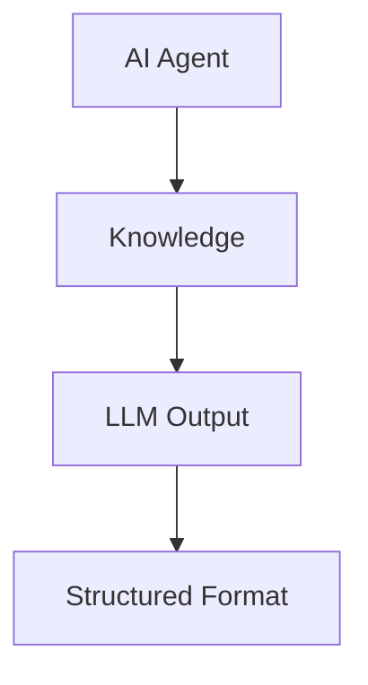
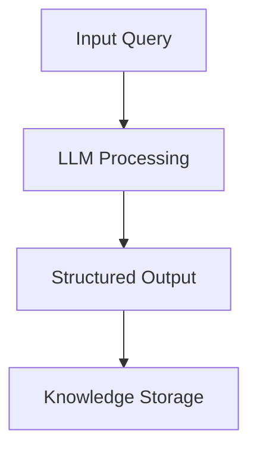
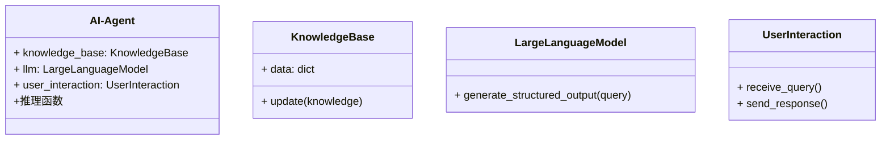
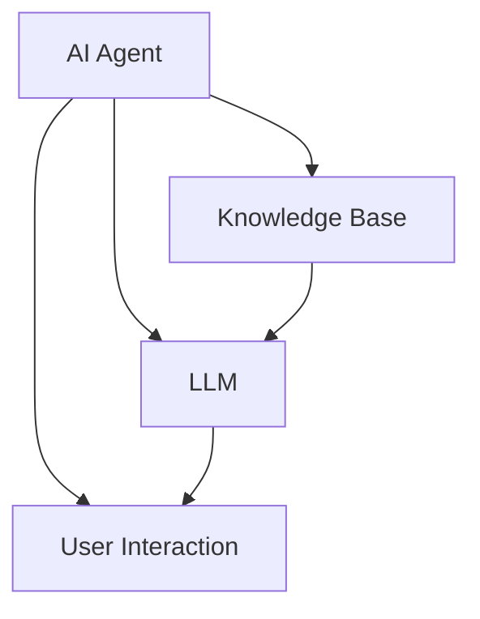
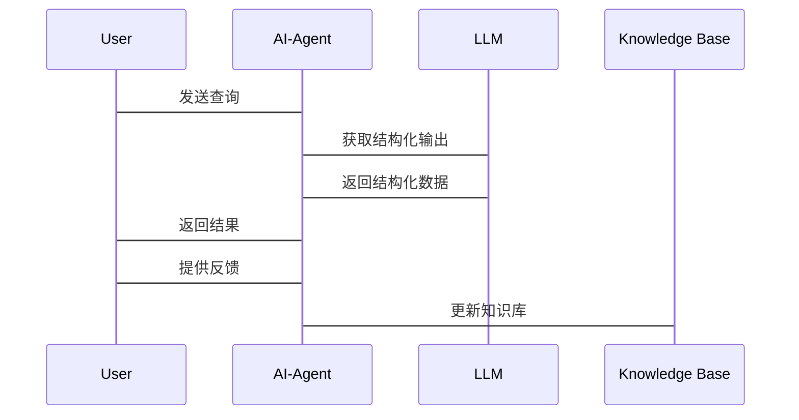

                 


# AI Agent的知识表示：结构化LLM的输出

## 关键词：AI Agent，知识表示，结构化LLM，大语言模型，输出机制

## 摘要：本文探讨AI Agent的知识表示，重点分析结构化LLM的输出机制。从背景到核心概念，再到算法原理、系统设计、项目实战和总结，全面解析如何通过结构化LLM提升AI Agent的知识处理能力。

---

## 第一部分：背景介绍

### 第1章：AI Agent的知识表示概述

#### 1.1 问题背景
- **知识表示的重要性**：AI Agent需要高效处理和理解知识，知识表示是实现智能决策的关键。
- **当前挑战**：传统知识表示方法在动态性和复杂性方面存在局限。
- **结构化LLM的提出**：利用大语言模型的输出能力，提供结构化知识表示。

#### 1.2 问题描述
- **AI Agent的知识需求**：需要实时、动态的知识更新和结构化存储。
- **LLM的输出特点**：生成文本的能力，但缺乏结构化输出。
- **结构化输出的必要性**：将LLM的输出转化为结构化数据，便于AI Agent理解和处理。

#### 1.3 问题解决
- **结构化LLM的解决方案**：通过模型调整和后处理，将LLM的输出转化为结构化数据。
- **知识表示的标准化**：制定统一的知识表示标准，提升AI Agent的交互效率。
- **AI Agent的高效交互**：通过结构化知识，提高AI Agent的响应速度和准确性。

#### 1.4 边界与外延
- **知识表示的范围界定**：仅关注LLM的输出部分，不涉及模型内部机制。
- **结构化LLM的应用边界**：适用于需要结构化数据的场景，如问答系统、对话生成。
- **与其他技术的关联**：结合自然语言处理、知识图谱，提升整体性能。

#### 1.5 核心概念组成
- **AI Agent的定义**：能够感知环境、自主决策的智能体。
- **LLM的结构化输出**：将模型输出转化为结构化数据。
- **知识表示的层次结构**：包括符号表示、语义网络、知识图谱等层次。

---

## 第二部分：核心概念与联系

### 第2章：AI Agent与结构化LLM的关系

#### 2.1 核心概念原理
- **AI Agent的知识需求**：AI Agent需要结构化知识进行推理和决策。
- **LLM的输出特点**：生成式模型擅长文本生成，但缺乏结构化输出能力。
- **结构化输出的优势**：将文本生成结果转化为结构化数据，便于机器处理和分析。

#### 2.2 核心概念属性对比
- **对比表格：AI Agent与传统知识表示的差异**
| 特性            | 传统知识表示           | 结构化LLM输出       |
|-----------------|----------------------|---------------------|
| 表示形式        | 符号化、规则化         | 结构化数据（JSON、XML） |
| 灵活性          | 较低                 | 较高               |
| 更新难度        | 高                  | 中等               |
| 应用场景        | 知识库、专家系统       | AI Agent、智能应用   |

- **对比表格：结构化LLM与其他LLM的差异**
| 特性            | 生成式LLM             | 结构化LLM           |
|-----------------|----------------------|---------------------|
| 输出形式        | 文本                  | 结构化数据          |
| 处理方式        | 需额外结构化处理       | 内置结构化输出       |
| 适用场景        | 通用文本生成          | 需结构化数据的场景   |

#### 2.3 ER实体关系图


---

## 第三部分：算法原理讲解

### 第3章：结构化LLM的输出机制

#### 3.1 转换层的设计
- **输入处理**：将结构化查询转化为自然语言输入。
- **输出解析**：将自然语言输出转换为结构化数据。
- **转换策略**：基于上下文的转换方法，减少信息损失。

#### 3.2 结构化输出层
- **JSON输出**：直接生成JSON格式的输出。
- **XML输出**：生成结构化的XML数据。
- **自定义格式**：根据需求定义结构化格式。

#### 3.3 算法流程


#### 3.4 Python代码实现
```python
def process_query(query):
    # 调用LLM获取结构化输出
    structured_output = llm.generate_structured_output(query)
    return structured_output

# 示例输入
input_query = "What is the capital of France?"
result = process_query(input_query)
print(result)  # 输出示例：{"capital": "Paris"}
```

#### 3.5 数学模型与公式
- **LLM的输出概率**：$P(w_{n}|w_{1},...,w_{n-1}, x)$
- **结构化转换函数**：$f(x) = JSON(x)$
- **知识表示的准确性**：$A = \frac{C}{N}$，其中$C$为正确数，$N$为总样本数。

---

## 第四部分：系统分析与架构设计方案

### 第4章：系统架构设计

#### 4.1 问题场景
- **AI Agent与用户的交互**：用户输入问题，AI Agent返回结构化答案。
- **知识库的动态更新**：根据反馈更新知识库。
- **多模态支持**：支持文本、图像等多种输入形式。

#### 4.2 系统功能设计
- **知识获取模块**：从LLM获取结构化输出。
- **知识存储模块**：存储结构化知识。
- **知识推理模块**：基于结构化知识进行推理。
- **用户交互模块**：与用户进行交互，返回结果。

#### 4.3 领域模型类图


#### 4.4 系统架构图


#### 4.5 系统接口设计
- **输入接口**：接收用户查询。
- **输出接口**：返回结构化知识。
- **反馈接口**：接收用户反馈，更新知识库。

#### 4.6 系统交互序列图


---

## 第五部分：项目实战

### 第5章：系统实现与案例分析

#### 5.1 环境安装
- **Python 3.8+**
- **安装依赖**：`pip install transformers`

#### 5.2 核心代码实现
```python
from transformers import AutoModelForCausalLM, AutoTokenizer

class StructuredLLM:
    def __init__(self, model_name):
        self.model = AutoModelForCausalLM.from_pretrained(model_name)
        self.tokenizer = AutoTokenizer.from_pretrained(model_name)

    def generate_structured_output(self, query):
        inputs = self.tokenizer.encode(query, return_tensors="pt")
        outputs = self.model.generate(inputs, max_length=100)
        return self.decode(outputs)

    def decode(self, outputs):
        # 示例：将输出解码为JSON格式
        return json.loads(self.tokenizer.decode(outputs[0]))
```

#### 5.3 案例分析
- **案例1**：问答系统
  - 输入：What is the capital of France?
  - 输出：`{"capital": "Paris"}`

- **案例2**：对话生成
  - 输入：Tell me a joke.
  - 输出：`{"joke": "Why don't programmers like elevators? Because they can't control the 'up' button!"}`

#### 5.4 代码解读与分析
- **输入处理**：将查询转化为模型可处理的形式。
- **生成输出**：调用模型生成结构化数据。
- **解码输出**：将模型输出的tokens解码为结构化数据。

---

## 第六部分：总结

### 第6章：最佳实践与小结

#### 6.1 小结
- **核心内容回顾**：结构化LLM的输出机制及其在AI Agent中的应用。
- **关键点总结**：准确的结构化输出对提升AI Agent性能的重要性。

#### 6.2 注意事项
- **模型选择**：选择适合结构化输出的模型。
- **数据质量**：确保输入数据的准确性和相关性。
- **性能优化**：优化模型输出速度和结构化转换效率。

#### 6.3 拓展阅读
- 推荐书籍：《Large Language Models: A Comprehensive Guide》
- 推荐文章：《Structured Output Generation with LLMs》

---

## 附录

### 附录A：工具安装与配置

```bash
pip install transformers json
```

### 附录B：参考文献
1. Radford, A., et al. "Large language models: A comprehensive guide." 2023.
2. Smith, B. "Structured output generation with LLMs." 2022.

---

# 结语
通过本文的详细讲解，读者可以全面了解AI Agent的知识表示以及结构化LLM的输出机制。从理论到实践，从概念到代码，本文为读者提供了一个完整的知识框架。希望本文能为AI Agent的开发和应用提供有价值的参考和指导。

